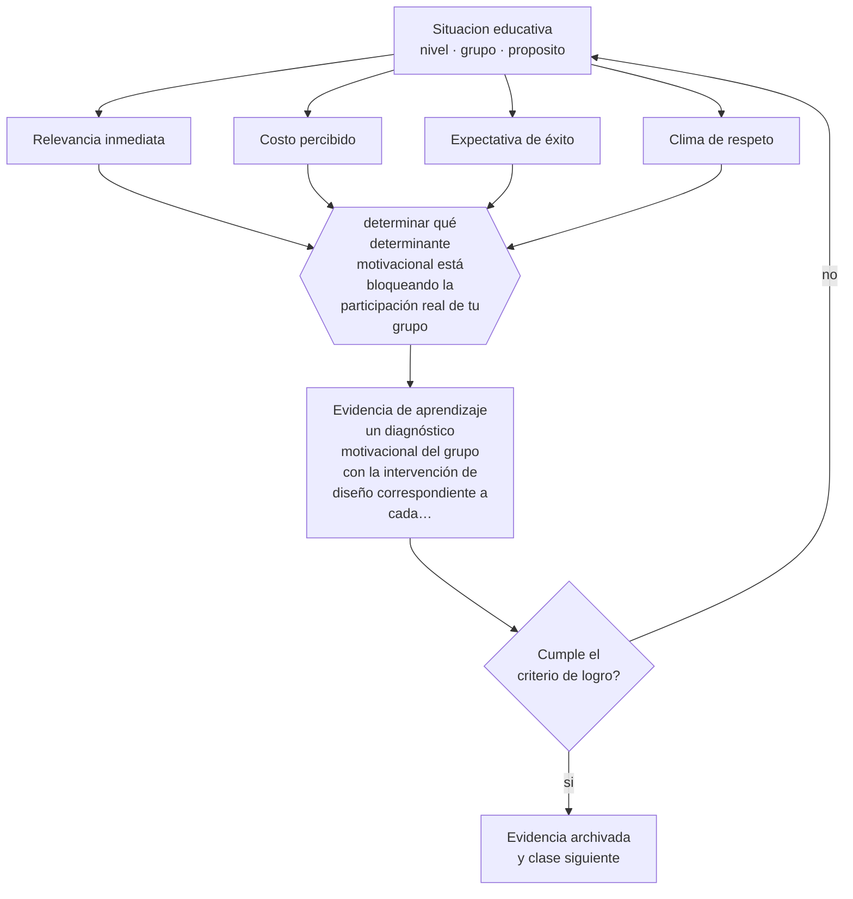

# Clase 088 — Motivación en adultos

> **Parte 07 · Educación de adultos y andragogía** — clase 4 de 12

**Estado de evidencia:** `CONSISTENTE` · **Etapa:** 🔵 Etapa B — Enseñanza por ciclo vital · **Población de referencia:** educación de adultos, capacitación laboral y formación continua 
**Decisión que habilita:** determinar qué determinante motivacional está bloqueando la participación real de tu grupo 
**Evidencia de aprendizaje:** un diagnóstico motivacional del grupo con la intervención de diseño correspondiente a cada determinante

## 🎯 Propósito

Diseñar para la motivación adulta a partir de sus determinantes reales —relevancia inmediata, expectativa de éxito, costo percibido y clima de respeto— en vez de apelar a la voluntad del participante.

## 📚 Resultados de aprendizaje

Al finalizar esta clase podrás:

1. **Definir** con precisión los cuatro conceptos centrales de la clase y reconocerlos en una situación educativa real, no solo en su enunciado.
2. **Explicar** por qué un adulto obligado a capacitarse puede aprender y uno voluntario puede abandonar.
3. **Decidir** —qué determinante motivacional está bloqueando la participación real de tu grupo— y sostener la decisión con un fundamento escrito.
4. **Producir** la evidencia de la clase —un diagnóstico motivacional del grupo con la intervención de diseño correspondiente a cada determinante— y contrastarla contra el criterio de logro.
5. **Distinguir** lo que la evidencia sostiene de lo que es práctica instalada, preferencia personal o costumbre de la institución.

## 🧩 Conceptos centrales

| Concepto | Comprensión verificable |
|---|---|
| **Relevancia inmediata** | relación visible entre lo que se aprende y un problema que el participante tiene ahora |
| **Costo percibido** | tiempo, esfuerzo y renuncias que el participante asocia a completar la formación |
| **Expectativa de éxito** | creencia de poder lograrlo, muy afectada por historias previas de fracaso académico |
| **Clima de respeto** | trato que reconoce al adulto como profesional y no como alumno que debe ser controlado |

## 🗺️ Flujo de razonamiento

## 📖 Desarrollo

### 1. El fondo del asunto

La motivación adulta se explica mejor por costos y beneficios percibidos que por rasgos personales. Un participante obligado puede comprometerse si ve utilidad inmediata; uno voluntario abandona si el costo en tiempo supera el beneficio esperado. El costo es la variable más subestimada por quienes diseñan: cada hora adicional no declarada compite con trabajo, familia y descanso.

### 2. Cómo se traduce en decisiones de enseñanza

Las intervenciones eficaces reducen costo y aumentan relevancia: respetar el tiempo declarado sin encargos encubiertos, permitir aplicar de inmediato lo aprendido, partir de un problema real del participante y garantizar una experiencia temprana de éxito. El clima de respeto es la condición de base: un adulto tratado como escolar desconecta aunque el contenido sea excelente.

### 3. Qué sostiene la evidencia y qué no

Ninguna intervención motivacional compensa una formación irrelevante o una organización que no permite aplicar lo aprendido. Cuando el entorno de trabajo bloquea la transferencia, la desmotivación es una respuesta racional. Diagnosticar eso evita atribuir al participante un problema que es organizacional.

> **Cómo leer el estado de evidencia `CONSISTENTE`.** La evidencia es amplia y coherente, pero proviene sobre todo de estudios correlacionales, de síntesis con heterogeneidad alta o de contextos distintos al tuyo. Sirve para orientar la decisión y exige que compruebes el efecto en tu propio grupo.

## 🧪 Taller guiado

Aplica la clase a **uno** de los contextos siguientes y repite después el ejercicio en un
contexto de exigencia distinta. Cambiar de contexto es parte del aprendizaje: lo que funciona
con un grupo no se traslada intacto a otro.

| Contexto | Rasgo que cambia la decisión |
|---|---|
| Capacitación obligatoria en empresa | el participante no eligió estar: hay que ganar la relevancia |
| Formación voluntaria de perfeccionamiento | alta motivación y alta exigencia de utilidad |
| Educación de adultos que retoma estudios | historia escolar previa, muchas veces negativa |
| Reconversión laboral o reskilling | urgencia económica y necesidad de resultado rápido |
| Formación en línea asincrónica | la deserción es el riesgo principal |
| Mentoría o acompañamiento individual | la relación es el vehículo del aprendizaje |

**Secuencia de trabajo:**

1. Delimita el contexto: nivel, edad, tamaño del grupo, asignatura o experiencia y tiempo real disponible.
2. Declara qué saben ya los estudiantes y **cómo lo comprobaste**, no cómo lo supones.
3. Formula la decisión pedagógica que esta clase habilita y escribe su fundamento.
4. Anticipa qué observarías si la decisión funciona y qué observarías si no funciona.
5. Diseña de antemano la alternativa que aplicarás si la primera estrategia falla.
6. Ejecuta o simula, y registra lo observado con fecha, contexto y evidencia concreta.
7. Produce la evidencia de aprendizaje de la clase.
8. Contrástala contra el criterio de logro, corrige y recién entonces avanza.

### 📦 Evidencia de aprendizaje

Un diagnóstico motivacional del grupo con la intervención de diseño correspondiente a cada determinante.

Debe incluir contexto, decisión, fundamento, fuentes consultadas con su fecha, indicador de
logro observable, riesgos previstos y qué harías distinto en la siguiente iteración.

## 🏆 Reto verificable

Calcula el costo horario real de tu programa y compáralo con lo declarado. Reduce la diferencia y compara la asistencia con la edición anterior.

## ✅ Criterio de logro

- [ ] el diagnóstico identifica el determinante bloqueado con evidencia y no con suposición;
- [ ] la intervención propuesta reduce costo o aumenta relevancia de forma verificable;
- [ ] cada afirmación sobre «lo que funciona» está atribuida a una fuente identificable, con autor y fecha;
- [ ] la decisión es ejecutable con el tiempo, el espacio, el número de estudiantes y los recursos que realmente tienes;
- [ ] la evidencia queda archivada de forma reproducible: otra persona podría revisarla sin que tú se la expliques.

## ⚠️ Errores frecuentes

**Propios de esta clase:**

- Atribuir la baja participación a falta de compromiso sin revisar el costo real que impone el diseño.
- Tratar a profesionales adultos con formatos y controles propios de la escuela.

**Característicos de la parte 07:**

- Diseñar para el contenido y no para el problema que el adulto necesita resolver.
- Ignorar que la experiencia previa puede sostener creencias erróneas resistentes.

## ♿ Diversidad, accesibilidad y ética

Los participantes con responsabilidades de cuidado, turnos rotativos o empleos informales enfrentan costos mucho mayores por la misma formación. Un diseño equitativo ajusta horarios, ofrece asincronía real y no penaliza la inasistencia inevitable.

Antes de aplicar cualquier decisión de esta clase con estudiantes reales, revisa el
[protocolo de práctica responsable](../../../docs/ETICA_Y_PRACTICA_RESPONSABLE.md):
consentimiento, resguardo de datos personales, proporcionalidad de la intervención y derecho
de cada estudiante a no ser objeto de un ensayo que no le reporta beneficio.

## ❓ Preguntas de comprobación

1. ¿Cuántas horas reales cuesta tu programa, contando todo?
2. ¿Qué problema actual del participante resuelve la sesión de mañana?
3. ¿Qué señal de tu diseño le comunica que no lo tratas como profesional?

## 📕 Lecturas base

**Wlodkowski, R. (2008). *Enhancing Adult Motivation to Learn*.**  
*Qué aporta a esta clase:* marco práctico de motivación adulta con estrategias verificables por sesión.

**Wigfield, A. & Eccles, J. (2000). *Expectancy–Value Theory*.**  
*Qué aporta a esta clase:* aporta el análisis de costo percibido, decisivo en formación de adultos que trabajan.

Catálogo completo: [bibliografía del programa](../../../docs/BIBLIOGRAFIA.md) ·
[glosario](../../../docs/GLOSARIO.md) ·
[fuentes oficiales y cómo leerlas](../../../docs/FUENTES.md).

## 🔗 Conexión con el resto del programa

Aplica la clase 022 al mundo adulto y condiciona el diseño de las clases 089 y 096.

> [!IMPORTANT]
> Material de formación profesional. No reemplaza un título de pedagogía, una habilitación
> legal para ejercer, ni el juicio de un equipo educativo que conoce a sus estudiantes.

---

| Anterior | Índice | Siguiente |
|---|---|---|
| [← 087 · Aprendizaje autodirigido](../class-03-aprendizaje-autodirigido/README.md) | [Parte 07](../README.md) · [Programa](../../../README.md) | [089 · Capacitación laboral →](../class-05-capacitacion-laboral/README.md) |
