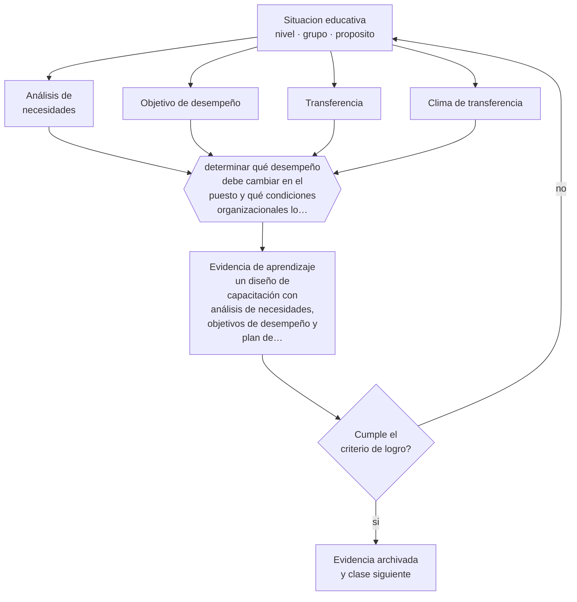

# Clase 089 — Capacitación laboral

> **Parte 07 · Educación de adultos y andragogía** — clase 5 de 12

**Estado de evidencia:** `CONSISTENTE` · **Etapa:** 🔵 Etapa B — Enseñanza por ciclo vital · **Población de referencia:** educación de adultos, capacitación laboral y formación continua 
**Decisión que habilita:** determinar qué desempeño debe cambiar en el puesto y qué condiciones organizacionales lo permitirán 
**Evidencia de aprendizaje:** un diseño de capacitación con análisis de necesidades, objetivos de desempeño y plan de transferencia acordado con la jefatura

## 🎯 Propósito

Diseñar capacitación laboral con foco en la transferencia: análisis de necesidades real, objetivos de desempeño y condiciones organizacionales que permitan aplicar lo aprendido.

## 📚 Resultados de aprendizaje

Al finalizar esta clase podrás:

1. **Definir** con precisión los cuatro conceptos centrales de la clase y reconocerlos en una situación educativa real, no solo en su enunciado.
2. **Explicar** por qué la mayoría de la capacitación laboral no cambia nada en el puesto de trabajo.
3. **Decidir** —qué desempeño debe cambiar en el puesto y qué condiciones organizacionales lo permitirán— y sostener la decisión con un fundamento escrito.
4. **Producir** la evidencia de la clase —un diseño de capacitación con análisis de necesidades, objetivos de desempeño y plan de transferencia acordado con la jefatura— y contrastarla contra el criterio de logro.
5. **Distinguir** lo que la evidencia sostiene de lo que es práctica instalada, preferencia personal o costumbre de la institución.

## 🧩 Conceptos centrales

| Concepto | Comprensión verificable |
|---|---|
| **Análisis de necesidades** | diagnóstico que distingue si el problema se resuelve con formación o con otra intervención |
| **Objetivo de desempeño** | cambio observable en el trabajo, distinto de un objetivo de conocimiento |
| **Transferencia** | aplicación efectiva de lo aprendido en el puesto de trabajo |
| **Clima de transferencia** | condiciones organizacionales —apoyo, oportunidad, tiempo, herramientas— que permiten aplicar |

## 🗺️ Flujo de razonamiento

## 📖 Desarrollo

### 1. El fondo del asunto

Buena parte de los problemas que se derivan a capacitación no son problemas de formación: son de proceso, de herramientas, de incentivos o de dotación. Capacitar a alguien que ya sabe hacer algo pero no puede hacerlo produce frustración y desperdicia recursos. Por eso el análisis de necesidades debe empezar preguntando si el desempeño falla por no saber, por no poder o por no querer, porque cada causa tiene una solución distinta.

### 2. Cómo se traduce en decisiones de enseñanza

Cuando la formación sí corresponde, el diseño se organiza desde el desempeño esperado en el puesto y no desde el contenido. El plan de transferencia se acuerda antes con la jefatura: qué podrá aplicar el participante, cuándo, con qué apoyo y cómo se verificará. Sin ese acuerdo, la capacitación termina el viernes y el lunes todo vuelve a ser igual.

### 3. Qué sostiene la evidencia y qué no

La evidencia sobre transferencia muestra que los factores organizacionales pesan tanto como el diseño instruccional, y que muchos programas exitosos en aprendizaje fracasan en transferencia por razones ajenas a la formación. Reconocerlo evita responsabilizar al formador de lo que decide la organización.

> **Cómo leer el estado de evidencia `CONSISTENTE`.** La evidencia es amplia y coherente, pero proviene sobre todo de estudios correlacionales, de síntesis con heterogeneidad alta o de contextos distintos al tuyo. Sirve para orientar la decisión y exige que compruebes el efecto en tu propio grupo.

## 🧪 Taller guiado

Aplica la clase a **uno** de los contextos siguientes y repite después el ejercicio en un
contexto de exigencia distinta. Cambiar de contexto es parte del aprendizaje: lo que funciona
con un grupo no se traslada intacto a otro.

| Contexto | Rasgo que cambia la decisión |
|---|---|
| Capacitación obligatoria en empresa | el participante no eligió estar: hay que ganar la relevancia |
| Formación voluntaria de perfeccionamiento | alta motivación y alta exigencia de utilidad |
| Educación de adultos que retoma estudios | historia escolar previa, muchas veces negativa |
| Reconversión laboral o reskilling | urgencia económica y necesidad de resultado rápido |
| Formación en línea asincrónica | la deserción es el riesgo principal |
| Mentoría o acompañamiento individual | la relación es el vehículo del aprendizaje |

**Secuencia de trabajo:**

1. Delimita el contexto: nivel, edad, tamaño del grupo, asignatura o experiencia y tiempo real disponible.
2. Declara qué saben ya los estudiantes y **cómo lo comprobaste**, no cómo lo supones.
3. Formula la decisión pedagógica que esta clase habilita y escribe su fundamento.
4. Anticipa qué observarías si la decisión funciona y qué observarías si no funciona.
5. Diseña de antemano la alternativa que aplicarás si la primera estrategia falla.
6. Ejecuta o simula, y registra lo observado con fecha, contexto y evidencia concreta.
7. Produce la evidencia de aprendizaje de la clase.
8. Contrástala contra el criterio de logro, corrige y recién entonces avanza.

### 📦 Evidencia de aprendizaje

Un diseño de capacitación con análisis de necesidades, objetivos de desempeño y plan de transferencia acordado con la jefatura.

Debe incluir contexto, decisión, fundamento, fuentes consultadas con su fecha, indicador de
logro observable, riesgos previstos y qué harías distinto en la siguiente iteración.

## 🏆 Reto verificable

Toma una solicitud de capacitación real y aplica el análisis de necesidades. Documenta si la formación era la solución correcta y qué propusiste en caso contrario.

## ✅ Criterio de logro

- [ ] el análisis de necesidades descarta explícitamente causas no formativas;
- [ ] existe un plan de transferencia acordado con quien controla las condiciones del puesto;
- [ ] cada afirmación sobre «lo que funciona» está atribuida a una fuente identificable, con autor y fecha;
- [ ] la decisión es ejecutable con el tiempo, el espacio, el número de estudiantes y los recursos que realmente tienes;
- [ ] la evidencia queda archivada de forma reproducible: otra persona podría revisarla sin que tú se la expliques.

## ⚠️ Errores frecuentes

**Propios de esta clase:**

- Aceptar una solicitud de capacitación sin verificar si el problema es de formación.
- Diseñar sin acordar con la jefatura las condiciones que permitirán aplicar lo aprendido.

**Característicos de la parte 07:**

- Diseñar para el contenido y no para el problema que el adulto necesita resolver.
- Ignorar que la experiencia previa puede sostener creencias erróneas resistentes.

## ♿ Diversidad, accesibilidad y ética

Los trabajadores con menos poder en la organización son los que menos oportunidad tienen de aplicar lo aprendido, y por eso los programas dirigidos a ellos muestran menos transferencia. Negociar esa condición es parte del diseño, no un asunto ajeno.

Antes de aplicar cualquier decisión de esta clase con estudiantes reales, revisa el
[protocolo de práctica responsable](../../../docs/ETICA_Y_PRACTICA_RESPONSABLE.md):
consentimiento, resguardo de datos personales, proporcionalidad de la intervención y derecho
de cada estudiante a no ser objeto de un ensayo que no le reporta beneficio.

## ❓ Preguntas de comprobación

1. ¿El desempeño falla por no saber, por no poder o por no querer?
2. ¿Qué podrá hacer distinto el participante el lunes siguiente?
3. ¿Quién debe autorizar que lo haga y ya está de acuerdo?

## 📕 Lecturas base

**Baldwin, T. & Ford, J. K. (1988). *Transfer of Training*. Personnel Psychology, 41.**  
*Qué aporta a esta clase:* el modelo clásico de transferencia y sus factores organizacionales.

**Blume, B. et al. (2010). *Transfer of Training: A Meta-Analytic Review*. Journal of Management, 36(4).**  
*Qué aporta a esta clase:* síntesis cuantitativa sobre qué predice realmente la transferencia.

Catálogo completo: [bibliografía del programa](../../../docs/BIBLIOGRAFIA.md) ·
[glosario](../../../docs/GLOSARIO.md) ·
[fuentes oficiales y cómo leerlas](../../../docs/FUENTES.md).

## 🔗 Conexión con el resto del programa

Es el núcleo aplicado de la parte 07 y se cierra con la clase 095 (evaluación) y la clase 096.

> [!IMPORTANT]
> Material de formación profesional. No reemplaza un título de pedagogía, una habilitación
> legal para ejercer, ni el juicio de un equipo educativo que conoce a sus estudiantes.

---

| Anterior | Índice | Siguiente |
|---|---|---|
| [← 088 · Motivación en adultos](../class-04-motivacion-en-adultos/README.md) | [Parte 07](../README.md) · [Programa](../../../README.md) | [090 · Reskilling y upskilling →](../class-06-reskilling-y-upskilling/README.md) |
