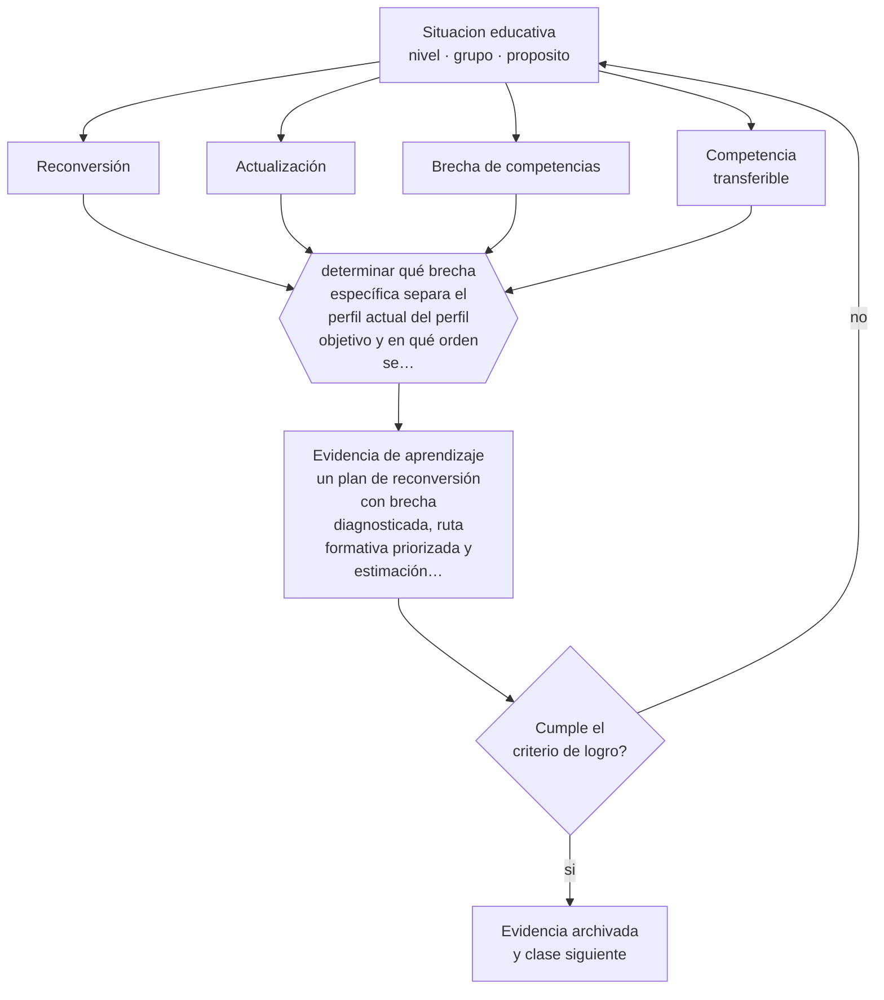

# Clase 090 — Reskilling y upskilling

> **Parte 07 · Educación de adultos y andragogía** — clase 6 de 12

**Estado de evidencia:** `EMERGENTE` · **Etapa:** 🔵 Etapa B — Enseñanza por ciclo vital · **Población de referencia:** educación de adultos, capacitación laboral y formación continua 
**Decisión que habilita:** determinar qué brecha específica separa el perfil actual del perfil objetivo y en qué orden se cierra 
**Evidencia de aprendizaje:** un plan de reconversión con brecha diagnosticada, ruta formativa priorizada y estimación realista de tiempo

## 🎯 Propósito

Diseñar programas de reconversión y actualización con diagnóstico de brecha, reconocimiento de lo transferible y una ruta realista en tiempo y en costo para el participante.

## 📚 Resultados de aprendizaje

Al finalizar esta clase podrás:

1. **Definir** con precisión los cuatro conceptos centrales de la clase y reconocerlos en una situación educativa real, no solo en su enunciado.
2. **Explicar** cómo se diseña formación para alguien que debe cambiar de oficio, no perfeccionar el suyo.
3. **Decidir** —qué brecha específica separa el perfil actual del perfil objetivo y en qué orden se cierra— y sostener la decisión con un fundamento escrito.
4. **Producir** la evidencia de la clase —un plan de reconversión con brecha diagnosticada, ruta formativa priorizada y estimación realista de tiempo— y contrastarla contra el criterio de logro.
5. **Distinguir** lo que la evidencia sostiene de lo que es práctica instalada, preferencia personal o costumbre de la institución.

## 🧩 Conceptos centrales

| Concepto | Comprensión verificable |
|---|---|
| **Reconversión** | cambio hacia un oficio distinto, que exige competencias nuevas y no solo actualización |
| **Actualización** | mejora de competencias dentro del mismo oficio ante cambios tecnológicos o normativos |
| **Brecha de competencias** | diferencia entre el perfil actual de la persona y el perfil objetivo del puesto |
| **Competencia transferible** | capacidad del oficio anterior que sigue siendo válida en el nuevo contexto |

## 🗺️ Flujo de razonamiento

## 📖 Desarrollo

### 1. El fondo del asunto

La reconversión falla habitualmente por dos razones opuestas: subestimar la brecha —cursos breves que prometen cambiar de rubro— o ignorar lo transferible, obligando a empezar de cero a personas con veinte años de experiencia laboral. Un diagnóstico serio identifica ambas cosas: qué se conserva y qué falta realmente, con el nivel de detalle de un perfil de competencias.

### 2. Cómo se traduce en decisiones de enseñanza

La ruta se prioriza por dos criterios: qué competencias son condición para todo lo demás y cuáles permiten un primer resultado laboral temprano. Ese resultado temprano importa: sostiene la motivación y a veces también el ingreso durante el proceso. La estimación de tiempo debe ser honesta, porque una promesa incumplida de empleabilidad tiene costos personales altos.

### 3. Qué sostiene la evidencia y qué no

La evidencia sobre programas de reconversión es heterogénea y sus resultados dependen fuertemente del mercado laboral local y de la duración del programa. Los programas breves muestran efectos limitados en cambios de rubro profundos. Prometer transiciones rápidas hacia sectores con alta demanda declarada, sin verificar la demanda local, es un riesgo real para el participante.

> **Cómo leer el estado de evidencia `EMERGENTE`.** El cuerpo de estudios es reciente, escaso o poco replicado. Úsala como hipótesis de trabajo con seguimiento explícito, nunca como argumento de autoridad ni como base para una política de establecimiento.

## 🧪 Taller guiado

Aplica la clase a **uno** de los contextos siguientes y repite después el ejercicio en un
contexto de exigencia distinta. Cambiar de contexto es parte del aprendizaje: lo que funciona
con un grupo no se traslada intacto a otro.

| Contexto | Rasgo que cambia la decisión |
|---|---|
| Capacitación obligatoria en empresa | el participante no eligió estar: hay que ganar la relevancia |
| Formación voluntaria de perfeccionamiento | alta motivación y alta exigencia de utilidad |
| Educación de adultos que retoma estudios | historia escolar previa, muchas veces negativa |
| Reconversión laboral o reskilling | urgencia económica y necesidad de resultado rápido |
| Formación en línea asincrónica | la deserción es el riesgo principal |
| Mentoría o acompañamiento individual | la relación es el vehículo del aprendizaje |

**Secuencia de trabajo:**

1. Delimita el contexto: nivel, edad, tamaño del grupo, asignatura o experiencia y tiempo real disponible.
2. Declara qué saben ya los estudiantes y **cómo lo comprobaste**, no cómo lo supones.
3. Formula la decisión pedagógica que esta clase habilita y escribe su fundamento.
4. Anticipa qué observarías si la decisión funciona y qué observarías si no funciona.
5. Diseña de antemano la alternativa que aplicarás si la primera estrategia falla.
6. Ejecuta o simula, y registra lo observado con fecha, contexto y evidencia concreta.
7. Produce la evidencia de aprendizaje de la clase.
8. Contrástala contra el criterio de logro, corrige y recién entonces avanza.

### 📦 Evidencia de aprendizaje

Un plan de reconversión con brecha diagnosticada, ruta formativa priorizada y estimación realista de tiempo.

Debe incluir contexto, decisión, fundamento, fuentes consultadas con su fecha, indicador de
logro observable, riesgos previstos y qué harías distinto en la siguiente iteración.

## 🏆 Reto verificable

Diagnostica la brecha de un caso real de reconversión y construye la ruta. Verifica la demanda laboral local antes de comprometer una recomendación.

## ✅ Criterio de logro

- [ ] el diagnóstico distingue competencias transferibles de brechas reales, con evidencia;
- [ ] la ruta prioriza condiciones previas y un resultado laboral temprano verificable;
- [ ] cada afirmación sobre «lo que funciona» está atribuida a una fuente identificable, con autor y fecha;
- [ ] la decisión es ejecutable con el tiempo, el espacio, el número de estudiantes y los recursos que realmente tienes;
- [ ] la evidencia queda archivada de forma reproducible: otra persona podría revisarla sin que tú se la expliques.

## ⚠️ Errores frecuentes

**Propios de esta clase:**

- Prometer cambio de oficio con formaciones demasiado breves para la brecha real.
- Ignorar las competencias transferibles y obligar a empezar de cero.

**Característicos de la parte 07:**

- Diseñar para el contenido y no para el problema que el adulto necesita resolver.
- Ignorar que la experiencia previa puede sostener creencias erróneas resistentes.

## ♿ Diversidad, accesibilidad y ética

Las personas que más necesitan reconvertirse suelen tener menos tiempo, menos ahorro y más responsabilidades de cuidado. Una ruta que ignora esas restricciones excluye precisamente a quienes dice servir.

Antes de aplicar cualquier decisión de esta clase con estudiantes reales, revisa el
[protocolo de práctica responsable](../../../docs/ETICA_Y_PRACTICA_RESPONSABLE.md):
consentimiento, resguardo de datos personales, proporcionalidad de la intervención y derecho
de cada estudiante a no ser objeto de un ensayo que no le reporta beneficio.

## ❓ Preguntas de comprobación

1. ¿Qué de su oficio anterior sigue siendo válido y lo estás desconociendo?
2. ¿Cuánto tiempo requiere realmente cerrar esta brecha?
3. ¿Qué demanda local verificaste antes de recomendar esta ruta?

## 📕 Lecturas base

**OCDE. *Getting Skills Right* y estudios sobre reconversión laboral.**  
*Qué aporta a esta clase:* evidencia comparada sobre qué programas de reconversión funcionan y bajo qué condiciones.

**Foro Económico Mundial. *Future of Jobs Report*.**  
*Qué aporta a esta clase:* útil para tendencias declaradas de demanda; contrástalo siempre con datos del mercado local.

Catálogo completo: [bibliografía del programa](../../../docs/BIBLIOGRAFIA.md) ·
[glosario](../../../docs/GLOSARIO.md) ·
[fuentes oficiales y cómo leerlas](../../../docs/FUENTES.md).

## 🔗 Conexión con el resto del programa

Se apoya en las clases 083 y 086 y se articula con la clase 089.

> [!IMPORTANT]
> Material de formación profesional. No reemplaza un título de pedagogía, una habilitación
> legal para ejercer, ni el juicio de un equipo educativo que conoce a sus estudiantes.

---

| Anterior | Índice | Siguiente |
|---|---|---|
| [← 089 · Capacitación laboral](../class-05-capacitacion-laboral/README.md) | [Parte 07](../README.md) · [Programa](../../../README.md) | [091 · Microlearning →](../class-07-microlearning/README.md) |
