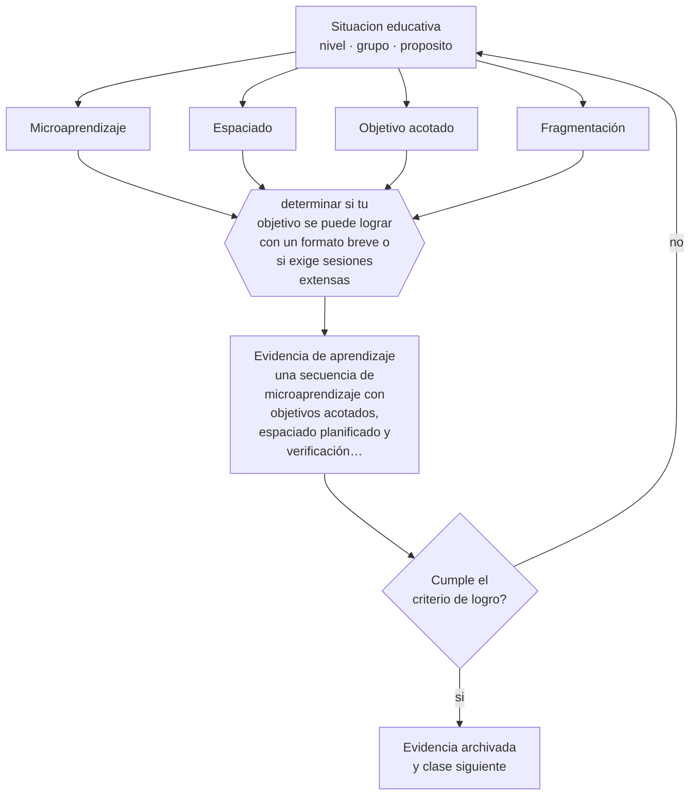

# Clase 091 — Microlearning

> **Parte 07 · Educación de adultos y andragogía** — clase 7 de 12

**Estado de evidencia:** `EMERGENTE` · **Etapa:** 🔵 Etapa B — Enseñanza por ciclo vital · **Población de referencia:** educación de adultos, capacitación laboral y formación continua 
**Decisión que habilita:** determinar si tu objetivo se puede lograr con un formato breve o si exige sesiones extensas 
**Evidencia de aprendizaje:** una secuencia de microaprendizaje con objetivos acotados, espaciado planificado y verificación de aprendizaje

## 🎯 Propósito

Diseñar formación en formatos breves con criterio: qué objetivos admiten microaprendizaje, cómo se secuencia con espaciado y qué contenidos exigen formatos extensos.

## 📚 Resultados de aprendizaje

Al finalizar esta clase podrás:

1. **Definir** con precisión los cuatro conceptos centrales de la clase y reconocerlos en una situación educativa real, no solo en su enunciado.
2. **Explicar** qué puede y qué no puede enseñar un formato breve consumido en el trabajo.
3. **Decidir** —si tu objetivo se puede lograr con un formato breve o si exige sesiones extensas— y sostener la decisión con un fundamento escrito.
4. **Producir** la evidencia de la clase —una secuencia de microaprendizaje con objetivos acotados, espaciado planificado y verificación de aprendizaje— y contrastarla contra el criterio de logro.
5. **Distinguir** lo que la evidencia sostiene de lo que es práctica instalada, preferencia personal o costumbre de la institución.

## 🧩 Conceptos centrales

| Concepto | Comprensión verificable |
|---|---|
| **Microaprendizaje** | unidad formativa breve y autocontenida orientada a un objetivo acotado |
| **Espaciado** | distribución de las unidades en el tiempo para favorecer retención |
| **Objetivo acotado** | aprendizaje que puede lograrse y verificarse en una unidad breve |
| **Fragmentación** | riesgo de dividir un contenido complejo hasta perder la comprensión del conjunto |

## 🗺️ Flujo de razonamiento

## 📖 Desarrollo

### 1. El fondo del asunto

Los formatos breves aprovechan bien dos mecanismos con evidencia: el espaciado y la práctica de recuperación. Funcionan para procedimientos acotados, recordatorios, actualizaciones normativas y refuerzo de contenidos ya enseñados. No funcionan para construir comprensión conceptual compleja, que requiere elaboración sostenida y no cabe en unidades de cinco minutos sin perder precisamente lo que la hace comprensión.

### 2. Cómo se traduce en decisiones de enseñanza

El diseño exige acotar el objetivo hasta que sea verificable en la unidad, planificar el espaciado entre unidades y verificar aprendizaje en vez de registrar visualizaciones. La tentación habitual es medir consumo —cuántos abrieron la cápsula— que es un indicador de actividad y no de aprendizaje.

### 3. Qué sostiene la evidencia y qué no

La evidencia específica sobre microaprendizaje es limitada y de calidad variable; lo respaldado son sus mecanismos subyacentes, no el formato como tal. Y su principal riesgo es la fragmentación: contenidos complejos troceados en píldoras producen la ilusión de haber cubierto el tema sin que nadie haya construido el conjunto.

> **Cómo leer el estado de evidencia `EMERGENTE`.** El cuerpo de estudios es reciente, escaso o poco replicado. Úsala como hipótesis de trabajo con seguimiento explícito, nunca como argumento de autoridad ni como base para una política de establecimiento.

## 🧪 Taller guiado

Aplica la clase a **uno** de los contextos siguientes y repite después el ejercicio en un
contexto de exigencia distinta. Cambiar de contexto es parte del aprendizaje: lo que funciona
con un grupo no se traslada intacto a otro.

| Contexto | Rasgo que cambia la decisión |
|---|---|
| Capacitación obligatoria en empresa | el participante no eligió estar: hay que ganar la relevancia |
| Formación voluntaria de perfeccionamiento | alta motivación y alta exigencia de utilidad |
| Educación de adultos que retoma estudios | historia escolar previa, muchas veces negativa |
| Reconversión laboral o reskilling | urgencia económica y necesidad de resultado rápido |
| Formación en línea asincrónica | la deserción es el riesgo principal |
| Mentoría o acompañamiento individual | la relación es el vehículo del aprendizaje |

**Secuencia de trabajo:**

1. Delimita el contexto: nivel, edad, tamaño del grupo, asignatura o experiencia y tiempo real disponible.
2. Declara qué saben ya los estudiantes y **cómo lo comprobaste**, no cómo lo supones.
3. Formula la decisión pedagógica que esta clase habilita y escribe su fundamento.
4. Anticipa qué observarías si la decisión funciona y qué observarías si no funciona.
5. Diseña de antemano la alternativa que aplicarás si la primera estrategia falla.
6. Ejecuta o simula, y registra lo observado con fecha, contexto y evidencia concreta.
7. Produce la evidencia de aprendizaje de la clase.
8. Contrástala contra el criterio de logro, corrige y recién entonces avanza.

### 📦 Evidencia de aprendizaje

Una secuencia de microaprendizaje con objetivos acotados, espaciado planificado y verificación de aprendizaje.

Debe incluir contexto, decisión, fundamento, fuentes consultadas con su fecha, indicador de
logro observable, riesgos previstos y qué harías distinto en la siguiente iteración.

## 🏆 Reto verificable

Diseña una secuencia breve con espaciado y verificación. Compara retención a cuatro semanas con la de una sesión única equivalente.

## ✅ Criterio de logro

- [ ] cada unidad tiene un objetivo verificable dentro de su duración;
- [ ] la secuencia declara el espaciado y una verificación de aprendizaje, no de consumo;
- [ ] cada afirmación sobre «lo que funciona» está atribuida a una fuente identificable, con autor y fecha;
- [ ] la decisión es ejecutable con el tiempo, el espacio, el número de estudiantes y los recursos que realmente tienes;
- [ ] la evidencia queda archivada de forma reproducible: otra persona podría revisarla sin que tú se la expliques.

## ⚠️ Errores frecuentes

**Propios de esta clase:**

- Trocear contenido conceptual complejo en cápsulas y suponer que se reconstruye solo.
- Medir visualizaciones o descargas en vez de aprendizaje verificado.

**Característicos de la parte 07:**

- Diseñar para el contenido y no para el problema que el adulto necesita resolver.
- Ignorar que la experiencia previa puede sostener creencias erróneas resistentes.

## ♿ Diversidad, accesibilidad y ética

Los formatos breves favorecen a quienes tienen tiempo fragmentado —turnos, cuidado, desplazamientos largos— y por eso amplían el acceso. Requieren, eso sí, accesibilidad real: subtítulos, transcripción y bajo consumo de datos.

Antes de aplicar cualquier decisión de esta clase con estudiantes reales, revisa el
[protocolo de práctica responsable](../../../docs/ETICA_Y_PRACTICA_RESPONSABLE.md):
consentimiento, resguardo de datos personales, proporcionalidad de la intervención y derecho
de cada estudiante a no ser objeto de un ensayo que no le reporta beneficio.

## ❓ Preguntas de comprobación

1. ¿Qué objetivo tuyo no cabe en un formato breve y por qué?
2. ¿Cómo verificas aprendizaje y no solo visualización?
3. ¿Quién reconstruye el conjunto después de las cápsulas?

## 📕 Lecturas base

**Dunlosky, J. et al. (2013). *Improving Students' Learning With Effective Learning Techniques*.**  
*Qué aporta a esta clase:* respalda espaciado y recuperación, que son los mecanismos que justifican el formato.

**Hug, T. (ed.). *Didactics of Microlearning*.**  
*Qué aporta a esta clase:* revisa el campo, sus definiciones y sus límites conceptuales.

Catálogo completo: [bibliografía del programa](../../../docs/BIBLIOGRAFIA.md) ·
[glosario](../../../docs/GLOSARIO.md) ·
[fuentes oficiales y cómo leerlas](../../../docs/FUENTES.md).

## 🔗 Conexión con el resto del programa

Aplica la clase 020 al mundo laboral y se articula con la parte 13 en su implementación tecnológica.

> [!IMPORTANT]
> Material de formación profesional. No reemplaza un título de pedagogía, una habilitación
> legal para ejercer, ni el juicio de un equipo educativo que conoce a sus estudiantes.

---

| Anterior | Índice | Siguiente |
|---|---|---|
| [← 090 · Reskilling y upskilling](../class-06-reskilling-y-upskilling/README.md) | [Parte 07](../README.md) · [Programa](../../../README.md) | [092 · Mentoría →](../class-08-mentoria/README.md) |
