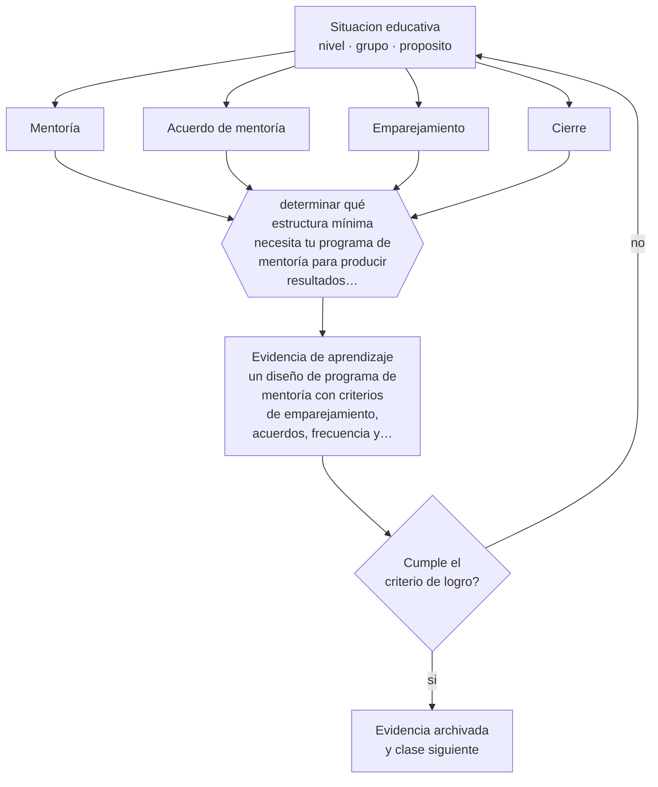

# Clase 092 — Mentoría

> **Parte 07 · Educación de adultos y andragogía** — clase 8 de 12

**Estado de evidencia:** `CONSISTENTE` · **Etapa:** 🔵 Etapa B — Enseñanza por ciclo vital · **Población de referencia:** educación de adultos, capacitación laboral y formación continua 
**Decisión que habilita:** determinar qué estructura mínima necesita tu programa de mentoría para producir resultados verificables 
**Evidencia de aprendizaje:** un diseño de programa de mentoría con criterios de emparejamiento, acuerdos, frecuencia y evaluación

## 🎯 Propósito

Diseñar programas de mentoría con estructura: emparejamiento, objetivos acordados, frecuencia, contenido de las sesiones y evaluación de resultados.

## 📚 Resultados de aprendizaje

Al finalizar esta clase podrás:

1. **Definir** con precisión los cuatro conceptos centrales de la clase y reconocerlos en una situación educativa real, no solo en su enunciado.
2. **Explicar** qué hace que una relación de mentoría produzca aprendizaje y no solo conversaciones agradables.
3. **Decidir** —qué estructura mínima necesita tu programa de mentoría para producir resultados verificables— y sostener la decisión con un fundamento escrito.
4. **Producir** la evidencia de la clase —un diseño de programa de mentoría con criterios de emparejamiento, acuerdos, frecuencia y evaluación— y contrastarla contra el criterio de logro.
5. **Distinguir** lo que la evidencia sostiene de lo que es práctica instalada, preferencia personal o costumbre de la institución.

## 🧩 Conceptos centrales

| Concepto | Comprensión verificable |
|---|---|
| **Mentoría** | relación en que una persona con más experiencia acompaña el desarrollo de otra en su contexto |
| **Acuerdo de mentoría** | documento breve con objetivos, frecuencia, duración y confidencialidad de la relación |
| **Emparejamiento** | proceso de asignar mentor y participante según criterios explícitos |
| **Cierre** | término planificado de la relación, con evaluación de lo logrado |

## 🗺️ Flujo de razonamiento

## 📖 Desarrollo

### 1. El fondo del asunto

La mentoría muestra efectos positivos en desarrollo profesional, retención y satisfacción, con magnitudes moderadas y muy dependientes de la estructura. Los programas que funcionan tienen objetivos acordados, frecuencia definida, preparación de los mentores y un cierre planificado. Los que fracasan asignan parejas y esperan que la relación se organice sola, con lo cual la mitad se disuelve en dos meses.

### 2. Cómo se traduce en decisiones de enseñanza

El acuerdo inicial es el instrumento clave: define qué se espera lograr, cada cuánto se reúnen, cuánto dura el programa y qué es confidencial. La preparación del mentor importa tanto como su experiencia: escuchar, preguntar y dar retroalimentación útil no son habilidades automáticas de quien sabe mucho de su oficio.

### 3. Qué sostiene la evidencia y qué no

Los efectos reportados provienen sobre todo de estudios correlacionales con autoselección: quienes participan en mentoría suelen ser ya más motivados. Además, una mala relación de mentoría puede ser perjudicial, especialmente si hay asimetría de poder jerárquico entre mentor y participante dentro de la misma organización.

> **Cómo leer el estado de evidencia `CONSISTENTE`.** La evidencia es amplia y coherente, pero proviene sobre todo de estudios correlacionales, de síntesis con heterogeneidad alta o de contextos distintos al tuyo. Sirve para orientar la decisión y exige que compruebes el efecto en tu propio grupo.

## 🧪 Taller guiado

Aplica la clase a **uno** de los contextos siguientes y repite después el ejercicio en un
contexto de exigencia distinta. Cambiar de contexto es parte del aprendizaje: lo que funciona
con un grupo no se traslada intacto a otro.

| Contexto | Rasgo que cambia la decisión |
|---|---|
| Capacitación obligatoria en empresa | el participante no eligió estar: hay que ganar la relevancia |
| Formación voluntaria de perfeccionamiento | alta motivación y alta exigencia de utilidad |
| Educación de adultos que retoma estudios | historia escolar previa, muchas veces negativa |
| Reconversión laboral o reskilling | urgencia económica y necesidad de resultado rápido |
| Formación en línea asincrónica | la deserción es el riesgo principal |
| Mentoría o acompañamiento individual | la relación es el vehículo del aprendizaje |

**Secuencia de trabajo:**

1. Delimita el contexto: nivel, edad, tamaño del grupo, asignatura o experiencia y tiempo real disponible.
2. Declara qué saben ya los estudiantes y **cómo lo comprobaste**, no cómo lo supones.
3. Formula la decisión pedagógica que esta clase habilita y escribe su fundamento.
4. Anticipa qué observarías si la decisión funciona y qué observarías si no funciona.
5. Diseña de antemano la alternativa que aplicarás si la primera estrategia falla.
6. Ejecuta o simula, y registra lo observado con fecha, contexto y evidencia concreta.
7. Produce la evidencia de aprendizaje de la clase.
8. Contrástala contra el criterio de logro, corrige y recién entonces avanza.

### 📦 Evidencia de aprendizaje

Un diseño de programa de mentoría con criterios de emparejamiento, acuerdos, frecuencia y evaluación.

Debe incluir contexto, decisión, fundamento, fuentes consultadas con su fecha, indicador de
logro observable, riesgos previstos y qué harías distinto en la siguiente iteración.

## 🏆 Reto verificable

Diseña el acuerdo de mentoría de tu programa y aplícalo a tres parejas. Evalúa a los tres meses qué relaciones se sostuvieron y por qué.

## ✅ Criterio de logro

- [ ] el diseño incluye acuerdo escrito con objetivos, frecuencia, duración y confidencialidad;
- [ ] los mentores reciben preparación específica y no solo la designación;
- [ ] cada afirmación sobre «lo que funciona» está atribuida a una fuente identificable, con autor y fecha;
- [ ] la decisión es ejecutable con el tiempo, el espacio, el número de estudiantes y los recursos que realmente tienes;
- [ ] la evidencia queda archivada de forma reproducible: otra persona podría revisarla sin que tú se la expliques.

## ⚠️ Errores frecuentes

**Propios de esta clase:**

- Asignar parejas sin acuerdo de objetivos ni frecuencia definida.
- Emparejar con la jefatura directa, lo que impide la franqueza que la relación requiere.

**Característicos de la parte 07:**

- Diseñar para el contenido y no para el problema que el adulto necesita resolver.
- Ignorar que la experiencia previa puede sostener creencias erróneas resistentes.

## ♿ Diversidad, accesibilidad y ética

La mentoría informal reproduce redes existentes y favorece a quienes ya están conectados. Un programa formal con emparejamiento explícito es una de las pocas formas de dar acceso a esas redes a quienes no las tienen.

Antes de aplicar cualquier decisión de esta clase con estudiantes reales, revisa el
[protocolo de práctica responsable](../../../docs/ETICA_Y_PRACTICA_RESPONSABLE.md):
consentimiento, resguardo de datos personales, proporcionalidad de la intervención y derecho
de cada estudiante a no ser objeto de un ensayo que no le reporta beneficio.

## ❓ Preguntas de comprobación

1. ¿Qué debería poder hacer el participante al final del programa?
2. ¿Qué preparación reciben tus mentores?
3. ¿Qué pasa si la relación no funciona y ambos lo saben?

## 📕 Lecturas base

**Eby, L. et al. (2008). *Does Mentoring Matter? A Multidisciplinary Meta-Analysis*.**  
*Qué aporta a esta clase:* síntesis de efectos y de sus limitaciones metodológicas.

**Clutterbuck, D. (2004). *Everyone Needs a Mentor*.**  
*Qué aporta a esta clase:* modelo operativo de diseño de programas con acuerdos y estructura.

Catálogo completo: [bibliografía del programa](../../../docs/BIBLIOGRAFIA.md) ·
[glosario](../../../docs/GLOSARIO.md) ·
[fuentes oficiales y cómo leerlas](../../../docs/FUENTES.md).

## 🔗 Conexión con el resto del programa

Se articula con la clase 093 y con la parte 15, donde el acompañamiento entre pares es una práctica de mejora institucional.

> [!IMPORTANT]
> Material de formación profesional. No reemplaza un título de pedagogía, una habilitación
> legal para ejercer, ni el juicio de un equipo educativo que conoce a sus estudiantes.

---

| Anterior | Índice | Siguiente |
|---|---|---|
| [← 091 · Microlearning](../class-07-microlearning/README.md) | [Parte 07](../README.md) · [Programa](../../../README.md) | [093 · Coaching educativo →](../class-09-coaching-educativo/README.md) |
