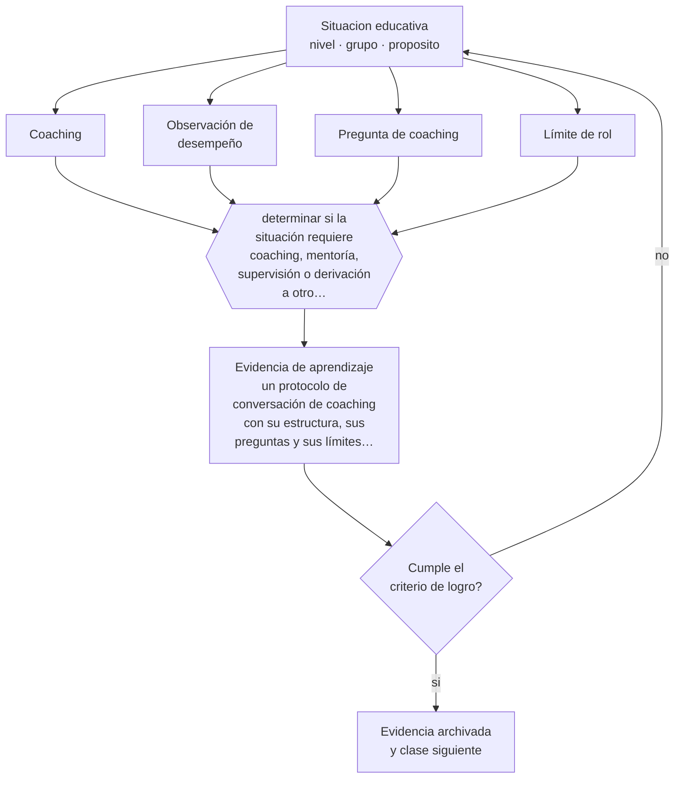

# Clase 093 — Coaching educativo

> **Parte 07 · Educación de adultos y andragogía** — clase 9 de 12

**Estado de evidencia:** `EN-DEBATE` · **Etapa:** 🔵 Etapa B — Enseñanza por ciclo vital · **Población de referencia:** educación de adultos, capacitación laboral y formación continua 
**Decisión que habilita:** determinar si la situación requiere coaching, mentoría, supervisión o derivación a otro profesional 
**Evidencia de aprendizaje:** un protocolo de conversación de coaching con su estructura, sus preguntas y sus límites declarados

## 🎯 Propósito

Usar el coaching educativo como acompañamiento centrado en el desempeño observable de la persona acompañada, distinguiéndolo de la mentoría, de la supervisión y de la terapia.

## 📚 Resultados de aprendizaje

Al finalizar esta clase podrás:

1. **Definir** con precisión los cuatro conceptos centrales de la clase y reconocerlos en una situación educativa real, no solo en su enunciado.
2. **Explicar** en qué se diferencia acompañar el desempeño de aconsejar desde la propia experiencia.
3. **Decidir** —si la situación requiere coaching, mentoría, supervisión o derivación a otro profesional— y sostener la decisión con un fundamento escrito.
4. **Producir** la evidencia de la clase —un protocolo de conversación de coaching con su estructura, sus preguntas y sus límites declarados— y contrastarla contra el criterio de logro.
5. **Distinguir** lo que la evidencia sostiene de lo que es práctica instalada, preferencia personal o costumbre de la institución.

## 🧩 Conceptos centrales

| Concepto | Comprensión verificable |
|---|---|
| **Coaching** | acompañamiento estructurado orientado a que la persona mejore un desempeño que ella misma define |
| **Observación de desempeño** | base del coaching educativo: se trabaja sobre lo que se observó, no sobre lo que se cree |
| **Pregunta de coaching** | intervención que ayuda a analizar el propio desempeño en vez de entregar la respuesta |
| **Límite de rol** | frontera entre acompañar el desempeño y abordar asuntos que exigen otro profesional |

## 🗺️ Flujo de razonamiento

## 📖 Desarrollo

### 1. El fondo del asunto

El coaching instruccional aplicado a docentes muestra efectos prometedores cuando combina observación, retroalimentación específica y práctica, con acompañamiento sostenido en el tiempo. La diferencia con la mentoría es de foco: el mentor comparte experiencia, el coach trabaja sobre el desempeño observado de la otra persona. Confundirlos produce conversaciones donde el acompañante habla de sí mismo.

### 2. Cómo se traduce en decisiones de enseñanza

Un protocolo funcional tiene estructura: acordar el foco, observar, describir lo observado sin juicio, preguntar, definir un cambio concreto y verificar en la siguiente sesión. Ese ciclo corto y repetido produce más cambio que las conversaciones extensas y ocasionales. Y exige explicitar límites: el coaching no aborda salud mental ni conflictos laborales que requieren otra instancia.

### 3. Qué sostiene la evidencia y qué no

El término se usa para prácticas muy distintas y buena parte de la oferta comercial carece de base empírica. La evidencia más sólida proviene del coaching instruccional escolar con protocolos definidos; los resultados no se extienden automáticamente a formatos genéricos. Además, los efectos disminuyen al escalar los programas, lo que sugiere alta dependencia de la calidad del coach.

> **Cómo leer el estado de evidencia `EN-DEBATE`.** Hay desacuerdo activo y publicado entre especialistas competentes. La clase presenta las posiciones y sus argumentos; tu tarea no es escoger un bando, sino saber qué evidencia te haría cambiar de posición.

## 🧪 Taller guiado

Aplica la clase a **uno** de los contextos siguientes y repite después el ejercicio en un
contexto de exigencia distinta. Cambiar de contexto es parte del aprendizaje: lo que funciona
con un grupo no se traslada intacto a otro.

| Contexto | Rasgo que cambia la decisión |
|---|---|
| Capacitación obligatoria en empresa | el participante no eligió estar: hay que ganar la relevancia |
| Formación voluntaria de perfeccionamiento | alta motivación y alta exigencia de utilidad |
| Educación de adultos que retoma estudios | historia escolar previa, muchas veces negativa |
| Reconversión laboral o reskilling | urgencia económica y necesidad de resultado rápido |
| Formación en línea asincrónica | la deserción es el riesgo principal |
| Mentoría o acompañamiento individual | la relación es el vehículo del aprendizaje |

**Secuencia de trabajo:**

1. Delimita el contexto: nivel, edad, tamaño del grupo, asignatura o experiencia y tiempo real disponible.
2. Declara qué saben ya los estudiantes y **cómo lo comprobaste**, no cómo lo supones.
3. Formula la decisión pedagógica que esta clase habilita y escribe su fundamento.
4. Anticipa qué observarías si la decisión funciona y qué observarías si no funciona.
5. Diseña de antemano la alternativa que aplicarás si la primera estrategia falla.
6. Ejecuta o simula, y registra lo observado con fecha, contexto y evidencia concreta.
7. Produce la evidencia de aprendizaje de la clase.
8. Contrástala contra el criterio de logro, corrige y recién entonces avanza.

### 📦 Evidencia de aprendizaje

Un protocolo de conversación de coaching con su estructura, sus preguntas y sus límites declarados.

Debe incluir contexto, decisión, fundamento, fuentes consultadas con su fecha, indicador de
logro observable, riesgos previstos y qué harías distinto en la siguiente iteración.

## 🏆 Reto verificable

Aplica tu protocolo en tres ciclos con una misma persona. Registra el cambio en el desempeño observado y no solo la percepción de la conversación.

## ✅ Criterio de logro

- [ ] el protocolo se basa en desempeño observado y define un cambio concreto verificable;
- [ ] los límites del rol y los criterios de derivación están declarados por escrito;
- [ ] cada afirmación sobre «lo que funciona» está atribuida a una fuente identificable, con autor y fecha;
- [ ] la decisión es ejecutable con el tiempo, el espacio, el número de estudiantes y los recursos que realmente tienes;
- [ ] la evidencia queda archivada de forma reproducible: otra persona podría revisarla sin que tú se la expliques.

## ⚠️ Errores frecuentes

**Propios de esta clase:**

- Convertir el coaching en consejos basados en la experiencia propia del acompañante.
- Abordar en una conversación de coaching asuntos que exigen derivación profesional.

**Característicos de la parte 07:**

- Diseñar para el contenido y no para el problema que el adulto necesita resolver.
- Ignorar que la experiencia previa puede sostener creencias erróneas resistentes.

## ♿ Diversidad, accesibilidad y ética

El coaching puede reproducir relaciones de poder si el acompañante evalúa además el desempeño de la persona. Separar el rol de coach del rol evaluador es condición para que la persona pueda mostrar sus dificultades reales.

Antes de aplicar cualquier decisión de esta clase con estudiantes reales, revisa el
[protocolo de práctica responsable](../../../docs/ETICA_Y_PRACTICA_RESPONSABLE.md):
consentimiento, resguardo de datos personales, proporcionalidad de la intervención y derecho
de cada estudiante a no ser objeto de un ensayo que no le reporta beneficio.

## ❓ Preguntas de comprobación

1. ¿Cuánto habla el coach y cuánto la persona acompañada en tus sesiones?
2. ¿Qué desempeño concreto observaste antes de conversar?
3. ¿Dónde termina tu rol y a quién derivas?

## 📕 Lecturas base

**Kraft, M., Blazar, D. & Hogan, D. (2018). *The Effect of Teacher Coaching on Instruction and Achievement*. Review of Educational Research, 88(4).**  
*Qué aporta a esta clase:* metaanálisis con efectos y con la caída observada al escalar los programas.

**Knight, J. (2007). *Instructional Coaching*.**  
*Qué aporta a esta clase:* modelo operativo de coaching instruccional con protocolos de conversación.

Catálogo completo: [bibliografía del programa](../../../docs/BIBLIOGRAFIA.md) ·
[glosario](../../../docs/GLOSARIO.md) ·
[fuentes oficiales y cómo leerlas](../../../docs/FUENTES.md).

## 🔗 Conexión con el resto del programa

Es antecedente directo de la parte 15 (retroalimentación a docentes) y se distingue de la clase 092.

> [!IMPORTANT]
> Material de formación profesional. No reemplaza un título de pedagogía, una habilitación
> legal para ejercer, ni el juicio de un equipo educativo que conoce a sus estudiantes.

---

| Anterior | Índice | Siguiente |
|---|---|---|
| [← 092 · Mentoría](../class-08-mentoria/README.md) | [Parte 07](../README.md) · [Programa](../../../README.md) | [094 · Aprendizaje experiencial →](../class-10-aprendizaje-experiencial/README.md) |
