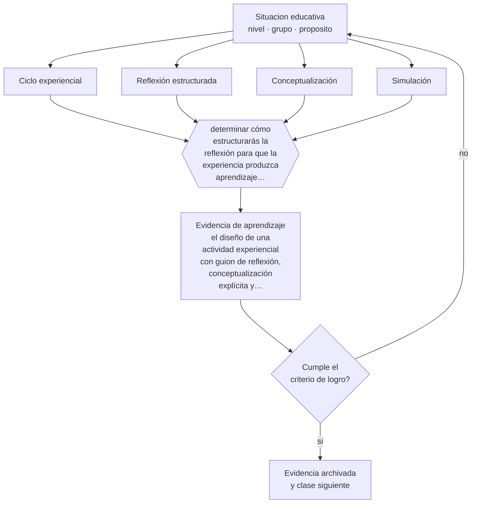

# Clase 094 — Aprendizaje experiencial

> **Parte 07 · Educación de adultos y andragogía** — clase 10 de 12

**Estado de evidencia:** `CONSISTENTE` · **Etapa:** 🔵 Etapa B — Enseñanza por ciclo vital · **Población de referencia:** educación de adultos, capacitación laboral y formación continua 
**Decisión que habilita:** determinar cómo estructurarás la reflexión para que la experiencia produzca aprendizaje transferible 
**Evidencia de aprendizaje:** el diseño de una actividad experiencial con guion de reflexión, conceptualización explícita y plan de aplicación

## 🎯 Propósito

Diseñar aprendizaje experiencial con las fases que lo hacen funcionar: experiencia, reflexión estructurada, conceptualización y aplicación deliberada.

## 📚 Resultados de aprendizaje

Al finalizar esta clase podrás:

1. **Definir** con precisión los cuatro conceptos centrales de la clase y reconocerlos en una situación educativa real, no solo en su enunciado.
2. **Explicar** por qué la experiencia sin reflexión estructurada enseña poco, aunque sea intensa.
3. **Decidir** —cómo estructurarás la reflexión para que la experiencia produzca aprendizaje transferible— y sostener la decisión con un fundamento escrito.
4. **Producir** la evidencia de la clase —el diseño de una actividad experiencial con guion de reflexión, conceptualización explícita y plan de aplicación— y contrastarla contra el criterio de logro.
5. **Distinguir** lo que la evidencia sostiene de lo que es práctica instalada, preferencia personal o costumbre de la institución.

## 🧩 Conceptos centrales

| Concepto | Comprensión verificable |
|---|---|
| **Ciclo experiencial** | secuencia de experiencia concreta, reflexión, conceptualización y experimentación activa |
| **Reflexión estructurada** | análisis guiado por preguntas que impide quedarse en la impresión de la experiencia |
| **Conceptualización** | paso en que la experiencia se conecta con un modelo o principio que permite transferirla |
| **Simulación** | recreación controlada de una situación real para practicar sin consecuencias reales |

## 🗺️ Flujo de razonamiento

## 📖 Desarrollo

### 1. El fondo del asunto

La experiencia por sí sola es un mal maestro: sin reflexión estructurada, las personas confirman lo que ya creían y recuerdan la anécdota en vez del principio. Las fases de reflexión y conceptualización son las que convierten un ejercicio memorable en aprendizaje transferible, y son también las que se recortan cuando falta tiempo, con lo que se pierde precisamente lo que justificaba la actividad.

### 2. Cómo se traduce en decisiones de enseñanza

El diseño exige un guion de reflexión con preguntas concretas —qué ocurrió, qué decidiste y por qué, qué habrías hecho distinto, qué principio explica lo que pasó— y un cierre conceptual donde el formador nombre el modelo. La aplicación se planifica al final: qué hará el participante en su contexto real y cuándo se revisará.

### 3. Qué sostiene la evidencia y qué no

El modelo del ciclo experiencial es una heurística de diseño útil y no una teoría con respaldo experimental fuerte; los estilos de aprendizaje que se derivaron de él no tienen evidencia. Y las simulaciones tienen un límite conocido: su transferencia depende de cuán fielmente reproduzcan las condiciones críticas de la situación real.

> **Cómo leer el estado de evidencia `CONSISTENTE`.** La evidencia es amplia y coherente, pero proviene sobre todo de estudios correlacionales, de síntesis con heterogeneidad alta o de contextos distintos al tuyo. Sirve para orientar la decisión y exige que compruebes el efecto en tu propio grupo.

## 🧪 Taller guiado

Aplica la clase a **uno** de los contextos siguientes y repite después el ejercicio en un
contexto de exigencia distinta. Cambiar de contexto es parte del aprendizaje: lo que funciona
con un grupo no se traslada intacto a otro.

| Contexto | Rasgo que cambia la decisión |
|---|---|
| Capacitación obligatoria en empresa | el participante no eligió estar: hay que ganar la relevancia |
| Formación voluntaria de perfeccionamiento | alta motivación y alta exigencia de utilidad |
| Educación de adultos que retoma estudios | historia escolar previa, muchas veces negativa |
| Reconversión laboral o reskilling | urgencia económica y necesidad de resultado rápido |
| Formación en línea asincrónica | la deserción es el riesgo principal |
| Mentoría o acompañamiento individual | la relación es el vehículo del aprendizaje |

**Secuencia de trabajo:**

1. Delimita el contexto: nivel, edad, tamaño del grupo, asignatura o experiencia y tiempo real disponible.
2. Declara qué saben ya los estudiantes y **cómo lo comprobaste**, no cómo lo supones.
3. Formula la decisión pedagógica que esta clase habilita y escribe su fundamento.
4. Anticipa qué observarías si la decisión funciona y qué observarías si no funciona.
5. Diseña de antemano la alternativa que aplicarás si la primera estrategia falla.
6. Ejecuta o simula, y registra lo observado con fecha, contexto y evidencia concreta.
7. Produce la evidencia de aprendizaje de la clase.
8. Contrástala contra el criterio de logro, corrige y recién entonces avanza.

### 📦 Evidencia de aprendizaje

El diseño de una actividad experiencial con guion de reflexión, conceptualización explícita y plan de aplicación.

Debe incluir contexto, decisión, fundamento, fuentes consultadas con su fecha, indicador de
logro observable, riesgos previstos y qué harías distinto en la siguiente iteración.

## 🏆 Reto verificable

Rediseña una actividad experiencial asignando al menos un tercio del tiempo a reflexión y conceptualización. Compara lo que los participantes recuerdan a las cuatro semanas.

## ✅ Criterio de logro

- [ ] el guion de reflexión contiene preguntas concretas y no invitaciones generales a comentar;
- [ ] existe un cierre conceptual explícito y un plan de aplicación con fecha de revisión;
- [ ] cada afirmación sobre «lo que funciona» está atribuida a una fuente identificable, con autor y fecha;
- [ ] la decisión es ejecutable con el tiempo, el espacio, el número de estudiantes y los recursos que realmente tienes;
- [ ] la evidencia queda archivada de forma reproducible: otra persona podría revisarla sin que tú se la expliques.

## ⚠️ Errores frecuentes

**Propios de esta clase:**

- Recortar la reflexión y la conceptualización por falta de tiempo y quedarse solo con la actividad.
- Usar los estilos de aprendizaje derivados del modelo como criterio de diseño.

**Característicos de la parte 07:**

- Diseñar para el contenido y no para el problema que el adulto necesita resolver.
- Ignorar que la experiencia previa puede sostener creencias erróneas resistentes.

## ♿ Diversidad, accesibilidad y ética

Las actividades experienciales pueden exponer a participantes con menos confianza o con experiencias personales sensibles relacionadas con el escenario simulado. Advertir el contenido y permitir roles distintos protege sin excluir.

Antes de aplicar cualquier decisión de esta clase con estudiantes reales, revisa el
[protocolo de práctica responsable](../../../docs/ETICA_Y_PRACTICA_RESPONSABLE.md):
consentimiento, resguardo de datos personales, proporcionalidad de la intervención y derecho
de cada estudiante a no ser objeto de un ensayo que no le reporta beneficio.

## ❓ Preguntas de comprobación

1. ¿Qué principio debería quedar claro después de esta actividad?
2. ¿Cuánto tiempo real asignaste a la reflexión frente a la actividad?
3. ¿Qué condición crítica de la situación real reproduce tu simulación?

## 📕 Lecturas base

**Kolb, D. (1984). *Experiential Learning*.**  
*Qué aporta a esta clase:* el modelo del ciclo; útil para el diseño de la reflexión, no para clasificar personas.

**Schön, D. (1983). *The Reflective Practitioner*.**  
*Qué aporta a esta clase:* fundamenta la reflexión sobre la acción como mecanismo de aprendizaje profesional.

Catálogo completo: [bibliografía del programa](../../../docs/BIBLIOGRAFIA.md) ·
[glosario](../../../docs/GLOSARIO.md) ·
[fuentes oficiales y cómo leerlas](../../../docs/FUENTES.md).

## 🔗 Conexión con el resto del programa

Se apoya en las clases 023 y 086 y sostiene la práctica de las clases 089 y 096.

> [!IMPORTANT]
> Material de formación profesional. No reemplaza un título de pedagogía, una habilitación
> legal para ejercer, ni el juicio de un equipo educativo que conoce a sus estudiantes.

---

| Anterior | Índice | Siguiente |
|---|---|---|
| [← 093 · Coaching educativo](../class-09-coaching-educativo/README.md) | [Parte 07](../README.md) · [Programa](../../../README.md) | [095 · Evaluación en formación de adultos →](../class-11-evaluacion-en-formacion-de-adultos/README.md) |
