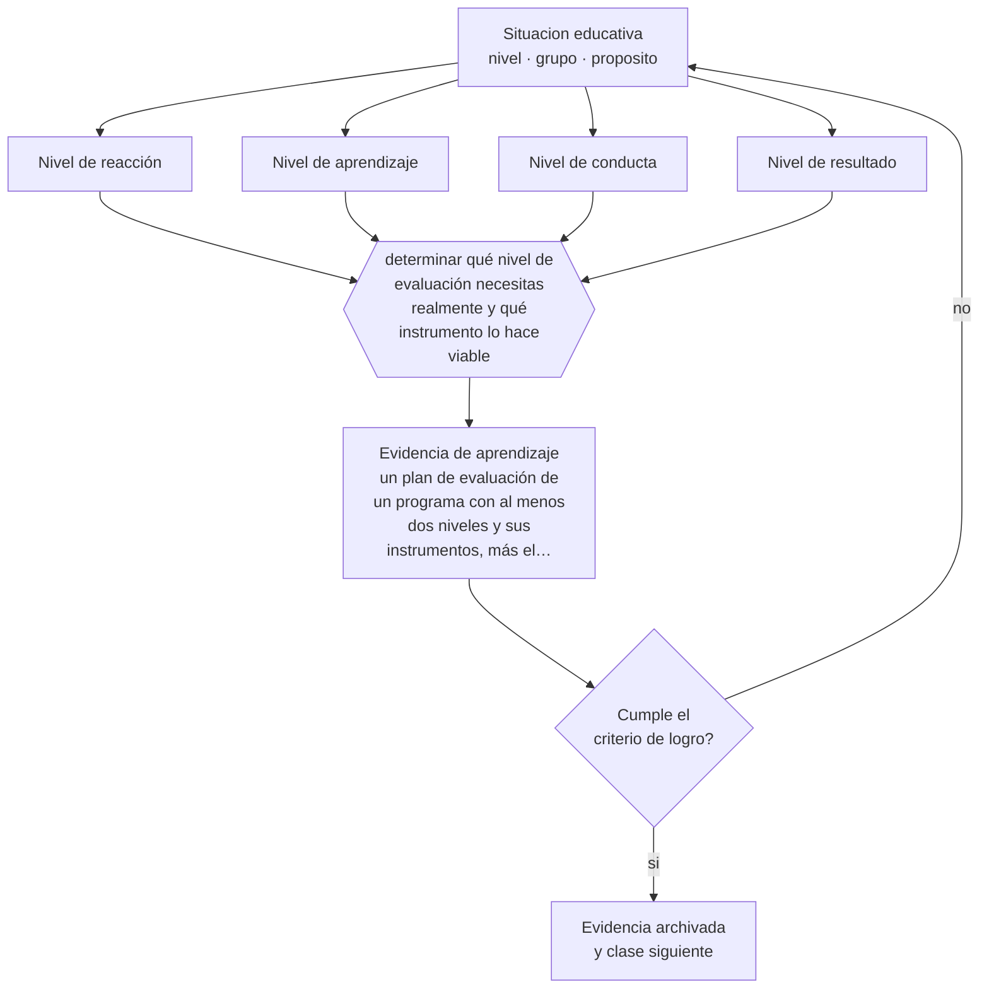

# Clase 095 — Evaluación en formación de adultos

> **Parte 07 · Educación de adultos y andragogía** — clase 11 de 12

**Estado de evidencia:** `CONSISTENTE` · **Etapa:** 🔵 Etapa B — Enseñanza por ciclo vital · **Población de referencia:** educación de adultos, capacitación laboral y formación continua 
**Decisión que habilita:** determinar qué nivel de evaluación necesitas realmente y qué instrumento lo hace viable 
**Evidencia de aprendizaje:** un plan de evaluación de un programa con al menos dos niveles y sus instrumentos, más el análisis de sus límites

## 🎯 Propósito

Evaluar formación de adultos más allá de la reacción: aprendizaje verificado, cambio de conducta en el puesto y resultado organizacional, con instrumentos proporcionales a la decisión.

## 📚 Resultados de aprendizaje

Al finalizar esta clase podrás:

1. **Definir** con precisión los cuatro conceptos centrales de la clase y reconocerlos en una situación educativa real, no solo en su enunciado.
2. **Explicar** por qué la encuesta de satisfacción al final de la sesión no dice casi nada sobre el aprendizaje.
3. **Decidir** —qué nivel de evaluación necesitas realmente y qué instrumento lo hace viable— y sostener la decisión con un fundamento escrito.
4. **Producir** la evidencia de la clase —un plan de evaluación de un programa con al menos dos niveles y sus instrumentos, más el análisis de sus límites— y contrastarla contra el criterio de logro.
5. **Distinguir** lo que la evidencia sostiene de lo que es práctica instalada, preferencia personal o costumbre de la institución.

## 🧩 Conceptos centrales

| Concepto | Comprensión verificable |
|---|---|
| **Nivel de reacción** | satisfacción declarada por el participante; el más fácil de medir y el menos informativo |
| **Nivel de aprendizaje** | verificación de lo aprendido con instrumentos distintos de la autopercepción |
| **Nivel de conducta** | cambio observable en el desempeño del puesto de trabajo |
| **Nivel de resultado** | efecto en indicadores de la organización; el más difícil de atribuir |

## 🗺️ Flujo de razonamiento

## 📖 Desarrollo

### 1. El fondo del asunto

La evaluación de la capacitación se estancó durante décadas en el primer nivel porque es barato y agradable de reportar. La evidencia disponible muestra que la satisfacción correlaciona débilmente con el aprendizaje y casi nada con el cambio de conducta. Un programa muy bien evaluado por sus participantes puede no haber producido ningún cambio en el trabajo, y suele ser el caso.

### 2. Cómo se traduce en decisiones de enseñanza

La decisión práctica es proporcional: si el programa es pequeño y de bajo costo, basta con verificar aprendizaje; si compromete recursos importantes o decisiones de continuidad, hay que medir conducta en el puesto. Medir conducta exige acuerdos previos con la organización sobre qué se observará y cuándo. Y atribuir resultados organizacionales a la formación exige diseño comparativo, no solo medición antes y después.

### 3. Qué sostiene la evidencia y qué no

El modelo de cuatro niveles es una taxonomía útil y no un modelo causal validado: los niveles no se implican entre sí y la evidencia no respalda su jerarquía. Además, atribuir cambios en indicadores organizacionales a una capacitación específica es un problema de inferencia causal que casi ningún diseño habitual resuelve.

> **Cómo leer el estado de evidencia `CONSISTENTE`.** La evidencia es amplia y coherente, pero proviene sobre todo de estudios correlacionales, de síntesis con heterogeneidad alta o de contextos distintos al tuyo. Sirve para orientar la decisión y exige que compruebes el efecto en tu propio grupo.

## 🧪 Taller guiado

Aplica la clase a **uno** de los contextos siguientes y repite después el ejercicio en un
contexto de exigencia distinta. Cambiar de contexto es parte del aprendizaje: lo que funciona
con un grupo no se traslada intacto a otro.

| Contexto | Rasgo que cambia la decisión |
|---|---|
| Capacitación obligatoria en empresa | el participante no eligió estar: hay que ganar la relevancia |
| Formación voluntaria de perfeccionamiento | alta motivación y alta exigencia de utilidad |
| Educación de adultos que retoma estudios | historia escolar previa, muchas veces negativa |
| Reconversión laboral o reskilling | urgencia económica y necesidad de resultado rápido |
| Formación en línea asincrónica | la deserción es el riesgo principal |
| Mentoría o acompañamiento individual | la relación es el vehículo del aprendizaje |

**Secuencia de trabajo:**

1. Delimita el contexto: nivel, edad, tamaño del grupo, asignatura o experiencia y tiempo real disponible.
2. Declara qué saben ya los estudiantes y **cómo lo comprobaste**, no cómo lo supones.
3. Formula la decisión pedagógica que esta clase habilita y escribe su fundamento.
4. Anticipa qué observarías si la decisión funciona y qué observarías si no funciona.
5. Diseña de antemano la alternativa que aplicarás si la primera estrategia falla.
6. Ejecuta o simula, y registra lo observado con fecha, contexto y evidencia concreta.
7. Produce la evidencia de aprendizaje de la clase.
8. Contrástala contra el criterio de logro, corrige y recién entonces avanza.

### 📦 Evidencia de aprendizaje

Un plan de evaluación de un programa con al menos dos niveles y sus instrumentos, más el análisis de sus límites.

Debe incluir contexto, decisión, fundamento, fuentes consultadas con su fecha, indicador de
logro observable, riesgos previstos y qué harías distinto en la siguiente iteración.

## 🏆 Reto verificable

Evalúa un programa tuyo en dos niveles. Compara el resultado de satisfacción con el de aprendizaje verificado y analiza la diferencia.

## ✅ Criterio de logro

- [ ] el plan evalúa al menos un nivel más allá de la reacción con instrumento definido;
- [ ] los límites de inferencia de cada nivel están declarados explícitamente;
- [ ] cada afirmación sobre «lo que funciona» está atribuida a una fuente identificable, con autor y fecha;
- [ ] la decisión es ejecutable con el tiempo, el espacio, el número de estudiantes y los recursos que realmente tienes;
- [ ] la evidencia queda archivada de forma reproducible: otra persona podría revisarla sin que tú se la expliques.

## ⚠️ Errores frecuentes

**Propios de esta clase:**

- Reportar satisfacción como si midiera aprendizaje o efectividad del programa.
- Atribuir un cambio en indicadores organizacionales a la formación sin diseño comparativo.

**Característicos de la parte 07:**

- Diseñar para el contenido y no para el problema que el adulto necesita resolver.
- Ignorar que la experiencia previa puede sostener creencias erróneas resistentes.

## ♿ Diversidad, accesibilidad y ética

Las evaluaciones basadas solo en satisfacción tienden a premiar formatos cómodos y penalizar los exigentes, lo que perjudica a los programas dirigidos a poblaciones con mayores brechas, que suelen ser más demandantes.

Antes de aplicar cualquier decisión de esta clase con estudiantes reales, revisa el
[protocolo de práctica responsable](../../../docs/ETICA_Y_PRACTICA_RESPONSABLE.md):
consentimiento, resguardo de datos personales, proporcionalidad de la intervención y derecho
de cada estudiante a no ser objeto de un ensayo que no le reporta beneficio.

## ❓ Preguntas de comprobación

1. ¿Qué decisión vas a tomar con el resultado de esta evaluación?
2. ¿Qué observarías en el puesto de trabajo si la formación funcionó?
3. ¿Qué otra explicación podría dar cuenta del cambio que estás atribuyendo al programa?

## 📕 Lecturas base

**Kirkpatrick, D. & Kirkpatrick, J. (2006). *Evaluating Training Programs*.**  
*Qué aporta a esta clase:* el modelo de cuatro niveles, ampliamente usado; conviene conocerlo con sus críticas.

**Alliger, G. & Janak, E. (1989). *Kirkpatrick's Levels of Training Criteria: Thirty Years Later*.**  
*Qué aporta a esta clase:* el análisis que muestra la débil relación entre niveles y desmonta su lectura jerárquica.

Catálogo completo: [bibliografía del programa](../../../docs/BIBLIOGRAFIA.md) ·
[glosario](../../../docs/GLOSARIO.md) ·
[fuentes oficiales y cómo leerlas](../../../docs/FUENTES.md).

## 🔗 Conexión con el resto del programa

Cierra la lógica de la clase 089 y aporta a la parte 11 el problema de la inferencia a partir de resultados.

> [!IMPORTANT]
> Material de formación profesional. No reemplaza un título de pedagogía, una habilitación
> legal para ejercer, ni el juicio de un equipo educativo que conoce a sus estudiantes.

---

| Anterior | Índice | Siguiente |
|---|---|---|
| [← 094 · Aprendizaje experiencial](../class-10-aprendizaje-experiencial/README.md) | [Parte 07](../README.md) · [Programa](../../../README.md) | [096 · Proyecto integrador: programa de capacitación →](../class-12-proyecto-integrador-programa-de-capacitacion/README.md) |
