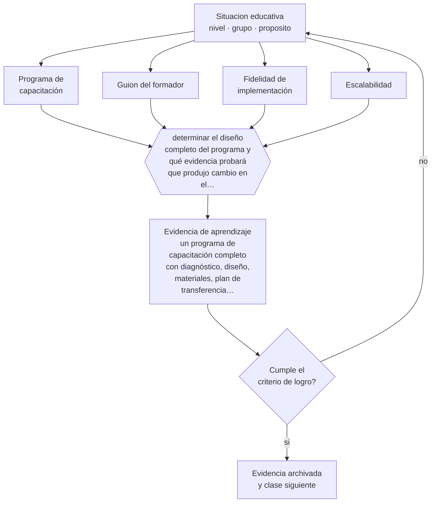

# Clase 096 — Proyecto integrador: programa de capacitación

> **Parte 07 · Educación de adultos y andragogía** — clase 12 de 12

**Estado de evidencia:** `CONSISTENTE` · **Etapa:** 🔵 Etapa B — Enseñanza por ciclo vital · **Población de referencia:** educación de adultos, capacitación laboral y formación continua 
**Decisión que habilita:** determinar el diseño completo del programa y qué evidencia probará que produjo cambio en el desempeño 
**Evidencia de aprendizaje:** un programa de capacitación completo con diagnóstico, diseño, materiales, plan de transferencia y evaluación

## 🎯 Propósito

Integrar la parte diseñando un programa de capacitación completo: diagnóstico, objetivos de desempeño, diseño instruccional, plan de transferencia, evaluación y materiales ejecutables por otro formador.

## 📚 Resultados de aprendizaje

Al finalizar esta clase podrás:

1. **Definir** con precisión los cuatro conceptos centrales de la clase y reconocerlos en una situación educativa real, no solo en su enunciado.
2. **Explicar** cómo se construye un programa de capacitación completo que alguien pueda ejecutar sin ti.
3. **Decidir** —el diseño completo del programa y qué evidencia probará que produjo cambio en el desempeño— y sostener la decisión con un fundamento escrito.
4. **Producir** la evidencia de la clase —un programa de capacitación completo con diagnóstico, diseño, materiales, plan de transferencia y evaluación— y contrastarla contra el criterio de logro.
5. **Distinguir** lo que la evidencia sostiene de lo que es práctica instalada, preferencia personal o costumbre de la institución.

## 🧩 Conceptos centrales

| Concepto | Comprensión verificable |
|---|---|
| **Programa de capacitación** | conjunto articulado de sesiones, materiales y evaluación orientado a un cambio de desempeño |
| **Guion del formador** | documento que permite a otra persona ejecutar la sesión con fidelidad razonable |
| **Fidelidad de implementación** | grado en que la ejecución corresponde al diseño; explica buena parte de los resultados |
| **Escalabilidad** | posibilidad de repetir el programa con otros formadores y grupos sin perder calidad |

## 🗺️ Flujo de razonamiento

## 📖 Desarrollo

### 1. El fondo del asunto

El proyecto integrador de esta parte tiene una exigencia particular: el programa debe poder ser ejecutado por otra persona. Eso obliga a explicitar lo que un formador experimentado hace de forma implícita —cómo abre la sesión, qué pregunta, qué ejemplos usa, cómo maneja la objeción típica— y convierte el diseño en un producto transferible y no en una actuación personal.

### 2. Cómo se traduce en decisiones de enseñanza

El paquete completo incluye diagnóstico documentado, objetivos de desempeño, secuencia de sesiones con guion, materiales del participante, plan de transferencia acordado y plan de evaluación. La prueba de calidad es entregarlo a otro formador y observar su ejecución: lo que él no logre reproducir es lo que faltaba explicitar.

### 3. Qué sostiene la evidencia y qué no

Un programa bien diseñado no garantiza transferencia: las condiciones organizacionales pesan tanto como el diseño. Declararlo por escrito, junto con los supuestos del diseño, protege al programa de ser evaluado por resultados que dependen de decisiones ajenas al formador.

> **Cómo leer el estado de evidencia `CONSISTENTE`.** La evidencia es amplia y coherente, pero proviene sobre todo de estudios correlacionales, de síntesis con heterogeneidad alta o de contextos distintos al tuyo. Sirve para orientar la decisión y exige que compruebes el efecto en tu propio grupo.

## 🧪 Taller guiado

Aplica la clase a **uno** de los contextos siguientes y repite después el ejercicio en un
contexto de exigencia distinta. Cambiar de contexto es parte del aprendizaje: lo que funciona
con un grupo no se traslada intacto a otro.

| Contexto | Rasgo que cambia la decisión |
|---|---|
| Capacitación obligatoria en empresa | el participante no eligió estar: hay que ganar la relevancia |
| Formación voluntaria de perfeccionamiento | alta motivación y alta exigencia de utilidad |
| Educación de adultos que retoma estudios | historia escolar previa, muchas veces negativa |
| Reconversión laboral o reskilling | urgencia económica y necesidad de resultado rápido |
| Formación en línea asincrónica | la deserción es el riesgo principal |
| Mentoría o acompañamiento individual | la relación es el vehículo del aprendizaje |

**Secuencia de trabajo:**

1. Delimita el contexto: nivel, edad, tamaño del grupo, asignatura o experiencia y tiempo real disponible.
2. Declara qué saben ya los estudiantes y **cómo lo comprobaste**, no cómo lo supones.
3. Formula la decisión pedagógica que esta clase habilita y escribe su fundamento.
4. Anticipa qué observarías si la decisión funciona y qué observarías si no funciona.
5. Diseña de antemano la alternativa que aplicarás si la primera estrategia falla.
6. Ejecuta o simula, y registra lo observado con fecha, contexto y evidencia concreta.
7. Produce la evidencia de aprendizaje de la clase.
8. Contrástala contra el criterio de logro, corrige y recién entonces avanza.

### 📦 Evidencia de aprendizaje

Un programa de capacitación completo con diagnóstico, diseño, materiales, plan de transferencia y evaluación.

Debe incluir contexto, decisión, fundamento, fuentes consultadas con su fecha, indicador de
logro observable, riesgos previstos y qué harías distinto en la siguiente iteración.

## 🏆 Reto verificable

Entrega tu programa a otro formador y observa una sesión ejecutada por él. Documenta qué no pudo reproducir y corrige el guion.

## ✅ Criterio de logro

- [ ] el guion permite a otro formador ejecutar la sesión con fidelidad razonable;
- [ ] el plan de evaluación mide al menos un nivel más allá de la satisfacción;
- [ ] cada afirmación sobre «lo que funciona» está atribuida a una fuente identificable, con autor y fecha;
- [ ] la decisión es ejecutable con el tiempo, el espacio, el número de estudiantes y los recursos que realmente tienes;
- [ ] la evidencia queda archivada de forma reproducible: otra persona podría revisarla sin que tú se la expliques.

## ⚠️ Errores frecuentes

**Propios de esta clase:**

- Diseñar un programa que solo su autor puede ejecutar.
- Comprometer resultados de negocio sin haber acordado las condiciones de transferencia.

**Característicos de la parte 07:**

- Diseñar para el contenido y no para el problema que el adulto necesita resolver.
- Ignorar que la experiencia previa puede sostener creencias erróneas resistentes.

## ♿ Diversidad, accesibilidad y ética

Un programa transferible debe declarar sus requisitos de accesibilidad: materiales legibles, alternativas a la exposición oral, subtítulos y consideración de participantes con lectura o conectividad limitadas.

Antes de aplicar cualquier decisión de esta clase con estudiantes reales, revisa el
[protocolo de práctica responsable](../../../docs/ETICA_Y_PRACTICA_RESPONSABLE.md):
consentimiento, resguardo de datos personales, proporcionalidad de la intervención y derecho
de cada estudiante a no ser objeto de un ensayo que no le reporta beneficio.

## ❓ Preguntas de comprobación

1. ¿Qué parte de tu programa vive solo en tu cabeza?
2. ¿Qué supuesto organizacional debe cumplirse para que produzca el cambio prometido?
3. ¿Qué observarías en el puesto de trabajo a los tres meses?

## 📕 Lecturas base

**Merriam, S. & Bierema, L. (2013). *Adult Learning: Linking Theory and Practice*.**  
*Qué aporta a esta clase:* marco general del diseño para adultos con criterios de calidad.

**Blume, B. et al. (2010). *Transfer of Training: A Meta-Analytic Review*.**  
*Qué aporta a esta clase:* evidencia sobre qué condiciones del diseño y del entorno predicen transferencia.

Catálogo completo: [bibliografía del programa](../../../docs/BIBLIOGRAFIA.md) ·
[glosario](../../../docs/GLOSARIO.md) ·
[fuentes oficiales y cómo leerlas](../../../docs/FUENTES.md).

## 🔗 Conexión con el resto del programa

Cierra la parte 07 integrando sus once clases previas. Es el puente directo hacia la migración de este mismo programa a modalidad de capacitación.

> [!IMPORTANT]
> Material de formación profesional. No reemplaza un título de pedagogía, una habilitación
> legal para ejercer, ni el juicio de un equipo educativo que conoce a sus estudiantes.

---

| Anterior | Índice | Siguiente |
|---|---|---|
| [← 095 · Evaluación en formación de adultos](../class-11-evaluacion-en-formacion-de-adultos/README.md) | [Parte 07](../README.md) · [Programa](../../../README.md) | [Programa completo →](../../../README.md) |
