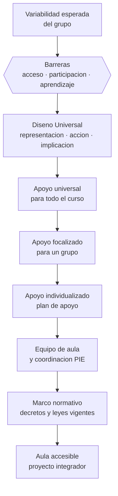

# Parte 08 — Inclusión y educación especial

> *La barrera casi nunca está en el estudiante: está en el diseño*

🟣 **Etapa C — Núcleo profesional docente** · salida de la etapa: diseñar, enseñar, evaluar y gestionar un curso completo con evidencia

**Clases:** 12 (097–108) · **Población de referencia:** todos los niveles, con foco en apoyos y accesibilidad · **Conceptos operacionales:** 48 · **Señales observables:** 36 
**Contenido central:** Educación inclusiva, barreras para el aprendizaje, Diseño Universal para el Aprendizaje, diversificación, necesidades educativas especiales, autismo, TDAH, dificultades específicas, discapacidad sensorial, motora e intelectual y altas capacidades

## 🎯 De qué trata esta parte

El cambio conceptual que ordena esta parte es el paso del déficit a la barrera. Durante décadas la pregunta fue qué le falta a este estudiante para seguir la clase; la pregunta actual es qué tiene esta clase que impide participar a este estudiante. No es un giro retórico: cambia quién debe modificarse. La primera pregunta genera diagnósticos y derivaciones; la segunda genera rediseño de la enseñanza, que es lo único que el docente controla.

El Diseño Universal para el Aprendizaje es el marco operativo de ese giro. Su lógica es anticipar la variabilidad en vez de compensarla después: si el material existe en más de un formato, si hay más de una forma de demostrar lo aprendido y si el sentido de la tarea está explícito, muchas adecuaciones individuales dejan de ser necesarias. La evidencia experimental sobre el marco completo es más limitada de lo que su difusión sugiere, y conviene decirlo: sus principios son sólidos y ampliamente adoptados, y su eficacia global sigue en estudio.

En Chile este campo está fuertemente normado —decretos de integración y de adecuaciones curriculares, ley de inclusión, ley de autismo, ley de discapacidad— y esa normativa define plazos, actores e instrumentos obligatorios. Aquí se enseña a distinguir la obligación legal de la buena práctica: la primera se cumple, la segunda se argumenta; confundirlas produce equipos que llenan formularios y no cambian la enseñanza.

## 🏫 Caso de la parte

Las doce clases trabajan sobre la misma realidad, para que puedas ver cómo cambia tu diagnóstico
a medida que avanzas:

> Un estudiante autista de 5.º básico tiene plan de apoyo vigente, informes completos y ninguna modificación real en la clase. Pasa la mitad de la jornada en la sala de recursos y su profesora jefe no participó del plan.

**Artefacto que produces al terminar:** aula accesible con mapa de barreras observado, rediseño universal y plan de apoyo conectado con la planificación de aula.

## 📚 Resultados de la parte

Al terminar esta parte podrás:

1. **Identificar barreras concretas para el aprendizaje y la participación en una clase real**.
2. **Rediseñar una experiencia aplicando los principios del Diseño Universal para el Aprendizaje**.
3. **Diferenciar apoyo universal, focalizado e individualizado y decidir cuál corresponde**.
4. **Aplicar el marco normativo chileno de inclusión sin reducirlo a papeleo**.

## 🗺️ Mapa de la parte

## 🧠 Marco de referencia

- modelo social y biopsicosocial de la discapacidad frente al modelo del déficit
- Diseño Universal para el Aprendizaje y diversificación de la enseñanza
- sistema de apoyos por niveles y trabajo colaborativo del equipo de aula
- normativa chilena de integración, adecuaciones curriculares e inclusión

**Autoras y autores que conviene conocer:** David Rose y Anne Meyer (CAST), Mel Ainscow y Tony Booth, Lani Florian, equipos de la Organización Mundial de la Salud (CIF) y especialistas chilenos en educación diferencial

## 📋 Las 12 clases

| # | Clase | Decisión que habilita | Evidencia |
|---:|---|---|---|
| 097 | [Educación inclusiva](class-01-educacion-inclusiva/README.md) | determinar si una práctica de tu establecimiento integra, incluye o simplemente tolera la presencia del estudiante | `MARCO-NORMATIVO` |
| 098 | [Barreras para el aprendizaje y la participación](class-02-barreras-para-el-aprendizaje-y-la-participacion/README.md) | determinar qué barrera concreta explica la no participación de un estudiante en tu clase | `CONSISTENTE` |
| 099 | [Diseño Universal para el Aprendizaje](class-03-diseno-universal-para-el-aprendizaje/README.md) | determinar qué opciones incorporar al diseño para que menos estudiantes necesiten una adecuación individual | `EMERGENTE` |
| 100 | [Diversificación de la enseñanza](class-04-diversificacion-de-la-ensenanza/README.md) | determinar qué dimensión vas a diversificar y cuál mantendrás constante para que el diseño sea sostenible | `CONSISTENTE` |
| 101 | [Necesidades educativas especiales](class-05-necesidades-educativas-especiales/README.md) | determinar qué apoyos concretos se derivan de una necesidad detectada y quién los ejecuta en el aula | `MARCO-NORMATIVO` |
| 102 | [Autismo y apoyos educativos](class-06-autismo-y-apoyos-educativos/README.md) | determinar qué ajuste de predictibilidad, comunicación o entorno sensorial requiere tu estudiante | `CONSISTENTE` |
| 103 | [TDAH y autorregulación](class-07-tdah-y-autorregulacion/README.md) | determinar qué ajuste de estructura y de tarea reducirá la demanda de autorregulación en tu clase | `ROBUSTA` |
| 104 | [Dificultades específicas del aprendizaje](class-08-dificultades-especificas-del-aprendizaje/README.md) | determinar si la dificultad de tu estudiante requiere intervención intensiva, ajuste de acceso o ambos | `ROBUSTA` |
| 105 | [Discapacidad sensorial y motora](class-09-discapacidad-sensorial-y-motora/README.md) | determinar qué formato, apoyo técnico o ajuste del espacio hace accesible tu clase concreta | `MARCO-NORMATIVO` |
| 106 | [Discapacidad intelectual](class-10-discapacidad-intelectual/README.md) | determinar qué aprendizaje significativo perseguirás y con qué apoyos lo harás alcanzable | `CONSISTENTE` |
| 107 | [Altas capacidades](class-11-altas-capacidades/README.md) | determinar qué forma de enriquecimiento o profundización corresponde a tu estudiante y en qué dominio | `EN-DEBATE` |
| 108 | [Proyecto integrador: aula accesible](class-12-proyecto-integrador-aula-accesible/README.md) | determinar el conjunto de decisiones que hará accesible tu aula y cómo verificarás que todos aprenden | `CONSISTENTE` |

## ⚠️ Riesgos característicos

- Reducir la inclusión a la presencia física del estudiante en la sala.
- Adecuar bajando la exigencia en vez de cambiar la vía de acceso.
- Convertir el plan de apoyo en un trámite que nadie usa para enseñar.
- Etiquetar a partir de un diagnóstico y dejar de observar al estudiante.

## 📕 Lecturas de referencia de la parte

- **CAST. *Universal Design for Learning Guidelines* (versión 3.0, 2024).** — el marco operativo del DUA con sus tres principios y sus pautas; usa la versión vigente, no resúmenes de segunda mano.
- **Booth, T. & Ainscow, M. (2011). *Index for Inclusion*.** — instrumento de autoevaluación institucional: convierte «ser inclusivo» en indicadores revisables.
- **Mineduc. *Decreto 83/2015* (adecuaciones curriculares) y *Decreto 170/2009* (NEE).** — marco chileno vigente que define instrumentos, plazos y responsabilidades; verifica siempre la versión actualizada.
- **Organización Mundial de la Salud (2001). *Clasificación Internacional del Funcionamiento, de la Discapacidad y de la Salud*.** — sostiene el enfoque de funcionamiento en contexto que reemplaza al enfoque de déficit.

## ✅ Evidencia mínima para dar la parte por cerrada

- [ ] un mapa de barreras de una clase real, con evidencia observada;
- [ ] un rediseño de clase con DUA y su comparación con la versión original;
- [ ] un plan de apoyo individual conectado con la planificación de aula;
- [ ] una revisión del cumplimiento normativo con brechas y plan de cierre.

## 🧭 Práctica y evaluación de la parte

- [Rúbrica maestra e instrumentos de autoevaluación](../../assessments/README.md)
- [Casos profesionales para resolver con este marco](../../cases/README.md)
- [Laboratorios de decisión](../../labs/README.md)
- [Dónde se archiva la evidencia](../../evidence/README.md)

---

| Anterior | Índice | Siguiente |
|---|---|---|
| [← Parte 07 · Educación de adultos y andragogía](../part-07-educacion-de-adultos-y-andragogia/README.md) | [Programa](../../README.md) · [Currículo](../../CURRICULUM.md) | [Parte 09 · Diseño curricular →](../part-09-diseno-curricular/README.md) |
