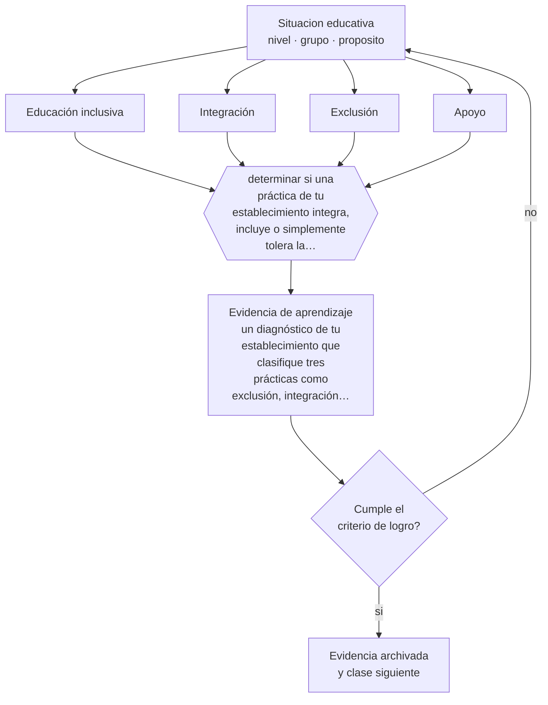

# Clase 097 — Educación inclusiva

> **Parte 08 · Inclusión y educación especial** — clase 1 de 12

**Estado de evidencia:** `MARCO-NORMATIVO` · **Etapa:** 🟣 Etapa C — Núcleo profesional docente · **Población de referencia:** todos los niveles, con foco en apoyos y accesibilidad 
**Decisión que habilita:** determinar si una práctica de tu establecimiento integra, incluye o simplemente tolera la presencia del estudiante 
**Evidencia de aprendizaje:** un diagnóstico de tu establecimiento que clasifique tres prácticas como exclusión, integración o inclusión, con evidencia

## 🎯 Propósito

Adoptar el enfoque de educación inclusiva como responsabilidad del sistema y no como beneficio concedido: todos los estudiantes aprenden en el mismo espacio, con los apoyos que cada uno necesita.

## 📚 Resultados de aprendizaje

Al finalizar esta clase podrás:

1. **Definir** con precisión los cuatro conceptos centrales de la clase y reconocerlos en una situación educativa real, no solo en su enunciado.
2. **Explicar** qué cambia cuando la pregunta pasa de «qué le falta a este estudiante» a «qué impide esta clase».
3. **Decidir** —si una práctica de tu establecimiento integra, incluye o simplemente tolera la presencia del estudiante— y sostener la decisión con un fundamento escrito.
4. **Producir** la evidencia de la clase —un diagnóstico de tu establecimiento que clasifique tres prácticas como exclusión, integración o inclusión, con evidencia— y contrastarla contra el criterio de logro.
5. **Distinguir** lo que la evidencia sostiene de lo que es práctica instalada, preferencia personal o costumbre de la institución.

## 🧩 Conceptos centrales

| Concepto | Comprensión verificable |
|---|---|
| **Educación inclusiva** | proceso de eliminar barreras para que todos aprendan y participen en el sistema común |
| **Integración** | incorporación del estudiante al espacio común exigiéndole adaptarse a él sin modificarlo |
| **Exclusión** | impedimento de acceso, permanencia o participación, incluso cuando el estudiante está presente |
| **Apoyo** | recurso, ajuste o intervención que hace posible la participación y el aprendizaje |

## 🗺️ Flujo de razonamiento

## 📖 Desarrollo

### 1. El fondo del asunto

Integrar e incluir no son sinónimos. La integración pide al estudiante que se ajuste al sistema tal como está; la inclusión obliga al sistema a modificarse para que la participación sea posible. La diferencia se ve en quién cambia: si el único que se adapta es el estudiante, no hay inclusión aunque esté sentado en la sala. En Chile, este enfoque está incorporado en la Ley de Inclusión Escolar y en la normativa de adecuaciones curriculares.

### 2. Cómo se traduce en decisiones de enseñanza

El diagnóstico se hace con prácticas concretas: cómo se matricula, quién participa de las salidas, quién queda fuera de las evaluaciones, qué ocurre con un estudiante durante la clase de la que fue retirado para su apoyo. Esas observaciones muestran el enfoque real de la institución mucho mejor que su proyecto educativo declarado.

### 3. Qué sostiene la evidencia y qué no

La inclusión tiene tensiones prácticas reconocidas y discutidas por profesionales competentes: recursos limitados, formación docente insuficiente, tamaño de los cursos, y casos donde el estudiante requiere apoyos que la escuela común no puede proveer sin comprometer a otros. Reconocer esas tensiones no es un argumento contra la inclusión: es la condición para discutirla con seriedad.

> **Cómo leer el estado de evidencia `MARCO-NORMATIVO`.** El contenido no se decide por evidencia empírica sino por norma, política pública o marco institucional vigente. Verifica siempre la versión vigente a la fecha en que vas a aplicarlo: la norma cambia y la clase no se actualiza sola.

## 🧪 Taller guiado

Aplica la clase a **uno** de los contextos siguientes y repite después el ejercicio en un
contexto de exigencia distinta. Cambiar de contexto es parte del aprendizaje: lo que funciona
con un grupo no se traslada intacto a otro.

| Contexto | Rasgo que cambia la decisión |
|---|---|
| Estudiante con discapacidad sensorial | el acceso al material define la participación |
| Estudiante con discapacidad motora | el espacio y los tiempos son la barrera principal |
| Estudiante autista | predictibilidad, regulación sensorial y comunicación explícita |
| Estudiante con TDAH | la organización de la tarea pesa más que la voluntad |
| Dificultad específica del aprendizaje | la vía de acceso cambia, el objetivo no baja |
| Altas capacidades | la falta de desafío también es una barrera |

**Secuencia de trabajo:**

1. Delimita el contexto: nivel, edad, tamaño del grupo, asignatura o experiencia y tiempo real disponible.
2. Declara qué saben ya los estudiantes y **cómo lo comprobaste**, no cómo lo supones.
3. Formula la decisión pedagógica que esta clase habilita y escribe su fundamento.
4. Anticipa qué observarías si la decisión funciona y qué observarías si no funciona.
5. Diseña de antemano la alternativa que aplicarás si la primera estrategia falla.
6. Ejecuta o simula, y registra lo observado con fecha, contexto y evidencia concreta.
7. Produce la evidencia de aprendizaje de la clase.
8. Contrástala contra el criterio de logro, corrige y recién entonces avanza.

### 📦 Evidencia de aprendizaje

Un diagnóstico de tu establecimiento que clasifique tres prácticas como exclusión, integración o inclusión, con evidencia.

Debe incluir contexto, decisión, fundamento, fuentes consultadas con su fecha, indicador de
logro observable, riesgos previstos y qué harías distinto en la siguiente iteración.

## 🏆 Reto verificable

Observa una jornada completa siguiendo a un estudiante con apoyos. Documenta cuánto tiempo participa del mismo aprendizaje que sus compañeros.

## ✅ Criterio de logro

- [ ] cada práctica se clasifica con evidencia observada y no con la declaración institucional;
- [ ] el diagnóstico identifica quién debe cambiar en cada caso para que haya inclusión;
- [ ] cada afirmación sobre «lo que funciona» está atribuida a una fuente identificable, con autor y fecha;
- [ ] la decisión es ejecutable con el tiempo, el espacio, el número de estudiantes y los recursos que realmente tienes;
- [ ] la evidencia queda archivada de forma reproducible: otra persona podría revisarla sin que tú se la expliques.

## ⚠️ Errores frecuentes

**Propios de esta clase:**

- Considerar cumplida la inclusión por la presencia física del estudiante en la sala común.
- Trasladar la responsabilidad de la adaptación exclusivamente al estudiante y su familia.

**Característicos de la parte 08:**

- Reducir la inclusión a la presencia física del estudiante en la sala.
- Adecuar bajando la exigencia en vez de cambiar la vía de acceso.

## ♿ Diversidad, accesibilidad y ética

La inclusión no se limita a la discapacidad: abarca migración, pobreza, género, identidad, ruralidad y trayectorias interrumpidas. Un diagnóstico que solo mira estudiantes con diagnóstico médico deja fuera la mayor parte de la exclusión real.

Antes de aplicar cualquier decisión de esta clase con estudiantes reales, revisa el
[protocolo de práctica responsable](../../../docs/ETICA_Y_PRACTICA_RESPONSABLE.md):
consentimiento, resguardo de datos personales, proporcionalidad de la intervención y derecho
de cada estudiante a no ser objeto de un ensayo que no le reporta beneficio.

## ❓ Preguntas de comprobación

1. ¿Qué hace el estudiante mientras el resto del curso avanza sin él?
2. ¿Quién se adapta en tu establecimiento: el sistema o el estudiante?
3. ¿Qué práctica declarada como inclusiva no resistiría una observación de una semana?

## 📕 Lecturas base

**Booth, T. & Ainscow, M. (2011). *Index for Inclusion*.**  
*Qué aporta a esta clase:* convierte la inclusión en indicadores revisables por la propia comunidad educativa.

**Ley 20.845 de Inclusión Escolar (Chile) y normativa asociada.**  
*Qué aporta a esta clase:* marco vigente que define obligaciones del sostenedor y derechos del estudiante.

Catálogo completo: [bibliografía del programa](../../../docs/BIBLIOGRAFIA.md) ·
[glosario](../../../docs/GLOSARIO.md) ·
[fuentes oficiales y cómo leerlas](../../../docs/FUENTES.md).

## 🔗 Conexión con el resto del programa

Abre la parte 08 y se apoya en la clase 007 (derecho a la educación). Sostiene todas las clases siguientes de esta parte.

> [!IMPORTANT]
> Material de formación profesional. No reemplaza un título de pedagogía, una habilitación
> legal para ejercer, ni el juicio de un equipo educativo que conoce a sus estudiantes.

---

| Anterior | Índice | Siguiente |
|---|---|---|
| [← Parte 08](../README.md) | [Parte 08](../README.md) · [Programa](../../../README.md) | [098 · Barreras para el aprendizaje y la participación →](../class-02-barreras-para-el-aprendizaje-y-la-participacion/README.md) |
