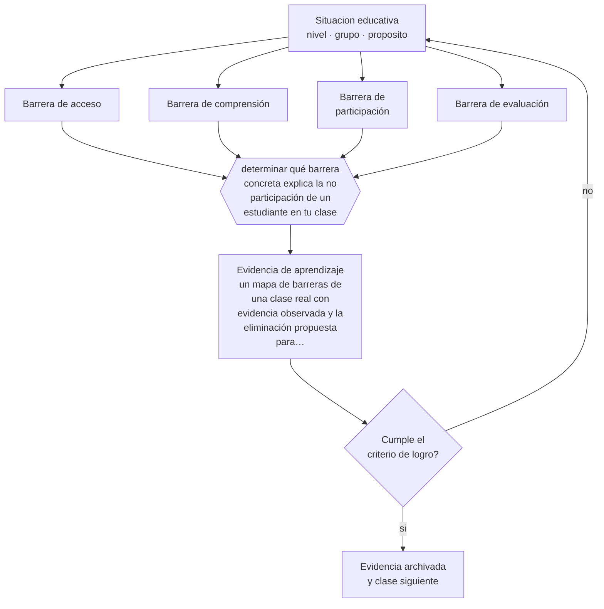

# Clase 098 — Barreras para el aprendizaje y la participación

> **Parte 08 · Inclusión y educación especial** — clase 2 de 12

**Estado de evidencia:** `CONSISTENTE` · **Etapa:** 🟣 Etapa C — Núcleo profesional docente · **Población de referencia:** todos los niveles, con foco en apoyos y accesibilidad 
**Decisión que habilita:** determinar qué barrera concreta explica la no participación de un estudiante en tu clase 
**Evidencia de aprendizaje:** un mapa de barreras de una clase real con evidencia observada y la eliminación propuesta para cada una

## 🎯 Propósito

Aprender a levantar barreras para el aprendizaje y la participación en una clase real: de acceso, de comprensión, de participación y de evaluación, con evidencia observada.

## 📚 Resultados de aprendizaje

Al finalizar esta clase podrás:

1. **Definir** con precisión los cuatro conceptos centrales de la clase y reconocerlos en una situación educativa real, no solo en su enunciado.
2. **Explicar** cómo se identifican las barreras concretas que impiden aprender, en vez de describir déficits del estudiante.
3. **Decidir** —qué barrera concreta explica la no participación de un estudiante en tu clase— y sostener la decisión con un fundamento escrito.
4. **Producir** la evidencia de la clase —un mapa de barreras de una clase real con evidencia observada y la eliminación propuesta para cada una— y contrastarla contra el criterio de logro.
5. **Distinguir** lo que la evidencia sostiene de lo que es práctica instalada, preferencia personal o costumbre de la institución.

## 🧩 Conceptos centrales

| Concepto | Comprensión verificable |
|---|---|
| **Barrera de acceso** | obstáculo físico, sensorial o comunicativo que impide llegar al contenido o al espacio |
| **Barrera de comprensión** | obstáculo en el lenguaje, el formato o el conocimiento previo supuesto por la clase |
| **Barrera de participación** | condición social u organizativa que impide intervenir, trabajar con otros o mostrar lo aprendido |
| **Barrera de evaluación** | formato de evaluación que impide demostrar un aprendizaje que sí existe |

## 🗺️ Flujo de razonamiento

## 📖 Desarrollo

### 1. El fondo del asunto

Cambiar la pregunta cambia la respuesta. Ante un estudiante que no participa, la descripción de déficit produce derivaciones; la descripción de barreras produce cambios en la clase. Una barrera es concreta y verificable: el texto está en un tamaño que no puede leer, la consigna supone vocabulario que no tiene, la actividad requiere hablar frente al grupo, la evaluación exige escribir a mano en un tiempo fijo.

### 2. Cómo se traduce en decisiones de enseñanza

El levantamiento se hace observando una clase completa con foco en un estudiante y registrando en qué momento exacto queda fuera. Después se clasifica la barrera y se decide su eliminación. La mayoría resulta eliminable con decisiones de diseño sin costo, y esa constatación suele cambiar más la práctica de un equipo que cualquier capacitación teórica.

### 3. Qué sostiene la evidencia y qué no

El enfoque de barreras no niega que existan condiciones individuales que requieren apoyos específicos: hay dificultades reales que no desaparecen eliminando obstáculos del entorno. Sostener las dos cosas —barreras del contexto y necesidades del estudiante— es lo que permite intervenir bien; negar cualquiera de las dos produce mala práctica.

> **Cómo leer el estado de evidencia `CONSISTENTE`.** La evidencia es amplia y coherente, pero proviene sobre todo de estudios correlacionales, de síntesis con heterogeneidad alta o de contextos distintos al tuyo. Sirve para orientar la decisión y exige que compruebes el efecto en tu propio grupo.

## 🧪 Taller guiado

Aplica la clase a **uno** de los contextos siguientes y repite después el ejercicio en un
contexto de exigencia distinta. Cambiar de contexto es parte del aprendizaje: lo que funciona
con un grupo no se traslada intacto a otro.

| Contexto | Rasgo que cambia la decisión |
|---|---|
| Estudiante con discapacidad sensorial | el acceso al material define la participación |
| Estudiante con discapacidad motora | el espacio y los tiempos son la barrera principal |
| Estudiante autista | predictibilidad, regulación sensorial y comunicación explícita |
| Estudiante con TDAH | la organización de la tarea pesa más que la voluntad |
| Dificultad específica del aprendizaje | la vía de acceso cambia, el objetivo no baja |
| Altas capacidades | la falta de desafío también es una barrera |

**Secuencia de trabajo:**

1. Delimita el contexto: nivel, edad, tamaño del grupo, asignatura o experiencia y tiempo real disponible.
2. Declara qué saben ya los estudiantes y **cómo lo comprobaste**, no cómo lo supones.
3. Formula la decisión pedagógica que esta clase habilita y escribe su fundamento.
4. Anticipa qué observarías si la decisión funciona y qué observarías si no funciona.
5. Diseña de antemano la alternativa que aplicarás si la primera estrategia falla.
6. Ejecuta o simula, y registra lo observado con fecha, contexto y evidencia concreta.
7. Produce la evidencia de aprendizaje de la clase.
8. Contrástala contra el criterio de logro, corrige y recién entonces avanza.

### 📦 Evidencia de aprendizaje

Un mapa de barreras de una clase real con evidencia observada y la eliminación propuesta para cada una.

Debe incluir contexto, decisión, fundamento, fuentes consultadas con su fecha, indicador de
logro observable, riesgos previstos y qué harías distinto en la siguiente iteración.

## 🏆 Reto verificable

Observa una clase de un colega siguiendo a un estudiante concreto. Entrega el mapa de barreras y acuerden juntos cuál eliminar primero.

## ✅ Criterio de logro

- [ ] cada barrera se documenta con el momento y la evidencia observada;
- [ ] la eliminación propuesta es ejecutable por el docente sin recursos adicionales;
- [ ] cada afirmación sobre «lo que funciona» está atribuida a una fuente identificable, con autor y fecha;
- [ ] la decisión es ejecutable con el tiempo, el espacio, el número de estudiantes y los recursos que realmente tienes;
- [ ] la evidencia queda archivada de forma reproducible: otra persona podría revisarla sin que tú se la expliques.

## ⚠️ Errores frecuentes

**Propios de esta clase:**

- Registrar déficits del estudiante en vez de barreras del contexto.
- Concluir que todas las dificultades desaparecen eliminando barreras, e ignorar apoyos necesarios.

**Característicos de la parte 08:**

- Reducir la inclusión a la presencia física del estudiante en la sala.
- Adecuar bajando la exigencia en vez de cambiar la vía de acceso.

## ♿ Diversidad, accesibilidad y ética

Las barreras más frecuentes no son las visibles: el ritmo de la clase, el vocabulario supuesto, el formato único de evaluación y las dinámicas de grupo excluyen a más estudiantes que las barreras arquitectónicas, y son más baratas de corregir.

Antes de aplicar cualquier decisión de esta clase con estudiantes reales, revisa el
[protocolo de práctica responsable](../../../docs/ETICA_Y_PRACTICA_RESPONSABLE.md):
consentimiento, resguardo de datos personales, proporcionalidad de la intervención y derecho
de cada estudiante a no ser objeto de un ensayo que no le reporta beneficio.

## ❓ Preguntas de comprobación

1. ¿En qué minuto exacto de tu clase quedó fuera ese estudiante?
2. ¿Qué supone tu consigna que él no tiene?
3. ¿Qué barrera podrías eliminar mañana sin pedir autorización ni recursos?

## 📕 Lecturas base

**Booth, T. & Ainscow, M. (2011). *Index for Inclusion*.**  
*Qué aporta a esta clase:* fuente del concepto de barreras para el aprendizaje y la participación, con indicadores.

**Organización Mundial de la Salud (2001). *CIF*.**  
*Qué aporta a esta clase:* fundamenta el funcionamiento como interacción entre la persona y su entorno.

Catálogo completo: [bibliografía del programa](../../../docs/BIBLIOGRAFIA.md) ·
[glosario](../../../docs/GLOSARIO.md) ·
[fuentes oficiales y cómo leerlas](../../../docs/FUENTES.md).

## 🔗 Conexión con el resto del programa

Es el instrumento diagnóstico de la parte 08 y alimenta directamente las clases 099 y 108.

> [!IMPORTANT]
> Material de formación profesional. No reemplaza un título de pedagogía, una habilitación
> legal para ejercer, ni el juicio de un equipo educativo que conoce a sus estudiantes.

---

| Anterior | Índice | Siguiente |
|---|---|---|
| [← 097 · Educación inclusiva](../class-01-educacion-inclusiva/README.md) | [Parte 08](../README.md) · [Programa](../../../README.md) | [099 · Diseño Universal para el Aprendizaje →](../class-03-diseno-universal-para-el-aprendizaje/README.md) |
