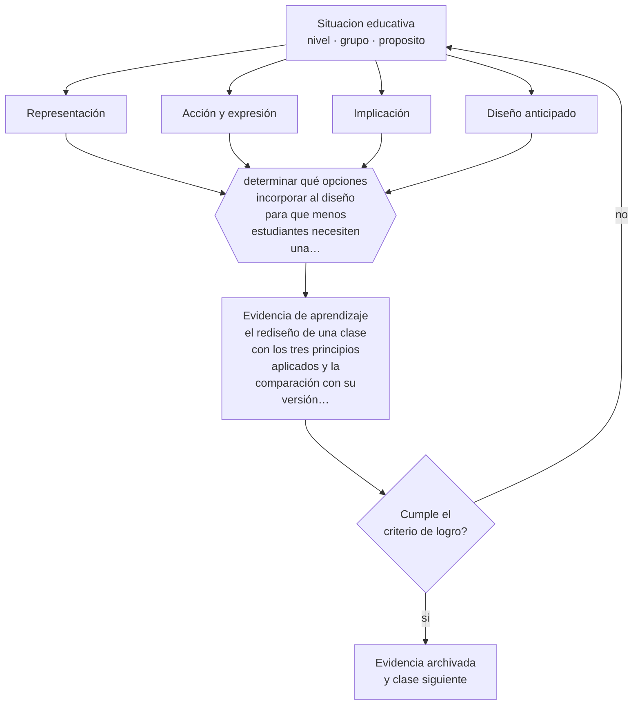

# Clase 099 — Diseño Universal para el Aprendizaje

> **Parte 08 · Inclusión y educación especial** — clase 3 de 12

**Estado de evidencia:** `EMERGENTE` · **Etapa:** 🟣 Etapa C — Núcleo profesional docente · **Población de referencia:** todos los niveles, con foco en apoyos y accesibilidad 
**Decisión que habilita:** determinar qué opciones incorporar al diseño para que menos estudiantes necesiten una adecuación individual 
**Evidencia de aprendizaje:** el rediseño de una clase con los tres principios aplicados y la comparación con su versión original

## 🎯 Propósito

Aplicar los principios del Diseño Universal para el Aprendizaje —múltiples formas de representación, de acción y expresión, y de implicación— al diseño ordinario de una clase.

## 📚 Resultados de aprendizaje

Al finalizar esta clase podrás:

1. **Definir** con precisión los cuatro conceptos centrales de la clase y reconocerlos en una situación educativa real, no solo en su enunciado.
2. **Explicar** cómo anticipar la variabilidad del curso en el diseño, en vez de compensarla con adecuaciones improvisadas.
3. **Decidir** —qué opciones incorporar al diseño para que menos estudiantes necesiten una adecuación individual— y sostener la decisión con un fundamento escrito.
4. **Producir** la evidencia de la clase —el rediseño de una clase con los tres principios aplicados y la comparación con su versión original— y contrastarla contra el criterio de logro.
5. **Distinguir** lo que la evidencia sostiene de lo que es práctica instalada, preferencia personal o costumbre de la institución.

## 🧩 Conceptos centrales

| Concepto | Comprensión verificable |
|---|---|
| **Representación** | formas alternativas de presentar la información para que sea accesible a distintos perfiles |
| **Acción y expresión** | formas alternativas de demostrar lo aprendido sin cambiar el objetivo |
| **Implicación** | opciones que sostienen el interés, el esfuerzo y la autorregulación durante la tarea |
| **Diseño anticipado** | previsión de la variabilidad en el diseño, en vez de ajuste posterior caso a caso |

## 🗺️ Flujo de razonamiento

## 📖 Desarrollo

### 1. El fondo del asunto

El Diseño Universal para el Aprendizaje propone anticipar la variabilidad: si el contenido existe en más de un formato, si hay más de una vía para demostrar lo aprendido y si la tarea explicita su sentido, muchas adecuaciones individuales dejan de ser necesarias. La lógica es sólida y ampliamente adoptada; conviene, eso sí, ser honesto sobre el estado de su evidencia experimental como marco completo.

### 2. Cómo se traduce en decisiones de enseñanza

El rediseño empieza por el objetivo: qué debe lograr el estudiante, sin negociar. Después se abren opciones en todo lo que no es el objetivo: cómo accede al contenido, cómo lo demuestra, cómo se sostiene el trabajo. La prueba práctica es que la clase rediseñada requiera menos adecuaciones individuales que la anterior, no que use más recursos.

### 3. Qué sostiene la evidencia y qué no

La evidencia sobre el marco completo es limitada: hay estudios sobre componentes específicos —opciones de representación, andamiaje— con resultados favorables, y poca evidencia experimental sobre el marco como sistema. Además, mal entendido, se usa para justificar bajar objetivos o para multiplicar materiales sin criterio.

> **Cómo leer el estado de evidencia `EMERGENTE`.** El cuerpo de estudios es reciente, escaso o poco replicado. Úsala como hipótesis de trabajo con seguimiento explícito, nunca como argumento de autoridad ni como base para una política de establecimiento.

## 🧪 Taller guiado

Aplica la clase a **uno** de los contextos siguientes y repite después el ejercicio en un
contexto de exigencia distinta. Cambiar de contexto es parte del aprendizaje: lo que funciona
con un grupo no se traslada intacto a otro.

| Contexto | Rasgo que cambia la decisión |
|---|---|
| Estudiante con discapacidad sensorial | el acceso al material define la participación |
| Estudiante con discapacidad motora | el espacio y los tiempos son la barrera principal |
| Estudiante autista | predictibilidad, regulación sensorial y comunicación explícita |
| Estudiante con TDAH | la organización de la tarea pesa más que la voluntad |
| Dificultad específica del aprendizaje | la vía de acceso cambia, el objetivo no baja |
| Altas capacidades | la falta de desafío también es una barrera |

**Secuencia de trabajo:**

1. Delimita el contexto: nivel, edad, tamaño del grupo, asignatura o experiencia y tiempo real disponible.
2. Declara qué saben ya los estudiantes y **cómo lo comprobaste**, no cómo lo supones.
3. Formula la decisión pedagógica que esta clase habilita y escribe su fundamento.
4. Anticipa qué observarías si la decisión funciona y qué observarías si no funciona.
5. Diseña de antemano la alternativa que aplicarás si la primera estrategia falla.
6. Ejecuta o simula, y registra lo observado con fecha, contexto y evidencia concreta.
7. Produce la evidencia de aprendizaje de la clase.
8. Contrástala contra el criterio de logro, corrige y recién entonces avanza.

### 📦 Evidencia de aprendizaje

El rediseño de una clase con los tres principios aplicados y la comparación con su versión original.

Debe incluir contexto, decisión, fundamento, fuentes consultadas con su fecha, indicador de
logro observable, riesgos previstos y qué harías distinto en la siguiente iteración.

## 🏆 Reto verificable

Rediseña una clase con los tres principios y aplícala. Cuenta cuántas adecuaciones individuales necesitaste antes y después.

## ✅ Criterio de logro

- [ ] el objetivo de aprendizaje permanece idéntico en todas las opciones ofrecidas;
- [ ] el rediseño reduce el número de adecuaciones individuales necesarias;
- [ ] cada afirmación sobre «lo que funciona» está atribuida a una fuente identificable, con autor y fecha;
- [ ] la decisión es ejecutable con el tiempo, el espacio, el número de estudiantes y los recursos que realmente tienes;
- [ ] la evidencia queda archivada de forma reproducible: otra persona podría revisarla sin que tú se la expliques.

## ⚠️ Errores frecuentes

**Propios de esta clase:**

- Confundir múltiples opciones con múltiples objetivos y bajar la exigencia a algunos estudiantes.
- Multiplicar formatos sin criterio y aumentar la carga cognitiva en vez de reducirla.

**Característicos de la parte 08:**

- Reducir la inclusión a la presencia física del estudiante en la sala.
- Adecuar bajando la exigencia en vez de cambiar la vía de acceso.

## ♿ Diversidad, accesibilidad y ética

El principio operativo de esta clase es que el apoyo diseñado para uno beneficia a muchos: subtítulos, instrucciones escritas, tiempo flexible y opciones de entrega mejoran el desempeño de estudiantes sin ningún diagnóstico.

Antes de aplicar cualquier decisión de esta clase con estudiantes reales, revisa el
[protocolo de práctica responsable](../../../docs/ETICA_Y_PRACTICA_RESPONSABLE.md):
consentimiento, resguardo de datos personales, proporcionalidad de la intervención y derecho
de cada estudiante a no ser objeto de un ensayo que no le reporta beneficio.

## ❓ Preguntas de comprobación

1. ¿Qué es el objetivo y qué es solo la forma habitual de alcanzarlo?
2. ¿Cuántas adecuaciones individuales necesitarías si rediseñas así la clase?
3. ¿Qué opción agregaste que en realidad aumenta la carga en vez de reducirla?

## 📕 Lecturas base

**CAST (2024). *UDL Guidelines*, versión 3.0.**  
*Qué aporta a esta clase:* el marco vigente con sus principios y pautas; consulta la versión actualizada, no resúmenes antiguos.

**Capp, M. (2017). *The Effectiveness of Universal Design for Learning: A Meta-Analysis*.**  
*Qué aporta a esta clase:* revisa la evidencia disponible y sus limitaciones metodológicas.

Catálogo completo: [bibliografía del programa](../../../docs/BIBLIOGRAFIA.md) ·
[glosario](../../../docs/GLOSARIO.md) ·
[fuentes oficiales y cómo leerlas](../../../docs/FUENTES.md).

## 🔗 Conexión con el resto del programa

Se apoya en la clase 098 y es el marco de diseño de la clase 100 y del proyecto de la clase 108.

> [!IMPORTANT]
> Material de formación profesional. No reemplaza un título de pedagogía, una habilitación
> legal para ejercer, ni el juicio de un equipo educativo que conoce a sus estudiantes.

---

| Anterior | Índice | Siguiente |
|---|---|---|
| [← 098 · Barreras para el aprendizaje y la participación](../class-02-barreras-para-el-aprendizaje-y-la-participacion/README.md) | [Parte 08](../README.md) · [Programa](../../../README.md) | [100 · Diversificación de la enseñanza →](../class-04-diversificacion-de-la-ensenanza/README.md) |
