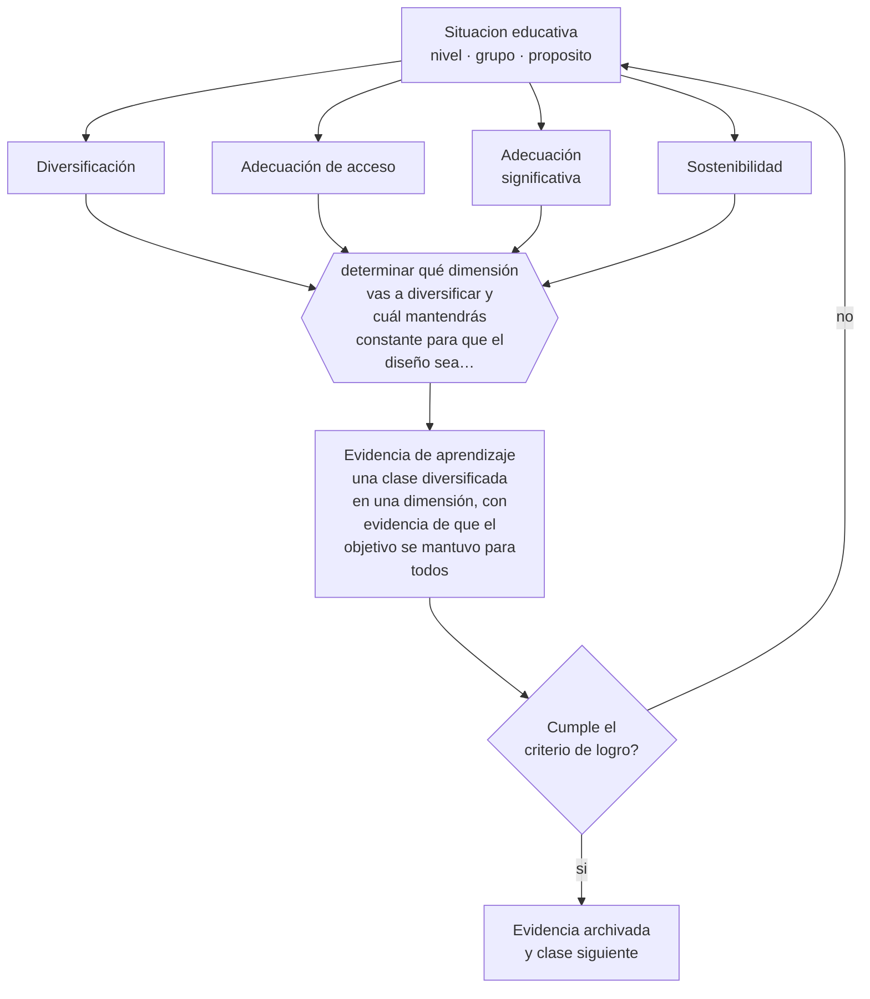

# Clase 100 — Diversificación de la enseñanza

> **Parte 08 · Inclusión y educación especial** — clase 4 de 12

**Estado de evidencia:** `CONSISTENTE` · **Etapa:** 🟣 Etapa C — Núcleo profesional docente · **Población de referencia:** todos los niveles, con foco en apoyos y accesibilidad 
**Decisión que habilita:** determinar qué dimensión vas a diversificar y cuál mantendrás constante para que el diseño sea sostenible 
**Evidencia de aprendizaje:** una clase diversificada en una dimensión, con evidencia de que el objetivo se mantuvo para todos

## 🎯 Propósito

Diversificar la enseñanza de forma sostenible: ajustar contenido, proceso, producto y entorno manteniendo el objetivo, con decisiones que un docente real pueda ejecutar.

## 📚 Resultados de aprendizaje

Al finalizar esta clase podrás:

1. **Definir** con precisión los cuatro conceptos centrales de la clase y reconocerlos en una situación educativa real, no solo en su enunciado.
2. **Explicar** cómo diferenciar la enseñanza sin fabricar tres clases distintas ni bajar la exigencia a nadie.
3. **Decidir** —qué dimensión vas a diversificar y cuál mantendrás constante para que el diseño sea sostenible— y sostener la decisión con un fundamento escrito.
4. **Producir** la evidencia de la clase —una clase diversificada en una dimensión, con evidencia de que el objetivo se mantuvo para todos— y contrastarla contra el criterio de logro.
5. **Distinguir** lo que la evidencia sostiene de lo que es práctica instalada, preferencia personal o costumbre de la institución.

## 🧩 Conceptos centrales

| Concepto | Comprensión verificable |
|---|---|
| **Diversificación** | ajuste de la enseñanza a la variabilidad del grupo sin modificar el objetivo de aprendizaje |
| **Adecuación de acceso** | ajuste que cambia la vía —formato, tiempo, apoyo— sin alterar el aprendizaje exigido |
| **Adecuación significativa** | modificación del objetivo mismo; es excepcional y tiene requisitos normativos |
| **Sostenibilidad** | posibilidad real de mantener la diversificación con la carga docente existente |

## 🗺️ Flujo de razonamiento

## 📖 Desarrollo

### 1. El fondo del asunto

La diferencia técnica más importante de esta clase es entre adecuación de acceso y adecuación significativa. La primera cambia cómo el estudiante llega al aprendizaje —tiempo, formato, apoyo, cantidad de ejercicios— y mantiene el objetivo; la segunda cambia el objetivo y, por eso, tiene consecuencias en la certificación y requisitos normativos específicos. Confundirlas produce estudiantes que aprueban sin haber aprendido lo declarado.

### 2. Cómo se traduce en decisiones de enseñanza

La diversificación sostenible se logra eligiendo una dimensión y no todas: variar el producto manteniendo el proceso, o variar el proceso manteniendo el producto. Intentar diversificar todo produce planificaciones inaplicables que se abandonan en dos semanas, con lo cual el estudiante queda peor que con una clase única bien hecha.

### 3. Qué sostiene la evidencia y qué no

La evidencia sobre diferenciación es más débil de lo que su difusión sugiere: los estudios muestran dificultades de implementación y efectos inconsistentes, en parte porque el término abarca prácticas muy distintas. Lo respaldado son sus componentes —ajuste al conocimiento previo, andamiaje diferenciado, retroalimentación específica— más que el enfoque como paquete.

> **Cómo leer el estado de evidencia `CONSISTENTE`.** La evidencia es amplia y coherente, pero proviene sobre todo de estudios correlacionales, de síntesis con heterogeneidad alta o de contextos distintos al tuyo. Sirve para orientar la decisión y exige que compruebes el efecto en tu propio grupo.

## 🧪 Taller guiado

Aplica la clase a **uno** de los contextos siguientes y repite después el ejercicio en un
contexto de exigencia distinta. Cambiar de contexto es parte del aprendizaje: lo que funciona
con un grupo no se traslada intacto a otro.

| Contexto | Rasgo que cambia la decisión |
|---|---|
| Estudiante con discapacidad sensorial | el acceso al material define la participación |
| Estudiante con discapacidad motora | el espacio y los tiempos son la barrera principal |
| Estudiante autista | predictibilidad, regulación sensorial y comunicación explícita |
| Estudiante con TDAH | la organización de la tarea pesa más que la voluntad |
| Dificultad específica del aprendizaje | la vía de acceso cambia, el objetivo no baja |
| Altas capacidades | la falta de desafío también es una barrera |

**Secuencia de trabajo:**

1. Delimita el contexto: nivel, edad, tamaño del grupo, asignatura o experiencia y tiempo real disponible.
2. Declara qué saben ya los estudiantes y **cómo lo comprobaste**, no cómo lo supones.
3. Formula la decisión pedagógica que esta clase habilita y escribe su fundamento.
4. Anticipa qué observarías si la decisión funciona y qué observarías si no funciona.
5. Diseña de antemano la alternativa que aplicarás si la primera estrategia falla.
6. Ejecuta o simula, y registra lo observado con fecha, contexto y evidencia concreta.
7. Produce la evidencia de aprendizaje de la clase.
8. Contrástala contra el criterio de logro, corrige y recién entonces avanza.

### 📦 Evidencia de aprendizaje

Una clase diversificada en una dimensión, con evidencia de que el objetivo se mantuvo para todos.

Debe incluir contexto, decisión, fundamento, fuentes consultadas con su fecha, indicador de
logro observable, riesgos previstos y qué harías distinto en la siguiente iteración.

## 🏆 Reto verificable

Aplica una diversificación en una sola dimensión durante un mes. Evalúa si el objetivo se mantuvo para todos y si pudiste sostener la práctica.

## ✅ Criterio de logro

- [ ] se declara qué dimensión se diversifica y cuál se mantiene constante;
- [ ] hay evidencia de que el objetivo se mantuvo para todos los estudiantes;
- [ ] cada afirmación sobre «lo que funciona» está atribuida a una fuente identificable, con autor y fecha;
- [ ] la decisión es ejecutable con el tiempo, el espacio, el número de estudiantes y los recursos que realmente tienes;
- [ ] la evidencia queda archivada de forma reproducible: otra persona podría revisarla sin que tú se la expliques.

## ⚠️ Errores frecuentes

**Propios de esta clase:**

- Aplicar adecuaciones significativas sin el procedimiento ni el registro que la norma exige.
- Diversificar todas las dimensiones a la vez y abandonar la práctica por inviable.

**Característicos de la parte 08:**

- Reducir la inclusión a la presencia física del estudiante en la sala.
- Adecuar bajando la exigencia en vez de cambiar la vía de acceso.

## ♿ Diversidad, accesibilidad y ética

Las adecuaciones deben quedar registradas y revisadas, porque tienden a volverse permanentes por inercia. Un apoyo que no se revisa se convierte en una etiqueta y, con el tiempo, en un techo.

Antes de aplicar cualquier decisión de esta clase con estudiantes reales, revisa el
[protocolo de práctica responsable](../../../docs/ETICA_Y_PRACTICA_RESPONSABLE.md):
consentimiento, resguardo de datos personales, proporcionalidad de la intervención y derecho
de cada estudiante a no ser objeto de un ensayo que no le reporta beneficio.

## ❓ Preguntas de comprobación

1. ¿Estás cambiando la vía o estás cambiando el objetivo?
2. ¿Podrías sostener esta diversificación durante todo el semestre?
3. ¿Qué registro respalda las adecuaciones significativas que aplicas?

## 📕 Lecturas base

**Mineduc. *Decreto 83/2015* sobre adecuaciones curriculares.**  
*Qué aporta a esta clase:* define en Chile los tipos de adecuación, su procedimiento y su registro.

**Deunk, M. et al. (2018). *Effective Differentiation Practices*. Educational Research Review, 24.**  
*Qué aporta a esta clase:* revisión que separa las prácticas de diferenciación con evidencia de las que no la tienen.

Catálogo completo: [bibliografía del programa](../../../docs/BIBLIOGRAFIA.md) ·
[glosario](../../../docs/GLOSARIO.md) ·
[fuentes oficiales y cómo leerlas](../../../docs/FUENTES.md).

## 🔗 Conexión con el resto del programa

Aplica la clase 099 y se articula con la clase 101 en el marco normativo chileno.

> [!IMPORTANT]
> Material de formación profesional. No reemplaza un título de pedagogía, una habilitación
> legal para ejercer, ni el juicio de un equipo educativo que conoce a sus estudiantes.

---

| Anterior | Índice | Siguiente |
|---|---|---|
| [← 099 · Diseño Universal para el Aprendizaje](../class-03-diseno-universal-para-el-aprendizaje/README.md) | [Parte 08](../README.md) · [Programa](../../../README.md) | [101 · Necesidades educativas especiales →](../class-05-necesidades-educativas-especiales/README.md) |
