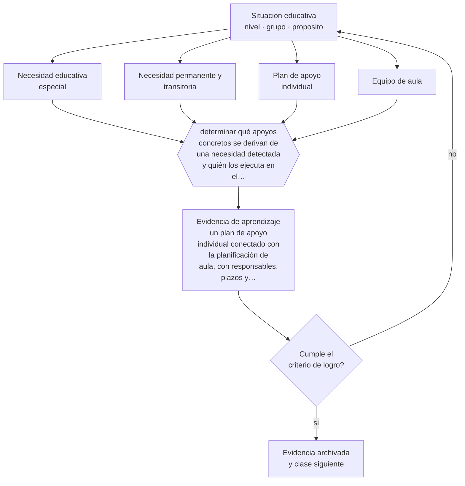

# Clase 101 — Necesidades educativas especiales

> **Parte 08 · Inclusión y educación especial** — clase 5 de 12

**Estado de evidencia:** `MARCO-NORMATIVO` · **Etapa:** 🟣 Etapa C — Núcleo profesional docente · **Población de referencia:** todos los niveles, con foco en apoyos y accesibilidad 
**Decisión que habilita:** determinar qué apoyos concretos se derivan de una necesidad detectada y quién los ejecuta en el aula 
**Evidencia de aprendizaje:** un plan de apoyo individual conectado con la planificación de aula, con responsables, plazos y criterios de revisión

## 🎯 Propósito

Comprender el sistema de necesidades educativas especiales y sus apoyos: qué implica un diagnóstico, qué instrumentos y plazos exige la norma, y cómo se traduce en enseñanza y no solo en documentación.

## 📚 Resultados de aprendizaje

Al finalizar esta clase podrás:

1. **Definir** con precisión los cuatro conceptos centrales de la clase y reconocerlos en una situación educativa real, no solo en su enunciado.
2. **Explicar** para qué sirve —y para qué no sirve— un diagnóstico en el sistema escolar.
3. **Decidir** —qué apoyos concretos se derivan de una necesidad detectada y quién los ejecuta en el aula— y sostener la decisión con un fundamento escrito.
4. **Producir** la evidencia de la clase —un plan de apoyo individual conectado con la planificación de aula, con responsables, plazos y criterios de revisión— y contrastarla contra el criterio de logro.
5. **Distinguir** lo que la evidencia sostiene de lo que es práctica instalada, preferencia personal o costumbre de la institución.

## 🧩 Conceptos centrales

| Concepto | Comprensión verificable |
|---|---|
| **Necesidad educativa especial** | requerimiento de apoyos adicionales para acceder y progresar en el currículo |
| **Necesidad permanente y transitoria** | distinción normativa que determina apoyos, plazos y procedimientos distintos |
| **Plan de apoyo individual** | documento que traduce la evaluación en decisiones de enseñanza concretas |
| **Equipo de aula** | conjunto de profesionales que planifica y ejecuta los apoyos junto al docente |

## 🗺️ Flujo de razonamiento

## 📖 Desarrollo

### 1. El fondo del asunto

El diagnóstico cumple una función administrativa —asignar recursos y apoyos— y una función pedagógica —informar decisiones de enseñanza—. La segunda se pierde con frecuencia: se completan formularios, se archivan informes y la clase sigue igual. Un plan de apoyo útil traduce cada necesidad en decisiones concretas de aula: qué hará el docente el martes a las diez, con qué material y con qué apoyo.

### 2. Cómo se traduce en decisiones de enseñanza

En Chile la normativa define instrumentos, plazos, profesionales habilitados y procedimientos para la evaluación y para las adecuaciones. Conocerla evita dos errores frecuentes: incumplir obligaciones y, en sentido contrario, exigir procedimientos donde la norma no los pide. El plan debe conectarse con la planificación de aula, no vivir en una carpeta paralela.

### 3. Qué sostiene la evidencia y qué no

El diagnóstico describe funcionamiento en un momento y con instrumentos limitados; no predice trayectorias ni define capacidades. Además, los criterios diagnósticos cambian entre versiones de los manuales y entre países. Un mismo estudiante puede cumplir criterios en un sistema y no en otro, lo que muestra que la categoría es una herramienta administrativa y no una propiedad de la persona.

> **Cómo leer el estado de evidencia `MARCO-NORMATIVO`.** El contenido no se decide por evidencia empírica sino por norma, política pública o marco institucional vigente. Verifica siempre la versión vigente a la fecha en que vas a aplicarlo: la norma cambia y la clase no se actualiza sola.

## 🧪 Taller guiado

Aplica la clase a **uno** de los contextos siguientes y repite después el ejercicio en un
contexto de exigencia distinta. Cambiar de contexto es parte del aprendizaje: lo que funciona
con un grupo no se traslada intacto a otro.

| Contexto | Rasgo que cambia la decisión |
|---|---|
| Estudiante con discapacidad sensorial | el acceso al material define la participación |
| Estudiante con discapacidad motora | el espacio y los tiempos son la barrera principal |
| Estudiante autista | predictibilidad, regulación sensorial y comunicación explícita |
| Estudiante con TDAH | la organización de la tarea pesa más que la voluntad |
| Dificultad específica del aprendizaje | la vía de acceso cambia, el objetivo no baja |
| Altas capacidades | la falta de desafío también es una barrera |

**Secuencia de trabajo:**

1. Delimita el contexto: nivel, edad, tamaño del grupo, asignatura o experiencia y tiempo real disponible.
2. Declara qué saben ya los estudiantes y **cómo lo comprobaste**, no cómo lo supones.
3. Formula la decisión pedagógica que esta clase habilita y escribe su fundamento.
4. Anticipa qué observarías si la decisión funciona y qué observarías si no funciona.
5. Diseña de antemano la alternativa que aplicarás si la primera estrategia falla.
6. Ejecuta o simula, y registra lo observado con fecha, contexto y evidencia concreta.
7. Produce la evidencia de aprendizaje de la clase.
8. Contrástala contra el criterio de logro, corrige y recién entonces avanza.

### 📦 Evidencia de aprendizaje

Un plan de apoyo individual conectado con la planificación de aula, con responsables, plazos y criterios de revisión.

Debe incluir contexto, decisión, fundamento, fuentes consultadas con su fecha, indicador de
logro observable, riesgos previstos y qué harías distinto en la siguiente iteración.

## 🏆 Reto verificable

Toma un plan de apoyo real y verifica cuántas de sus medidas se ejecutan efectivamente en el aula. Rediséñalo con acciones que sí se puedan cumplir.

## ✅ Criterio de logro

- [ ] cada apoyo del plan indica qué se hace, quién lo hace y cuándo se revisa;
- [ ] el plan está conectado con la planificación de aula y no es un documento paralelo;
- [ ] cada afirmación sobre «lo que funciona» está atribuida a una fuente identificable, con autor y fecha;
- [ ] la decisión es ejecutable con el tiempo, el espacio, el número de estudiantes y los recursos que realmente tienes;
- [ ] la evidencia queda archivada de forma reproducible: otra persona podría revisarla sin que tú se la expliques.

## ⚠️ Errores frecuentes

**Propios de esta clase:**

- Completar el plan de apoyo como trámite y no usarlo para decidir la enseñanza.
- Tratar la categoría diagnóstica como descripción completa del estudiante.

**Característicos de la parte 08:**

- Reducir la inclusión a la presencia física del estudiante en la sala.
- Adecuar bajando la exigencia en vez de cambiar la vía de acceso.

## ♿ Diversidad, accesibilidad y ética

El riesgo central de esta clase es el efecto de expectativa: un diagnóstico puede reducir lo que se le exige al estudiante. La regla profesional es que el diagnóstico modifica los apoyos, nunca el objetivo, salvo mediante el procedimiento formal de adecuación significativa.

Antes de aplicar cualquier decisión de esta clase con estudiantes reales, revisa el
[protocolo de práctica responsable](../../../docs/ETICA_Y_PRACTICA_RESPONSABLE.md):
consentimiento, resguardo de datos personales, proporcionalidad de la intervención y derecho
de cada estudiante a no ser objeto de un ensayo que no le reporta beneficio.

## ❓ Preguntas de comprobación

1. ¿Qué cambia el martes en tu clase por lo que dice este plan de apoyo?
2. ¿Qué apoyo lleva tres años vigente sin haberse revisado?
3. ¿Qué sabes de este estudiante que el diagnóstico no dice?

## 📕 Lecturas base

**Mineduc. *Decreto 170/2009* y *Decreto 83/2015*.**  
*Qué aporta a esta clase:* definen en Chile evaluación diagnóstica, apoyos y adecuaciones curriculares vigentes.

**Florian, L. (2014). *What Counts as Evidence of Inclusive Education?***  
*Qué aporta a esta clase:* discute el uso pedagógico de las categorías diagnósticas y sus riesgos.

Catálogo completo: [bibliografía del programa](../../../docs/BIBLIOGRAFIA.md) ·
[glosario](../../../docs/GLOSARIO.md) ·
[fuentes oficiales y cómo leerlas](../../../docs/FUENTES.md).

## 🔗 Conexión con el resto del programa

Es el marco administrativo de las clases 102 a 107 y se conecta con la clase 009 sobre roles profesionales.

> [!IMPORTANT]
> Material de formación profesional. No reemplaza un título de pedagogía, una habilitación
> legal para ejercer, ni el juicio de un equipo educativo que conoce a sus estudiantes.

---

| Anterior | Índice | Siguiente |
|---|---|---|
| [← 100 · Diversificación de la enseñanza](../class-04-diversificacion-de-la-ensenanza/README.md) | [Parte 08](../README.md) · [Programa](../../../README.md) | [102 · Autismo y apoyos educativos →](../class-06-autismo-y-apoyos-educativos/README.md) |
