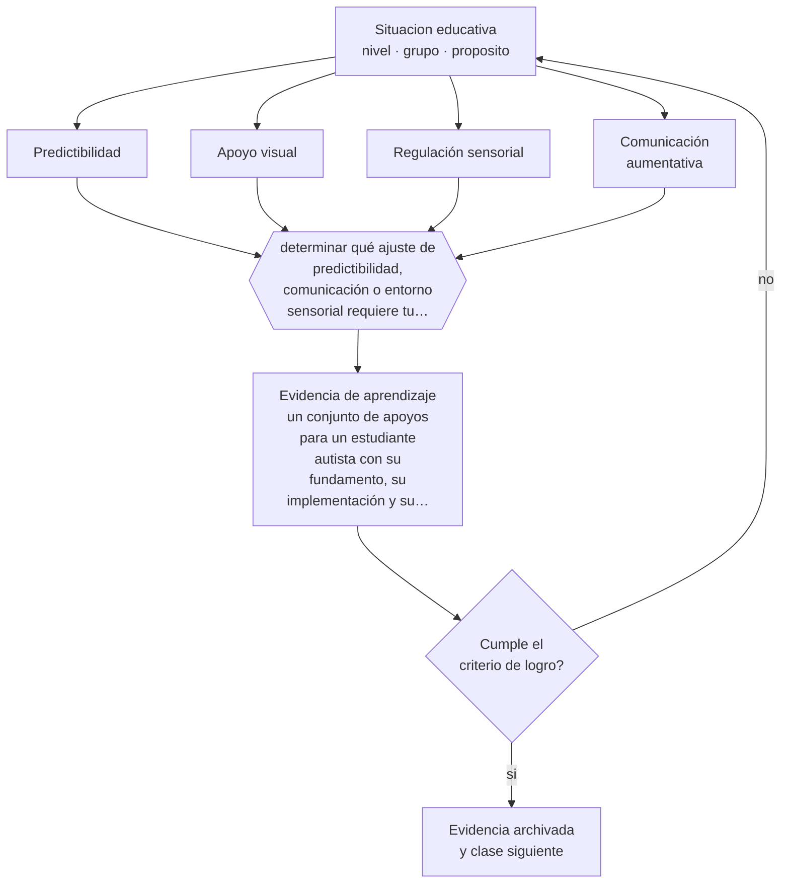

# Clase 102 — Autismo y apoyos educativos

> **Parte 08 · Inclusión y educación especial** — clase 6 de 12

**Estado de evidencia:** `CONSISTENTE` · **Etapa:** 🟣 Etapa C — Núcleo profesional docente · **Población de referencia:** todos los niveles, con foco en apoyos y accesibilidad 
**Decisión que habilita:** determinar qué ajuste de predictibilidad, comunicación o entorno sensorial requiere tu estudiante 
**Evidencia de aprendizaje:** un conjunto de apoyos para un estudiante autista con su fundamento, su implementación y su criterio de revisión

## 🎯 Propósito

Diseñar apoyos educativos para estudiantes autistas centrados en comunicación, predictibilidad, regulación sensorial y participación social, con respeto por su forma de funcionamiento.

## 📚 Resultados de aprendizaje

Al finalizar esta clase podrás:

1. **Definir** con precisión los cuatro conceptos centrales de la clase y reconocerlos en una situación educativa real, no solo en su enunciado.
2. **Explicar** qué apoyos educativos tienen respaldo para estudiantes autistas y cuáles se ofrecen sin evidencia.
3. **Decidir** —qué ajuste de predictibilidad, comunicación o entorno sensorial requiere tu estudiante— y sostener la decisión con un fundamento escrito.
4. **Producir** la evidencia de la clase —un conjunto de apoyos para un estudiante autista con su fundamento, su implementación y su criterio de revisión— y contrastarla contra el criterio de logro.
5. **Distinguir** lo que la evidencia sostiene de lo que es práctica instalada, preferencia personal o costumbre de la institución.

## 🧩 Conceptos centrales

| Concepto | Comprensión verificable |
|---|---|
| **Predictibilidad** | anticipación explícita de lo que va a ocurrir; reduce la ansiedad y aumenta la disponibilidad |
| **Apoyo visual** | representación gráfica de secuencias, normas o consignas que complementa el lenguaje oral |
| **Regulación sensorial** | gestión de la estimulación del entorno según el perfil sensorial del estudiante |
| **Comunicación aumentativa** | sistemas que complementan o sustituyen el habla para permitir la comunicación |

## 🗺️ Flujo de razonamiento

## 📖 Desarrollo

### 1. El fondo del asunto

Los apoyos con mejor respaldo en contextos educativos son concretos: anticipar cambios, hacer visible la secuencia de la jornada, dar consignas explícitas y literales, ofrecer un espacio de regulación y garantizar una vía de comunicación efectiva. Estos apoyos reducen conductas que suelen interpretarse como desafío y que en realidad son respuestas a un entorno impredecible o sensorialmente sobrecargado.

### 2. Cómo se traduce en decisiones de enseñanza

El diseño parte del perfil concreto: qué situaciones desregulan, qué apoyos ya funcionan, cómo se comunica mejor. En Chile, la Ley 21.545 establece obligaciones específicas para los establecimientos respecto de estudiantes autistas, incluidos ajustes y protocolos. Conviene conocerla y verificar su versión vigente antes de aplicar cualquier medida.

### 3. Qué sostiene la evidencia y qué no

El autismo presenta una variabilidad enorme: lo que funciona con un estudiante puede ser inútil o contraproducente con otro. Además, existen intervenciones ampliamente comercializadas sin evidencia, y algunas prácticas históricas han sido cuestionadas por las propias personas autistas por priorizar la apariencia de normalidad sobre el bienestar. La orientación profesional actual es apoyar la participación y la comunicación, no suprimir conductas que no dañan.

> **Cómo leer el estado de evidencia `CONSISTENTE`.** La evidencia es amplia y coherente, pero proviene sobre todo de estudios correlacionales, de síntesis con heterogeneidad alta o de contextos distintos al tuyo. Sirve para orientar la decisión y exige que compruebes el efecto en tu propio grupo.

## 🧪 Taller guiado

Aplica la clase a **uno** de los contextos siguientes y repite después el ejercicio en un
contexto de exigencia distinta. Cambiar de contexto es parte del aprendizaje: lo que funciona
con un grupo no se traslada intacto a otro.

| Contexto | Rasgo que cambia la decisión |
|---|---|
| Estudiante con discapacidad sensorial | el acceso al material define la participación |
| Estudiante con discapacidad motora | el espacio y los tiempos son la barrera principal |
| Estudiante autista | predictibilidad, regulación sensorial y comunicación explícita |
| Estudiante con TDAH | la organización de la tarea pesa más que la voluntad |
| Dificultad específica del aprendizaje | la vía de acceso cambia, el objetivo no baja |
| Altas capacidades | la falta de desafío también es una barrera |

**Secuencia de trabajo:**

1. Delimita el contexto: nivel, edad, tamaño del grupo, asignatura o experiencia y tiempo real disponible.
2. Declara qué saben ya los estudiantes y **cómo lo comprobaste**, no cómo lo supones.
3. Formula la decisión pedagógica que esta clase habilita y escribe su fundamento.
4. Anticipa qué observarías si la decisión funciona y qué observarías si no funciona.
5. Diseña de antemano la alternativa que aplicarás si la primera estrategia falla.
6. Ejecuta o simula, y registra lo observado con fecha, contexto y evidencia concreta.
7. Produce la evidencia de aprendizaje de la clase.
8. Contrástala contra el criterio de logro, corrige y recién entonces avanza.

### 📦 Evidencia de aprendizaje

Un conjunto de apoyos para un estudiante autista con su fundamento, su implementación y su criterio de revisión.

Debe incluir contexto, decisión, fundamento, fuentes consultadas con su fecha, indicador de
logro observable, riesgos previstos y qué harías distinto en la siguiente iteración.

## 🏆 Reto verificable

Registra durante una semana las situaciones que desregulan a un estudiante. Introduce un solo ajuste de predictibilidad y compara el registro.

## ✅ Criterio de logro

- [ ] cada apoyo declara la situación que atiende y cómo se comprobará su efecto;
- [ ] el plan considera comunicación, predictibilidad y entorno sensorial de forma explícita;
- [ ] cada afirmación sobre «lo que funciona» está atribuida a una fuente identificable, con autor y fecha;
- [ ] la decisión es ejecutable con el tiempo, el espacio, el número de estudiantes y los recursos que realmente tienes;
- [ ] la evidencia queda archivada de forma reproducible: otra persona podría revisarla sin que tú se la expliques.

## ⚠️ Errores frecuentes

**Propios de esta clase:**

- Interpretar como desafío una respuesta a la sobrecarga sensorial o al cambio imprevisto.
- Adoptar intervenciones comerciales sin evidencia o que buscan suprimir conductas inofensivas.

**Característicos de la parte 08:**

- Reducir la inclusión a la presencia física del estudiante en la sala.
- Adecuar bajando la exigencia en vez de cambiar la vía de acceso.

## ♿ Diversidad, accesibilidad y ética

Los apoyos deben decidirse escuchando al estudiante y a su familia. Muchas medidas bienintencionadas —retirarlo del grupo, reducir su exigencia, hablarle en tono infantil— producen exclusión adicional y bajan expectativas sin ningún beneficio.

Antes de aplicar cualquier decisión de esta clase con estudiantes reales, revisa el
[protocolo de práctica responsable](../../../docs/ETICA_Y_PRACTICA_RESPONSABLE.md):
consentimiento, resguardo de datos personales, proporcionalidad de la intervención y derecho
de cada estudiante a no ser objeto de un ensayo que no le reporta beneficio.

## ❓ Preguntas de comprobación

1. ¿Qué situación de tu jornada es impredecible para este estudiante?
2. ¿Qué vía de comunicación tiene disponible cuando el habla no le sirve?
3. ¿Qué conducta estás intentando eliminar y a quién daña realmente?

## 📕 Lecturas base

**Ley 21.545 (Chile, 2023) sobre atención integral de personas con trastorno del espectro autista.**  
*Qué aporta a esta clase:* define obligaciones del sistema educativo; verifica su reglamentación vigente.

**National Autism Center / National Clearinghouse. *Reportes sobre prácticas basadas en evidencia*.**  
*Qué aporta a esta clase:* clasifican intervenciones por nivel de respaldo; útiles para descartar ofertas sin evidencia.

Catálogo completo: [bibliografía del programa](../../../docs/BIBLIOGRAFIA.md) ·
[glosario](../../../docs/GLOSARIO.md) ·
[fuentes oficiales y cómo leerlas](../../../docs/FUENTES.md).

## 🔗 Conexión con el resto del programa

Se apoya en las clases 099 y 101 y comparte instrumentos con la clase 103.

> [!IMPORTANT]
> Material de formación profesional. No reemplaza un título de pedagogía, una habilitación
> legal para ejercer, ni el juicio de un equipo educativo que conoce a sus estudiantes.

---

| Anterior | Índice | Siguiente |
|---|---|---|
| [← 101 · Necesidades educativas especiales](../class-05-necesidades-educativas-especiales/README.md) | [Parte 08](../README.md) · [Programa](../../../README.md) | [103 · TDAH y autorregulación →](../class-07-tdah-y-autorregulacion/README.md) |
