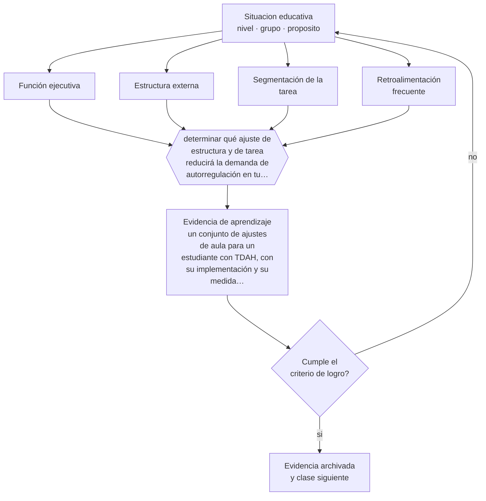

# Clase 103 — TDAH y autorregulación

> **Parte 08 · Inclusión y educación especial** — clase 7 de 12

**Estado de evidencia:** `ROBUSTA` · **Etapa:** 🟣 Etapa C — Núcleo profesional docente · **Población de referencia:** todos los niveles, con foco en apoyos y accesibilidad 
**Decisión que habilita:** determinar qué ajuste de estructura y de tarea reducirá la demanda de autorregulación en tu clase 
**Evidencia de aprendizaje:** un conjunto de ajustes de aula para un estudiante con TDAH, con su implementación y su medida de efecto

## 🎯 Propósito

Diseñar apoyos para estudiantes con TDAH centrados en estructura, organización de la tarea, retroalimentación frecuente y reducción de la carga de autorregulación exigida.

## 📚 Resultados de aprendizaje

Al finalizar esta clase podrás:

1. **Definir** con precisión los cuatro conceptos centrales de la clase y reconocerlos en una situación educativa real, no solo en su enunciado.
2. **Explicar** por qué la organización de la tarea rinde más que la insistencia en el esfuerzo con estudiantes con TDAH.
3. **Decidir** —qué ajuste de estructura y de tarea reducirá la demanda de autorregulación en tu clase— y sostener la decisión con un fundamento escrito.
4. **Producir** la evidencia de la clase —un conjunto de ajustes de aula para un estudiante con TDAH, con su implementación y su medida de efecto— y contrastarla contra el criterio de logro.
5. **Distinguir** lo que la evidencia sostiene de lo que es práctica instalada, preferencia personal o costumbre de la institución.

## 🧩 Conceptos centrales

| Concepto | Comprensión verificable |
|---|---|
| **Función ejecutiva** | conjunto de procesos de planificación, inhibición y memoria de trabajo implicados en la conducta dirigida a metas |
| **Estructura externa** | apoyos del entorno que sustituyen temporalmente la regulación que el estudiante no puede sostener |
| **Segmentación de la tarea** | división del trabajo en pasos cortos con verificación intermedia |
| **Retroalimentación frecuente** | información inmediata sobre el desempeño, que sostiene la conducta mejor que la consecuencia diferida |

## 🗺️ Flujo de razonamiento

## 📖 Desarrollo

### 1. El fondo del asunto

El TDAH no es un déficit de voluntad ni de conocimiento de las reglas: es una dificultad de regulación con base neurobiológica bien documentada. Los apoyos con mejor respaldo en el aula son estructurales: consignas breves y visibles, tareas segmentadas, retroalimentación inmediata, ubicación que reduzca distractores y oportunidades de movimiento. Todos disminuyen la cantidad de autorregulación que la clase exige.

### 2. Cómo se traduce en decisiones de enseñanza

La implementación es concreta: escribir la consigna además de decirla, dividir el trabajo en tramos con revisión al final de cada uno, dar retroalimentación en el momento, permitir movimiento legítimo. Estos ajustes benefician al curso completo, no solo al estudiante con diagnóstico, y por eso conviene aplicarlos como diseño y no como excepción visible.

### 3. Qué sostiene la evidencia y qué no

Los apoyos escolares mejoran el desempeño y la conducta en el aula, y no eliminan la condición. El tratamiento clínico —incluida la decisión farmacológica— corresponde a profesionales de la salud, y el rol educativo es aportar información observada, no recomendar tratamientos. Además, el diagnóstico varía entre sistemas y hay debate sobre sobrediagnóstico e infradiagnóstico según contexto.

> **Cómo leer el estado de evidencia `ROBUSTA`.** Hay evidencia convergente de varios equipos, países y diseños de investigación, incluidos estudios experimentales o cuasiexperimentales, y el efecto se sostiene al replicarlo. Puedes apoyar una decisión profesional en ella, sin olvidar que ningún efecto promedio describe a un estudiante concreto.

## 🧪 Taller guiado

Aplica la clase a **uno** de los contextos siguientes y repite después el ejercicio en un
contexto de exigencia distinta. Cambiar de contexto es parte del aprendizaje: lo que funciona
con un grupo no se traslada intacto a otro.

| Contexto | Rasgo que cambia la decisión |
|---|---|
| Estudiante con discapacidad sensorial | el acceso al material define la participación |
| Estudiante con discapacidad motora | el espacio y los tiempos son la barrera principal |
| Estudiante autista | predictibilidad, regulación sensorial y comunicación explícita |
| Estudiante con TDAH | la organización de la tarea pesa más que la voluntad |
| Dificultad específica del aprendizaje | la vía de acceso cambia, el objetivo no baja |
| Altas capacidades | la falta de desafío también es una barrera |

**Secuencia de trabajo:**

1. Delimita el contexto: nivel, edad, tamaño del grupo, asignatura o experiencia y tiempo real disponible.
2. Declara qué saben ya los estudiantes y **cómo lo comprobaste**, no cómo lo supones.
3. Formula la decisión pedagógica que esta clase habilita y escribe su fundamento.
4. Anticipa qué observarías si la decisión funciona y qué observarías si no funciona.
5. Diseña de antemano la alternativa que aplicarás si la primera estrategia falla.
6. Ejecuta o simula, y registra lo observado con fecha, contexto y evidencia concreta.
7. Produce la evidencia de aprendizaje de la clase.
8. Contrástala contra el criterio de logro, corrige y recién entonces avanza.

### 📦 Evidencia de aprendizaje

Un conjunto de ajustes de aula para un estudiante con TDAH, con su implementación y su medida de efecto.

Debe incluir contexto, decisión, fundamento, fuentes consultadas con su fecha, indicador de
logro observable, riesgos previstos y qué harías distinto en la siguiente iteración.

## 🏆 Reto verificable

Aplica dos ajustes estructurales durante tres semanas y registra la conducta objetivo antes y después. Comprueba si el resto del curso también mejoró.

## ✅ Criterio de logro

- [ ] los ajustes reducen la demanda de autorregulación de forma verificable;
- [ ] existe una medida de efecto observada y no solo la impresión del docente;
- [ ] cada afirmación sobre «lo que funciona» está atribuida a una fuente identificable, con autor y fecha;
- [ ] la decisión es ejecutable con el tiempo, el espacio, el número de estudiantes y los recursos que realmente tienes;
- [ ] la evidencia queda archivada de forma reproducible: otra persona podría revisarla sin que tú se la expliques.

## ⚠️ Errores frecuentes

**Propios de esta clase:**

- Atribuir a falta de esfuerzo una dificultad de regulación con base neurobiológica.
- Sugerir o cuestionar tratamientos médicos desde el rol docente.

**Característicos de la parte 08:**

- Reducir la inclusión a la presencia física del estudiante en la sala.
- Adecuar bajando la exigencia en vez de cambiar la vía de acceso.

## ♿ Diversidad, accesibilidad y ética

Los estudiantes con TDAH acumulan una historia de sanciones y de mensajes negativos que deteriora su autoconcepto. Ajustar la estructura antes de corregir la conducta cambia esa trayectoria más que cualquier conversación motivacional.

Antes de aplicar cualquier decisión de esta clase con estudiantes reales, revisa el
[protocolo de práctica responsable](../../../docs/ETICA_Y_PRACTICA_RESPONSABLE.md):
consentimiento, resguardo de datos personales, proporcionalidad de la intervención y derecho
de cada estudiante a no ser objeto de un ensayo que no le reporta beneficio.

## ❓ Preguntas de comprobación

1. ¿Cuánta autorregulación exige tu clase antes de que ocurra algo interesante?
2. ¿Qué consigna tuya solo existe en forma oral?
3. ¿Cada cuánto recibe este estudiante información sobre cómo va?

## 📕 Lecturas base

**Barkley, R. (2015). *Attention-Deficit Hyperactivity Disorder: A Handbook for Diagnosis and Treatment*.**  
*Qué aporta a esta clase:* referencia sobre el modelo de funciones ejecutivas y sus implicancias educativas.

**DuPaul, G. & Stoner, G. (2014). *ADHD in the Schools*.**  
*Qué aporta a esta clase:* intervenciones escolares con evidencia, descritas de forma directamente aplicable.

Catálogo completo: [bibliografía del programa](../../../docs/BIBLIOGRAFIA.md) ·
[glosario](../../../docs/GLOSARIO.md) ·
[fuentes oficiales y cómo leerlas](../../../docs/FUENTES.md).

## 🔗 Conexión con el resto del programa

Se apoya en las clases 018 y 021 y comparte diseño con la clase 099.

> [!IMPORTANT]
> Material de formación profesional. No reemplaza un título de pedagogía, una habilitación
> legal para ejercer, ni el juicio de un equipo educativo que conoce a sus estudiantes.

---

| Anterior | Índice | Siguiente |
|---|---|---|
| [← 102 · Autismo y apoyos educativos](../class-06-autismo-y-apoyos-educativos/README.md) | [Parte 08](../README.md) · [Programa](../../../README.md) | [104 · Dificultades específicas del aprendizaje →](../class-08-dificultades-especificas-del-aprendizaje/README.md) |
