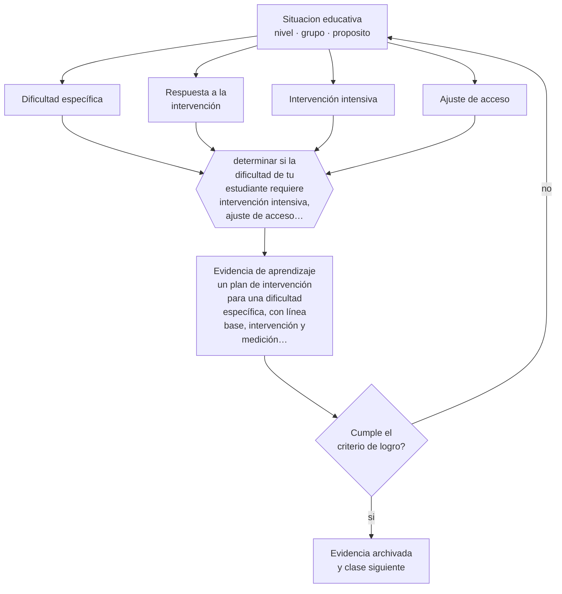

# Clase 104 — Dificultades específicas del aprendizaje

> **Parte 08 · Inclusión y educación especial** — clase 8 de 12

**Estado de evidencia:** `ROBUSTA` · **Etapa:** 🟣 Etapa C — Núcleo profesional docente · **Población de referencia:** todos los niveles, con foco en apoyos y accesibilidad 
**Decisión que habilita:** determinar si la dificultad de tu estudiante requiere intervención intensiva, ajuste de acceso o ambos 
**Evidencia de aprendizaje:** un plan de intervención para una dificultad específica, con línea base, intervención y medición de progreso

## 🎯 Propósito

Reconocer las dificultades específicas del aprendizaje —lectura, escritura, matemática— y responder con intervención intensiva y ajustes de acceso, sin bajar el objetivo.

## 📚 Resultados de aprendizaje

Al finalizar esta clase podrás:

1. **Definir** con precisión los cuatro conceptos centrales de la clase y reconocerlos en una situación educativa real, no solo en su enunciado.
2. **Explicar** cómo se distingue una dificultad específica de aprendizaje de una brecha por falta de enseñanza.
3. **Decidir** —si la dificultad de tu estudiante requiere intervención intensiva, ajuste de acceso o ambos— y sostener la decisión con un fundamento escrito.
4. **Producir** la evidencia de la clase —un plan de intervención para una dificultad específica, con línea base, intervención y medición de progreso— y contrastarla contra el criterio de logro.
5. **Distinguir** lo que la evidencia sostiene de lo que es práctica instalada, preferencia personal o costumbre de la institución.

## 🧩 Conceptos centrales

| Concepto | Comprensión verificable |
|---|---|
| **Dificultad específica** | dificultad persistente en un dominio, desproporcionada respecto del desempeño general y de la enseñanza recibida |
| **Respuesta a la intervención** | enfoque que evalúa la dificultad observando cómo responde el estudiante a enseñanza intensiva de calidad |
| **Intervención intensiva** | enseñanza adicional, focalizada, frecuente y en grupo pequeño, con seguimiento de progreso |
| **Ajuste de acceso** | apoyo —tiempo, formato, herramienta— que permite demostrar aprendizaje sin alterar el objetivo |

## 🗺️ Flujo de razonamiento

## 📖 Desarrollo

### 1. El fondo del asunto

Antes de atribuir una dificultad al estudiante hay que descartar la explicación más frecuente: enseñanza insuficiente o inadecuada. El enfoque de respuesta a la intervención hace justamente eso: se entrega enseñanza de calidad, se mide el progreso y se intensifica; la dificultad específica se reconoce cuando el estudiante no progresa pese a intervención adecuada. Ese orden evita diagnósticos que solo describen una brecha de oportunidades.

### 2. Cómo se traduce en decisiones de enseñanza

Una intervención seria tiene línea base, dosis definida —cuántas sesiones, de cuánto tiempo, en qué grupo—, contenido específico y medición periódica de progreso con el mismo instrumento. Sin medición, no se sabe si funciona y se prolonga durante años un apoyo inefectivo. Los ajustes de acceso van en paralelo: mientras se interviene, el estudiante debe poder seguir aprendiendo el resto del currículo.

### 3. Qué sostiene la evidencia y qué no

Los criterios diagnósticos y los puntos de corte varían entre sistemas y manuales, y el desacuerdo profesional es real. Además, la intervención muestra mejores resultados cuanto antes se aplica: en cursos superiores los efectos disminuyen, lo que refuerza la importancia de la detección temprana y no de la espera vigilante.

> **Cómo leer el estado de evidencia `ROBUSTA`.** Hay evidencia convergente de varios equipos, países y diseños de investigación, incluidos estudios experimentales o cuasiexperimentales, y el efecto se sostiene al replicarlo. Puedes apoyar una decisión profesional en ella, sin olvidar que ningún efecto promedio describe a un estudiante concreto.

## 🧪 Taller guiado

Aplica la clase a **uno** de los contextos siguientes y repite después el ejercicio en un
contexto de exigencia distinta. Cambiar de contexto es parte del aprendizaje: lo que funciona
con un grupo no se traslada intacto a otro.

| Contexto | Rasgo que cambia la decisión |
|---|---|
| Estudiante con discapacidad sensorial | el acceso al material define la participación |
| Estudiante con discapacidad motora | el espacio y los tiempos son la barrera principal |
| Estudiante autista | predictibilidad, regulación sensorial y comunicación explícita |
| Estudiante con TDAH | la organización de la tarea pesa más que la voluntad |
| Dificultad específica del aprendizaje | la vía de acceso cambia, el objetivo no baja |
| Altas capacidades | la falta de desafío también es una barrera |

**Secuencia de trabajo:**

1. Delimita el contexto: nivel, edad, tamaño del grupo, asignatura o experiencia y tiempo real disponible.
2. Declara qué saben ya los estudiantes y **cómo lo comprobaste**, no cómo lo supones.
3. Formula la decisión pedagógica que esta clase habilita y escribe su fundamento.
4. Anticipa qué observarías si la decisión funciona y qué observarías si no funciona.
5. Diseña de antemano la alternativa que aplicarás si la primera estrategia falla.
6. Ejecuta o simula, y registra lo observado con fecha, contexto y evidencia concreta.
7. Produce la evidencia de aprendizaje de la clase.
8. Contrástala contra el criterio de logro, corrige y recién entonces avanza.

### 📦 Evidencia de aprendizaje

Un plan de intervención para una dificultad específica, con línea base, intervención y medición de progreso.

Debe incluir contexto, decisión, fundamento, fuentes consultadas con su fecha, indicador de
logro observable, riesgos previstos y qué harías distinto en la siguiente iteración.

## 🏆 Reto verificable

Implementa una intervención con línea base y medición cada dos semanas. Decide con datos si continúa, se intensifica o se cambia.

## ✅ Criterio de logro

- [ ] el plan declara línea base, dosis de intervención y medición periódica con el mismo instrumento;
- [ ] los ajustes de acceso permiten seguir aprendiendo el resto del currículo mientras se interviene;
- [ ] cada afirmación sobre «lo que funciona» está atribuida a una fuente identificable, con autor y fecha;
- [ ] la decisión es ejecutable con el tiempo, el espacio, el número de estudiantes y los recursos que realmente tienes;
- [ ] la evidencia queda archivada de forma reproducible: otra persona podría revisarla sin que tú se la expliques.

## ⚠️ Errores frecuentes

**Propios de esta clase:**

- Diagnosticar una dificultad específica sin haber descartado enseñanza insuficiente.
- Sostener un apoyo durante años sin medir si produce progreso.

**Característicos de la parte 08:**

- Reducir la inclusión a la presencia física del estudiante en la sala.
- Adecuar bajando la exigencia en vez de cambiar la vía de acceso.

## ♿ Diversidad, accesibilidad y ética

La detección tardía convierte una dificultad tratable en una trayectoria de fracaso y de deterioro del autoconcepto. El tamizaje temprano y universal es una medida de equidad, porque detecta también a quienes nadie derivaría por su comportamiento.

Antes de aplicar cualquier decisión de esta clase con estudiantes reales, revisa el
[protocolo de práctica responsable](../../../docs/ETICA_Y_PRACTICA_RESPONSABLE.md):
consentimiento, resguardo de datos personales, proporcionalidad de la intervención y derecho
de cada estudiante a no ser objeto de un ensayo que no le reporta beneficio.

## ❓ Preguntas de comprobación

1. ¿Qué enseñanza recibió antes este estudiante y de qué calidad?
2. ¿Cuánta intervención está recibiendo, medida en sesiones y minutos?
3. ¿Con qué instrumento sabrás en seis semanas si está funcionando?

## 📕 Lecturas base

**Fuchs, D. & Fuchs, L. (2006). *Introduction to Response to Intervention*. Reading Research Quarterly, 41(1).**  
*Qué aporta a esta clase:* expone el enfoque y sus condiciones de aplicación.

**Snowling, M. & Hulme, C. (2011). *Evidence-Based Interventions for Reading and Language Difficulties*.**  
*Qué aporta a esta clase:* revisa qué intervenciones tienen respaldo y con qué magnitud.

Catálogo completo: [bibliografía del programa](../../../docs/BIBLIOGRAFIA.md) ·
[glosario](../../../docs/GLOSARIO.md) ·
[fuentes oficiales y cómo leerlas](../../../docs/FUENTES.md).

## 🔗 Conexión con el resto del programa

Se apoya en las clases 049 y 051 y usa el marco administrativo de la clase 101.

> [!IMPORTANT]
> Material de formación profesional. No reemplaza un título de pedagogía, una habilitación
> legal para ejercer, ni el juicio de un equipo educativo que conoce a sus estudiantes.

---

| Anterior | Índice | Siguiente |
|---|---|---|
| [← 103 · TDAH y autorregulación](../class-07-tdah-y-autorregulacion/README.md) | [Parte 08](../README.md) · [Programa](../../../README.md) | [105 · Discapacidad sensorial y motora →](../class-09-discapacidad-sensorial-y-motora/README.md) |
