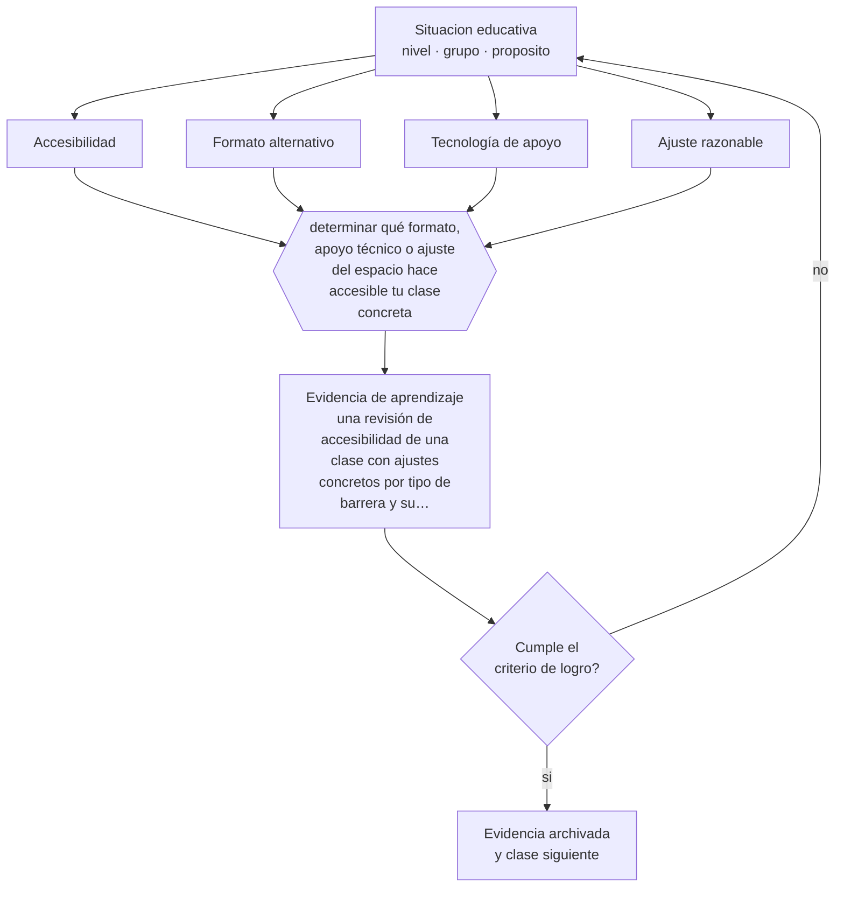

# Clase 105 — Discapacidad sensorial y motora

> **Parte 08 · Inclusión y educación especial** — clase 9 de 12

**Estado de evidencia:** `MARCO-NORMATIVO` · **Etapa:** 🟣 Etapa C — Núcleo profesional docente · **Población de referencia:** todos los niveles, con foco en apoyos y accesibilidad 
**Decisión que habilita:** determinar qué formato, apoyo técnico o ajuste del espacio hace accesible tu clase concreta 
**Evidencia de aprendizaje:** una revisión de accesibilidad de una clase con ajustes concretos por tipo de barrera y su verificación

## 🎯 Propósito

Diseñar acceso efectivo para estudiantes con discapacidad sensorial o motora: formatos alternativos, tecnología de apoyo, organización del espacio y comunicación adecuada.

## 📚 Resultados de aprendizaje

Al finalizar esta clase podrás:

1. **Definir** con precisión los cuatro conceptos centrales de la clase y reconocerlos en una situación educativa real, no solo en su enunciado.
2. **Explicar** qué hace accesible una clase para un estudiante que no ve, no oye o no puede manipular el material.
3. **Decidir** —qué formato, apoyo técnico o ajuste del espacio hace accesible tu clase concreta— y sostener la decisión con un fundamento escrito.
4. **Producir** la evidencia de la clase —una revisión de accesibilidad de una clase con ajustes concretos por tipo de barrera y su verificación— y contrastarla contra el criterio de logro.
5. **Distinguir** lo que la evidencia sostiene de lo que es práctica instalada, preferencia personal o costumbre de la institución.

## 🧩 Conceptos centrales

| Concepto | Comprensión verificable |
|---|---|
| **Accesibilidad** | condición que permite acceder al espacio, al material y a la actividad en igualdad de oportunidades |
| **Formato alternativo** | versión del material accesible: braille, macrotipo, audio, texto digital compatible con lectores |
| **Tecnología de apoyo** | dispositivo o software que compensa una limitación funcional y habilita el desempeño |
| **Ajuste razonable** | modificación necesaria y proporcionada para garantizar el ejercicio de un derecho |

## 🗺️ Flujo de razonamiento

## 📖 Desarrollo

### 1. El fondo del asunto

El acceso es la condición previa de cualquier aprendizaje: un estudiante que no puede percibir el material no está aprendiendo menos, está aprendiendo nada de ese material. Los ajustes son mayormente conocidos y en muchos casos de bajo costo: documentos digitales estructurados y compatibles con lectores de pantalla, subtítulos, descripción verbal de lo que se muestra, ubicación adecuada, rutas libres, materiales manipulables alternativos.

### 2. Cómo se traduce en decisiones de enseñanza

La revisión de accesibilidad se hace material por material y actividad por actividad, con verificación real: probar el documento con un lector de pantalla, comprobar que el video tenga subtítulos correctos, recorrer la ruta física. Y la comunicación importa: hablar mirando al estudiante que lee labios, describir lo que se escribe en la pizarra, no señalar «esto» sin nombrarlo.

### 3. Qué sostiene la evidencia y qué no

Los ajustes de acceso no sustituyen los apoyos especializados: la enseñanza de braille, de lengua de señas o el uso avanzado de tecnología de apoyo requiere profesionales específicos. Y las obligaciones legales de accesibilidad son exigibles y varían por país; en Chile la Ley 20.422 y la normativa educativa definen el marco, que debe verificarse en su versión vigente.

> **Cómo leer el estado de evidencia `MARCO-NORMATIVO`.** El contenido no se decide por evidencia empírica sino por norma, política pública o marco institucional vigente. Verifica siempre la versión vigente a la fecha en que vas a aplicarlo: la norma cambia y la clase no se actualiza sola.

## 🧪 Taller guiado

Aplica la clase a **uno** de los contextos siguientes y repite después el ejercicio en un
contexto de exigencia distinta. Cambiar de contexto es parte del aprendizaje: lo que funciona
con un grupo no se traslada intacto a otro.

| Contexto | Rasgo que cambia la decisión |
|---|---|
| Estudiante con discapacidad sensorial | el acceso al material define la participación |
| Estudiante con discapacidad motora | el espacio y los tiempos son la barrera principal |
| Estudiante autista | predictibilidad, regulación sensorial y comunicación explícita |
| Estudiante con TDAH | la organización de la tarea pesa más que la voluntad |
| Dificultad específica del aprendizaje | la vía de acceso cambia, el objetivo no baja |
| Altas capacidades | la falta de desafío también es una barrera |

**Secuencia de trabajo:**

1. Delimita el contexto: nivel, edad, tamaño del grupo, asignatura o experiencia y tiempo real disponible.
2. Declara qué saben ya los estudiantes y **cómo lo comprobaste**, no cómo lo supones.
3. Formula la decisión pedagógica que esta clase habilita y escribe su fundamento.
4. Anticipa qué observarías si la decisión funciona y qué observarías si no funciona.
5. Diseña de antemano la alternativa que aplicarás si la primera estrategia falla.
6. Ejecuta o simula, y registra lo observado con fecha, contexto y evidencia concreta.
7. Produce la evidencia de aprendizaje de la clase.
8. Contrástala contra el criterio de logro, corrige y recién entonces avanza.

### 📦 Evidencia de aprendizaje

Una revisión de accesibilidad de una clase con ajustes concretos por tipo de barrera y su verificación.

Debe incluir contexto, decisión, fundamento, fuentes consultadas con su fecha, indicador de
logro observable, riesgos previstos y qué harías distinto en la siguiente iteración.

## 🏆 Reto verificable

Toma tu material de una unidad y hazlo accesible: estructura, contraste, subtítulos y descripciones. Verifica con las herramientas reales y documenta lo que faltaba.

## ✅ Criterio de logro

- [ ] cada ajuste fue verificado con el medio real y no solo planificado;
- [ ] la revisión cubre material, comunicación y espacio, no solo uno de ellos;
- [ ] cada afirmación sobre «lo que funciona» está atribuida a una fuente identificable, con autor y fecha;
- [ ] la decisión es ejecutable con el tiempo, el espacio, el número de estudiantes y los recursos que realmente tienes;
- [ ] la evidencia queda archivada de forma reproducible: otra persona podría revisarla sin que tú se la expliques.

## ⚠️ Errores frecuentes

**Propios de esta clase:**

- Entregar material digital no estructurado, ilegible para lectores de pantalla.
- Describir contenidos visuales con deícticos —«esto», «aquí»— sin nombrar lo que se muestra.

**Característicos de la parte 08:**

- Reducir la inclusión a la presencia física del estudiante en la sala.
- Adecuar bajando la exigencia en vez de cambiar la vía de acceso.

## ♿ Diversidad, accesibilidad y ética

La accesibilidad del material digital beneficia también a estudiantes sin discapacidad: documentos estructurados, subtítulos y buen contraste mejoran la comprensión de todo el grupo y son requisito para cualquier publicación educativa seria.

Antes de aplicar cualquier decisión de esta clase con estudiantes reales, revisa el
[protocolo de práctica responsable](../../../docs/ETICA_Y_PRACTICA_RESPONSABLE.md):
consentimiento, resguardo de datos personales, proporcionalidad de la intervención y derecho
de cada estudiante a no ser objeto de un ensayo que no le reporta beneficio.

## ❓ Preguntas de comprobación

1. ¿Probaste tu documento con un lector de pantalla?
2. ¿Qué dices en clase que solo se entiende si se ve la pizarra?
3. ¿Qué actividad de tu unidad es imposible sin un ajuste que aún no hiciste?

## 📕 Lecturas base

**Ley 20.422 (Chile) sobre igualdad de oportunidades e inclusión social de personas con discapacidad.**  
*Qué aporta a esta clase:* marco de obligaciones y de ajustes razonables exigibles.

**W3C. *Web Content Accessibility Guidelines (WCAG)*.**  
*Qué aporta a esta clase:* criterios técnicos de accesibilidad aplicables a todo material digital educativo.

Catálogo completo: [bibliografía del programa](../../../docs/BIBLIOGRAFIA.md) ·
[glosario](../../../docs/GLOSARIO.md) ·
[fuentes oficiales y cómo leerlas](../../../docs/FUENTES.md).

## 🔗 Conexión con el resto del programa

Aplica la clase 099 al plano técnico y se conecta con la parte 13, donde el material digital se diseña desde cero.

> [!IMPORTANT]
> Material de formación profesional. No reemplaza un título de pedagogía, una habilitación
> legal para ejercer, ni el juicio de un equipo educativo que conoce a sus estudiantes.

---

| Anterior | Índice | Siguiente |
|---|---|---|
| [← 104 · Dificultades específicas del aprendizaje](../class-08-dificultades-especificas-del-aprendizaje/README.md) | [Parte 08](../README.md) · [Programa](../../../README.md) | [106 · Discapacidad intelectual →](../class-10-discapacidad-intelectual/README.md) |
