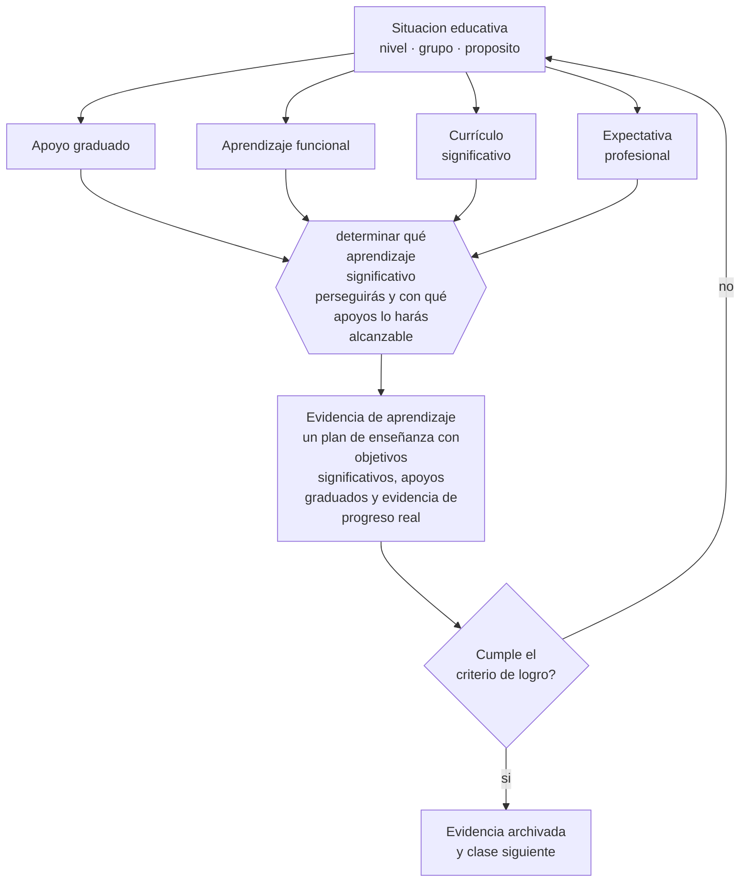

# Clase 106 — Discapacidad intelectual

> **Parte 08 · Inclusión y educación especial** — clase 10 de 12

**Estado de evidencia:** `CONSISTENTE` · **Etapa:** 🟣 Etapa C — Núcleo profesional docente · **Población de referencia:** todos los niveles, con foco en apoyos y accesibilidad 
**Decisión que habilita:** determinar qué aprendizaje significativo perseguirás y con qué apoyos lo harás alcanzable 
**Evidencia de aprendizaje:** un plan de enseñanza con objetivos significativos, apoyos graduados y evidencia de progreso real

## 🎯 Propósito

Diseñar enseñanza para estudiantes con discapacidad intelectual con foco en aprendizajes funcionales y académicos significativos, apoyos graduados y expectativas que no se reduzcan por la categoría.

## 📚 Resultados de aprendizaje

Al finalizar esta clase podrás:

1. **Definir** con precisión los cuatro conceptos centrales de la clase y reconocerlos en una situación educativa real, no solo en su enunciado.
2. **Explicar** cómo se enseña contenido significativo a un estudiante con discapacidad intelectual sin reducirlo a tareas ocupacionales.
3. **Decidir** —qué aprendizaje significativo perseguirás y con qué apoyos lo harás alcanzable— y sostener la decisión con un fundamento escrito.
4. **Producir** la evidencia de la clase —un plan de enseñanza con objetivos significativos, apoyos graduados y evidencia de progreso real— y contrastarla contra el criterio de logro.
5. **Distinguir** lo que la evidencia sostiene de lo que es práctica instalada, preferencia personal o costumbre de la institución.

## 🧩 Conceptos centrales

| Concepto | Comprensión verificable |
|---|---|
| **Apoyo graduado** | ayuda ajustada en intensidad y retirada progresivamente según el desempeño observado |
| **Aprendizaje funcional** | competencia con uso directo en la vida cotidiana y en la autonomía de la persona |
| **Currículo significativo** | contenido académico ajustado en complejidad pero no vaciado de sentido |
| **Expectativa profesional** | nivel de logro que el equipo cree posible; condiciona lo que efectivamente se enseña |

## 🗺️ Flujo de razonamiento

## 📖 Desarrollo

### 1. El fondo del asunto

El principal riesgo en la enseñanza de estudiantes con discapacidad intelectual no es la sobreexigencia sino la subestimación: se reduce el currículo a tareas repetitivas de bajo valor y se confirma el pronóstico. La evidencia disponible muestra que muchos estudiantes progresan en contenidos académicos significativos cuando reciben enseñanza sistemática con apoyos adecuados y expectativas sostenidas.

### 2. Cómo se traduce en decisiones de enseñanza

El diseño combina aprendizajes académicos ajustados en complejidad con aprendizajes funcionales que aumentan la autonomía, y evita presentarlos como alternativas. Los apoyos se gradúan con criterio de retiro, y el progreso se mide con evidencia concreta y no con impresiones. El registro sistemático es lo que permite discutir con el equipo cuando alguien propone bajar expectativas.

### 3. Qué sostiene la evidencia y qué no

La discapacidad intelectual abarca perfiles muy diversos y necesidades de apoyo de intensidad muy distinta; ninguna prescripción general aplica a todos. Además, la evidencia sobre enseñanza académica en necesidades de apoyo extensas es menos abundante, y la decisión sobre el equilibrio entre lo académico y lo funcional debe tomarse con la familia y con la persona cuando es posible.

> **Cómo leer el estado de evidencia `CONSISTENTE`.** La evidencia es amplia y coherente, pero proviene sobre todo de estudios correlacionales, de síntesis con heterogeneidad alta o de contextos distintos al tuyo. Sirve para orientar la decisión y exige que compruebes el efecto en tu propio grupo.

## 🧪 Taller guiado

Aplica la clase a **uno** de los contextos siguientes y repite después el ejercicio en un
contexto de exigencia distinta. Cambiar de contexto es parte del aprendizaje: lo que funciona
con un grupo no se traslada intacto a otro.

| Contexto | Rasgo que cambia la decisión |
|---|---|
| Estudiante con discapacidad sensorial | el acceso al material define la participación |
| Estudiante con discapacidad motora | el espacio y los tiempos son la barrera principal |
| Estudiante autista | predictibilidad, regulación sensorial y comunicación explícita |
| Estudiante con TDAH | la organización de la tarea pesa más que la voluntad |
| Dificultad específica del aprendizaje | la vía de acceso cambia, el objetivo no baja |
| Altas capacidades | la falta de desafío también es una barrera |

**Secuencia de trabajo:**

1. Delimita el contexto: nivel, edad, tamaño del grupo, asignatura o experiencia y tiempo real disponible.
2. Declara qué saben ya los estudiantes y **cómo lo comprobaste**, no cómo lo supones.
3. Formula la decisión pedagógica que esta clase habilita y escribe su fundamento.
4. Anticipa qué observarías si la decisión funciona y qué observarías si no funciona.
5. Diseña de antemano la alternativa que aplicarás si la primera estrategia falla.
6. Ejecuta o simula, y registra lo observado con fecha, contexto y evidencia concreta.
7. Produce la evidencia de aprendizaje de la clase.
8. Contrástala contra el criterio de logro, corrige y recién entonces avanza.

### 📦 Evidencia de aprendizaje

Un plan de enseñanza con objetivos significativos, apoyos graduados y evidencia de progreso real.

Debe incluir contexto, decisión, fundamento, fuentes consultadas con su fecha, indicador de
logro observable, riesgos previstos y qué harías distinto en la siguiente iteración.

## 🏆 Reto verificable

Escoge un objetivo académico que se haya descartado por el diagnóstico. Enséñalo con apoyos graduados durante seis semanas y documenta el progreso.

## ✅ Criterio de logro

- [ ] el plan incluye objetivos académicos significativos y no solo tareas funcionales;
- [ ] los apoyos declaran su criterio de retiro y el progreso se documenta con evidencia;
- [ ] cada afirmación sobre «lo que funciona» está atribuida a una fuente identificable, con autor y fecha;
- [ ] la decisión es ejecutable con el tiempo, el espacio, el número de estudiantes y los recursos que realmente tienes;
- [ ] la evidencia queda archivada de forma reproducible: otra persona podría revisarla sin que tú se la expliques.

## ⚠️ Errores frecuentes

**Propios de esta clase:**

- Reducir el currículo a tareas ocupacionales repetitivas por bajas expectativas.
- Sostener objetivos académicos sin apoyos, con lo que el estudiante acumula fracaso sin aprender.

**Característicos de la parte 08:**

- Reducir la inclusión a la presencia física del estudiante en la sala.
- Adecuar bajando la exigencia en vez de cambiar la vía de acceso.

## ♿ Diversidad, accesibilidad y ética

Las decisiones sobre el currículo de un estudiante con discapacidad intelectual deben incluir su voz y la de su familia. La autodeterminación es un objetivo educativo en sí mismo y se aprende tomando decisiones reales, no solo recibiendo apoyos.

Antes de aplicar cualquier decisión de esta clase con estudiantes reales, revisa el
[protocolo de práctica responsable](../../../docs/ETICA_Y_PRACTICA_RESPONSABLE.md):
consentimiento, resguardo de datos personales, proporcionalidad de la intervención y derecho
de cada estudiante a no ser objeto de un ensayo que no le reporta beneficio.

## ❓ Preguntas de comprobación

1. ¿Qué le estás enseñando que efectivamente aumenta lo que puede hacer?
2. ¿Qué objetivo descartaste por su diagnóstico sin haberlo intentado con apoyos?
3. ¿Qué evidencia de progreso tienes de los últimos tres meses?

## 📕 Lecturas base

**AAIDD. *Intellectual Disability: Definition, Diagnosis, Classification, and Systems of Supports*.**  
*Qué aporta a esta clase:* define la discapacidad intelectual desde los apoyos necesarios y no desde el déficit.

**Browder, D. & Spooner, F. (2011). *Teaching Students with Moderate and Severe Disabilities*.**  
*Qué aporta a esta clase:* enseñanza académica con evidencia para estudiantes con necesidades de apoyo extensas.

Catálogo completo: [bibliografía del programa](../../../docs/BIBLIOGRAFIA.md) ·
[glosario](../../../docs/GLOSARIO.md) ·
[fuentes oficiales y cómo leerlas](../../../docs/FUENTES.md).

## 🔗 Conexión con el resto del programa

Aplica las clases 099 y 101 y comparte con la clase 105 el principio de que el acceso precede al aprendizaje.

> [!IMPORTANT]
> Material de formación profesional. No reemplaza un título de pedagogía, una habilitación
> legal para ejercer, ni el juicio de un equipo educativo que conoce a sus estudiantes.

---

| Anterior | Índice | Siguiente |
|---|---|---|
| [← 105 · Discapacidad sensorial y motora](../class-09-discapacidad-sensorial-y-motora/README.md) | [Parte 08](../README.md) · [Programa](../../../README.md) | [107 · Altas capacidades →](../class-11-altas-capacidades/README.md) |
