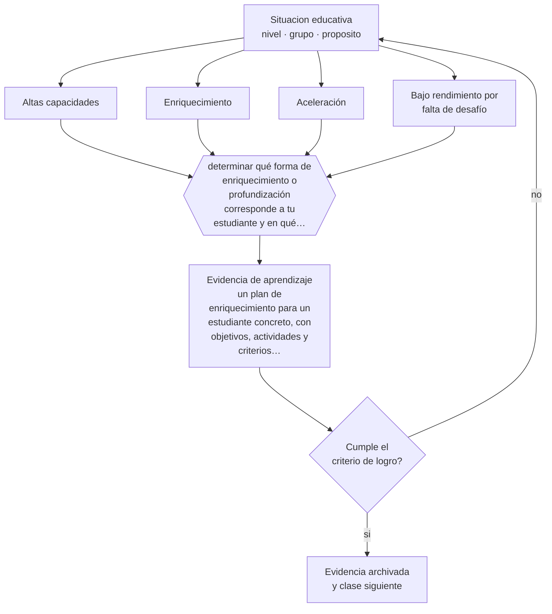

# Clase 107 — Altas capacidades

> **Parte 08 · Inclusión y educación especial** — clase 11 de 12

**Estado de evidencia:** `EN-DEBATE` · **Etapa:** 🟣 Etapa C — Núcleo profesional docente · **Población de referencia:** todos los niveles, con foco en apoyos y accesibilidad 
**Decisión que habilita:** determinar qué forma de enriquecimiento o profundización corresponde a tu estudiante y en qué dominio 
**Evidencia de aprendizaje:** un plan de enriquecimiento para un estudiante concreto, con objetivos, actividades y criterios de evaluación

## 🎯 Propósito

Reconocer y atender las altas capacidades con enriquecimiento y profundización, evitando tanto la negación —«ya le va bien»— como la aceleración indiscriminada.

## 📚 Resultados de aprendizaje

Al finalizar esta clase podrás:

1. **Definir** con precisión los cuatro conceptos centrales de la clase y reconocerlos en una situación educativa real, no solo en su enunciado.
2. **Explicar** por qué un estudiante con altas capacidades puede fracasar en la escuela y por qué la falta de desafío también es una barrera.
3. **Decidir** —qué forma de enriquecimiento o profundización corresponde a tu estudiante y en qué dominio— y sostener la decisión con un fundamento escrito.
4. **Producir** la evidencia de la clase —un plan de enriquecimiento para un estudiante concreto, con objetivos, actividades y criterios de evaluación— y contrastarla contra el criterio de logro.
5. **Distinguir** lo que la evidencia sostiene de lo que es práctica instalada, preferencia personal o costumbre de la institución.

## 🧩 Conceptos centrales

| Concepto | Comprensión verificable |
|---|---|
| **Altas capacidades** | desempeño o potencial marcadamente superior en uno o más dominios |
| **Enriquecimiento** | profundización o ampliación del currículo manteniendo al estudiante en su grupo |
| **Aceleración** | avance a contenidos o cursos superiores; tiene evidencia favorable bajo ciertas condiciones |
| **Bajo rendimiento por falta de desafío** | desconexión y bajo desempeño de un estudiante capaz ante tareas triviales |

## 🗺️ Flujo de razonamiento

## 📖 Desarrollo

### 1. El fondo del asunto

Las altas capacidades no garantizan buen desempeño escolar: un estudiante que nunca es desafiado puede desconectarse, aburrirse y obtener resultados bajos, lo que retrasa aún más su identificación. La evidencia sobre aceleración es más favorable de lo que suele suponerse, incluida la aceleración de asignatura, y no muestra los efectos sociales negativos que se le atribuyen con frecuencia.

### 2. Cómo se traduce en decisiones de enseñanza

El enriquecimiento útil no es «más de lo mismo» sino profundización real: problemas abiertos, mayor complejidad, proyectos con estándar exigente, acceso a contenido superior en el dominio específico. La identificación debe basarse en desempeño y no solo en test, y debe considerar dominios específicos: un estudiante puede requerir aceleración en matemática y apoyo en escritura.

### 3. Qué sostiene la evidencia y qué no

El campo tiene desacuerdos reales sobre definición, identificación e intervención, y los instrumentos usados favorecen sistemáticamente a estudiantes de mayor nivel socioeconómico. La identificación por nominación docente también arrastra sesgos conocidos de género y origen. Reconocerlo es parte del tratamiento profesional del tema.

> **Cómo leer el estado de evidencia `EN-DEBATE`.** Hay desacuerdo activo y publicado entre especialistas competentes. La clase presenta las posiciones y sus argumentos; tu tarea no es escoger un bando, sino saber qué evidencia te haría cambiar de posición.

## 🧪 Taller guiado

Aplica la clase a **uno** de los contextos siguientes y repite después el ejercicio en un
contexto de exigencia distinta. Cambiar de contexto es parte del aprendizaje: lo que funciona
con un grupo no se traslada intacto a otro.

| Contexto | Rasgo que cambia la decisión |
|---|---|
| Estudiante con discapacidad sensorial | el acceso al material define la participación |
| Estudiante con discapacidad motora | el espacio y los tiempos son la barrera principal |
| Estudiante autista | predictibilidad, regulación sensorial y comunicación explícita |
| Estudiante con TDAH | la organización de la tarea pesa más que la voluntad |
| Dificultad específica del aprendizaje | la vía de acceso cambia, el objetivo no baja |
| Altas capacidades | la falta de desafío también es una barrera |

**Secuencia de trabajo:**

1. Delimita el contexto: nivel, edad, tamaño del grupo, asignatura o experiencia y tiempo real disponible.
2. Declara qué saben ya los estudiantes y **cómo lo comprobaste**, no cómo lo supones.
3. Formula la decisión pedagógica que esta clase habilita y escribe su fundamento.
4. Anticipa qué observarías si la decisión funciona y qué observarías si no funciona.
5. Diseña de antemano la alternativa que aplicarás si la primera estrategia falla.
6. Ejecuta o simula, y registra lo observado con fecha, contexto y evidencia concreta.
7. Produce la evidencia de aprendizaje de la clase.
8. Contrástala contra el criterio de logro, corrige y recién entonces avanza.

### 📦 Evidencia de aprendizaje

Un plan de enriquecimiento para un estudiante concreto, con objetivos, actividades y criterios de evaluación.

Debe incluir contexto, decisión, fundamento, fuentes consultadas con su fecha, indicador de
logro observable, riesgos previstos y qué harías distinto en la siguiente iteración.

## 🏆 Reto verificable

Identifica a un estudiante desconectado por falta de desafío. Diseña seis semanas de profundización real y evalúa su efecto sobre su desempeño y su participación.

## ✅ Criterio de logro

- [ ] el plan profundiza en complejidad y no solo aumenta la cantidad de trabajo;
- [ ] la identificación considera desempeño por dominio y declara los sesgos del instrumento usado;
- [ ] cada afirmación sobre «lo que funciona» está atribuida a una fuente identificable, con autor y fecha;
- [ ] la decisión es ejecutable con el tiempo, el espacio, el número de estudiantes y los recursos que realmente tienes;
- [ ] la evidencia queda archivada de forma reproducible: otra persona podría revisarla sin que tú se la expliques.

## ⚠️ Errores frecuentes

**Propios de esta clase:**

- Suponer que un estudiante con altas capacidades no necesita atención porque obtiene buenas notas.
- Asignar más ejercicios del mismo nivel como forma de enriquecimiento.

**Característicos de la parte 08:**

- Reducir la inclusión a la presencia física del estudiante en la sala.
- Adecuar bajando la exigencia en vez de cambiar la vía de acceso.

## ♿ Diversidad, accesibilidad y ética

Las altas capacidades en estudiantes de contextos vulnerables, con discapacidad o de culturas minorizadas se identifican mucho menos. Buscar activamente en esos grupos, con instrumentos de desempeño y no solo de test, corrige parte del sesgo.

Antes de aplicar cualquier decisión de esta clase con estudiantes reales, revisa el
[protocolo de práctica responsable](../../../docs/ETICA_Y_PRACTICA_RESPONSABLE.md):
consentimiento, resguardo de datos personales, proporcionalidad de la intervención y derecho
de cada estudiante a no ser objeto de un ensayo que no le reporta beneficio.

## ❓ Preguntas de comprobación

1. ¿Qué estudiante tuyo está desconectado por falta de desafío?
2. ¿Qué le estás dando cuando termina antes: más trabajo o mejor trabajo?
3. ¿A quién no identificaste por sesgo del instrumento o de la nominación?

## 📕 Lecturas base

**Assouline, S. et al. (2015). *A Nation Empowered: Evidence Trumps the Excuses Holding Back America's Brightest Students*.**  
*Qué aporta a esta clase:* síntesis de la evidencia sobre aceleración y sus efectos reales.

**Renzulli, J. *The Schoolwide Enrichment Model*.**  
*Qué aporta a esta clase:* modelo operativo de enriquecimiento aplicable dentro del aula común.

Catálogo completo: [bibliografía del programa](../../../docs/BIBLIOGRAFIA.md) ·
[glosario](../../../docs/GLOSARIO.md) ·
[fuentes oficiales y cómo leerlas](../../../docs/FUENTES.md).

## 🔗 Conexión con el resto del programa

Completa la parte 08 mostrando que la variabilidad tiene dos extremos, y se apoya en la clase 035.

> [!IMPORTANT]
> Material de formación profesional. No reemplaza un título de pedagogía, una habilitación
> legal para ejercer, ni el juicio de un equipo educativo que conoce a sus estudiantes.

---

| Anterior | Índice | Siguiente |
|---|---|---|
| [← 106 · Discapacidad intelectual](../class-10-discapacidad-intelectual/README.md) | [Parte 08](../README.md) · [Programa](../../../README.md) | [108 · Proyecto integrador: aula accesible →](../class-12-proyecto-integrador-aula-accesible/README.md) |
