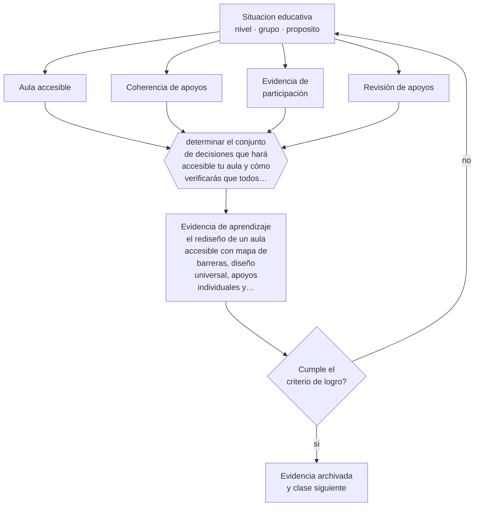

# Clase 108 — Proyecto integrador: aula accesible

> **Parte 08 · Inclusión y educación especial** — clase 12 de 12

**Estado de evidencia:** `CONSISTENTE` · **Etapa:** 🟣 Etapa C — Núcleo profesional docente · **Población de referencia:** todos los niveles, con foco en apoyos y accesibilidad 
**Decisión que habilita:** determinar el conjunto de decisiones que hará accesible tu aula y cómo verificarás que todos aprenden 
**Evidencia de aprendizaje:** el rediseño de un aula accesible con mapa de barreras, diseño universal, apoyos individuales y evidencia de participación

## 🎯 Propósito

Integrar la parte rediseñando un aula completa: barreras identificadas, diseño universal aplicado, apoyos individuales conectados con la planificación y evidencia de participación de todos.

## 📚 Resultados de aprendizaje

Al finalizar esta clase podrás:

1. **Definir** con precisión los cuatro conceptos centrales de la clase y reconocerlos en una situación educativa real, no solo en su enunciado.
2. **Explicar** cómo se convierte un aula común en un espacio donde todos aprenden lo mismo por vías distintas.
3. **Decidir** —el conjunto de decisiones que hará accesible tu aula y cómo verificarás que todos aprenden— y sostener la decisión con un fundamento escrito.
4. **Producir** la evidencia de la clase —el rediseño de un aula accesible con mapa de barreras, diseño universal, apoyos individuales y evidencia de participación— y contrastarla contra el criterio de logro.
5. **Distinguir** lo que la evidencia sostiene de lo que es práctica instalada, preferencia personal o costumbre de la institución.

## 🧩 Conceptos centrales

| Concepto | Comprensión verificable |
|---|---|
| **Aula accesible** | espacio donde todos los estudiantes pueden acceder, participar y demostrar aprendizaje |
| **Coherencia de apoyos** | conexión entre planificación de aula, plan de apoyo individual y trabajo del equipo |
| **Evidencia de participación** | registro que muestra quién participa efectivamente y quién queda al margen |
| **Revisión de apoyos** | proceso periódico que evita que un apoyo se vuelva permanente por inercia |

## 🗺️ Flujo de razonamiento

## 📖 Desarrollo

### 1. El fondo del asunto

El proyecto integrador exige que todos los instrumentos de la parte operen juntos. La prueba de calidad es directa: tomar al estudiante con mayores necesidades de apoyo del curso y mostrar, con evidencia, que accede al mismo objetivo de aprendizaje que sus compañeros. Si no se puede mostrar, el rediseño todavía no cumple, aunque haya mejorado en muchos aspectos.

### 2. Cómo se traduce en decisiones de enseñanza

El trabajo tiene cuatro capas: mapa de barreras, rediseño universal, apoyos individuales conectados con la planificación y registro de participación. Ese último registro es el que revela lo que las percepciones ocultan: quién habla, quién trabaja con otros, quién demuestra lo aprendido y quién pasa la semana sin producir evidencia alguna.

### 3. Qué sostiene la evidencia y qué no

Un aula rediseñada no elimina todas las necesidades de apoyo especializado ni compensa condiciones institucionales adversas —cursos numerosos, falta de profesionales, ausencia de tiempo de coordinación—. Declarar esas condiciones como límites del diseño es parte del rigor profesional y del argumento ante el equipo directivo.

> **Cómo leer el estado de evidencia `CONSISTENTE`.** La evidencia es amplia y coherente, pero proviene sobre todo de estudios correlacionales, de síntesis con heterogeneidad alta o de contextos distintos al tuyo. Sirve para orientar la decisión y exige que compruebes el efecto en tu propio grupo.

## 🧪 Taller guiado

Aplica la clase a **uno** de los contextos siguientes y repite después el ejercicio en un
contexto de exigencia distinta. Cambiar de contexto es parte del aprendizaje: lo que funciona
con un grupo no se traslada intacto a otro.

| Contexto | Rasgo que cambia la decisión |
|---|---|
| Estudiante con discapacidad sensorial | el acceso al material define la participación |
| Estudiante con discapacidad motora | el espacio y los tiempos son la barrera principal |
| Estudiante autista | predictibilidad, regulación sensorial y comunicación explícita |
| Estudiante con TDAH | la organización de la tarea pesa más que la voluntad |
| Dificultad específica del aprendizaje | la vía de acceso cambia, el objetivo no baja |
| Altas capacidades | la falta de desafío también es una barrera |

**Secuencia de trabajo:**

1. Delimita el contexto: nivel, edad, tamaño del grupo, asignatura o experiencia y tiempo real disponible.
2. Declara qué saben ya los estudiantes y **cómo lo comprobaste**, no cómo lo supones.
3. Formula la decisión pedagógica que esta clase habilita y escribe su fundamento.
4. Anticipa qué observarías si la decisión funciona y qué observarías si no funciona.
5. Diseña de antemano la alternativa que aplicarás si la primera estrategia falla.
6. Ejecuta o simula, y registra lo observado con fecha, contexto y evidencia concreta.
7. Produce la evidencia de aprendizaje de la clase.
8. Contrástala contra el criterio de logro, corrige y recién entonces avanza.

### 📦 Evidencia de aprendizaje

El rediseño de un aula accesible con mapa de barreras, diseño universal, apoyos individuales y evidencia de participación.

Debe incluir contexto, decisión, fundamento, fuentes consultadas con su fecha, indicador de
logro observable, riesgos previstos y qué harías distinto en la siguiente iteración.

## 🏆 Reto verificable

Aplica el rediseño durante un mes y documenta la participación de todos los estudiantes. Presenta la evidencia al equipo y acuerden una mejora institucional.

## ✅ Criterio de logro

- [ ] existe evidencia documentada de participación y aprendizaje del estudiante con mayores necesidades;
- [ ] los apoyos individuales están conectados con la planificación de aula y tienen fecha de revisión;
- [ ] cada afirmación sobre «lo que funciona» está atribuida a una fuente identificable, con autor y fecha;
- [ ] la decisión es ejecutable con el tiempo, el espacio, el número de estudiantes y los recursos que realmente tienes;
- [ ] la evidencia queda archivada de forma reproducible: otra persona podría revisarla sin que tú se la expliques.

## ⚠️ Errores frecuentes

**Propios de esta clase:**

- Evaluar el rediseño por la impresión general del clima y no por la participación documentada de cada estudiante.
- Mantener apoyos sin revisión hasta que se convierten en etiquetas permanentes.

**Característicos de la parte 08:**

- Reducir la inclusión a la presencia física del estudiante en la sala.
- Adecuar bajando la exigencia en vez de cambiar la vía de acceso.

## ♿ Diversidad, accesibilidad y ética

Esta clase es el punto donde la inclusión deja de ser un principio y se vuelve verificable. La pregunta que la resume: ¿qué aprendió esta semana el estudiante que más apoyos necesita, y con qué evidencia lo sabes?

Antes de aplicar cualquier decisión de esta clase con estudiantes reales, revisa el
[protocolo de práctica responsable](../../../docs/ETICA_Y_PRACTICA_RESPONSABLE.md):
consentimiento, resguardo de datos personales, proporcionalidad de la intervención y derecho
de cada estudiante a no ser objeto de un ensayo que no le reporta beneficio.

## ❓ Preguntas de comprobación

1. ¿Qué evidencia de aprendizaje produjo esta semana el estudiante con más apoyos?
2. ¿Qué apoyo lleva más de un año sin revisarse?
3. ¿Qué condición institucional impide completar tu rediseño?

## 📕 Lecturas base

**Booth, T. & Ainscow, M. (2011). *Index for Inclusion*.**  
*Qué aporta a esta clase:* instrumento de autoevaluación para verificar el rediseño con indicadores concretos.

**CAST (2024). *UDL Guidelines* 3.0.**  
*Qué aporta a esta clase:* marco de diseño para articular las decisiones del aula rediseñada.

Catálogo completo: [bibliografía del programa](../../../docs/BIBLIOGRAFIA.md) ·
[glosario](../../../docs/GLOSARIO.md) ·
[fuentes oficiales y cómo leerlas](../../../docs/FUENTES.md).

## 🔗 Conexión con el resto del programa

Cierra la parte 08 integrando sus once clases previas y condiciona el diseño de las partes 09, 10 y 11.

> [!IMPORTANT]
> Material de formación profesional. No reemplaza un título de pedagogía, una habilitación
> legal para ejercer, ni el juicio de un equipo educativo que conoce a sus estudiantes.

---

| Anterior | Índice | Siguiente |
|---|---|---|
| [← 107 · Altas capacidades](../class-11-altas-capacidades/README.md) | [Parte 08](../README.md) · [Programa](../../../README.md) | [Programa completo →](../../../README.md) |
