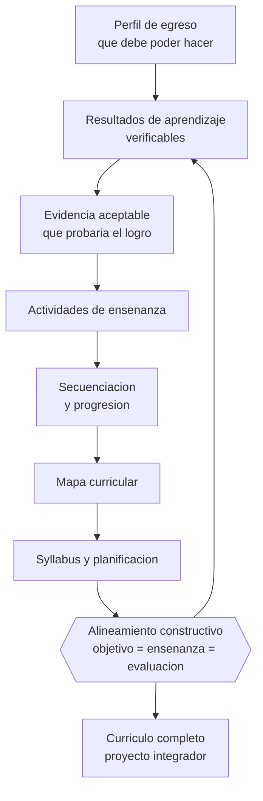

# Parte 09 — Diseño curricular

> *Si la evaluación no mide lo que el objetivo declara, el currículo real es la evaluación*

🟣 **Etapa C — Núcleo profesional docente** · salida de la etapa: diseñar, enseñar, evaluar y gestionar un curso completo con evidencia

**Clases:** 12 (109–120) · **Población de referencia:** diseño de asignaturas, programas y planes de estudio · **Conceptos operacionales:** 48 · **Señales observables:** 36 
**Contenido central:** Niveles del currículum, perfil de egreso, competencias, resultados y objetivos de aprendizaje, secuenciación, mapas curriculares, diseño inverso, alineamiento constructivo, syllabus y planificación

## 🎯 De qué trata esta parte

Todo curso tiene tres currículos: el declarado, el enseñado y el evaluado. Cuando se separan, los estudiantes se orientan por el tercero, porque es el que tiene consecuencias. Esa es la razón por la que el diseño inverso —definir primero la evidencia aceptable de logro y recién después las actividades— no es una preferencia metodológica sino una corrección de un problema estructural del oficio.

El segundo eje es la progresión. Un currículo bien diseñado no es una lista de temas ordenados por tradición, sino una secuencia donde cada aprendizaje habilita el siguiente y donde las nociones difíciles se visitan más de una vez con creciente complejidad. La mayoría de los planes de estudio fracasan aquí: acumulan contenidos, no construyen trayectorias, y el resultado es un egresado que aprobó todo sin poder hacer nada completo.

El tercer eje es la escritura. Un resultado de aprendizaje mal redactado —«conocer», «comprender», «tomar conciencia»— hace imposible evaluarlo y vuelve arbitraria la calificación. Aquí se entrena la redacción de resultados verificables y su alineamiento con actividades y evaluaciones, que es la competencia que separa un syllabus profesional de un temario con formato institucional.

## 🏫 Caso de la parte

Las doce clases trabajan sobre la misma realidad, para que puedas ver cómo cambia tu diagnóstico
a medida que avanzas:

> El programa de la asignatura declara «pensamiento crítico» como objetivo central. La única evaluación del semestre es una prueba de selección múltiple sobre contenidos, y nadie ha notado la contradicción en cuatro años.

**Artefacto que produces al terminar:** currículo completo con perfil, resultados verificables, mapa curricular y auditoría de alineamiento documentada.

## 📚 Resultados de la parte

Al terminar esta parte podrás:

1. **Redactar resultados de aprendizaje verificables y graduables**.
2. **Construir un mapa curricular que muestre progresión y no acumulación**.
3. **Diseñar con lógica inversa desde la evidencia de logro hasta la actividad**.
4. **Auditar el alineamiento entre objetivos, enseñanza y evaluación de un programa existente**.

## 🗺️ Mapa de la parte

## 🧠 Marco de referencia

- niveles del currículum: prescrito, planificado, enseñado, evaluado y aprendido
- diseño inverso y alineamiento constructivo
- taxonomías de objetivos y niveles de complejidad del desempeño
- Bases Curriculares y planes de estudio vigentes en Chile

**Autoras y autores que conviene conocer:** Ralph Tyler, Hilda Taba, Grant Wiggins y Jay McTighe, John Biggs y Catherine Tang, Benjamin Bloom con la revisión de Anderson y Krathwohl, Kevin Collis, especialistas del currículum nacional chileno

## 📋 Las 12 clases

| # | Clase | Decisión que habilita | Evidencia |
|---:|---|---|---|
| 109 | [Concepto y niveles del currículum](class-01-concepto-y-niveles-del-curriculum/README.md) | determinar en qué nivel del currículum se está produciendo la brecha que observas en tus resultados | `CONSISTENTE` |
| 110 | [Perfil de egreso](class-02-perfil-de-egreso/README.md) | determinar qué desempeños definen el perfil de egreso y cómo se comprobará que se logran | `MARCO-NORMATIVO` |
| 111 | [Competencias](class-03-competencias/README.md) | determinar si tu programa se organiza mejor por competencias, por contenidos o por una combinación explícita | `EN-DEBATE` |
| 112 | [Resultados de aprendizaje](class-04-resultados-de-aprendizaje/README.md) | determinar el nivel de desempeño exigido en cada resultado y cómo se evidenciará | `CONSISTENTE` |
| 113 | [Objetivos de aprendizaje](class-05-objetivos-de-aprendizaje/README.md) | determinar el objetivo y el criterio de éxito de tu próxima clase, en lenguaje que tus estudiantes usen | `ROBUSTA` |
| 114 | [Secuenciación curricular](class-06-secuenciacion-curricular/README.md) | determinar el orden de tu programa a partir de dependencias reales y no de la tradición del temario | `CONSISTENTE` |
| 115 | [Mapas curriculares](class-07-mapas-curriculares/README.md) | determinar dónde se desarrolla y dónde se evalúa cada elemento del perfil a lo largo del plan | `PRACTICA-PROFESIONAL` |
| 116 | [Backward design](class-08-backward-design/README.md) | determinar qué evidencia aceptarías como prueba del logro antes de diseñar cualquier actividad | `CONSISTENTE` |
| 117 | [Alineamiento constructivo](class-09-alineamiento-constructivo/README.md) | determinar dónde se rompe el alineamiento de tu programa y qué corrección corresponde | `CONSISTENTE` |
| 118 | [Diseño de syllabus](class-10-diseno-de-syllabus/README.md) | determinar qué debe contener tu syllabus para que un estudiante pueda organizarse y un colega pueda dictar el curso | `PRACTICA-PROFESIONAL` |
| 119 | [Planificación anual y por unidad](class-11-planificacion-anual-y-por-unidad/README.md) | determinar qué se prioriza y qué se sacrifica cuando el tiempo real resulte menor que el planificado | `PRACTICA-PROFESIONAL` |
| 120 | [Proyecto integrador: currículo completo](class-12-proyecto-integrador-curriculo-completo/README.md) | determinar el diseño curricular completo y demostrar su coherencia con una auditoría documentada | `CONSISTENTE` |

## ⚠️ Riesgos característicos

- Redactar objetivos con verbos no observables y evaluarlos igual.
- Diseñar actividades primero y buscar después qué objetivo cubren.
- Confundir cobertura de contenidos con progresión de aprendizajes.
- Mantener evaluaciones heredadas que ya no corresponden al objetivo declarado.

## 📕 Lecturas de referencia de la parte

- **Wiggins, G. & McTighe, J. (2005). *Understanding by Design*.** — el manual del diseño inverso; su aporte central es exigir la evidencia de logro antes que la actividad.
- **Biggs, J. & Tang, C. (2011). *Teaching for Quality Learning at University*.** — define el alineamiento constructivo y lo convierte en procedimiento de diseño.
- **Anderson, L. & Krathwohl, D. (2001). *A Taxonomy for Learning, Teaching, and Assessing*.** — la revisión de la taxonomía de Bloom que separa dimensión del conocimiento y proceso cognitivo.
- **Mineduc. *Bases Curriculares* vigentes y priorización curricular.** — en Chile el diseño local se hace sobre este marco: conviene conocer su estructura y sus grados de libertad.

## ✅ Evidencia mínima para dar la parte por cerrada

- [ ] un conjunto de resultados de aprendizaje redactados y revisados por pares;
- [ ] un mapa curricular con prerrequisitos y progresión visible;
- [ ] un syllabus completo con alineamiento auditado;
- [ ] el informe de auditoría de un programa existente con brechas y propuesta.

## 🧭 Práctica y evaluación de la parte

- [Rúbrica maestra e instrumentos de autoevaluación](../../assessments/README.md)
- [Casos profesionales para resolver con este marco](../../cases/README.md)
- [Laboratorios de decisión](../../labs/README.md)
- [Dónde se archiva la evidencia](../../evidence/README.md)

---

| Anterior | Índice | Siguiente |
|---|---|---|
| [← Parte 08 · Inclusión y educación especial](../part-08-inclusion-y-educacion-especial/README.md) | [Programa](../../README.md) · [Currículo](../../CURRICULUM.md) | [Parte 10 · Didáctica avanzada →](../part-10-didactica-avanzada/README.md) |
