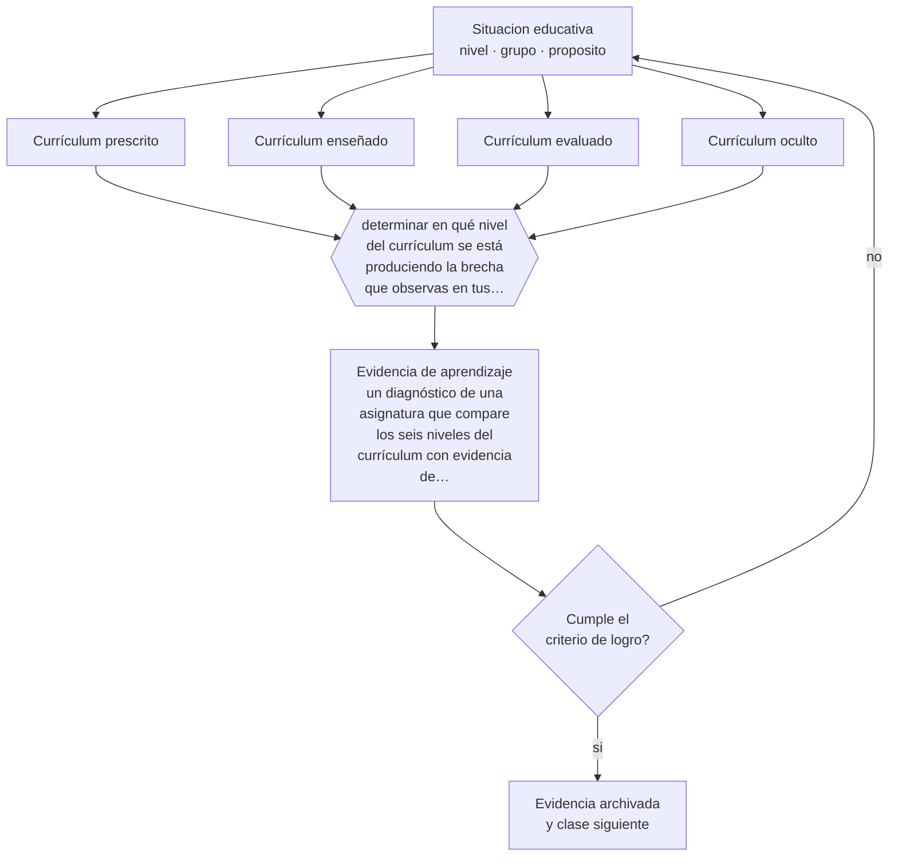

# Clase 109 — Concepto y niveles del currículum

> **Parte 09 · Diseño curricular** — clase 1 de 12

**Estado de evidencia:** `CONSISTENTE` · **Etapa:** 🟣 Etapa C — Núcleo profesional docente · **Población de referencia:** diseño de asignaturas, programas y planes de estudio 
**Decisión que habilita:** determinar en qué nivel del currículum se está produciendo la brecha que observas en tus resultados 
**Evidencia de aprendizaje:** un diagnóstico de una asignatura que compare los seis niveles del currículum con evidencia de cada uno

## 🎯 Propósito

Distinguir los niveles del currículum —prescrito, planificado, enseñado, evaluado, aprendido y oculto— y usar esa distinción para diagnosticar dónde se produce la pérdida en tu institución.

## 📚 Resultados de aprendizaje

Al finalizar esta clase podrás:

1. **Definir** con precisión los cuatro conceptos centrales de la clase y reconocerlos en una situación educativa real, no solo en su enunciado.
2. **Explicar** por qué lo que se declara, lo que se enseña y lo que se evalúa casi nunca son el mismo currículo.
3. **Decidir** —en qué nivel del currículum se está produciendo la brecha que observas en tus resultados— y sostener la decisión con un fundamento escrito.
4. **Producir** la evidencia de la clase —un diagnóstico de una asignatura que compare los seis niveles del currículum con evidencia de cada uno— y contrastarla contra el criterio de logro.
5. **Distinguir** lo que la evidencia sostiene de lo que es práctica instalada, preferencia personal o costumbre de la institución.

## 🧩 Conceptos centrales

| Concepto | Comprensión verificable |
|---|---|
| **Currículum prescrito** | lo que la autoridad define como obligatorio para el sistema |
| **Currículum enseñado** | lo que efectivamente ocurre en la sala, que suele diferir de lo planificado |
| **Currículum evaluado** | lo que se mide; en la práctica es el que orienta la conducta de los estudiantes |
| **Currículum oculto** | aprendizajes no declarados que la institución transmite con sus prácticas y su organización |

## 🗺️ Flujo de razonamiento

## 📖 Desarrollo

### 1. El fondo del asunto

Todo sistema educativo tiene varios currículos operando a la vez, y la distancia entre ellos explica buena parte de sus resultados. Un objetivo declarado que nadie enseña no existe; uno enseñado que nadie evalúa se olvida; y lo evaluado se convierte en el currículo real porque es lo que tiene consecuencias. A eso se suma el currículo oculto: la puntualidad, la obediencia, la competencia o la colaboración se aprenden por cómo funciona la institución, no por lo que declara.

### 2. Cómo se traduce en decisiones de enseñanza

El diagnóstico se hace comparando fuentes: el programa oficial, la planificación del docente, un registro de lo efectivamente enseñado, los instrumentos de evaluación aplicados y una muestra del trabajo de los estudiantes. Las diferencias aparecen rápido y son incómodas: contenidos declarados que nunca se abordaron, evaluaciones que miden algo distinto de lo enseñado, aprendizajes que ocurren sin estar en ningún documento.

### 3. Qué sostiene la evidencia y qué no

La distinción es una herramienta analítica y no una jerarquía de importancia: el currículo prescrito no siempre es mejor que el enseñado, y a veces el ajuste del docente corrige un programa mal diseñado. El objetivo del diagnóstico no es forzar la coincidencia total, sino hacer visibles las diferencias para decidirlas en vez de sufrirlas.

> **Cómo leer el estado de evidencia `CONSISTENTE`.** La evidencia es amplia y coherente, pero proviene sobre todo de estudios correlacionales, de síntesis con heterogeneidad alta o de contextos distintos al tuyo. Sirve para orientar la decisión y exige que compruebes el efecto en tu propio grupo.

## 🧪 Taller guiado

Aplica la clase a **uno** de los contextos siguientes y repite después el ejercicio en un
contexto de exigencia distinta. Cambiar de contexto es parte del aprendizaje: lo que funciona
con un grupo no se traslada intacto a otro.

| Contexto | Rasgo que cambia la decisión |
|---|---|
| Asignatura escolar | el marco curricular nacional acota los objetivos |
| Módulo técnico-profesional | el perfil de egreso del oficio manda |
| Asignatura universitaria | autonomía alta y responsabilidad de coherencia con la carrera |
| Programa de capacitación breve | el resultado debe ser útil en semanas |
| Rediseño de un programa completo | hay historia, intereses y cargas docentes en juego |
| Programa en modalidad en línea | la evidencia de logro debe funcionar sin presencia |

**Secuencia de trabajo:**

1. Delimita el contexto: nivel, edad, tamaño del grupo, asignatura o experiencia y tiempo real disponible.
2. Declara qué saben ya los estudiantes y **cómo lo comprobaste**, no cómo lo supones.
3. Formula la decisión pedagógica que esta clase habilita y escribe su fundamento.
4. Anticipa qué observarías si la decisión funciona y qué observarías si no funciona.
5. Diseña de antemano la alternativa que aplicarás si la primera estrategia falla.
6. Ejecuta o simula, y registra lo observado con fecha, contexto y evidencia concreta.
7. Produce la evidencia de aprendizaje de la clase.
8. Contrástala contra el criterio de logro, corrige y recién entonces avanza.

### 📦 Evidencia de aprendizaje

Un diagnóstico de una asignatura que compare los seis niveles del currículum con evidencia de cada uno.

Debe incluir contexto, decisión, fundamento, fuentes consultadas con su fecha, indicador de
logro observable, riesgos previstos y qué harías distinto en la siguiente iteración.

## 🏆 Reto verificable

Compara los seis niveles en una asignatura real durante una unidad completa. Presenta las brechas al equipo y propón una corrección para la mayor.

## ✅ Criterio de logro

- [ ] el diagnóstico usa evidencia distinta para cada nivel y no solo el programa oficial;
- [ ] identifica al menos una brecha concreta con su explicación y su corrección;
- [ ] cada afirmación sobre «lo que funciona» está atribuida a una fuente identificable, con autor y fecha;
- [ ] la decisión es ejecutable con el tiempo, el espacio, el número de estudiantes y los recursos que realmente tienes;
- [ ] la evidencia queda archivada de forma reproducible: otra persona podría revisarla sin que tú se la expliques.

## ⚠️ Errores frecuentes

**Propios de esta clase:**

- Suponer que lo planificado es lo que efectivamente se enseñó, sin verificarlo.
- Ignorar el currículo oculto y atribuir a los estudiantes actitudes que la institución enseña.

**Característicos de la parte 09:**

- Redactar objetivos con verbos no observables y evaluarlos igual.
- Diseñar actividades primero y buscar después qué objetivo cubren.

## ♿ Diversidad, accesibilidad y ética

El currículo oculto opera con más fuerza sobre los estudiantes que menos se ajustan al perfil esperado: aprenden, antes que cualquier contenido, cuál es su lugar en la institución. Detectarlo es condición para modificarlo.

Antes de aplicar cualquier decisión de esta clase con estudiantes reales, revisa el
[protocolo de práctica responsable](../../../docs/ETICA_Y_PRACTICA_RESPONSABLE.md):
consentimiento, resguardo de datos personales, proporcionalidad de la intervención y derecho
de cada estudiante a no ser objeto de un ensayo que no le reporta beneficio.

## ❓ Preguntas de comprobación

1. ¿Qué objetivo declarado de tu programa no se enseñó este año?
2. ¿Qué mide realmente tu evaluación, comparado con lo que enseñaste?
3. ¿Qué está aprendiendo tu curso de la forma en que funciona la institución?

## 📕 Lecturas base

**Goodlad, J. (1979). *Curriculum Inquiry*.**  
*Qué aporta a esta clase:* origen de la distinción entre niveles del currículum, todavía la más útil para diagnosticar.

**Jackson, P. (1968). *Life in Classrooms*.**  
*Qué aporta a esta clase:* introduce el currículo oculto con observación etnográfica; sigue siendo la mejor descripción del fenómeno.

Catálogo completo: [bibliografía del programa](../../../docs/BIBLIOGRAFIA.md) ·
[glosario](../../../docs/GLOSARIO.md) ·
[fuentes oficiales y cómo leerlas](../../../docs/FUENTES.md).

## 🔗 Conexión con el resto del programa

Abre la parte 09 y se apoya en la clase 010 sobre cultura escolar. Es el diagnóstico previo a todo lo que sigue.

> [!IMPORTANT]
> Material de formación profesional. No reemplaza un título de pedagogía, una habilitación
> legal para ejercer, ni el juicio de un equipo educativo que conoce a sus estudiantes.

---

| Anterior | Índice | Siguiente |
|---|---|---|
| [← Parte 09](../README.md) | [Parte 09](../README.md) · [Programa](../../../README.md) | [110 · Perfil de egreso →](../class-02-perfil-de-egreso/README.md) |
