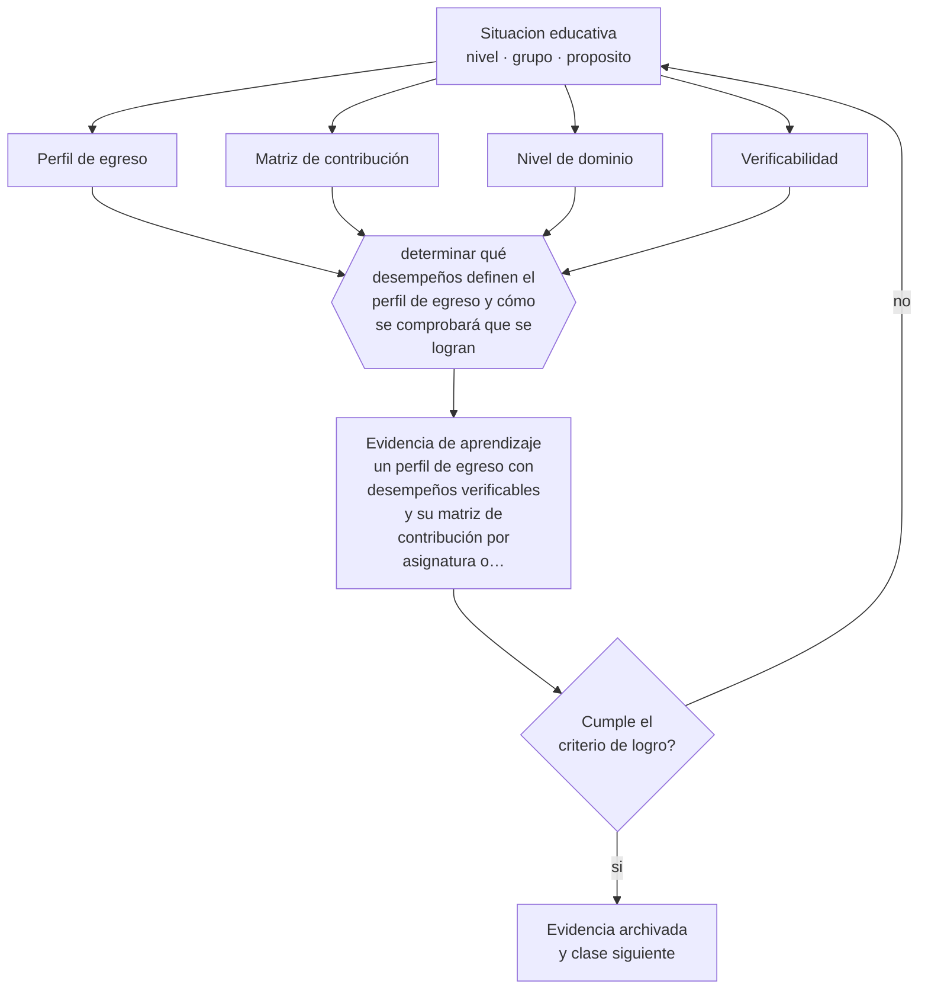

# Clase 110 — Perfil de egreso

> **Parte 09 · Diseño curricular** — clase 2 de 12

**Estado de evidencia:** `MARCO-NORMATIVO` · **Etapa:** 🟣 Etapa C — Núcleo profesional docente · **Población de referencia:** diseño de asignaturas, programas y planes de estudio 
**Decisión que habilita:** determinar qué desempeños definen el perfil de egreso y cómo se comprobará que se logran 
**Evidencia de aprendizaje:** un perfil de egreso con desempeños verificables y su matriz de contribución por asignatura o módulo

## 🎯 Propósito

Construir perfiles de egreso verificables: qué debe poder hacer una persona al terminar el programa, con qué nivel y en qué contextos, de modo que el perfil ordene el resto del diseño.

## 📚 Resultados de aprendizaje

Al finalizar esta clase podrás:

1. **Definir** con precisión los cuatro conceptos centrales de la clase y reconocerlos en una situación educativa real, no solo en su enunciado.
2. **Explicar** cómo se escribe un perfil de egreso que sirva para decidir y no solo para publicar.
3. **Decidir** —qué desempeños definen el perfil de egreso y cómo se comprobará que se logran— y sostener la decisión con un fundamento escrito.
4. **Producir** la evidencia de la clase —un perfil de egreso con desempeños verificables y su matriz de contribución por asignatura o módulo— y contrastarla contra el criterio de logro.
5. **Distinguir** lo que la evidencia sostiene de lo que es práctica instalada, preferencia personal o costumbre de la institución.

## 🧩 Conceptos centrales

| Concepto | Comprensión verificable |
|---|---|
| **Perfil de egreso** | conjunto de desempeños que caracteriza a quien completa el programa |
| **Matriz de contribución** | tabla que muestra qué asignatura desarrolla y evalúa cada elemento del perfil |
| **Nivel de dominio** | grado de desempeño esperado al egreso, distinto del de etapas intermedias |
| **Verificabilidad** | posibilidad de comprobar el logro con evidencia y no solo con la aprobación de asignaturas |

## 🗺️ Flujo de razonamiento

## 📖 Desarrollo

### 1. El fondo del asunto

Un perfil de egreso cumple su función cuando permite responder dos preguntas: qué puede hacer esta persona y dónde en el plan de estudios lo aprendió. La mayoría de los perfiles publicados falla en ambas: enumera atributos deseables —crítico, íntegro, comprometido— que no se pueden verificar ni rastrear. La matriz de contribución expone ese problema de inmediato, porque obliga a señalar dónde se enseña y dónde se evalúa cada elemento.

### 2. Cómo se traduce en decisiones de enseñanza

El trabajo consiste en escribir desempeños observables con su nivel y su contexto, y después construir la matriz asignatura por asignatura. Los vacíos aparecen solos: elementos del perfil que nadie desarrolla, o que se declaran en diez asignaturas y no se evalúan en ninguna. Cerrar esos vacíos es la principal utilidad práctica del ejercicio.

### 3. Qué sostiene la evidencia y qué no

Un perfil bien escrito no garantiza que el programa lo produzca: la matriz muestra intención, no efecto. Comprobar el logro exige evidencia de desempeño al egreso, que pocas instituciones recogen. Además, los procesos de acreditación pueden incentivar perfiles escritos para el evaluador externo y no para el diseño interno.

> **Cómo leer el estado de evidencia `MARCO-NORMATIVO`.** El contenido no se decide por evidencia empírica sino por norma, política pública o marco institucional vigente. Verifica siempre la versión vigente a la fecha en que vas a aplicarlo: la norma cambia y la clase no se actualiza sola.

## 🧪 Taller guiado

Aplica la clase a **uno** de los contextos siguientes y repite después el ejercicio en un
contexto de exigencia distinta. Cambiar de contexto es parte del aprendizaje: lo que funciona
con un grupo no se traslada intacto a otro.

| Contexto | Rasgo que cambia la decisión |
|---|---|
| Asignatura escolar | el marco curricular nacional acota los objetivos |
| Módulo técnico-profesional | el perfil de egreso del oficio manda |
| Asignatura universitaria | autonomía alta y responsabilidad de coherencia con la carrera |
| Programa de capacitación breve | el resultado debe ser útil en semanas |
| Rediseño de un programa completo | hay historia, intereses y cargas docentes en juego |
| Programa en modalidad en línea | la evidencia de logro debe funcionar sin presencia |

**Secuencia de trabajo:**

1. Delimita el contexto: nivel, edad, tamaño del grupo, asignatura o experiencia y tiempo real disponible.
2. Declara qué saben ya los estudiantes y **cómo lo comprobaste**, no cómo lo supones.
3. Formula la decisión pedagógica que esta clase habilita y escribe su fundamento.
4. Anticipa qué observarías si la decisión funciona y qué observarías si no funciona.
5. Diseña de antemano la alternativa que aplicarás si la primera estrategia falla.
6. Ejecuta o simula, y registra lo observado con fecha, contexto y evidencia concreta.
7. Produce la evidencia de aprendizaje de la clase.
8. Contrástala contra el criterio de logro, corrige y recién entonces avanza.

### 📦 Evidencia de aprendizaje

Un perfil de egreso con desempeños verificables y su matriz de contribución por asignatura o módulo.

Debe incluir contexto, decisión, fundamento, fuentes consultadas con su fecha, indicador de
logro observable, riesgos previstos y qué harías distinto en la siguiente iteración.

## 🏆 Reto verificable

Construye la matriz de contribución de un programa real. Identifica el elemento del perfil peor cubierto y propón dónde y cómo desarrollarlo.

## ✅ Criterio de logro

- [ ] cada elemento del perfil declara desempeño, nivel y contexto;
- [ ] la matriz identifica dónde se desarrolla y dónde se evalúa cada elemento;
- [ ] cada afirmación sobre «lo que funciona» está atribuida a una fuente identificable, con autor y fecha;
- [ ] la decisión es ejecutable con el tiempo, el espacio, el número de estudiantes y los recursos que realmente tienes;
- [ ] la evidencia queda archivada de forma reproducible: otra persona podría revisarla sin que tú se la expliques.

## ⚠️ Errores frecuentes

**Propios de esta clase:**

- Redactar el perfil con atributos de personalidad en vez de desempeños verificables.
- Publicar un perfil sin matriz de contribución, con lo que nadie sabe dónde se aprende cada cosa.

**Característicos de la parte 09:**

- Redactar objetivos con verbos no observables y evaluarlos igual.
- Diseñar actividades primero y buscar después qué objetivo cubren.

## ♿ Diversidad, accesibilidad y ética

Un perfil verificable protege a los estudiantes: hace explícito qué se les exigirá y con qué criterios, lo que reduce la arbitrariedad y permite pedir apoyos con anticipación en vez de descubrir la exigencia al final.

Antes de aplicar cualquier decisión de esta clase con estudiantes reales, revisa el
[protocolo de práctica responsable](../../../docs/ETICA_Y_PRACTICA_RESPONSABLE.md):
consentimiento, resguardo de datos personales, proporcionalidad de la intervención y derecho
de cada estudiante a no ser objeto de un ensayo que no le reporta beneficio.

## ❓ Preguntas de comprobación

1. ¿Qué elemento de tu perfil no se evalúa en ninguna asignatura?
2. ¿Cómo comprobarías que un egresado logró el perfil declarado?
3. ¿Qué atributo del perfil es en realidad un deseo y no un aprendizaje?

## 📕 Lecturas base

**Comisión Nacional de Acreditación (Chile). *Criterios y estándares de acreditación*.**  
*Qué aporta a esta clase:* define qué se espera del perfil de egreso y de su verificación en el sistema chileno.

**Biggs, J. & Tang, C. (2011). *Teaching for Quality Learning at University*.**  
*Qué aporta a esta clase:* conecta perfil, resultados de aprendizaje y evaluación con la lógica del alineamiento.

Catálogo completo: [bibliografía del programa](../../../docs/BIBLIOGRAFIA.md) ·
[glosario](../../../docs/GLOSARIO.md) ·
[fuentes oficiales y cómo leerlas](../../../docs/FUENTES.md).

## 🔗 Conexión con el resto del programa

Ordena todo el diseño posterior: las clases 111 a 119 operan dentro del marco que fija el perfil.

> [!IMPORTANT]
> Material de formación profesional. No reemplaza un título de pedagogía, una habilitación
> legal para ejercer, ni el juicio de un equipo educativo que conoce a sus estudiantes.

---

| Anterior | Índice | Siguiente |
|---|---|---|
| [← 109 · Concepto y niveles del currículum](../class-01-concepto-y-niveles-del-curriculum/README.md) | [Parte 09](../README.md) · [Programa](../../../README.md) | [111 · Competencias →](../class-03-competencias/README.md) |
