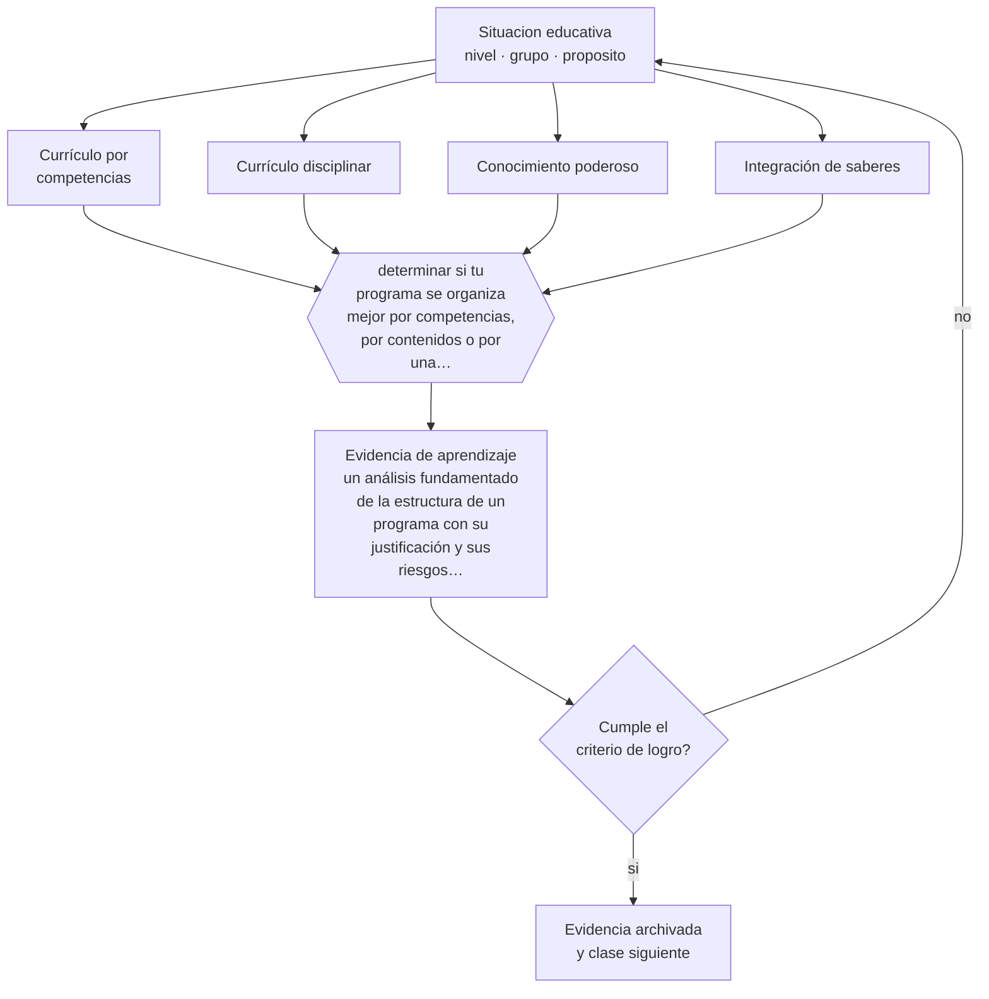

# Clase 111 — Competencias

> **Parte 09 · Diseño curricular** — clase 3 de 12

**Estado de evidencia:** `EN-DEBATE` · **Etapa:** 🟣 Etapa C — Núcleo profesional docente · **Población de referencia:** diseño de asignaturas, programas y planes de estudio 
**Decisión que habilita:** determinar si tu programa se organiza mejor por competencias, por contenidos o por una combinación explícita 
**Evidencia de aprendizaje:** un análisis fundamentado de la estructura de un programa con su justificación y sus riesgos declarados

## 🎯 Propósito

Analizar el enfoque por competencias como decisión de diseño curricular: qué problemas resuelve, qué costos tiene y cómo se articula con el conocimiento disciplinar.

## 📚 Resultados de aprendizaje

Al finalizar esta clase podrás:

1. **Definir** con precisión los cuatro conceptos centrales de la clase y reconocerlos en una situación educativa real, no solo en su enunciado.
2. **Explicar** qué gana y qué pierde un currículo cuando se organiza por competencias en vez de por contenidos.
3. **Decidir** —si tu programa se organiza mejor por competencias, por contenidos o por una combinación explícita— y sostener la decisión con un fundamento escrito.
4. **Producir** la evidencia de la clase —un análisis fundamentado de la estructura de un programa con su justificación y sus riesgos declarados— y contrastarla contra el criterio de logro.
5. **Distinguir** lo que la evidencia sostiene de lo que es práctica instalada, preferencia personal o costumbre de la institución.

## 🧩 Conceptos centrales

| Concepto | Comprensión verificable |
|---|---|
| **Currículo por competencias** | organización en torno a desempeños integrados en situaciones reales |
| **Currículo disciplinar** | organización en torno a la estructura del conocimiento de cada disciplina |
| **Conocimiento poderoso** | conocimiento especializado que la escuela ofrece y que no se adquiere en la experiencia cotidiana |
| **Integración de saberes** | articulación entre conocimiento, procedimiento y criterio dentro de una competencia |

## 🗺️ Flujo de razonamiento

## 📖 Desarrollo

### 1. El fondo del asunto

El enfoque por competencias corrige un problema real: currículos que acumulan contenidos sin que nadie pueda hacer nada con ellos. Pero arrastra un riesgo simétrico, señalado por autores de la sociología del currículum: si todo se organiza por desempeños situados, se puede perder el acceso al conocimiento disciplinar sistemático, que es precisamente lo que la escuela ofrece y el entorno cotidiano no.

### 2. Cómo se traduce en decisiones de enseñanza

La decisión práctica no es adherir a un bando sino explicitar la estructura: qué parte del programa se organiza por competencias, qué parte conserva progresión disciplinar y cómo se articulan. Los programas técnicos y profesionales suelen requerir lo primero; las disciplinas con estructura jerárquica fuerte —matemática, ciencias— pierden si se desarma su progresión.

### 3. Qué sostiene la evidencia y qué no

No hay evidencia concluyente de que un enfoque produzca mejores aprendizajes que el otro: los resultados dependen más de la calidad de la enseñanza y de la evaluación que de la etiqueta curricular. El debate es real y legítimo, y las posiciones extremas de ambos lados suelen apoyarse en caricaturas del contrario.

> **Cómo leer el estado de evidencia `EN-DEBATE`.** Hay desacuerdo activo y publicado entre especialistas competentes. La clase presenta las posiciones y sus argumentos; tu tarea no es escoger un bando, sino saber qué evidencia te haría cambiar de posición.

## 🧪 Taller guiado

Aplica la clase a **uno** de los contextos siguientes y repite después el ejercicio en un
contexto de exigencia distinta. Cambiar de contexto es parte del aprendizaje: lo que funciona
con un grupo no se traslada intacto a otro.

| Contexto | Rasgo que cambia la decisión |
|---|---|
| Asignatura escolar | el marco curricular nacional acota los objetivos |
| Módulo técnico-profesional | el perfil de egreso del oficio manda |
| Asignatura universitaria | autonomía alta y responsabilidad de coherencia con la carrera |
| Programa de capacitación breve | el resultado debe ser útil en semanas |
| Rediseño de un programa completo | hay historia, intereses y cargas docentes en juego |
| Programa en modalidad en línea | la evidencia de logro debe funcionar sin presencia |

**Secuencia de trabajo:**

1. Delimita el contexto: nivel, edad, tamaño del grupo, asignatura o experiencia y tiempo real disponible.
2. Declara qué saben ya los estudiantes y **cómo lo comprobaste**, no cómo lo supones.
3. Formula la decisión pedagógica que esta clase habilita y escribe su fundamento.
4. Anticipa qué observarías si la decisión funciona y qué observarías si no funciona.
5. Diseña de antemano la alternativa que aplicarás si la primera estrategia falla.
6. Ejecuta o simula, y registra lo observado con fecha, contexto y evidencia concreta.
7. Produce la evidencia de aprendizaje de la clase.
8. Contrástala contra el criterio de logro, corrige y recién entonces avanza.

### 📦 Evidencia de aprendizaje

Un análisis fundamentado de la estructura de un programa con su justificación y sus riesgos declarados.

Debe incluir contexto, decisión, fundamento, fuentes consultadas con su fecha, indicador de
logro observable, riesgos previstos y qué harías distinto en la siguiente iteración.

## 🏆 Reto verificable

Analiza un programa real y clasifica sus unidades según su lógica de organización. Identifica una incoherencia entre la estructura declarada y la evaluación aplicada.

## ✅ Criterio de logro

- [ ] el análisis declara qué se organiza por competencias y qué conserva progresión disciplinar;
- [ ] los riesgos del enfoque elegido están explicitados junto con su mitigación;
- [ ] cada afirmación sobre «lo que funciona» está atribuida a una fuente identificable, con autor y fecha;
- [ ] la decisión es ejecutable con el tiempo, el espacio, el número de estudiantes y los recursos que realmente tienes;
- [ ] la evidencia queda archivada de forma reproducible: otra persona podría revisarla sin que tú se la expliques.

## ⚠️ Errores frecuentes

**Propios de esta clase:**

- Adoptar el lenguaje de competencias sin cambiar la evaluación, con lo que solo cambia la portada.
- Desarmar la progresión de una disciplina jerárquica para ajustarla a un formato de competencias.

**Característicos de la parte 09:**

- Redactar objetivos con verbos no observables y evaluarlos igual.
- Diseñar actividades primero y buscar después qué objetivo cubren.

## ♿ Diversidad, accesibilidad y ética

El acceso al conocimiento disciplinar sistemático es especialmente importante para estudiantes cuyo entorno no lo provee. Un currículo que lo diluye en nombre de la aplicabilidad puede ampliar la brecha que dice combatir.

Antes de aplicar cualquier decisión de esta clase con estudiantes reales, revisa el
[protocolo de práctica responsable](../../../docs/ETICA_Y_PRACTICA_RESPONSABLE.md):
consentimiento, resguardo de datos personales, proporcionalidad de la intervención y derecho
de cada estudiante a no ser objeto de un ensayo que no le reporta beneficio.

## ❓ Preguntas de comprobación

1. ¿Qué conocimiento disciplinar corre riesgo de perderse en tu diseño?
2. ¿Cambió tu evaluación cuando cambiaste al lenguaje de competencias?
3. ¿Qué argumento del enfoque contrario te parece más difícil de responder?

## 📕 Lecturas base

**Young, M. (2013). *Overcoming the Crisis in Curriculum Theory: A Knowledge-Based Approach*.**  
*Qué aporta a esta clase:* la crítica más consistente al desplazamiento del conocimiento disciplinar; obligatoria para discutir con seriedad.

**Le Boterf, G. *Construir las competencias individuales y colectivas*.**  
*Qué aporta a esta clase:* formulación operativa del enfoque por competencias en formación profesional.

Catálogo completo: [bibliografía del programa](../../../docs/BIBLIOGRAFIA.md) ·
[glosario](../../../docs/GLOSARIO.md) ·
[fuentes oficiales y cómo leerlas](../../../docs/FUENTES.md).

## 🔗 Conexión con el resto del programa

Dialoga con la clase 073, que trabaja la redacción técnica de competencias, y con la clase 117.

> [!IMPORTANT]
> Material de formación profesional. No reemplaza un título de pedagogía, una habilitación
> legal para ejercer, ni el juicio de un equipo educativo que conoce a sus estudiantes.

---

| Anterior | Índice | Siguiente |
|---|---|---|
| [← 110 · Perfil de egreso](../class-02-perfil-de-egreso/README.md) | [Parte 09](../README.md) · [Programa](../../../README.md) | [112 · Resultados de aprendizaje →](../class-04-resultados-de-aprendizaje/README.md) |
