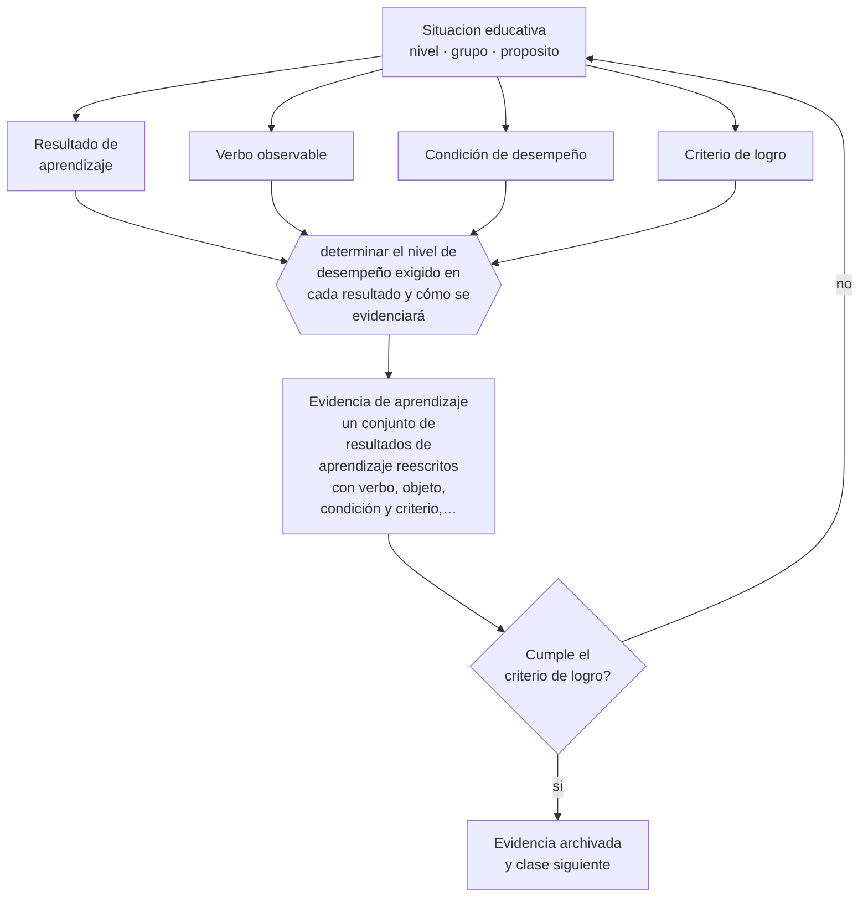

# Clase 112 — Resultados de aprendizaje

> **Parte 09 · Diseño curricular** — clase 4 de 12

**Estado de evidencia:** `CONSISTENTE` · **Etapa:** 🟣 Etapa C — Núcleo profesional docente · **Población de referencia:** diseño de asignaturas, programas y planes de estudio 
**Decisión que habilita:** determinar el nivel de desempeño exigido en cada resultado y cómo se evidenciará 
**Evidencia de aprendizaje:** un conjunto de resultados de aprendizaje reescritos con verbo, objeto, condición y criterio, revisados por pares

## 🎯 Propósito

Redactar resultados de aprendizaje verificables y graduables a nivel de asignatura o programa, con verbo observable, objeto preciso, condición y criterio de logro.

## 📚 Resultados de aprendizaje

Al finalizar esta clase podrás:

1. **Definir** con precisión los cuatro conceptos centrales de la clase y reconocerlos en una situación educativa real, no solo en su enunciado.
2. **Explicar** cómo se escribe un resultado de aprendizaje que cualquiera pueda evaluar del mismo modo.
3. **Decidir** —el nivel de desempeño exigido en cada resultado y cómo se evidenciará— y sostener la decisión con un fundamento escrito.
4. **Producir** la evidencia de la clase —un conjunto de resultados de aprendizaje reescritos con verbo, objeto, condición y criterio, revisados por pares— y contrastarla contra el criterio de logro.
5. **Distinguir** lo que la evidencia sostiene de lo que es práctica instalada, preferencia personal o costumbre de la institución.

## 🧩 Conceptos centrales

| Concepto | Comprensión verificable |
|---|---|
| **Resultado de aprendizaje** | declaración de lo que el estudiante podrá hacer al finalizar, verificable con evidencia |
| **Verbo observable** | acción que puede constatarse externamente; excluye «conocer», «comprender» y «valorar» sin más |
| **Condición de desempeño** | contexto, recursos y restricciones bajo los cuales se demuestra el resultado |
| **Criterio de logro** | nivel mínimo aceptable para considerar alcanzado el resultado |

## 🗺️ Flujo de razonamiento

## 📖 Desarrollo

### 1. El fondo del asunto

Un resultado mal redactado hace imposible la evaluación justa: si dice «comprender el ciclo del agua», cada evaluador decidirá qué cuenta como comprensión. Escribirlo con verbo observable, objeto preciso, condición y criterio convierte una intención en un compromiso verificable. No es formalismo administrativo: es lo que permite que dos docentes evalúen igual y que el estudiante sepa qué se le exige.

### 2. Cómo se traduce en decisiones de enseñanza

El procedimiento de escritura es simple y su dificultad está en sostenerlo: elegir el verbo por el desempeño real esperado, precisar el objeto, declarar la condición y fijar el criterio. La revisión por pares es indispensable, porque el autor siempre entiende lo que quiso decir. La prueba definitiva es pedir a un colega que diseñe la evaluación a partir del resultado escrito.

### 3. Qué sostiene la evidencia y qué no

Llevado al extremo, este enfoque fragmenta el aprendizaje en listas interminables de microresultados y pierde de vista la comprensión integrada. Además, no todo lo valioso se deja escribir así: hay disposiciones y sensibilidades que se cultivan y no se certifican. Reconocerlo evita convertir el currículo en un inventario.

> **Cómo leer el estado de evidencia `CONSISTENTE`.** La evidencia es amplia y coherente, pero proviene sobre todo de estudios correlacionales, de síntesis con heterogeneidad alta o de contextos distintos al tuyo. Sirve para orientar la decisión y exige que compruebes el efecto en tu propio grupo.

## 🧪 Taller guiado

Aplica la clase a **uno** de los contextos siguientes y repite después el ejercicio en un
contexto de exigencia distinta. Cambiar de contexto es parte del aprendizaje: lo que funciona
con un grupo no se traslada intacto a otro.

| Contexto | Rasgo que cambia la decisión |
|---|---|
| Asignatura escolar | el marco curricular nacional acota los objetivos |
| Módulo técnico-profesional | el perfil de egreso del oficio manda |
| Asignatura universitaria | autonomía alta y responsabilidad de coherencia con la carrera |
| Programa de capacitación breve | el resultado debe ser útil en semanas |
| Rediseño de un programa completo | hay historia, intereses y cargas docentes en juego |
| Programa en modalidad en línea | la evidencia de logro debe funcionar sin presencia |

**Secuencia de trabajo:**

1. Delimita el contexto: nivel, edad, tamaño del grupo, asignatura o experiencia y tiempo real disponible.
2. Declara qué saben ya los estudiantes y **cómo lo comprobaste**, no cómo lo supones.
3. Formula la decisión pedagógica que esta clase habilita y escribe su fundamento.
4. Anticipa qué observarías si la decisión funciona y qué observarías si no funciona.
5. Diseña de antemano la alternativa que aplicarás si la primera estrategia falla.
6. Ejecuta o simula, y registra lo observado con fecha, contexto y evidencia concreta.
7. Produce la evidencia de aprendizaje de la clase.
8. Contrástala contra el criterio de logro, corrige y recién entonces avanza.

### 📦 Evidencia de aprendizaje

Un conjunto de resultados de aprendizaje reescritos con verbo, objeto, condición y criterio, revisados por pares.

Debe incluir contexto, decisión, fundamento, fuentes consultadas con su fecha, indicador de
logro observable, riesgos previstos y qué harías distinto en la siguiente iteración.

## 🏆 Reto verificable

Reescribe los resultados de una asignatura y pide a un colega que diseñe la evaluación a partir de ellos. Corrige todo resultado que produjo una evaluación distinta de la que esperabas.

## ✅ Criterio de logro

- [ ] cada resultado declara verbo observable, objeto, condición y criterio de logro;
- [ ] un colega puede diseñar la evaluación a partir del resultado sin pedir aclaraciones;
- [ ] cada afirmación sobre «lo que funciona» está atribuida a una fuente identificable, con autor y fecha;
- [ ] la decisión es ejecutable con el tiempo, el espacio, el número de estudiantes y los recursos que realmente tienes;
- [ ] la evidencia queda archivada de forma reproducible: otra persona podría revisarla sin que tú se la expliques.

## ⚠️ Errores frecuentes

**Propios de esta clase:**

- Usar verbos no observables y descubrir el problema recién al momento de calificar.
- Fragmentar el aprendizaje en decenas de microresultados que nadie puede evaluar en el tiempo real.

**Característicos de la parte 09:**

- Redactar objetivos con verbos no observables y evaluarlos igual.
- Diseñar actividades primero y buscar después qué objetivo cubren.

## ♿ Diversidad, accesibilidad y ética

Un resultado bien escrito separa el aprendizaje de su vía de demostración, lo que habilita formatos alternativos sin bajar la exigencia. Escribir «explicar» en vez de «escribir un ensayo explicando» es una decisión de accesibilidad.

Antes de aplicar cualquier decisión de esta clase con estudiantes reales, revisa el
[protocolo de práctica responsable](../../../docs/ETICA_Y_PRACTICA_RESPONSABLE.md):
consentimiento, resguardo de datos personales, proporcionalidad de la intervención y derecho
de cada estudiante a no ser objeto de un ensayo que no le reporta beneficio.

## ❓ Preguntas de comprobación

1. ¿Podría otro docente evaluar tu resultado sin preguntarte qué quisiste decir?
2. ¿Qué condición de desempeño estás dando por supuesta?
3. ¿Cuál es el mínimo aceptable y quién lo decidió?

## 📕 Lecturas base

**Anderson, L. & Krathwohl, D. (2001). *A Taxonomy for Learning, Teaching, and Assessing*.**  
*Qué aporta a esta clase:* ordena verbos y niveles cognitivos; base para elegir el verbo por el desempeño real.

**Biggs, J. & Collis, K. (1982). *Evaluating the Quality of Learning: The SOLO Taxonomy*.**  
*Qué aporta a esta clase:* permite graduar la complejidad del desempeño y no solo su presencia.

Catálogo completo: [bibliografía del programa](../../../docs/BIBLIOGRAFIA.md) ·
[glosario](../../../docs/GLOSARIO.md) ·
[fuentes oficiales y cómo leerlas](../../../docs/FUENTES.md).

## 🔗 Conexión con el resto del programa

Es la unidad básica del diseño de las clases 116 a 119 y condiciona toda la parte 11.

> [!IMPORTANT]
> Material de formación profesional. No reemplaza un título de pedagogía, una habilitación
> legal para ejercer, ni el juicio de un equipo educativo que conoce a sus estudiantes.

---

| Anterior | Índice | Siguiente |
|---|---|---|
| [← 111 · Competencias](../class-03-competencias/README.md) | [Parte 09](../README.md) · [Programa](../../../README.md) | [113 · Objetivos de aprendizaje →](../class-05-objetivos-de-aprendizaje/README.md) |
