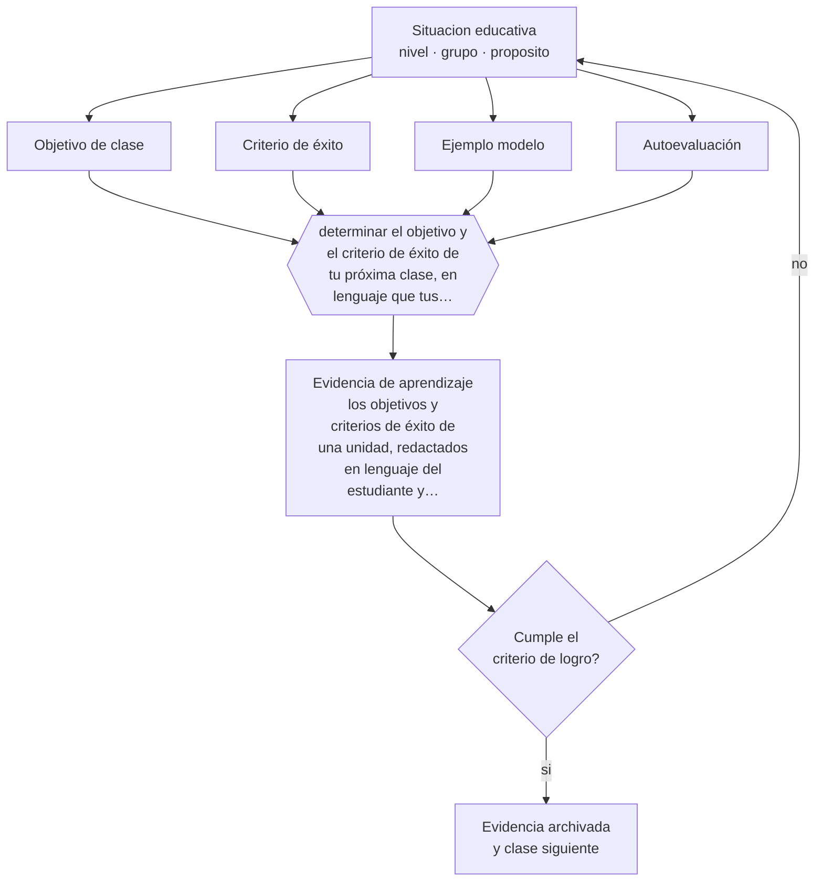

# Clase 113 — Objetivos de aprendizaje

> **Parte 09 · Diseño curricular** — clase 5 de 12

**Estado de evidencia:** `ROBUSTA` · **Etapa:** 🟣 Etapa C — Núcleo profesional docente · **Población de referencia:** diseño de asignaturas, programas y planes de estudio 
**Decisión que habilita:** determinar el objetivo y el criterio de éxito de tu próxima clase, en lenguaje que tus estudiantes usen 
**Evidencia de aprendizaje:** los objetivos y criterios de éxito de una unidad, redactados en lenguaje del estudiante y probados con ellos

## 🎯 Propósito

Formular objetivos de clase y criterios de éxito comunicables a los estudiantes, de modo que puedan autorregular su trabajo y saber cuándo lo hicieron bien.

## 📚 Resultados de aprendizaje

Al finalizar esta clase podrás:

1. **Definir** con precisión los cuatro conceptos centrales de la clase y reconocerlos en una situación educativa real, no solo en su enunciado.
2. **Explicar** por qué compartir el objetivo y el criterio de éxito con los estudiantes cambia lo que hacen en clase.
3. **Decidir** —el objetivo y el criterio de éxito de tu próxima clase, en lenguaje que tus estudiantes usen— y sostener la decisión con un fundamento escrito.
4. **Producir** la evidencia de la clase —los objetivos y criterios de éxito de una unidad, redactados en lenguaje del estudiante y probados con ellos— y contrastarla contra el criterio de logro.
5. **Distinguir** lo que la evidencia sostiene de lo que es práctica instalada, preferencia personal o costumbre de la institución.

## 🧩 Conceptos centrales

| Concepto | Comprensión verificable |
|---|---|
| **Objetivo de clase** | aprendizaje concreto perseguido en una sesión, distinto de la actividad que se realizará |
| **Criterio de éxito** | descripción de cómo se ve un trabajo logrado; permite al estudiante evaluarse |
| **Ejemplo modelo** | trabajo real que ilustra el criterio y hace visible el estándar esperado |
| **Autoevaluación** | juicio del estudiante sobre su propio trabajo a partir de criterios explícitos |

## 🗺️ Flujo de razonamiento

## 📖 Desarrollo

### 1. El fondo del asunto

Los estudiantes trabajan mejor cuando saben qué se espera y cómo se ve un buen resultado. Compartir el objetivo no basta si el criterio queda implícito: «hacer un buen resumen» no orienta a nadie. Mostrar ejemplos modelo y describir el criterio en lenguaje concreto permite que el estudiante corrija su propio trabajo antes de entregarlo, que es donde la mejora es más barata.

### 2. Cómo se traduce en decisiones de enseñanza

La formulación debe distinguir objetivo de actividad: «vamos a hacer un afiche» es una actividad; «explicar las causas de un fenómeno usando evidencia» es un objetivo. Y los criterios se prueban con los estudiantes: si al leerlos no pueden juzgar un trabajo ajeno, están mal escritos. Esa prueba toma cinco minutos y ahorra semanas de malentendidos.

### 3. Qué sostiene la evidencia y qué no

Compartir objetivos no siempre conviene al inicio: en tareas de indagación, revelar la conclusión esperada elimina el trabajo intelectual. La regla es compartir el criterio de calidad, que orienta, sin revelar la respuesta, que la sustituye. Y la evidencia sobre objetivos comunicados muestra efectos condicionados a que se usen efectivamente durante la clase.

> **Cómo leer el estado de evidencia `ROBUSTA`.** Hay evidencia convergente de varios equipos, países y diseños de investigación, incluidos estudios experimentales o cuasiexperimentales, y el efecto se sostiene al replicarlo. Puedes apoyar una decisión profesional en ella, sin olvidar que ningún efecto promedio describe a un estudiante concreto.

## 🧪 Taller guiado

Aplica la clase a **uno** de los contextos siguientes y repite después el ejercicio en un
contexto de exigencia distinta. Cambiar de contexto es parte del aprendizaje: lo que funciona
con un grupo no se traslada intacto a otro.

| Contexto | Rasgo que cambia la decisión |
|---|---|
| Asignatura escolar | el marco curricular nacional acota los objetivos |
| Módulo técnico-profesional | el perfil de egreso del oficio manda |
| Asignatura universitaria | autonomía alta y responsabilidad de coherencia con la carrera |
| Programa de capacitación breve | el resultado debe ser útil en semanas |
| Rediseño de un programa completo | hay historia, intereses y cargas docentes en juego |
| Programa en modalidad en línea | la evidencia de logro debe funcionar sin presencia |

**Secuencia de trabajo:**

1. Delimita el contexto: nivel, edad, tamaño del grupo, asignatura o experiencia y tiempo real disponible.
2. Declara qué saben ya los estudiantes y **cómo lo comprobaste**, no cómo lo supones.
3. Formula la decisión pedagógica que esta clase habilita y escribe su fundamento.
4. Anticipa qué observarías si la decisión funciona y qué observarías si no funciona.
5. Diseña de antemano la alternativa que aplicarás si la primera estrategia falla.
6. Ejecuta o simula, y registra lo observado con fecha, contexto y evidencia concreta.
7. Produce la evidencia de aprendizaje de la clase.
8. Contrástala contra el criterio de logro, corrige y recién entonces avanza.

### 📦 Evidencia de aprendizaje

Los objetivos y criterios de éxito de una unidad, redactados en lenguaje del estudiante y probados con ellos.

Debe incluir contexto, decisión, fundamento, fuentes consultadas con su fecha, indicador de
logro observable, riesgos previstos y qué harías distinto en la siguiente iteración.

## 🏆 Reto verificable

Comparte objetivo y criterio en tus clases durante dos semanas y pide autoevaluación antes de entregar. Compara la calidad de las entregas con la unidad anterior.

## ✅ Criterio de logro

- [ ] el objetivo describe aprendizaje y no actividad;
- [ ] los criterios fueron probados con estudiantes juzgando un trabajo real;
- [ ] cada afirmación sobre «lo que funciona» está atribuida a una fuente identificable, con autor y fecha;
- [ ] la decisión es ejecutable con el tiempo, el espacio, el número de estudiantes y los recursos que realmente tienes;
- [ ] la evidencia queda archivada de forma reproducible: otra persona podría revisarla sin que tú se la expliques.

## ⚠️ Errores frecuentes

**Propios de esta clase:**

- Anunciar la actividad y llamarla objetivo de aprendizaje.
- Escribir criterios en lenguaje docente que los estudiantes no pueden usar para juzgar su trabajo.

**Característicos de la parte 09:**

- Redactar objetivos con verbos no observables y evaluarlos igual.
- Diseñar actividades primero y buscar después qué objetivo cubren.

## ♿ Diversidad, accesibilidad y ética

Los criterios explícitos benefician especialmente a estudiantes cuyo entorno no les transmite los códigos implícitos del trabajo académico. Hacer visible el estándar es una medida de equidad concreta y sin costo.

Antes de aplicar cualquier decisión de esta clase con estudiantes reales, revisa el
[protocolo de práctica responsable](../../../docs/ETICA_Y_PRACTICA_RESPONSABLE.md):
consentimiento, resguardo de datos personales, proporcionalidad de la intervención y derecho
de cada estudiante a no ser objeto de un ensayo que no le reporta beneficio.

## ❓ Preguntas de comprobación

1. ¿Tus estudiantes podrían decir qué están aprendiendo hoy y no solo qué están haciendo?
2. ¿Cómo se ve un trabajo logrado en tu asignatura, en palabras concretas?
3. ¿Qué ejemplo modelo mostraste antes de pedir el trabajo?

## 📕 Lecturas base

**Wiliam, D. (2011). *Embedded Formative Assessment*.**  
*Qué aporta a esta clase:* desarrolla objetivos y criterios de éxito como técnica de aula con evidencia.

**Sadler, D. R. (1989). *Formative Assessment and the Design of Instructional Systems*.**  
*Qué aporta a esta clase:* explica por qué el estudiante necesita el criterio para poder cerrar la brecha de aprendizaje.

Catálogo completo: [bibliografía del programa](../../../docs/BIBLIOGRAFIA.md) ·
[glosario](../../../docs/GLOSARIO.md) ·
[fuentes oficiales y cómo leerlas](../../../docs/FUENTES.md).

## 🔗 Conexión con el resto del programa

Es la versión de aula de la clase 112 y sostiene las prácticas de las partes 10 y 11.

> [!IMPORTANT]
> Material de formación profesional. No reemplaza un título de pedagogía, una habilitación
> legal para ejercer, ni el juicio de un equipo educativo que conoce a sus estudiantes.

---

| Anterior | Índice | Siguiente |
|---|---|---|
| [← 112 · Resultados de aprendizaje](../class-04-resultados-de-aprendizaje/README.md) | [Parte 09](../README.md) · [Programa](../../../README.md) | [114 · Secuenciación curricular →](../class-06-secuenciacion-curricular/README.md) |
