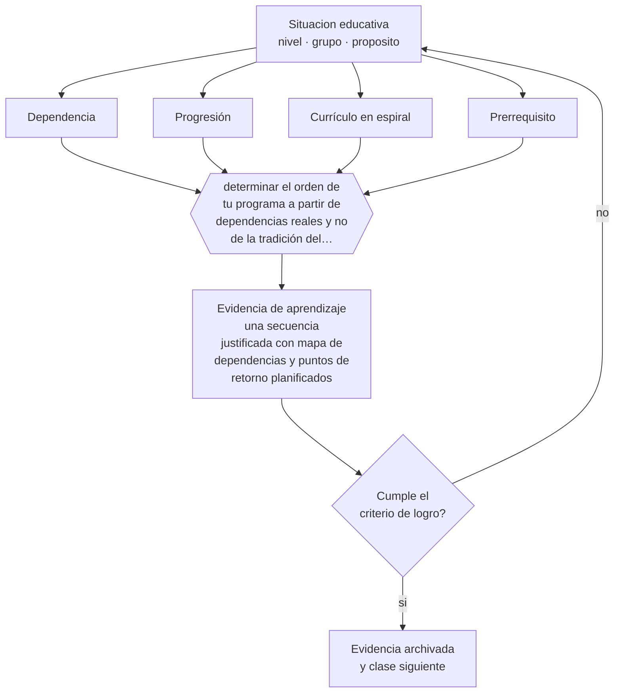

# Clase 114 — Secuenciación curricular

> **Parte 09 · Diseño curricular** — clase 6 de 12

**Estado de evidencia:** `CONSISTENTE` · **Etapa:** 🟣 Etapa C — Núcleo profesional docente · **Población de referencia:** diseño de asignaturas, programas y planes de estudio 
**Decisión que habilita:** determinar el orden de tu programa a partir de dependencias reales y no de la tradición del temario 
**Evidencia de aprendizaje:** una secuencia justificada con mapa de dependencias y puntos de retorno planificados

## 🎯 Propósito

Secuenciar aprendizajes según dependencias reales, progresión de complejidad y oportunidades de retorno, en vez de seguir el orden heredado del texto escolar.

## 📚 Resultados de aprendizaje

Al finalizar esta clase podrás:

1. **Definir** con precisión los cuatro conceptos centrales de la clase y reconocerlos en una situación educativa real, no solo en su enunciado.
2. **Explicar** por qué el orden de los contenidos no es una convención sino una decisión con consecuencias.
3. **Decidir** —el orden de tu programa a partir de dependencias reales y no de la tradición del temario— y sostener la decisión con un fundamento escrito.
4. **Producir** la evidencia de la clase —una secuencia justificada con mapa de dependencias y puntos de retorno planificados— y contrastarla contra el criterio de logro.
5. **Distinguir** lo que la evidencia sostiene de lo que es práctica instalada, preferencia personal o costumbre de la institución.

## 🧩 Conceptos centrales

| Concepto | Comprensión verificable |
|---|---|
| **Dependencia** | relación por la que un aprendizaje es condición para otro |
| **Progresión** | aumento planificado de complejidad, autonomía o abstracción en un mismo aprendizaje |
| **Currículo en espiral** | retorno planificado sobre un mismo contenido con mayor profundidad |
| **Prerrequisito** | conocimiento previo verificado que la secuencia supone en un punto determinado |

## 🗺️ Flujo de razonamiento

## 📖 Desarrollo

### 1. El fondo del asunto

Buena parte del fracaso escolar acumulativo se explica por secuencias que suponen prerrequisitos no verificados. Enseñar fracciones a quien no domina división, o argumentación a quien no distingue hecho de opinión, produce un fracaso que se atribuye al estudiante y que en realidad es de diseño. El mapa de dependencias hace visible ese riesgo antes de que ocurra.

### 2. Cómo se traduce en decisiones de enseñanza

La secuenciación exige tres decisiones: qué depende de qué, cómo aumenta la complejidad y cuándo se vuelve sobre lo importante. El retorno planificado —el currículo en espiral bien entendido— no es repetir lo mismo, sino volver con mayor profundidad y en contexto nuevo, lo que además produce práctica distribuida.

### 3. Qué sostiene la evidencia y qué no

No todas las secuencias tienen dependencias fuertes: en muchos dominios el orden es convencional y su efecto sobre el aprendizaje es menor de lo que se supone. Discutir el orden puede consumir tiempo que rendiría más en la calidad de la enseñanza de cada unidad. La secuenciación importa donde las dependencias son reales.

> **Cómo leer el estado de evidencia `CONSISTENTE`.** La evidencia es amplia y coherente, pero proviene sobre todo de estudios correlacionales, de síntesis con heterogeneidad alta o de contextos distintos al tuyo. Sirve para orientar la decisión y exige que compruebes el efecto en tu propio grupo.

## 🧪 Taller guiado

Aplica la clase a **uno** de los contextos siguientes y repite después el ejercicio en un
contexto de exigencia distinta. Cambiar de contexto es parte del aprendizaje: lo que funciona
con un grupo no se traslada intacto a otro.

| Contexto | Rasgo que cambia la decisión |
|---|---|
| Asignatura escolar | el marco curricular nacional acota los objetivos |
| Módulo técnico-profesional | el perfil de egreso del oficio manda |
| Asignatura universitaria | autonomía alta y responsabilidad de coherencia con la carrera |
| Programa de capacitación breve | el resultado debe ser útil en semanas |
| Rediseño de un programa completo | hay historia, intereses y cargas docentes en juego |
| Programa en modalidad en línea | la evidencia de logro debe funcionar sin presencia |

**Secuencia de trabajo:**

1. Delimita el contexto: nivel, edad, tamaño del grupo, asignatura o experiencia y tiempo real disponible.
2. Declara qué saben ya los estudiantes y **cómo lo comprobaste**, no cómo lo supones.
3. Formula la decisión pedagógica que esta clase habilita y escribe su fundamento.
4. Anticipa qué observarías si la decisión funciona y qué observarías si no funciona.
5. Diseña de antemano la alternativa que aplicarás si la primera estrategia falla.
6. Ejecuta o simula, y registra lo observado con fecha, contexto y evidencia concreta.
7. Produce la evidencia de aprendizaje de la clase.
8. Contrástala contra el criterio de logro, corrige y recién entonces avanza.

### 📦 Evidencia de aprendizaje

Una secuencia justificada con mapa de dependencias y puntos de retorno planificados.

Debe incluir contexto, decisión, fundamento, fuentes consultadas con su fecha, indicador de
logro observable, riesgos previstos y qué harías distinto en la siguiente iteración.

## 🏆 Reto verificable

Construye el mapa de dependencias de tu programa y verifica un prerrequisito crítico con tu curso real. Ajusta la secuencia según lo que encuentres.

## ✅ Criterio de logro

- [ ] el mapa de dependencias distingue relaciones reales de convenciones del temario;
- [ ] los puntos de retorno declaran qué se profundiza y no solo qué se repite;
- [ ] cada afirmación sobre «lo que funciona» está atribuida a una fuente identificable, con autor y fecha;
- [ ] la decisión es ejecutable con el tiempo, el espacio, el número de estudiantes y los recursos que realmente tienes;
- [ ] la evidencia queda archivada de forma reproducible: otra persona podría revisarla sin que tú se la expliques.

## ⚠️ Errores frecuentes

**Propios de esta clase:**

- Suponer prerrequisitos sin verificarlos al inicio de la unidad.
- Confundir currículo en espiral con repetición idéntica del mismo contenido.

**Característicos de la parte 09:**

- Redactar objetivos con verbos no observables y evaluarlos igual.
- Diseñar actividades primero y buscar después qué objetivo cubren.

## ♿ Diversidad, accesibilidad y ética

Verificar prerrequisitos en vez de suponerlos evita que los estudiantes con trayectorias interrumpidas acumulen fracaso invisible. Es una práctica de equidad que además mejora los resultados del grupo completo.

Antes de aplicar cualquier decisión de esta clase con estudiantes reales, revisa el
[protocolo de práctica responsable](../../../docs/ETICA_Y_PRACTICA_RESPONSABLE.md):
consentimiento, resguardo de datos personales, proporcionalidad de la intervención y derecho
de cada estudiante a no ser objeto de un ensayo que no le reporta beneficio.

## ❓ Preguntas de comprobación

1. ¿Qué prerrequisito de tu unidad no has verificado nunca?
2. ¿Qué parte de tu orden actual es tradición y no dependencia?
3. ¿Cuándo vuelven tus estudiantes sobre lo más importante, y con qué profundidad?

## 📕 Lecturas base

**Bruner, J. (1960). *The Process of Education*.**  
*Qué aporta a esta clase:* origen del currículo en espiral y de la idea de estructura de la disciplina.

**Clements, D. & Sarama, J. (2014). *Learning Trajectories*.**  
*Qué aporta a esta clase:* ejemplo detallado de secuenciación basada en evidencia sobre cómo progresa el aprendizaje.

Catálogo completo: [bibliografía del programa](../../../docs/BIBLIOGRAFIA.md) ·
[glosario](../../../docs/GLOSARIO.md) ·
[fuentes oficiales y cómo leerlas](../../../docs/FUENTES.md).

## 🔗 Conexión con el resto del programa

Se apoya en la clase 017 y alimenta las clases 115 y 119.

> [!IMPORTANT]
> Material de formación profesional. No reemplaza un título de pedagogía, una habilitación
> legal para ejercer, ni el juicio de un equipo educativo que conoce a sus estudiantes.

---

| Anterior | Índice | Siguiente |
|---|---|---|
| [← 113 · Objetivos de aprendizaje](../class-05-objetivos-de-aprendizaje/README.md) | [Parte 09](../README.md) · [Programa](../../../README.md) | [115 · Mapas curriculares →](../class-07-mapas-curriculares/README.md) |
