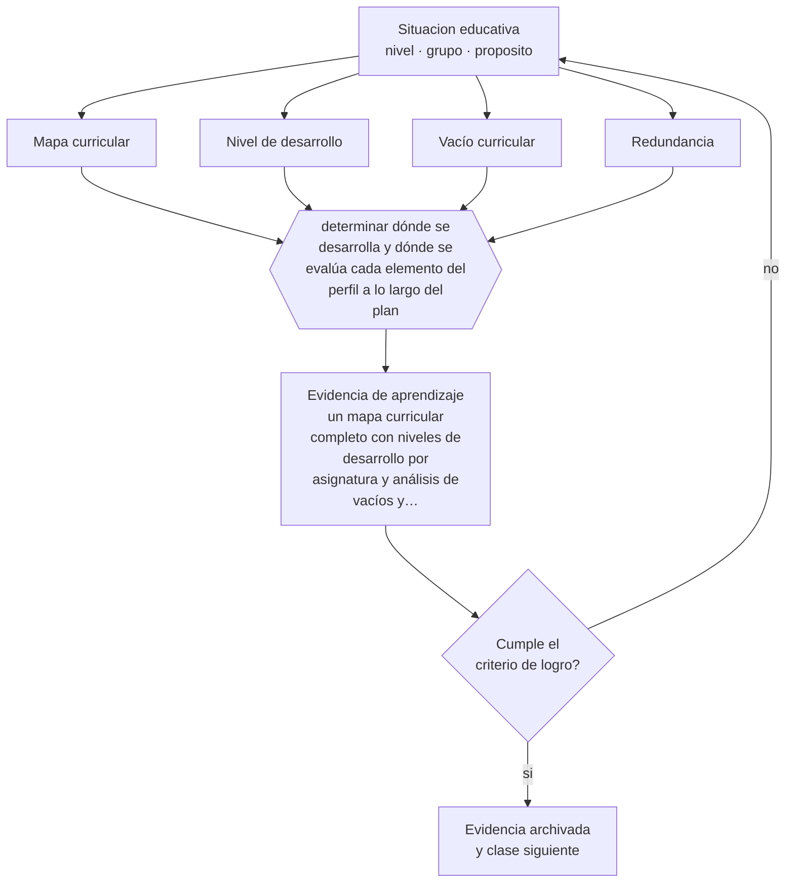

# Clase 115 — Mapas curriculares

> **Parte 09 · Diseño curricular** — clase 7 de 12

**Estado de evidencia:** `PRACTICA-PROFESIONAL` · **Etapa:** 🟣 Etapa C — Núcleo profesional docente · **Población de referencia:** diseño de asignaturas, programas y planes de estudio 
**Decisión que habilita:** determinar dónde se desarrolla y dónde se evalúa cada elemento del perfil a lo largo del plan 
**Evidencia de aprendizaje:** un mapa curricular completo con niveles de desarrollo por asignatura y análisis de vacíos y redundancias

## 🎯 Propósito

Construir mapas curriculares que muestren dónde se desarrolla, se profundiza y se evalúa cada aprendizaje del perfil, y que permitan detectar vacíos y redundancias.

## 📚 Resultados de aprendizaje

Al finalizar esta clase podrás:

1. **Definir** con precisión los cuatro conceptos centrales de la clase y reconocerlos en una situación educativa real, no solo en su enunciado.
2. **Explicar** cómo se ve un plan de estudios completo cuando se representa como trayectoria y no como lista de asignaturas.
3. **Decidir** —dónde se desarrolla y dónde se evalúa cada elemento del perfil a lo largo del plan— y sostener la decisión con un fundamento escrito.
4. **Producir** la evidencia de la clase —un mapa curricular completo con niveles de desarrollo por asignatura y análisis de vacíos y redundancias— y contrastarla contra el criterio de logro.
5. **Distinguir** lo que la evidencia sostiene de lo que es práctica instalada, preferencia personal o costumbre de la institución.

## 🧩 Conceptos centrales

| Concepto | Comprensión verificable |
|---|---|
| **Mapa curricular** | representación de la contribución de cada asignatura a los aprendizajes del perfil |
| **Nivel de desarrollo** | grado en que una asignatura introduce, desarrolla o consolida un aprendizaje |
| **Vacío curricular** | elemento del perfil que ninguna asignatura desarrolla o evalúa |
| **Redundancia** | repetición sin progresión de un mismo aprendizaje en varias asignaturas |

## 🗺️ Flujo de razonamiento

## 📖 Desarrollo

### 1. El fondo del asunto

El mapa curricular convierte un plan de estudios en información utilizable. Su valor no está en el documento sino en lo que revela: aprendizajes declarados que nadie desarrolla, contenidos repetidos cinco veces al mismo nivel, evaluaciones concentradas en el mismo semestre, competencias que se evalúan antes de haberse enseñado. Todo eso es invisible en una malla y evidente en un mapa.

### 2. Cómo se traduce en decisiones de enseñanza

Se construye consultando a los docentes reales, no leyendo programas: la pregunta es qué se enseña y se evalúa efectivamente. El resultado suele diferir de los documentos oficiales, y esa diferencia es la información más valiosa del ejercicio. Después se decide: cerrar vacíos, eliminar redundancias y redistribuir la carga de evaluación.

### 3. Qué sostiene la evidencia y qué no

El mapa refleja declaraciones de los docentes y envejece con cada cambio de equipo. No prueba que el aprendizaje ocurra: muestra dónde se intenta. Su utilidad depende de que se revise periódicamente y de que las decisiones que sugiere se tomen efectivamente; un mapa que no cambia nada es un ejercicio administrativo.

> **Cómo leer el estado de evidencia `PRACTICA-PROFESIONAL`.** Es conocimiento práctico acumulado del oficio, útil y transferible, pero no probado con diseños de investigación. Trátalo como un buen punto de partida sujeto a comprobación en tu contexto.

## 🧪 Taller guiado

Aplica la clase a **uno** de los contextos siguientes y repite después el ejercicio en un
contexto de exigencia distinta. Cambiar de contexto es parte del aprendizaje: lo que funciona
con un grupo no se traslada intacto a otro.

| Contexto | Rasgo que cambia la decisión |
|---|---|
| Asignatura escolar | el marco curricular nacional acota los objetivos |
| Módulo técnico-profesional | el perfil de egreso del oficio manda |
| Asignatura universitaria | autonomía alta y responsabilidad de coherencia con la carrera |
| Programa de capacitación breve | el resultado debe ser útil en semanas |
| Rediseño de un programa completo | hay historia, intereses y cargas docentes en juego |
| Programa en modalidad en línea | la evidencia de logro debe funcionar sin presencia |

**Secuencia de trabajo:**

1. Delimita el contexto: nivel, edad, tamaño del grupo, asignatura o experiencia y tiempo real disponible.
2. Declara qué saben ya los estudiantes y **cómo lo comprobaste**, no cómo lo supones.
3. Formula la decisión pedagógica que esta clase habilita y escribe su fundamento.
4. Anticipa qué observarías si la decisión funciona y qué observarías si no funciona.
5. Diseña de antemano la alternativa que aplicarás si la primera estrategia falla.
6. Ejecuta o simula, y registra lo observado con fecha, contexto y evidencia concreta.
7. Produce la evidencia de aprendizaje de la clase.
8. Contrástala contra el criterio de logro, corrige y recién entonces avanza.

### 📦 Evidencia de aprendizaje

Un mapa curricular completo con niveles de desarrollo por asignatura y análisis de vacíos y redundancias.

Debe incluir contexto, decisión, fundamento, fuentes consultadas con su fecha, indicador de
logro observable, riesgos previstos y qué harías distinto en la siguiente iteración.

## 🏆 Reto verificable

Levanta el mapa curricular de un programa consultando a los docentes. Presenta los vacíos al equipo y acuerden una corrección concreta.

## ✅ Criterio de logro

- [ ] el mapa distingue introducir, desarrollar y consolidar en cada cruce;
- [ ] el análisis identifica vacíos y redundancias con una decisión asociada a cada uno;
- [ ] cada afirmación sobre «lo que funciona» está atribuida a una fuente identificable, con autor y fecha;
- [ ] la decisión es ejecutable con el tiempo, el espacio, el número de estudiantes y los recursos que realmente tienes;
- [ ] la evidencia queda archivada de forma reproducible: otra persona podría revisarla sin que tú se la expliques.

## ⚠️ Errores frecuentes

**Propios de esta clase:**

- Construir el mapa a partir de programas oficiales y no de lo que se enseña realmente.
- Levantar el mapa y no tomar ninguna decisión con sus hallazgos.

**Característicos de la parte 09:**

- Redactar objetivos con verbos no observables y evaluarlos igual.
- Diseñar actividades primero y buscar después qué objetivo cubren.

## ♿ Diversidad, accesibilidad y ética

El mapa revela también dónde se concentran las exigencias que producen deserción: semestres sobrecargados, evaluaciones simultáneas, prerrequisitos mal ubicados. Corregir eso es una intervención estructural sobre la retención.

Antes de aplicar cualquier decisión de esta clase con estudiantes reales, revisa el
[protocolo de práctica responsable](../../../docs/ETICA_Y_PRACTICA_RESPONSABLE.md):
consentimiento, resguardo de datos personales, proporcionalidad de la intervención y derecho
de cada estudiante a no ser objeto de un ensayo que no le reporta beneficio.

## ❓ Preguntas de comprobación

1. ¿Qué aprendizaje del perfil no aparece en ninguna asignatura?
2. ¿Qué contenido se repite sin aumentar su complejidad?
3. ¿En qué semestre se concentran las evaluaciones y qué efecto tiene?

## 📕 Lecturas base

**Jacobs, H. H. (1997). *Mapping the Big Picture: Integrating Curriculum and Assessment*.**  
*Qué aporta a esta clase:* metodología de mapeo curricular con base en lo efectivamente enseñado.

**Comisión Nacional de Acreditación (Chile). *Criterios de evaluación de planes de estudio*.**  
*Qué aporta a esta clase:* referencia sobre coherencia interna esperada en programas formales.

Catálogo completo: [bibliografía del programa](../../../docs/BIBLIOGRAFIA.md) ·
[glosario](../../../docs/GLOSARIO.md) ·
[fuentes oficiales y cómo leerlas](../../../docs/FUENTES.md).

## 🔗 Conexión con el resto del programa

Depende de la clase 110 y ordena las decisiones de las clases 114 y 119.

> [!IMPORTANT]
> Material de formación profesional. No reemplaza un título de pedagogía, una habilitación
> legal para ejercer, ni el juicio de un equipo educativo que conoce a sus estudiantes.

---

| Anterior | Índice | Siguiente |
|---|---|---|
| [← 114 · Secuenciación curricular](../class-06-secuenciacion-curricular/README.md) | [Parte 09](../README.md) · [Programa](../../../README.md) | [116 · Backward design →](../class-08-backward-design/README.md) |
