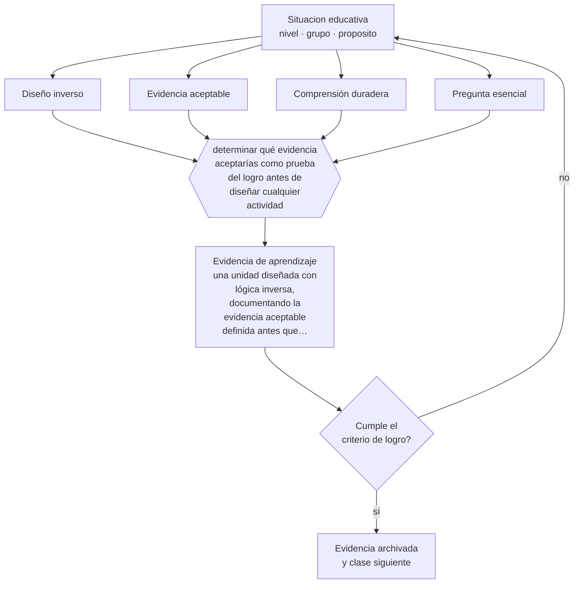

# Clase 116 — Backward design

> **Parte 09 · Diseño curricular** — clase 8 de 12

**Estado de evidencia:** `CONSISTENTE` · **Etapa:** 🟣 Etapa C — Núcleo profesional docente · **Población de referencia:** diseño de asignaturas, programas y planes de estudio 
**Decisión que habilita:** determinar qué evidencia aceptarías como prueba del logro antes de diseñar cualquier actividad 
**Evidencia de aprendizaje:** una unidad diseñada con lógica inversa, documentando la evidencia aceptable definida antes que las actividades

## 🎯 Propósito

Aplicar el diseño inverso: identificar los resultados deseados, determinar la evidencia aceptable y solo entonces planificar la enseñanza.

## 📚 Resultados de aprendizaje

Al finalizar esta clase podrás:

1. **Definir** con precisión los cuatro conceptos centrales de la clase y reconocerlos en una situación educativa real, no solo en su enunciado.
2. **Explicar** por qué definir la evaluación antes que las actividades mejora el diseño y no lo burocratiza.
3. **Decidir** —qué evidencia aceptarías como prueba del logro antes de diseñar cualquier actividad— y sostener la decisión con un fundamento escrito.
4. **Producir** la evidencia de la clase —una unidad diseñada con lógica inversa, documentando la evidencia aceptable definida antes que las actividades— y contrastarla contra el criterio de logro.
5. **Distinguir** lo que la evidencia sostiene de lo que es práctica instalada, preferencia personal o costumbre de la institución.

## 🧩 Conceptos centrales

| Concepto | Comprensión verificable |
|---|---|
| **Diseño inverso** | procedimiento que parte del resultado y de su evidencia antes de planificar actividades |
| **Evidencia aceptable** | desempeño o producto que permitiría afirmar con confianza que el aprendizaje ocurrió |
| **Comprensión duradera** | idea central que se busca que permanezca más allá del detalle del contenido |
| **Pregunta esencial** | interrogante que organiza la unidad y no se responde con una definición |

## 🗺️ Flujo de razonamiento

## 📖 Desarrollo

### 1. El fondo del asunto

La secuencia habitual —elegir actividades, enseñarlas y después construir la evaluación— produce el desalineamiento crónico entre lo declarado y lo medido. El diseño inverso lo corrige invirtiendo el orden: primero qué debe lograrse, después qué evidencia lo probaría y por último cómo enseñar para producir esa evidencia. El cambio es simple de enunciar y difícil de sostener, porque las actividades son lo más entretenido de planificar.

### 2. Cómo se traduce en decisiones de enseñanza

El paso decisivo es el segundo: escribir la evidencia aceptable antes de haber pensado en las actividades. Ese ejercicio revela objetivos imposibles de evaluar, evaluaciones que miden otra cosa y actividades favoritas que no contribuyen a nada. También ordena la conversación de equipo: se discute qué prueba el aprendizaje en vez de qué actividad gusta más.

### 3. Qué sostiene la evidencia y qué no

El diseño inverso ordena el trabajo y no garantiza calidad: una unidad perfectamente alineada puede perseguir objetivos triviales. Además, aplicado de forma rígida puede excluir aprendizajes valiosos difíciles de evidenciar. Conviene usarlo como disciplina de diseño y no como criterio único de valor.

> **Cómo leer el estado de evidencia `CONSISTENTE`.** La evidencia es amplia y coherente, pero proviene sobre todo de estudios correlacionales, de síntesis con heterogeneidad alta o de contextos distintos al tuyo. Sirve para orientar la decisión y exige que compruebes el efecto en tu propio grupo.

## 🧪 Taller guiado

Aplica la clase a **uno** de los contextos siguientes y repite después el ejercicio en un
contexto de exigencia distinta. Cambiar de contexto es parte del aprendizaje: lo que funciona
con un grupo no se traslada intacto a otro.

| Contexto | Rasgo que cambia la decisión |
|---|---|
| Asignatura escolar | el marco curricular nacional acota los objetivos |
| Módulo técnico-profesional | el perfil de egreso del oficio manda |
| Asignatura universitaria | autonomía alta y responsabilidad de coherencia con la carrera |
| Programa de capacitación breve | el resultado debe ser útil en semanas |
| Rediseño de un programa completo | hay historia, intereses y cargas docentes en juego |
| Programa en modalidad en línea | la evidencia de logro debe funcionar sin presencia |

**Secuencia de trabajo:**

1. Delimita el contexto: nivel, edad, tamaño del grupo, asignatura o experiencia y tiempo real disponible.
2. Declara qué saben ya los estudiantes y **cómo lo comprobaste**, no cómo lo supones.
3. Formula la decisión pedagógica que esta clase habilita y escribe su fundamento.
4. Anticipa qué observarías si la decisión funciona y qué observarías si no funciona.
5. Diseña de antemano la alternativa que aplicarás si la primera estrategia falla.
6. Ejecuta o simula, y registra lo observado con fecha, contexto y evidencia concreta.
7. Produce la evidencia de aprendizaje de la clase.
8. Contrástala contra el criterio de logro, corrige y recién entonces avanza.

### 📦 Evidencia de aprendizaje

Una unidad diseñada con lógica inversa, documentando la evidencia aceptable definida antes que las actividades.

Debe incluir contexto, decisión, fundamento, fuentes consultadas con su fecha, indicador de
logro observable, riesgos previstos y qué harías distinto en la siguiente iteración.

## 🏆 Reto verificable

Diseña una unidad con lógica inversa y compárala con la versión anterior de la misma unidad. Documenta qué actividades desaparecieron y por qué.

## ✅ Criterio de logro

- [ ] la evidencia aceptable está documentada con fecha anterior al diseño de actividades;
- [ ] cada actividad se justifica por su contribución a producir esa evidencia;
- [ ] cada afirmación sobre «lo que funciona» está atribuida a una fuente identificable, con autor y fecha;
- [ ] la decisión es ejecutable con el tiempo, el espacio, el número de estudiantes y los recursos que realmente tienes;
- [ ] la evidencia queda archivada de forma reproducible: otra persona podría revisarla sin que tú se la expliques.

## ⚠️ Errores frecuentes

**Propios de esta clase:**

- Diseñar las actividades primero y construir la evaluación al final de la unidad.
- Aceptar como evidencia la realización de la actividad en vez del desempeño que prueba el aprendizaje.

**Característicos de la parte 09:**

- Redactar objetivos con verbos no observables y evaluarlos igual.
- Diseñar actividades primero y buscar después qué objetivo cubren.

## ♿ Diversidad, accesibilidad y ética

Definir la evidencia antes permite decidir desde el diseño qué formatos alternativos la producirían igual de bien, en vez de improvisar adecuaciones cuando el estudiante ya está frente a la evaluación.

Antes de aplicar cualquier decisión de esta clase con estudiantes reales, revisa el
[protocolo de práctica responsable](../../../docs/ETICA_Y_PRACTICA_RESPONSABLE.md):
consentimiento, resguardo de datos personales, proporcionalidad de la intervención y derecho
de cada estudiante a no ser objeto de un ensayo que no le reporta beneficio.

## ❓ Preguntas de comprobación

1. ¿Qué evidencia te convencería de que aprendieron, y no solo de que trabajaron?
2. ¿Qué actividad favorita tuya no contribuye a ninguna evidencia?
3. ¿Qué objetivo declaraste que no sabes cómo evidenciar?

## 📕 Lecturas base

**Wiggins, G. & McTighe, J. (2005). *Understanding by Design*.**  
*Qué aporta a esta clase:* el planteamiento completo del diseño inverso con plantillas y ejemplos.

**Biggs, J. & Tang, C. (2011). *Teaching for Quality Learning at University*.**  
*Qué aporta a esta clase:* complementa el diseño inverso con la lógica del alineamiento constructivo.

Catálogo completo: [bibliografía del programa](../../../docs/BIBLIOGRAFIA.md) ·
[glosario](../../../docs/GLOSARIO.md) ·
[fuentes oficiales y cómo leerlas](../../../docs/FUENTES.md).

## 🔗 Conexión con el resto del programa

Aplica las clases 112 y 113 y es el procedimiento de trabajo de la clase 119.

> [!IMPORTANT]
> Material de formación profesional. No reemplaza un título de pedagogía, una habilitación
> legal para ejercer, ni el juicio de un equipo educativo que conoce a sus estudiantes.

---

| Anterior | Índice | Siguiente |
|---|---|---|
| [← 115 · Mapas curriculares](../class-07-mapas-curriculares/README.md) | [Parte 09](../README.md) · [Programa](../../../README.md) | [117 · Alineamiento constructivo →](../class-09-alineamiento-constructivo/README.md) |
