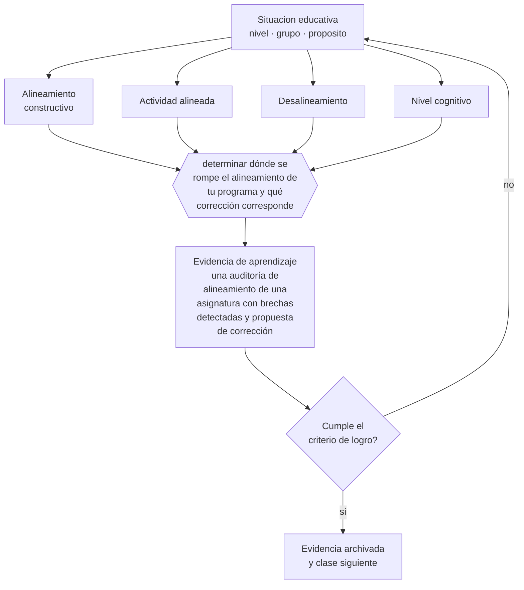

# Clase 117 — Alineamiento constructivo

> **Parte 09 · Diseño curricular** — clase 9 de 12

**Estado de evidencia:** `CONSISTENTE` · **Etapa:** 🟣 Etapa C — Núcleo profesional docente · **Población de referencia:** diseño de asignaturas, programas y planes de estudio 
**Decisión que habilita:** determinar dónde se rompe el alineamiento de tu programa y qué corrección corresponde 
**Evidencia de aprendizaje:** una auditoría de alineamiento de una asignatura con brechas detectadas y propuesta de corrección

## 🎯 Propósito

Aplicar el alineamiento constructivo como criterio de auditoría de un programa existente: verificar la correspondencia entre resultados, actividades y evaluación, y corregir donde falla.

## 📚 Resultados de aprendizaje

Al finalizar esta clase podrás:

1. **Definir** con precisión los cuatro conceptos centrales de la clase y reconocerlos en una situación educativa real, no solo en su enunciado.
2. **Explicar** cómo se audita si lo que se declara, lo que se enseña y lo que se evalúa son de verdad lo mismo.
3. **Decidir** —dónde se rompe el alineamiento de tu programa y qué corrección corresponde— y sostener la decisión con un fundamento escrito.
4. **Producir** la evidencia de la clase —una auditoría de alineamiento de una asignatura con brechas detectadas y propuesta de corrección— y contrastarla contra el criterio de logro.
5. **Distinguir** lo que la evidencia sostiene de lo que es práctica instalada, preferencia personal o costumbre de la institución.

## 🧩 Conceptos centrales

| Concepto | Comprensión verificable |
|---|---|
| **Alineamiento constructivo** | correspondencia entre resultados declarados, actividades de aprendizaje y tareas de evaluación |
| **Actividad alineada** | tarea que hace practicar exactamente el desempeño que el resultado declara |
| **Desalineamiento** | situación en que la evaluación exige un desempeño que la enseñanza no desarrolló |
| **Nivel cognitivo** | complejidad del desempeño exigido; debe coincidir entre resultado, actividad y evaluación |

## 🗺️ Flujo de razonamiento

## 📖 Desarrollo

### 1. El fondo del asunto

El desalineamiento más común es de nivel cognitivo: se declara «analizar», se enseña con exposición y se evalúa con reconocimiento. El estudiante responde a lo que se le evalúa, de modo que el resultado declarado nunca se desarrolla. La auditoría consiste en tomar cada resultado y verificar qué actividad lo practica y qué tarea lo evalúa, comparando además el nivel exigido en cada punto.

### 2. Cómo se traduce en decisiones de enseñanza

El instrumento es una tabla de tres columnas por resultado. Los vacíos aparecen de inmediato: resultados sin actividad, actividades sin resultado, evaluaciones que exigen un nivel superior al practicado. La corrección más frecuente no es cambiar la evaluación sino agregar la práctica que faltaba, porque el problema suele ser que nunca se enseñó el desempeño que se exige.

### 3. Qué sostiene la evidencia y qué no

Un programa perfectamente alineado puede seguir siendo malo si sus resultados son triviales, y el alineamiento estricto puede empujar hacia objetivos fáciles de evaluar. Además, cierta desalineación productiva existe: enseñar más de lo que se evalúa es legítimo si el propósito formativo lo justifica y se declara.

> **Cómo leer el estado de evidencia `CONSISTENTE`.** La evidencia es amplia y coherente, pero proviene sobre todo de estudios correlacionales, de síntesis con heterogeneidad alta o de contextos distintos al tuyo. Sirve para orientar la decisión y exige que compruebes el efecto en tu propio grupo.

## 🧪 Taller guiado

Aplica la clase a **uno** de los contextos siguientes y repite después el ejercicio en un
contexto de exigencia distinta. Cambiar de contexto es parte del aprendizaje: lo que funciona
con un grupo no se traslada intacto a otro.

| Contexto | Rasgo que cambia la decisión |
|---|---|
| Asignatura escolar | el marco curricular nacional acota los objetivos |
| Módulo técnico-profesional | el perfil de egreso del oficio manda |
| Asignatura universitaria | autonomía alta y responsabilidad de coherencia con la carrera |
| Programa de capacitación breve | el resultado debe ser útil en semanas |
| Rediseño de un programa completo | hay historia, intereses y cargas docentes en juego |
| Programa en modalidad en línea | la evidencia de logro debe funcionar sin presencia |

**Secuencia de trabajo:**

1. Delimita el contexto: nivel, edad, tamaño del grupo, asignatura o experiencia y tiempo real disponible.
2. Declara qué saben ya los estudiantes y **cómo lo comprobaste**, no cómo lo supones.
3. Formula la decisión pedagógica que esta clase habilita y escribe su fundamento.
4. Anticipa qué observarías si la decisión funciona y qué observarías si no funciona.
5. Diseña de antemano la alternativa que aplicarás si la primera estrategia falla.
6. Ejecuta o simula, y registra lo observado con fecha, contexto y evidencia concreta.
7. Produce la evidencia de aprendizaje de la clase.
8. Contrástala contra el criterio de logro, corrige y recién entonces avanza.

### 📦 Evidencia de aprendizaje

Una auditoría de alineamiento de una asignatura con brechas detectadas y propuesta de corrección.

Debe incluir contexto, decisión, fundamento, fuentes consultadas con su fecha, indicador de
logro observable, riesgos previstos y qué harías distinto en la siguiente iteración.

## 🏆 Reto verificable

Audita una asignatura completa con la tabla de tres columnas. Corrige la brecha más grande y verifica el efecto en la siguiente evaluación.

## ✅ Criterio de logro

- [ ] cada resultado tiene identificadas sus actividades y sus tareas de evaluación;
- [ ] las brechas de nivel cognitivo están explicitadas con su corrección;
- [ ] cada afirmación sobre «lo que funciona» está atribuida a una fuente identificable, con autor y fecha;
- [ ] la decisión es ejecutable con el tiempo, el espacio, el número de estudiantes y los recursos que realmente tienes;
- [ ] la evidencia queda archivada de forma reproducible: otra persona podría revisarla sin que tú se la expliques.

## ⚠️ Errores frecuentes

**Propios de esta clase:**

- Evaluar un nivel cognitivo superior al que la enseñanza practicó.
- Corregir el desalineamiento bajando la evaluación en vez de agregar la práctica faltante.

**Característicos de la parte 09:**

- Redactar objetivos con verbos no observables y evaluarlos igual.
- Diseñar actividades primero y buscar después qué objetivo cubren.

## ♿ Diversidad, accesibilidad y ética

El desalineamiento perjudica más a los estudiantes sin apoyo externo: quienes tienen quien les explique en casa compensan lo que la clase no enseñó, y quienes no lo tienen, no. Alinear es una medida de equidad tanto como de calidad.

Antes de aplicar cualquier decisión de esta clase con estudiantes reales, revisa el
[protocolo de práctica responsable](../../../docs/ETICA_Y_PRACTICA_RESPONSABLE.md):
consentimiento, resguardo de datos personales, proporcionalidad de la intervención y derecho
de cada estudiante a no ser objeto de un ensayo que no le reporta beneficio.

## ❓ Preguntas de comprobación

1. ¿Qué desempeño exiges en la prueba que nunca practicaron en clase?
2. ¿Qué actividad tuya no contribuye a ningún resultado declarado?
3. ¿Qué resultado se evalúa a un nivel más bajo del que declaraste?

## 📕 Lecturas base

**Biggs, J. (1996). *Enhancing Teaching through Constructive Alignment*. Higher Education, 32.**  
*Qué aporta a esta clase:* el artículo que formula el concepto y su procedimiento de aplicación.

**Anderson, L. & Krathwohl, D. (2001). *A Taxonomy for Learning, Teaching, and Assessing*.**  
*Qué aporta a esta clase:* permite comparar niveles cognitivos entre resultado, actividad y evaluación.

Catálogo completo: [bibliografía del programa](../../../docs/BIBLIOGRAFIA.md) ·
[glosario](../../../docs/GLOSARIO.md) ·
[fuentes oficiales y cómo leerlas](../../../docs/FUENTES.md).

## 🔗 Conexión con el resto del programa

Es el criterio de calidad de toda la parte 09 y el instrumento de auditoría de la clase 120.

> [!IMPORTANT]
> Material de formación profesional. No reemplaza un título de pedagogía, una habilitación
> legal para ejercer, ni el juicio de un equipo educativo que conoce a sus estudiantes.

---

| Anterior | Índice | Siguiente |
|---|---|---|
| [← 116 · Backward design](../class-08-backward-design/README.md) | [Parte 09](../README.md) · [Programa](../../../README.md) | [118 · Diseño de syllabus →](../class-10-diseno-de-syllabus/README.md) |
