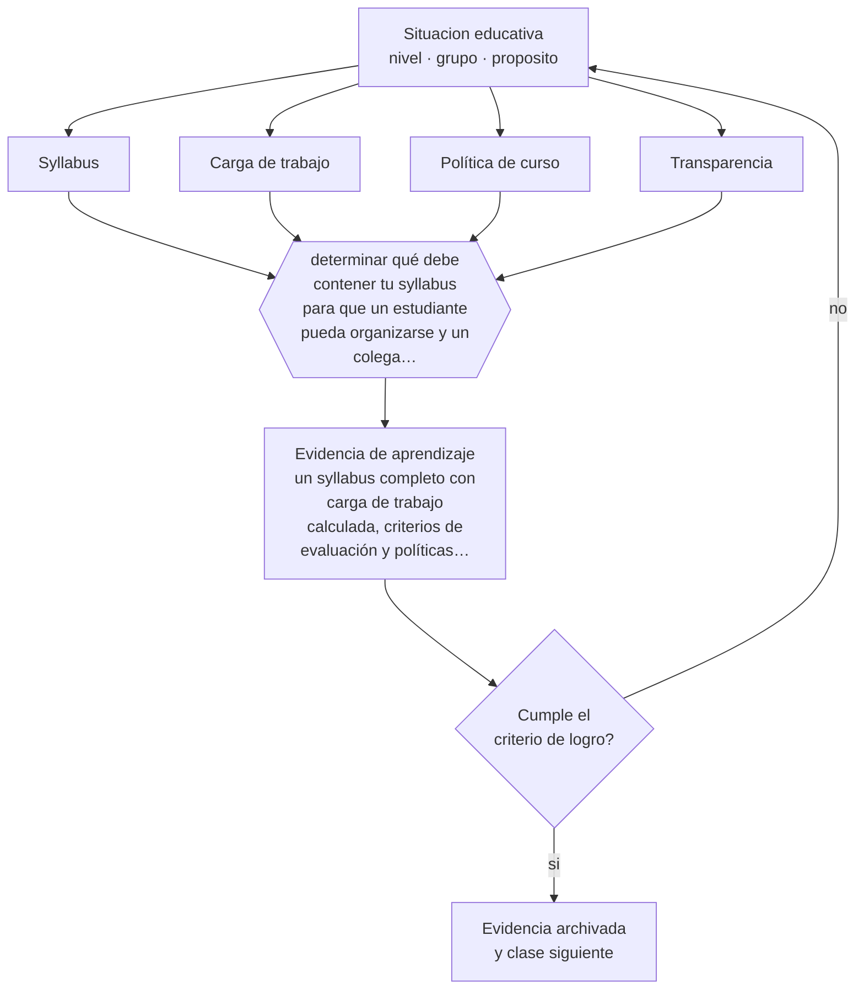

# Clase 118 — Diseño de syllabus

> **Parte 09 · Diseño curricular** — clase 10 de 12

**Estado de evidencia:** `PRACTICA-PROFESIONAL` · **Etapa:** 🟣 Etapa C — Núcleo profesional docente · **Población de referencia:** diseño de asignaturas, programas y planes de estudio 
**Decisión que habilita:** determinar qué debe contener tu syllabus para que un estudiante pueda organizarse y un colega pueda dictar el curso 
**Evidencia de aprendizaje:** un syllabus completo con carga de trabajo calculada, criterios de evaluación y políticas explícitas

## 🎯 Propósito

Diseñar syllabus completos y utilizables: resultados, secuencia, evaluación con ponderaciones, criterios, carga de trabajo estimada, políticas y recursos.

## 📚 Resultados de aprendizaje

Al finalizar esta clase podrás:

1. **Definir** con precisión los cuatro conceptos centrales de la clase y reconocerlos en una situación educativa real, no solo en su enunciado.
2. **Explicar** por qué el syllabus es un contrato académico y no una lista de contenidos con fechas.
3. **Decidir** —qué debe contener tu syllabus para que un estudiante pueda organizarse y un colega pueda dictar el curso— y sostener la decisión con un fundamento escrito.
4. **Producir** la evidencia de la clase —un syllabus completo con carga de trabajo calculada, criterios de evaluación y políticas explícitas— y contrastarla contra el criterio de logro.
5. **Distinguir** lo que la evidencia sostiene de lo que es práctica instalada, preferencia personal o costumbre de la institución.

## 🧩 Conceptos centrales

| Concepto | Comprensión verificable |
|---|---|
| **Syllabus** | documento que define el acuerdo académico de una asignatura y su plan de trabajo |
| **Carga de trabajo** | tiempo total estimado del estudiante, dentro y fuera de la sesión |
| **Política de curso** | reglas explícitas sobre entregas, atrasos, integridad académica y uso de herramientas |
| **Transparencia** | condición de que el estudiante pueda anticipar qué se le exigirá y cómo se calificará |

## 🗺️ Flujo de razonamiento

## 📖 Desarrollo

### 1. El fondo del asunto

Un buen syllabus responde por adelantado las preguntas que después generan conflicto: qué se evalúa, con qué peso, con qué criterios, qué pasa si se entrega tarde, qué uso de herramientas se permite. Escribir eso antes evita discusiones caso a caso y protege tanto al estudiante como al docente. Y el cálculo de carga de trabajo, casi siempre omitido, es lo que distingue un plan realista de uno imposible.

### 2. Cómo se traduce en decisiones de enseñanza

Estimar la carga significa contar todo: lectura, preparación, trabajos, estudio para evaluaciones. Cuando se hace, muchos cursos resultan exigir el doble de tiempo del que declaran, lo que explica entregas de baja calidad y abandono. Ajustar el diseño a la carga real es una decisión profesional, no una concesión.

### 3. Qué sostiene la evidencia y qué no

El syllabus no sustituye la comunicación durante el curso ni congela decisiones: los ajustes son legítimos si se comunican y se justifican. Y un documento extenso que nadie lee cumple una función defensiva y no comunicativa; conviene priorizar lo que el estudiante necesita para decidir y organizarse.

> **Cómo leer el estado de evidencia `PRACTICA-PROFESIONAL`.** Es conocimiento práctico acumulado del oficio, útil y transferible, pero no probado con diseños de investigación. Trátalo como un buen punto de partida sujeto a comprobación en tu contexto.

## 🧪 Taller guiado

Aplica la clase a **uno** de los contextos siguientes y repite después el ejercicio en un
contexto de exigencia distinta. Cambiar de contexto es parte del aprendizaje: lo que funciona
con un grupo no se traslada intacto a otro.

| Contexto | Rasgo que cambia la decisión |
|---|---|
| Asignatura escolar | el marco curricular nacional acota los objetivos |
| Módulo técnico-profesional | el perfil de egreso del oficio manda |
| Asignatura universitaria | autonomía alta y responsabilidad de coherencia con la carrera |
| Programa de capacitación breve | el resultado debe ser útil en semanas |
| Rediseño de un programa completo | hay historia, intereses y cargas docentes en juego |
| Programa en modalidad en línea | la evidencia de logro debe funcionar sin presencia |

**Secuencia de trabajo:**

1. Delimita el contexto: nivel, edad, tamaño del grupo, asignatura o experiencia y tiempo real disponible.
2. Declara qué saben ya los estudiantes y **cómo lo comprobaste**, no cómo lo supones.
3. Formula la decisión pedagógica que esta clase habilita y escribe su fundamento.
4. Anticipa qué observarías si la decisión funciona y qué observarías si no funciona.
5. Diseña de antemano la alternativa que aplicarás si la primera estrategia falla.
6. Ejecuta o simula, y registra lo observado con fecha, contexto y evidencia concreta.
7. Produce la evidencia de aprendizaje de la clase.
8. Contrástala contra el criterio de logro, corrige y recién entonces avanza.

### 📦 Evidencia de aprendizaje

Un syllabus completo con carga de trabajo calculada, criterios de evaluación y políticas explícitas.

Debe incluir contexto, decisión, fundamento, fuentes consultadas con su fecha, indicador de
logro observable, riesgos previstos y qué harías distinto en la siguiente iteración.

## 🏆 Reto verificable

Calcula la carga real de tu asignatura y compárala con la declarada. Ajusta el diseño y comunica el cambio a tus estudiantes.

## ✅ Criterio de logro

- [ ] el syllabus declara carga estimada, criterios de evaluación y políticas explícitas;
- [ ] otro docente podría dictar el curso a partir del documento;
- [ ] cada afirmación sobre «lo que funciona» está atribuida a una fuente identificable, con autor y fecha;
- [ ] la decisión es ejecutable con el tiempo, el espacio, el número de estudiantes y los recursos que realmente tienes;
- [ ] la evidencia queda archivada de forma reproducible: otra persona podría revisarla sin que tú se la expliques.

## ⚠️ Errores frecuentes

**Propios de esta clase:**

- Publicar el syllabus sin haber calculado la carga real de trabajo del estudiante.
- Dejar implícitas las políticas de atraso, integridad y uso de herramientas hasta que ocurre el problema.

**Característicos de la parte 09:**

- Redactar objetivos con verbos no observables y evaluarlos igual.
- Diseñar actividades primero y buscar después qué objetivo cubren.

## ♿ Diversidad, accesibilidad y ética

La transparencia del syllabus beneficia a quienes no conocen los códigos implícitos de la institución. Estudiantes de primera generación, migrantes o trabajadores dependen de que las reglas estén escritas y no supuestas.

Antes de aplicar cualquier decisión de esta clase con estudiantes reales, revisa el
[protocolo de práctica responsable](../../../docs/ETICA_Y_PRACTICA_RESPONSABLE.md):
consentimiento, resguardo de datos personales, proporcionalidad de la intervención y derecho
de cada estudiante a no ser objeto de un ensayo que no le reporta beneficio.

## ❓ Preguntas de comprobación

1. ¿Cuántas horas por semana exige realmente tu curso?
2. ¿Qué regla tuya no está escrita y se aplica igualmente?
3. ¿Qué parte del syllabus leen tus estudiantes y cuál no lee nadie?

## 📕 Lecturas base

**Biggs, J. & Tang, C. (2011). *Teaching for Quality Learning at University*.**  
*Qué aporta a esta clase:* modelo de syllabus alineado con resultados y evaluación.

**Sistema de créditos transferibles (SCT-Chile) y marcos de créditos internacionales.**  
*Qué aporta a esta clase:* base para estimar carga de trabajo del estudiante en horas reales.

Catálogo completo: [bibliografía del programa](../../../docs/BIBLIOGRAFIA.md) ·
[glosario](../../../docs/GLOSARIO.md) ·
[fuentes oficiales y cómo leerlas](../../../docs/FUENTES.md).

## 🔗 Conexión con el resto del programa

Integra las clases 112 a 117 y se aplica directamente en la parte 14.

> [!IMPORTANT]
> Material de formación profesional. No reemplaza un título de pedagogía, una habilitación
> legal para ejercer, ni el juicio de un equipo educativo que conoce a sus estudiantes.

---

| Anterior | Índice | Siguiente |
|---|---|---|
| [← 117 · Alineamiento constructivo](../class-09-alineamiento-constructivo/README.md) | [Parte 09](../README.md) · [Programa](../../../README.md) | [119 · Planificación anual y por unidad →](../class-11-planificacion-anual-y-por-unidad/README.md) |
