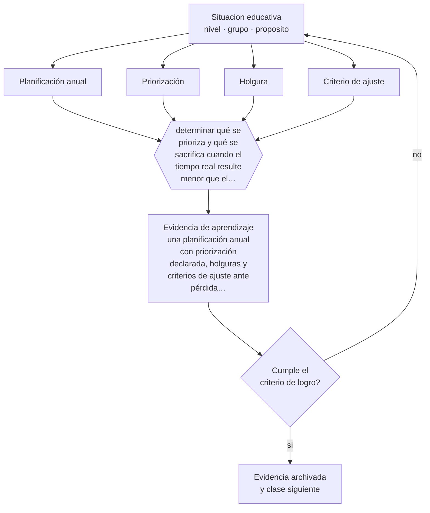

# Clase 119 — Planificación anual y por unidad

> **Parte 09 · Diseño curricular** — clase 11 de 12

**Estado de evidencia:** `PRACTICA-PROFESIONAL` · **Etapa:** 🟣 Etapa C — Núcleo profesional docente · **Población de referencia:** diseño de asignaturas, programas y planes de estudio 
**Decisión que habilita:** determinar qué se prioriza y qué se sacrifica cuando el tiempo real resulte menor que el planificado 
**Evidencia de aprendizaje:** una planificación anual con priorización declarada, holguras y criterios de ajuste ante pérdida de tiempo

## 🎯 Propósito

Planificar a nivel anual y de unidad con priorización explícita, holguras y criterios de ajuste, en vez de calendarios que se abandonan en abril.

## 📚 Resultados de aprendizaje

Al finalizar esta clase podrás:

1. **Definir** con precisión los cuatro conceptos centrales de la clase y reconocerlos en una situación educativa real, no solo en su enunciado.
2. **Explicar** cómo se planifica un año completo sabiendo que ningún año se ejecuta como se planifica.
3. **Decidir** —qué se prioriza y qué se sacrifica cuando el tiempo real resulte menor que el planificado— y sostener la decisión con un fundamento escrito.
4. **Producir** la evidencia de la clase —una planificación anual con priorización declarada, holguras y criterios de ajuste ante pérdida de tiempo— y contrastarla contra el criterio de logro.
5. **Distinguir** lo que la evidencia sostiene de lo que es práctica instalada, preferencia personal o costumbre de la institución.

## 🧩 Conceptos centrales

| Concepto | Comprensión verificable |
|---|---|
| **Planificación anual** | distribución de aprendizajes y evaluaciones a lo largo del año o del semestre |
| **Priorización** | decisión explícita sobre qué aprendizajes son irrenunciables y cuáles admiten recorte |
| **Holgura** | tiempo no asignado que absorbe interrupciones sin destruir la planificación |
| **Criterio de ajuste** | regla decidida de antemano sobre qué se recorta cuando falta tiempo |

## 🗺️ Flujo de razonamiento

## 📖 Desarrollo

### 1. El fondo del asunto

Toda planificación anual se enfrenta al mismo hecho: el año real tiene menos horas que el nominal. Interrupciones, actos, evaluaciones institucionales, ausencias y contingencias consumen una fracción significativa. Planificar sin holgura obliga a recortar en marcha, y ese recorte improvisado suele eliminar lo último del programa, que muchas veces es lo más importante.

### 2. Cómo se traduce en decisiones de enseñanza

La solución profesional es decidir antes: qué aprendizajes son irrenunciables, cuáles se profundizan si hay tiempo y cuáles se recortan primero. Declarado por escrito, el ajuste deja de ser una pérdida y pasa a ser una decisión. La holgura planificada —entre un diez y un quince por ciento del tiempo— convierte lo imprevisto en algo absorbible.

### 3. Qué sostiene la evidencia y qué no

La priorización tiene costos: recortar es renunciar a aprendizajes que alguien consideró importantes. Y en sistemas con evaluaciones externas, la decisión local está condicionada por lo que se medirá. Hacer explícito ese condicionamiento permite discutirlo en vez de sufrirlo como inevitable.

> **Cómo leer el estado de evidencia `PRACTICA-PROFESIONAL`.** Es conocimiento práctico acumulado del oficio, útil y transferible, pero no probado con diseños de investigación. Trátalo como un buen punto de partida sujeto a comprobación en tu contexto.

## 🧪 Taller guiado

Aplica la clase a **uno** de los contextos siguientes y repite después el ejercicio en un
contexto de exigencia distinta. Cambiar de contexto es parte del aprendizaje: lo que funciona
con un grupo no se traslada intacto a otro.

| Contexto | Rasgo que cambia la decisión |
|---|---|
| Asignatura escolar | el marco curricular nacional acota los objetivos |
| Módulo técnico-profesional | el perfil de egreso del oficio manda |
| Asignatura universitaria | autonomía alta y responsabilidad de coherencia con la carrera |
| Programa de capacitación breve | el resultado debe ser útil en semanas |
| Rediseño de un programa completo | hay historia, intereses y cargas docentes en juego |
| Programa en modalidad en línea | la evidencia de logro debe funcionar sin presencia |

**Secuencia de trabajo:**

1. Delimita el contexto: nivel, edad, tamaño del grupo, asignatura o experiencia y tiempo real disponible.
2. Declara qué saben ya los estudiantes y **cómo lo comprobaste**, no cómo lo supones.
3. Formula la decisión pedagógica que esta clase habilita y escribe su fundamento.
4. Anticipa qué observarías si la decisión funciona y qué observarías si no funciona.
5. Diseña de antemano la alternativa que aplicarás si la primera estrategia falla.
6. Ejecuta o simula, y registra lo observado con fecha, contexto y evidencia concreta.
7. Produce la evidencia de aprendizaje de la clase.
8. Contrástala contra el criterio de logro, corrige y recién entonces avanza.

### 📦 Evidencia de aprendizaje

Una planificación anual con priorización declarada, holguras y criterios de ajuste ante pérdida de tiempo.

Debe incluir contexto, decisión, fundamento, fuentes consultadas con su fecha, indicador de
logro observable, riesgos previstos y qué harías distinto en la siguiente iteración.

## 🏆 Reto verificable

Planifica un semestre con holgura y criterios de ajuste. Al terminar, compara lo ejecutado con lo planificado y evalúa si tu priorización funcionó.

## ✅ Criterio de logro

- [ ] la planificación declara aprendizajes irrenunciables y orden de recorte;
- [ ] incluye holgura explícita y un criterio de ajuste decidido de antemano;
- [ ] cada afirmación sobre «lo que funciona» está atribuida a una fuente identificable, con autor y fecha;
- [ ] la decisión es ejecutable con el tiempo, el espacio, el número de estudiantes y los recursos que realmente tienes;
- [ ] la evidencia queda archivada de forma reproducible: otra persona podría revisarla sin que tú se la expliques.

## ⚠️ Errores frecuentes

**Propios de esta clase:**

- Planificar sobre el tiempo nominal y recortar improvisadamente en noviembre.
- Dejar la priorización implícita, con lo que se sacrifica siempre lo que viene al final del programa.

**Característicos de la parte 09:**

- Redactar objetivos con verbos no observables y evaluarlos igual.
- Diseñar actividades primero y buscar después qué objetivo cubren.

## ♿ Diversidad, accesibilidad y ética

Los recortes improvisados suelen eliminar el tiempo de apoyo y de retroalimentación, que es lo que más necesitan los estudiantes con mayores dificultades. Priorizar de antemano protege ese tiempo.

Antes de aplicar cualquier decisión de esta clase con estudiantes reales, revisa el
[protocolo de práctica responsable](../../../docs/ETICA_Y_PRACTICA_RESPONSABLE.md):
consentimiento, resguardo de datos personales, proporcionalidad de la intervención y derecho
de cada estudiante a no ser objeto de un ensayo que no le reporta beneficio.

## ❓ Preguntas de comprobación

1. ¿Cuántas horas efectivas tendrá realmente tu año?
2. ¿Qué recortarías primero si pierdes tres semanas, y por qué eso?
3. ¿Qué aprendizaje irrenunciable quedó al final de tu planificación?

## 📕 Lecturas base

**Mineduc. *Priorización curricular y orientaciones de planificación*.**  
*Qué aporta a esta clase:* referencia chilena sobre criterios de priorización de aprendizajes.

**Wiggins, G. & McTighe, J. (2005). *Understanding by Design*.**  
*Qué aporta a esta clase:* aporta el criterio de distinguir lo esencial de lo deseable y de lo familiar.

Catálogo completo: [bibliografía del programa](../../../docs/BIBLIOGRAFIA.md) ·
[glosario](../../../docs/GLOSARIO.md) ·
[fuentes oficiales y cómo leerlas](../../../docs/FUENTES.md).

## 🔗 Conexión con el resto del programa

Aplica las clases 114 y 116 y se articula con la clase 057 en el nivel escolar.

> [!IMPORTANT]
> Material de formación profesional. No reemplaza un título de pedagogía, una habilitación
> legal para ejercer, ni el juicio de un equipo educativo que conoce a sus estudiantes.

---

| Anterior | Índice | Siguiente |
|---|---|---|
| [← 118 · Diseño de syllabus](../class-10-diseno-de-syllabus/README.md) | [Parte 09](../README.md) · [Programa](../../../README.md) | [120 · Proyecto integrador: currículo completo →](../class-12-proyecto-integrador-curriculo-completo/README.md) |
