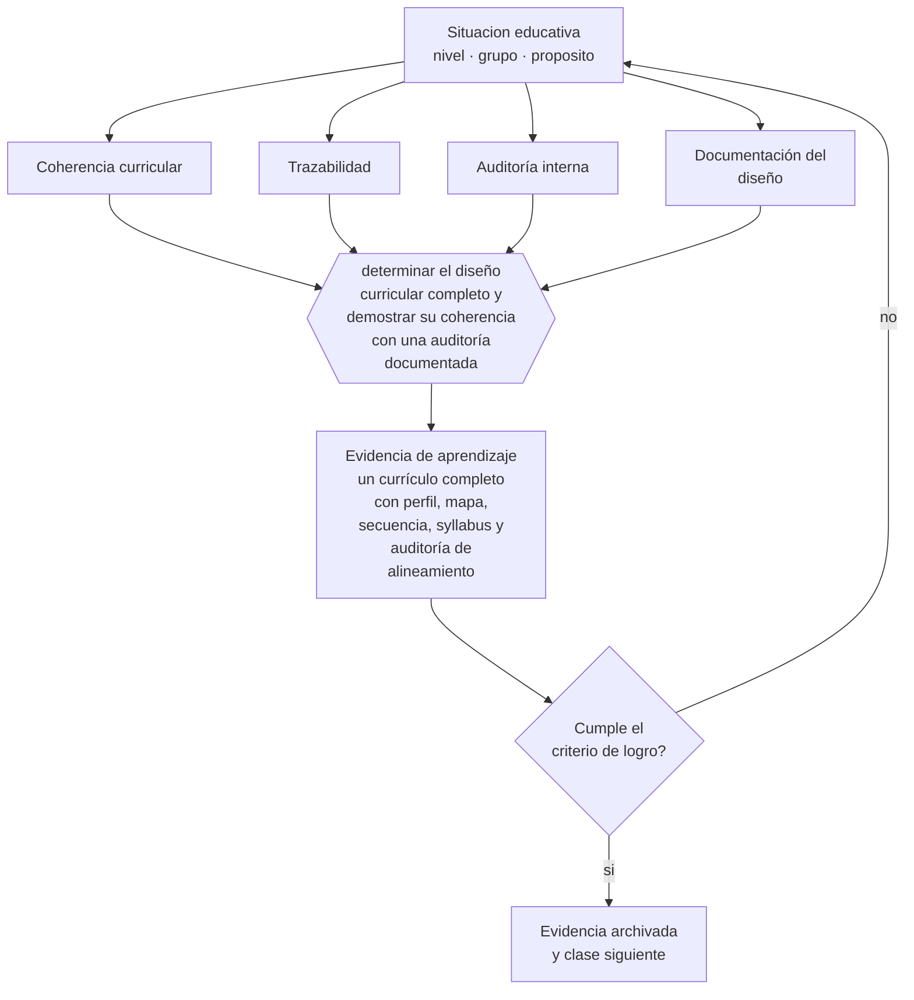

# Clase 120 — Proyecto integrador: currículo completo

> **Parte 09 · Diseño curricular** — clase 12 de 12

**Estado de evidencia:** `CONSISTENTE` · **Etapa:** 🟣 Etapa C — Núcleo profesional docente · **Población de referencia:** diseño de asignaturas, programas y planes de estudio 
**Decisión que habilita:** determinar el diseño curricular completo y demostrar su coherencia con una auditoría documentada 
**Evidencia de aprendizaje:** un currículo completo con perfil, mapa, secuencia, syllabus y auditoría de alineamiento

## 🎯 Propósito

Integrar la parte diseñando un currículo completo —perfil, resultados, mapa, secuencia, syllabus y planificación— y auditando su coherencia interna con instrumentos explícitos.

## 📚 Resultados de aprendizaje

Al finalizar esta clase podrás:

1. **Definir** con precisión los cuatro conceptos centrales de la clase y reconocerlos en una situación educativa real, no solo en su enunciado.
2. **Explicar** cómo se construye un currículo completo cuya coherencia cualquiera pueda verificar.
3. **Decidir** —el diseño curricular completo y demostrar su coherencia con una auditoría documentada— y sostener la decisión con un fundamento escrito.
4. **Producir** la evidencia de la clase —un currículo completo con perfil, mapa, secuencia, syllabus y auditoría de alineamiento— y contrastarla contra el criterio de logro.
5. **Distinguir** lo que la evidencia sostiene de lo que es práctica instalada, preferencia personal o costumbre de la institución.

## 🧩 Conceptos centrales

| Concepto | Comprensión verificable |
|---|---|
| **Coherencia curricular** | correspondencia verificable entre todos los niveles del diseño |
| **Trazabilidad** | posibilidad de seguir un aprendizaje del perfil hasta su evaluación concreta |
| **Auditoría interna** | revisión sistemática de la coherencia realizada por el propio equipo |
| **Documentación del diseño** | registro que permite a otros entender y sostener las decisiones tomadas |

## 🗺️ Flujo de razonamiento

## 📖 Desarrollo

### 1. El fondo del asunto

El proyecto integrador exige demostrar coherencia, no declararla. La prueba es la trazabilidad: tomar un elemento del perfil y seguirlo hasta la tarea concreta que lo evalúa, pasando por el mapa, la secuencia y el syllabus. Casi ningún programa real resiste ese recorrido completo la primera vez, y encontrar dónde se rompe es el aprendizaje central de la parte.

### 2. Cómo se traduce en decisiones de enseñanza

El trabajo se organiza en capas y se audita al final con la tabla de alineamiento. Documentar las decisiones —por qué esta secuencia, por qué esta evaluación, qué se priorizó y qué se dejó fuera— es lo que permite que el currículo sobreviva al cambio de equipo, que es la principal causa de pérdida de coherencia con el tiempo.

### 3. Qué sostiene la evidencia y qué no

Un currículo coherente no garantiza aprendizaje: la implementación, la calidad de la enseñanza y las condiciones institucionales deciden el resultado. El diseño elimina un conjunto de fallas evitables; el resto depende de lo que ocurra en la sala, que es materia de las partes 10 y 12.

> **Cómo leer el estado de evidencia `CONSISTENTE`.** La evidencia es amplia y coherente, pero proviene sobre todo de estudios correlacionales, de síntesis con heterogeneidad alta o de contextos distintos al tuyo. Sirve para orientar la decisión y exige que compruebes el efecto en tu propio grupo.

## 🧪 Taller guiado

Aplica la clase a **uno** de los contextos siguientes y repite después el ejercicio en un
contexto de exigencia distinta. Cambiar de contexto es parte del aprendizaje: lo que funciona
con un grupo no se traslada intacto a otro.

| Contexto | Rasgo que cambia la decisión |
|---|---|
| Asignatura escolar | el marco curricular nacional acota los objetivos |
| Módulo técnico-profesional | el perfil de egreso del oficio manda |
| Asignatura universitaria | autonomía alta y responsabilidad de coherencia con la carrera |
| Programa de capacitación breve | el resultado debe ser útil en semanas |
| Rediseño de un programa completo | hay historia, intereses y cargas docentes en juego |
| Programa en modalidad en línea | la evidencia de logro debe funcionar sin presencia |

**Secuencia de trabajo:**

1. Delimita el contexto: nivel, edad, tamaño del grupo, asignatura o experiencia y tiempo real disponible.
2. Declara qué saben ya los estudiantes y **cómo lo comprobaste**, no cómo lo supones.
3. Formula la decisión pedagógica que esta clase habilita y escribe su fundamento.
4. Anticipa qué observarías si la decisión funciona y qué observarías si no funciona.
5. Diseña de antemano la alternativa que aplicarás si la primera estrategia falla.
6. Ejecuta o simula, y registra lo observado con fecha, contexto y evidencia concreta.
7. Produce la evidencia de aprendizaje de la clase.
8. Contrástala contra el criterio de logro, corrige y recién entonces avanza.

### 📦 Evidencia de aprendizaje

Un currículo completo con perfil, mapa, secuencia, syllabus y auditoría de alineamiento.

Debe incluir contexto, decisión, fundamento, fuentes consultadas con su fecha, indicador de
logro observable, riesgos previstos y qué harías distinto en la siguiente iteración.

## 🏆 Reto verificable

Audita tu currículo completo con un colega externo al programa. Documenta las tres rupturas más graves y corrige al menos una.

## ✅ Criterio de logro

- [ ] la trazabilidad de al menos tres elementos del perfil está documentada de principio a fin;
- [ ] la auditoría identifica las rupturas de coherencia y su corrección;
- [ ] cada afirmación sobre «lo que funciona» está atribuida a una fuente identificable, con autor y fecha;
- [ ] la decisión es ejecutable con el tiempo, el espacio, el número de estudiantes y los recursos que realmente tienes;
- [ ] la evidencia queda archivada de forma reproducible: otra persona podría revisarla sin que tú se la expliques.

## ⚠️ Errores frecuentes

**Propios de esta clase:**

- Declarar coherencia sin haber recorrido la trazabilidad de al menos un elemento completo.
- Documentar el producto final y no las decisiones que lo produjeron.

**Característicos de la parte 09:**

- Redactar objetivos con verbos no observables y evaluarlos igual.
- Diseñar actividades primero y buscar después qué objetivo cubren.

## ♿ Diversidad, accesibilidad y ética

Un currículo trazable permite a cualquier estudiante saber qué se le exigirá y cuándo, y a la institución detectar dónde se produce la exclusión: qué asignatura filtra, qué evaluación deja fuera y a quiénes.

Antes de aplicar cualquier decisión de esta clase con estudiantes reales, revisa el
[protocolo de práctica responsable](../../../docs/ETICA_Y_PRACTICA_RESPONSABLE.md):
consentimiento, resguardo de datos personales, proporcionalidad de la intervención y derecho
de cada estudiante a no ser objeto de un ensayo que no le reporta beneficio.

## ❓ Preguntas de comprobación

1. ¿Dónde se rompe la trazabilidad de tu currículo?
2. ¿Qué decisión de diseño no podrías explicar dentro de un año?
3. ¿Qué sobreviviría de tu currículo si cambiara todo el equipo?

## 📕 Lecturas base

**Biggs, J. & Tang, C. (2011). *Teaching for Quality Learning at University*.**  
*Qué aporta a esta clase:* marco integral para diseñar y auditar coherencia curricular.

**Jacobs, H. H. (1997). *Mapping the Big Picture*.**  
*Qué aporta a esta clase:* metodología de mapeo que sostiene la verificación de coherencia.

Catálogo completo: [bibliografía del programa](../../../docs/BIBLIOGRAFIA.md) ·
[glosario](../../../docs/GLOSARIO.md) ·
[fuentes oficiales y cómo leerlas](../../../docs/FUENTES.md).

## 🔗 Conexión con el resto del programa

Cierra la parte 09 integrando sus once clases previas. Es el insumo directo de las partes 10, 11 y 14.

> [!IMPORTANT]
> Material de formación profesional. No reemplaza un título de pedagogía, una habilitación
> legal para ejercer, ni el juicio de un equipo educativo que conoce a sus estudiantes.

---

| Anterior | Índice | Siguiente |
|---|---|---|
| [← 119 · Planificación anual y por unidad](../class-11-planificacion-anual-y-por-unidad/README.md) | [Parte 09](../README.md) · [Programa](../../../README.md) | [Programa completo →](../../../README.md) |
