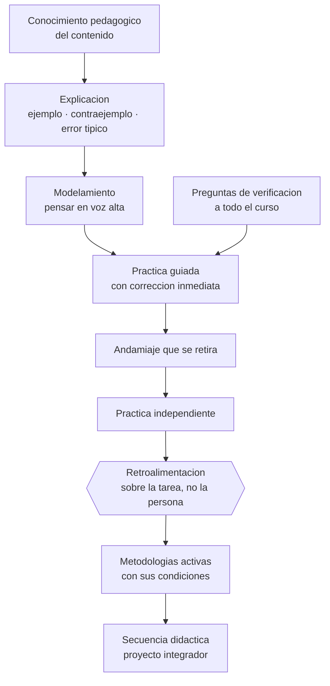

# Parte 10 — Didáctica avanzada

> *Explicar bien es una técnica que se entrena, no un don que se tiene*

🟣 **Etapa C — Núcleo profesional docente** · salida de la etapa: diseñar, enseñar, evaluar y gestionar un curso completo con evidencia

**Clases:** 12 (121–132) · **Población de referencia:** transversal a niveles y disciplinas · **Conceptos operacionales:** 48 · **Señales observables:** 36 
**Contenido central:** Conocimiento pedagógico del contenido, explicaciones, ejemplos y contraejemplos, preguntas, diálogo, modelamiento, andamiaje, práctica guiada e independiente, aprendizaje colaborativo, aula invertida y aprendizaje para el dominio

## 🎯 De qué trata esta parte

El corazón de esta parte es el conocimiento pedagógico del contenido: ese saber que no es la disciplina ni la pedagogía general, sino la manera en que un contenido específico se vuelve enseñable —qué analogía funciona, qué error aparece siempre, en qué orden conviene presentarlo—. Es lo que distingue a un experto en la materia de un buen profesor de esa materia, y se construye con años y con registro sistemático de lo que ocurre en clase.

Sobre esa base se entrenan técnicas con respaldo empírico: explicación con ejemplos trabajados, secuencia de modelamiento a práctica independiente, preguntas que verifican comprensión de todo el curso y no solo de quien levanta la mano, y retroalimentación que corrige el trabajo en vez de calificar a la persona. Los principios de instrucción derivados de la investigación sobre docentes eficaces son la columna vertebral, y se aplican tal como fueron formulados: como principios, no como guion.

La parte cierra con las metodologías que suelen adoptarse por moda —aula invertida, colaborativo, dominio— y las somete a la misma exigencia. Todas tienen condiciones de funcionamiento: el aula invertida fracasa si el material previo no se estudia; el trabajo colaborativo sin interdependencia y responsabilidad individual se convierte en trabajo de uno; el aprendizaje para el dominio exige tiempo variable, y quien no lo concede solo cambió el nombre de lo que ya hacía.

## 🏫 Caso de la parte

Las doce clases trabajan sobre la misma realidad, para que puedas ver cómo cambia tu diagnóstico
a medida que avanzas:

> Un docente con dominio disciplinar sólido explica con claridad y su curso obtiene malos resultados. Al revisar, se ve que nadie practica con corrección durante la clase: la práctica se envía siempre como tarea.

**Artefacto que produces al terminar:** secuencia didáctica completa con modelamiento, práctica guiada y verificación de comprensión, ejecutada y registrada.

## 📚 Resultados de la parte

Al terminar esta parte podrás:

1. **Construir explicaciones con ejemplos, contraejemplos y anticipación del error frecuente**.
2. **Ejecutar una secuencia completa de modelamiento, práctica guiada y práctica independiente**.
3. **Formular preguntas que verifiquen comprensión del curso completo**.
4. **Implementar una metodología activa cumpliendo sus condiciones de funcionamiento**.

## 🗺️ Mapa de la parte

## 🧠 Marco de referencia

- conocimiento pedagógico del contenido y su desarrollo profesional
- principios de instrucción derivados de la investigación sobre docentes eficaces
- andamiaje, modelamiento y transferencia gradual de responsabilidad
- condiciones de eficacia del aprendizaje colaborativo y del aula invertida

**Autoras y autores que conviene conocer:** Lee Shulman, Barak Rosenshine, Michelene Chi, Robin Alexander, David y Roger Johnson, Robert Slavin, Benjamin Bloom, Doug Lemov con sus críticos

## 📋 Las 12 clases

| # | Clase | Decisión que habilita | Evidencia |
|---:|---|---|---|
| 121 | [Conocimiento pedagógico del contenido](class-01-conocimiento-pedagogico-del-contenido/README.md) | determinar qué representación, analogía o secuencia hace enseñable el contenido que dominas | `CONSISTENTE` |
| 122 | [Explicaciones efectivas](class-02-explicaciones-efectivas/README.md) | determinar cómo estructurar la explicación de un contenido difícil para que resista la primera verificación | `ROBUSTA` |
| 123 | [Ejemplos y contraejemplos](class-03-ejemplos-y-contraejemplos/README.md) | determinar qué contraejemplo hace visible el límite del concepto que enseñas | `ROBUSTA` |
| 124 | [Preguntas de alto nivel](class-04-preguntas-de-alto-nivel/README.md) | determinar qué preguntas harás y cómo asegurarás respuesta de todos y no solo de algunos | `CONSISTENTE` |
| 125 | [Diálogo socrático](class-05-dialogo-socratico/README.md) | determinar cómo estructurar la discusión para que produzca comprensión y no solo participación | `PRACTICA-PROFESIONAL` |
| 126 | [Modelamiento y think-aloud](class-06-modelamiento-y-think-aloud/README.md) | determinar qué parte del proceso experto debes hacer visible para que tus estudiantes puedan imitarlo | `ROBUSTA` |
| 127 | [Scaffolding](class-07-scaffolding/README.md) | determinar el criterio que activará el retiro de cada apoyo que ofreces | `ROBUSTA` |
| 128 | [Práctica guiada e independiente](class-08-practica-guiada-e-independiente/README.md) | determinar cuándo tu grupo está listo para practicar sin corrección inmediata | `ROBUSTA` |
| 129 | [Aprendizaje colaborativo](class-09-aprendizaje-colaborativo/README.md) | determinar qué condición de la colaboración falta en tu diseño de trabajo grupal | `ROBUSTA` |
| 130 | [Flipped classroom](class-10-flipped-classroom/README.md) | determinar qué mecanismo asegurará que el material previo se estudie antes de la sesión | `EN-DEBATE` |
| 131 | [Mastery learning](class-11-mastery-learning/README.md) | determinar qué harás con quienes no alcanzan el criterio, dentro de las restricciones reales de tu calendario | `CONSISTENTE` |
| 132 | [Proyecto integrador: secuencia didáctica](class-12-proyecto-integrador-secuencia-didactica/README.md) | determinar la secuencia completa de decisiones didácticas y su justificación técnica | `ROBUSTA` |

## ⚠️ Riesgos característicos

- Adoptar una metodología sin verificar si se cumplen sus condiciones de eficacia.
- Explicar sin anticipar el error que el contenido produce siempre.
- Preguntar solo a quien responde y confundir eso con comprensión del curso.
- Retirar el andamiaje demasiado pronto o no retirarlo nunca.

## 📕 Lecturas de referencia de la parte

- **Shulman, L. (1986). *Those Who Understand: Knowledge Growth in Teaching*. Educational Researcher, 15(2).** — el artículo que instala el conocimiento pedagógico del contenido como categoría propia del oficio.
- **Rosenshine, B. (2012). *Principles of Instruction*.** — la síntesis operativa más útil de la didáctica basada en evidencia; cabe en diez principios y se aplica mañana.
- **Chi, M. & Wylie, R. (2014). *The ICAP Framework*. Educational Psychologist, 49(4).** — ordena la participación del estudiante en cuatro modos y predice cuál produce más aprendizaje.
- **Johnson, D. & Johnson, R. (2009). *An Educational Psychology Success Story: Social Interdependence Theory and Cooperative Learning*.** — define las condiciones sin las cuales el trabajo en grupo no es aprendizaje cooperativo.

## ✅ Evidencia mínima para dar la parte por cerrada

- [ ] una explicación diseñada con ejemplos, contraejemplos y errores anticipados;
- [ ] el registro de una secuencia completa de modelamiento a práctica independiente;
- [ ] un repertorio propio de preguntas de verificación por nivel cognitivo;
- [ ] una secuencia didáctica completa aplicada y revisada con evidencia.

## 🧭 Práctica y evaluación de la parte

- [Rúbrica maestra e instrumentos de autoevaluación](../../assessments/README.md)
- [Casos profesionales para resolver con este marco](../../cases/README.md)
- [Laboratorios de decisión](../../labs/README.md)
- [Dónde se archiva la evidencia](../../evidence/README.md)

---

| Anterior | Índice | Siguiente |
|---|---|---|
| [← Parte 09 · Diseño curricular](../part-09-diseno-curricular/README.md) | [Programa](../../README.md) · [Currículo](../../CURRICULUM.md) | [Parte 11 · Evaluación y psicometría →](../part-11-evaluacion-y-psicometria/README.md) |
