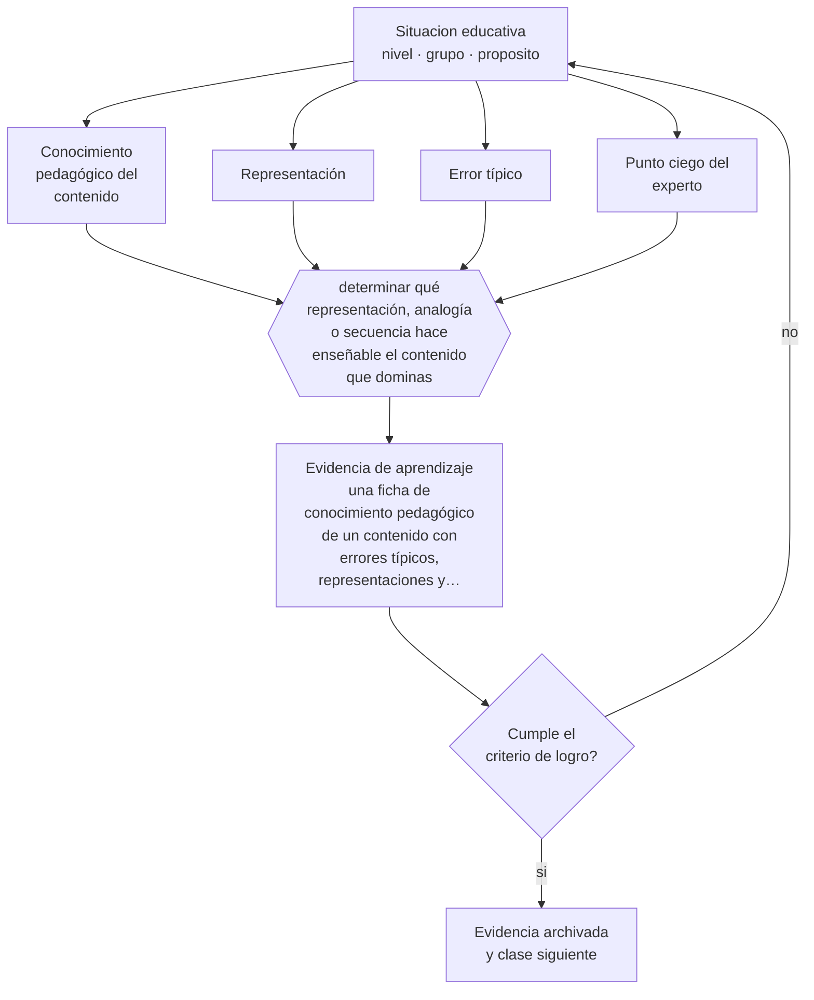

# Clase 121 — Conocimiento pedagógico del contenido

> **Parte 10 · Didáctica avanzada** — clase 1 de 12

**Estado de evidencia:** `CONSISTENTE` · **Etapa:** 🟣 Etapa C — Núcleo profesional docente · **Población de referencia:** transversal a niveles y disciplinas 
**Decisión que habilita:** determinar qué representación, analogía o secuencia hace enseñable el contenido que dominas 
**Evidencia de aprendizaje:** una ficha de conocimiento pedagógico de un contenido con errores típicos, representaciones y secuencia recomendada

## 🎯 Propósito

Desarrollar conocimiento pedagógico del contenido: el saber sobre cómo un contenido específico se vuelve enseñable, qué errores produce siempre y en qué orden conviene presentarlo.

## 📚 Resultados de aprendizaje

Al finalizar esta clase podrás:

1. **Definir** con precisión los cuatro conceptos centrales de la clase y reconocerlos en una situación educativa real, no solo en su enunciado.
2. **Explicar** qué sabe un buen profesor de matemática que no sabe un buen matemático.
3. **Decidir** —qué representación, analogía o secuencia hace enseñable el contenido que dominas— y sostener la decisión con un fundamento escrito.
4. **Producir** la evidencia de la clase —una ficha de conocimiento pedagógico de un contenido con errores típicos, representaciones y secuencia recomendada— y contrastarla contra el criterio de logro.
5. **Distinguir** lo que la evidencia sostiene de lo que es práctica instalada, preferencia personal o costumbre de la institución.

## 🧩 Conceptos centrales

| Concepto | Comprensión verificable |
|---|---|
| **Conocimiento pedagógico del contenido** | saber sobre cómo enseñar un contenido específico, distinto del contenido y de la pedagogía general |
| **Representación** | forma de presentar una idea —analogía, modelo, ejemplo, diagrama— que la hace accesible |
| **Error típico** | equivocación que el contenido produce de forma sistemática en quienes lo aprenden |
| **Punto ciego del experto** | dificultad del especialista para ver qué pasos necesita quien no sabe |

## 🗺️ Flujo de razonamiento

## 📖 Desarrollo

### 1. El fondo del asunto

Dominar una disciplina no basta para enseñarla, y en parte estorba: el experto tiene su conocimiento tan automatizado que olvida los pasos intermedios. El conocimiento pedagógico del contenido es el saber específico que llena ese vacío: qué analogía funciona para este concepto, qué error aparece siempre, qué ejemplo hace visible la distinción, en qué orden conviene presentar los casos.

### 2. Cómo se traduce en decisiones de enseñanza

Este conocimiento se construye con registro sistemático. Después de cada clase, anotar qué error apareció, qué explicación funcionó y cuál no, qué pregunta reveló la confusión. En tres años eso produce un repertorio propio que ninguna formación entrega. Compartirlo entre colegas de la misma asignatura multiplica su valor y es la forma más eficiente de desarrollo profesional disponible.

### 3. Qué sostiene la evidencia y qué no

Es conocimiento específico de contenido: no se transfiere entre asignaturas ni entre niveles. Un docente excelente en un tema puede ser novato en otro del mismo curso. Y su construcción es lenta: no hay atajo formativo que sustituya la experiencia registrada y analizada.

> **Cómo leer el estado de evidencia `CONSISTENTE`.** La evidencia es amplia y coherente, pero proviene sobre todo de estudios correlacionales, de síntesis con heterogeneidad alta o de contextos distintos al tuyo. Sirve para orientar la decisión y exige que compruebes el efecto en tu propio grupo.

## 🧪 Taller guiado

Aplica la clase a **uno** de los contextos siguientes y repite después el ejercicio en un
contexto de exigencia distinta. Cambiar de contexto es parte del aprendizaje: lo que funciona
con un grupo no se traslada intacto a otro.

| Contexto | Rasgo que cambia la decisión |
|---|---|
| Contenido conceptual abstracto | los ejemplos y contraejemplos hacen el trabajo pesado |
| Contenido procedimental | el modelamiento y la corrección inmediata dominan |
| Curso numeroso | verificar comprensión de todos exige técnica, no buena voluntad |
| Clase con conocimiento previo desigual | el andamiaje debe ser diferenciado |
| Modalidad en línea sincrónica | la verificación de comprensión debe rediseñarse |
| Sesión única de capacitación | no hay segunda oportunidad para corregir la secuencia |

**Secuencia de trabajo:**

1. Delimita el contexto: nivel, edad, tamaño del grupo, asignatura o experiencia y tiempo real disponible.
2. Declara qué saben ya los estudiantes y **cómo lo comprobaste**, no cómo lo supones.
3. Formula la decisión pedagógica que esta clase habilita y escribe su fundamento.
4. Anticipa qué observarías si la decisión funciona y qué observarías si no funciona.
5. Diseña de antemano la alternativa que aplicarás si la primera estrategia falla.
6. Ejecuta o simula, y registra lo observado con fecha, contexto y evidencia concreta.
7. Produce la evidencia de aprendizaje de la clase.
8. Contrástala contra el criterio de logro, corrige y recién entonces avanza.

### 📦 Evidencia de aprendizaje

Una ficha de conocimiento pedagógico de un contenido con errores típicos, representaciones y secuencia recomendada.

Debe incluir contexto, decisión, fundamento, fuentes consultadas con su fecha, indicador de
logro observable, riesgos previstos y qué harías distinto en la siguiente iteración.

## 🏆 Reto verificable

Registra durante una unidad los errores de tus estudiantes en un contenido específico. Construye la ficha y compártela con un colega de la misma asignatura.

## ✅ Criterio de logro

- [ ] la ficha documenta errores típicos observados y no supuestos;
- [ ] incluye al menos dos representaciones alternativas del mismo contenido;
- [ ] cada afirmación sobre «lo que funciona» está atribuida a una fuente identificable, con autor y fecha;
- [ ] la decisión es ejecutable con el tiempo, el espacio, el número de estudiantes y los recursos que realmente tienes;
- [ ] la evidencia queda archivada de forma reproducible: otra persona podría revisarla sin que tú se la expliques.

## ⚠️ Errores frecuentes

**Propios de esta clase:**

- Explicar desde la lógica del experto, saltando los pasos que el novato necesita.
- No registrar los errores típicos y volver a sorprenderse con los mismos cada año.

**Característicos de la parte 10:**

- Adoptar una metodología sin verificar si se cumplen sus condiciones de eficacia.
- Explicar sin anticipar el error que el contenido produce siempre.

## ♿ Diversidad, accesibilidad y ética

Conocer los errores típicos permite anticiparlos y prevenirlos, lo que beneficia sobre todo a estudiantes que no tienen quién los corrija fuera de la escuela y que, sin esa anticipación, consolidan el error durante meses.

Antes de aplicar cualquier decisión de esta clase con estudiantes reales, revisa el
[protocolo de práctica responsable](../../../docs/ETICA_Y_PRACTICA_RESPONSABLE.md):
consentimiento, resguardo de datos personales, proporcionalidad de la intervención y derecho
de cada estudiante a no ser objeto de un ensayo que no le reporta beneficio.

## ❓ Preguntas de comprobación

1. ¿Qué error comete tu curso todos los años en este contenido?
2. ¿Qué paso te saltas porque para ti es obvio?
3. ¿Qué representación te ha funcionado mejor y por qué?

## 📕 Lecturas base

**Shulman, L. (1986). *Those Who Understand: Knowledge Growth in Teaching*.**  
*Qué aporta a esta clase:* el artículo fundacional del conocimiento pedagógico del contenido.

**Ball, D., Thames, M. & Phelps, G. (2008). *Content Knowledge for Teaching: What Makes It Special?***  
*Qué aporta a esta clase:* desarrolla el concepto con precisión y con evidencia en el caso de la matemática escolar.

Catálogo completo: [bibliografía del programa](../../../docs/BIBLIOGRAFIA.md) ·
[glosario](../../../docs/GLOSARIO.md) ·
[fuentes oficiales y cómo leerlas](../../../docs/FUENTES.md).

## 🔗 Conexión con el resto del programa

Abre la parte 10 y sostiene las clases 122 y 123. Se apoya en la clase 015 sobre concepciones previas.

> [!IMPORTANT]
> Material de formación profesional. No reemplaza un título de pedagogía, una habilitación
> legal para ejercer, ni el juicio de un equipo educativo que conoce a sus estudiantes.

---

| Anterior | Índice | Siguiente |
|---|---|---|
| [← Parte 10](../README.md) | [Parte 10](../README.md) · [Programa](../../../README.md) | [122 · Explicaciones efectivas →](../class-02-explicaciones-efectivas/README.md) |
