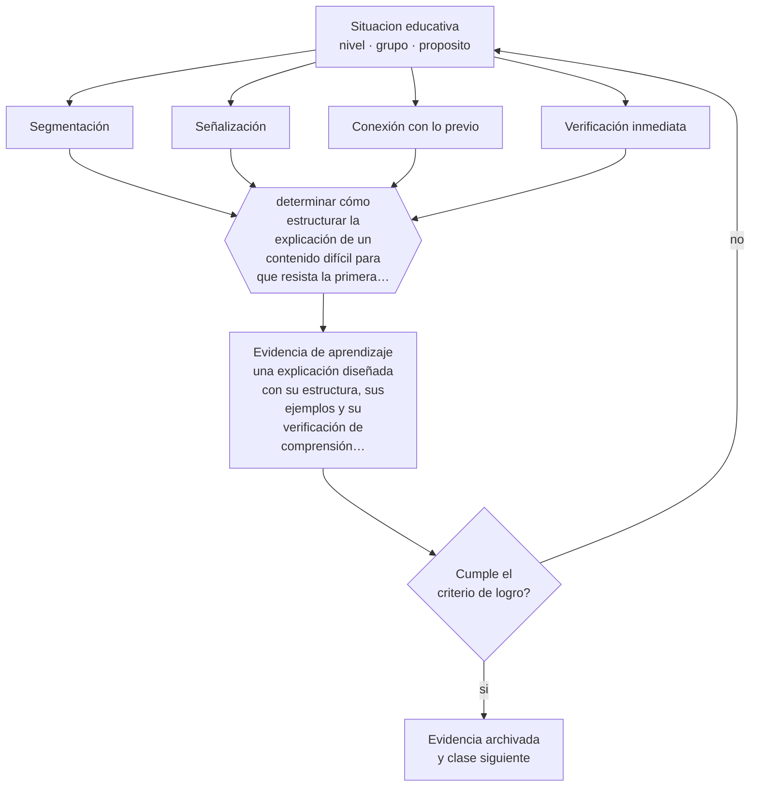

# Clase 122 — Explicaciones efectivas

> **Parte 10 · Didáctica avanzada** — clase 2 de 12

**Estado de evidencia:** `ROBUSTA` · **Etapa:** 🟣 Etapa C — Núcleo profesional docente · **Población de referencia:** transversal a niveles y disciplinas 
**Decisión que habilita:** determinar cómo estructurar la explicación de un contenido difícil para que resista la primera verificación 
**Evidencia de aprendizaje:** una explicación diseñada con su estructura, sus ejemplos y su verificación de comprensión inmediata

## 🎯 Propósito

Construir explicaciones efectivas: propósito explícito, conexión con lo conocido, segmentación, ejemplos, señalización de lo importante y verificación de comprensión.

## 📚 Resultados de aprendizaje

Al finalizar esta clase podrás:

1. **Definir** con precisión los cuatro conceptos centrales de la clase y reconocerlos en una situación educativa real, no solo en su enunciado.
2. **Explicar** qué distingue una explicación que se entiende de una que solo suena clara.
3. **Decidir** —cómo estructurar la explicación de un contenido difícil para que resista la primera verificación— y sostener la decisión con un fundamento escrito.
4. **Producir** la evidencia de la clase —una explicación diseñada con su estructura, sus ejemplos y su verificación de comprensión inmediata— y contrastarla contra el criterio de logro.
5. **Distinguir** lo que la evidencia sostiene de lo que es práctica instalada, preferencia personal o costumbre de la institución.

## 🧩 Conceptos centrales

| Concepto | Comprensión verificable |
|---|---|
| **Segmentación** | división de la explicación en partes con pausas de procesamiento entre ellas |
| **Señalización** | marcado explícito de lo importante para dirigir la atención del estudiante |
| **Conexión con lo previo** | anclaje del contenido nuevo en conocimiento que el estudiante ya posee |
| **Verificación inmediata** | comprobación de comprensión antes de avanzar, sobre todo el curso y no sobre algunos |

## 🗺️ Flujo de razonamiento

## 📖 Desarrollo

### 1. El fondo del asunto

La claridad de una explicación no la juzga quien la da: la juzga quien la recibe. Las explicaciones que funcionan comparten rasgos verificables: parten de algo conocido, avanzan en segmentos con pausas, marcan explícitamente lo importante, usan ejemplos concretos antes de la formulación general y comprueban comprensión antes de seguir. Todo eso se puede diseñar; no depende de carisma.

### 2. Cómo se traduce en decisiones de enseñanza

El diseño concreto consiste en escribir la explicación antes de darla: qué se dice primero, dónde va el ejemplo, dónde se detiene, qué pregunta verifica. Parece excesivo y deja de serlo cuando se comprueba cuántas explicaciones improvisadas fallan en el mismo punto todos los años. La verificación inmediata es la parte que más rinde y la que más se omite.

### 3. Qué sostiene la evidencia y qué no

Una explicación excelente no basta para aprender: sin práctica posterior, el contenido se olvida. Y hay contenidos donde la explicación previa es contraproducente porque elimina el problema que el estudiante debía enfrentar. La decisión sobre cuándo explicar y cuándo dejar explorar depende del conocimiento previo del grupo.

> **Cómo leer el estado de evidencia `ROBUSTA`.** Hay evidencia convergente de varios equipos, países y diseños de investigación, incluidos estudios experimentales o cuasiexperimentales, y el efecto se sostiene al replicarlo. Puedes apoyar una decisión profesional en ella, sin olvidar que ningún efecto promedio describe a un estudiante concreto.

## 🧪 Taller guiado

Aplica la clase a **uno** de los contextos siguientes y repite después el ejercicio en un
contexto de exigencia distinta. Cambiar de contexto es parte del aprendizaje: lo que funciona
con un grupo no se traslada intacto a otro.

| Contexto | Rasgo que cambia la decisión |
|---|---|
| Contenido conceptual abstracto | los ejemplos y contraejemplos hacen el trabajo pesado |
| Contenido procedimental | el modelamiento y la corrección inmediata dominan |
| Curso numeroso | verificar comprensión de todos exige técnica, no buena voluntad |
| Clase con conocimiento previo desigual | el andamiaje debe ser diferenciado |
| Modalidad en línea sincrónica | la verificación de comprensión debe rediseñarse |
| Sesión única de capacitación | no hay segunda oportunidad para corregir la secuencia |

**Secuencia de trabajo:**

1. Delimita el contexto: nivel, edad, tamaño del grupo, asignatura o experiencia y tiempo real disponible.
2. Declara qué saben ya los estudiantes y **cómo lo comprobaste**, no cómo lo supones.
3. Formula la decisión pedagógica que esta clase habilita y escribe su fundamento.
4. Anticipa qué observarías si la decisión funciona y qué observarías si no funciona.
5. Diseña de antemano la alternativa que aplicarás si la primera estrategia falla.
6. Ejecuta o simula, y registra lo observado con fecha, contexto y evidencia concreta.
7. Produce la evidencia de aprendizaje de la clase.
8. Contrástala contra el criterio de logro, corrige y recién entonces avanza.

### 📦 Evidencia de aprendizaje

Una explicación diseñada con su estructura, sus ejemplos y su verificación de comprensión inmediata.

Debe incluir contexto, decisión, fundamento, fuentes consultadas con su fecha, indicador de
logro observable, riesgos previstos y qué harías distinto en la siguiente iteración.

## 🏆 Reto verificable

Escribe la explicación de un contenido difícil antes de darla. Aplícala con verificación intermedia y compara los resultados con el año anterior.

## ✅ Criterio de logro

- [ ] la explicación está segmentada con verificación intermedia diseñada;
- [ ] conecta explícitamente con conocimiento previo comprobado del grupo;
- [ ] cada afirmación sobre «lo que funciona» está atribuida a una fuente identificable, con autor y fecha;
- [ ] la decisión es ejecutable con el tiempo, el espacio, el número de estudiantes y los recursos que realmente tienes;
- [ ] la evidencia queda archivada de forma reproducible: otra persona podría revisarla sin que tú se la expliques.

## ⚠️ Errores frecuentes

**Propios de esta clase:**

- Explicar más despacio y con más palabras cuando el problema es de estructura, no de velocidad.
- Preguntar «¿se entendió?» y tomar el silencio como comprensión.

**Característicos de la parte 10:**

- Adoptar una metodología sin verificar si se cumplen sus condiciones de eficacia.
- Explicar sin anticipar el error que el contenido produce siempre.

## ♿ Diversidad, accesibilidad y ética

La segmentación y la señalización benefician especialmente a estudiantes con dificultades atencionales o que aprenden en una segunda lengua, y no perjudican a nadie: son mejoras universales del diseño de la explicación.

Antes de aplicar cualquier decisión de esta clase con estudiantes reales, revisa el
[protocolo de práctica responsable](../../../docs/ETICA_Y_PRACTICA_RESPONSABLE.md):
consentimiento, resguardo de datos personales, proporcionalidad de la intervención y derecho
de cada estudiante a no ser objeto de un ensayo que no le reporta beneficio.

## ❓ Preguntas de comprobación

1. ¿Con qué conocimiento previo conectas esta explicación, y lo verificaste?
2. ¿Dónde se pierden tus estudiantes siempre en esta explicación?
3. ¿Qué pregunta te diría que comprendieron, sin que baste con decir que sí?

## 📕 Lecturas base

**Rosenshine, B. (2012). *Principles of Instruction*.**  
*Qué aporta a esta clase:* principios de explicación derivados de la investigación sobre docentes eficaces.

**Mayer, R. (2021). *Multimedia Learning*.**  
*Qué aporta a esta clase:* aporta segmentación, señalización y principios de diseño con evidencia experimental.

Catálogo completo: [bibliografía del programa](../../../docs/BIBLIOGRAFIA.md) ·
[glosario](../../../docs/GLOSARIO.md) ·
[fuentes oficiales y cómo leerlas](../../../docs/FUENTES.md).

## 🔗 Conexión con el resto del programa

Aplica las clases 017 y 019 y sostiene la secuencia completa de las clases 126 a 128.

> [!IMPORTANT]
> Material de formación profesional. No reemplaza un título de pedagogía, una habilitación
> legal para ejercer, ni el juicio de un equipo educativo que conoce a sus estudiantes.

---

| Anterior | Índice | Siguiente |
|---|---|---|
| [← 121 · Conocimiento pedagógico del contenido](../class-01-conocimiento-pedagogico-del-contenido/README.md) | [Parte 10](../README.md) · [Programa](../../../README.md) | [123 · Ejemplos y contraejemplos →](../class-03-ejemplos-y-contraejemplos/README.md) |
