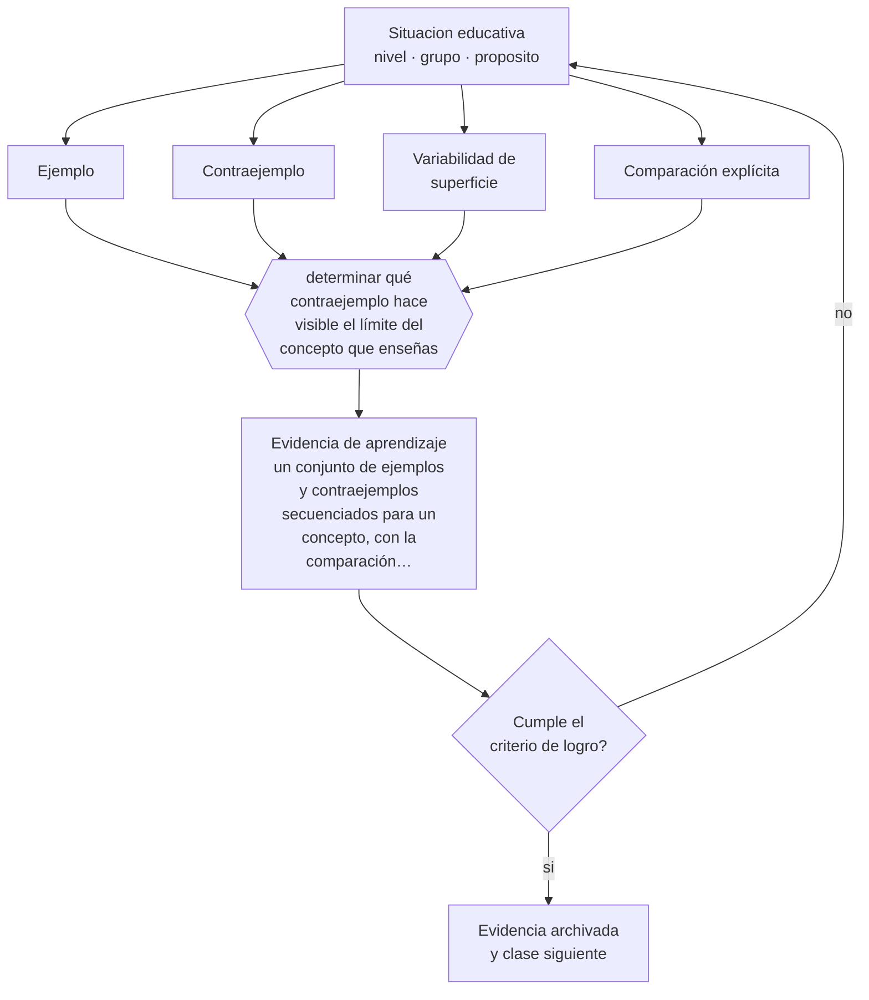

# Clase 123 — Ejemplos y contraejemplos

> **Parte 10 · Didáctica avanzada** — clase 3 de 12

**Estado de evidencia:** `ROBUSTA` · **Etapa:** 🟣 Etapa C — Núcleo profesional docente · **Población de referencia:** transversal a niveles y disciplinas 
**Decisión que habilita:** determinar qué contraejemplo hace visible el límite del concepto que enseñas 
**Evidencia de aprendizaje:** un conjunto de ejemplos y contraejemplos secuenciados para un concepto, con la comparación explícita entre ellos

## 🎯 Propósito

Usar ejemplos, contraejemplos y comparación explícita para construir conceptos precisos y evitar generalizaciones erróneas.

## 📚 Resultados de aprendizaje

Al finalizar esta clase podrás:

1. **Definir** con precisión los cuatro conceptos centrales de la clase y reconocerlos en una situación educativa real, no solo en su enunciado.
2. **Explicar** por qué un contraejemplo bien elegido enseña más que tres ejemplos adicionales.
3. **Decidir** —qué contraejemplo hace visible el límite del concepto que enseñas— y sostener la decisión con un fundamento escrito.
4. **Producir** la evidencia de la clase —un conjunto de ejemplos y contraejemplos secuenciados para un concepto, con la comparación explícita entre ellos— y contrastarla contra el criterio de logro.
5. **Distinguir** lo que la evidencia sostiene de lo que es práctica instalada, preferencia personal o costumbre de la institución.

## 🧩 Conceptos centrales

| Concepto | Comprensión verificable |
|---|---|
| **Ejemplo** | caso que cumple todas las condiciones del concepto |
| **Contraejemplo** | caso que no cumple alguna condición y hace visible el límite del concepto |
| **Variabilidad de superficie** | cambio en rasgos irrelevantes que impide asociar el concepto a características accidentales |
| **Comparación explícita** | yuxtaposición deliberada de casos para que el estudiante identifique la diferencia estructural |

## 🗺️ Flujo de razonamiento

## 📖 Desarrollo

### 1. El fondo del asunto

Los estudiantes forman conceptos por inducción sobre los casos que ven, de modo que la selección de ejemplos determina el concepto que construyen. Si todos los triángulos que ven son equiláteros y están apoyados en su base, construirán un concepto erróneo. Los contraejemplos —casos que parecen cumplir y no cumplen— son lo que fija el límite, y la comparación explícita entre casos es uno de los procedimientos con mejor evidencia para producir comprensión estructural.

### 2. Cómo se traduce en decisiones de enseñanza

El diseño requiere elegir los casos con criterio: ejemplos variados en superficie, contraejemplos cercanos —no absurdos— y una actividad que obligue a comparar y a formular la diferencia. Los contraejemplos lejanos no enseñan nada; los cercanos, los que casi cumplen, son los que producen la discriminación fina que el concepto exige.

### 3. Qué sostiene la evidencia y qué no

Demasiados casos simultáneos saturan la memoria de trabajo y producen confusión en vez de precisión. Y la comparación exige que el estudiante tenga suficiente conocimiento base para percibir la diferencia: presentada demasiado temprano, no se ve. La secuencia y la dosificación son parte del diseño.

> **Cómo leer el estado de evidencia `ROBUSTA`.** Hay evidencia convergente de varios equipos, países y diseños de investigación, incluidos estudios experimentales o cuasiexperimentales, y el efecto se sostiene al replicarlo. Puedes apoyar una decisión profesional en ella, sin olvidar que ningún efecto promedio describe a un estudiante concreto.

## 🧪 Taller guiado

Aplica la clase a **uno** de los contextos siguientes y repite después el ejercicio en un
contexto de exigencia distinta. Cambiar de contexto es parte del aprendizaje: lo que funciona
con un grupo no se traslada intacto a otro.

| Contexto | Rasgo que cambia la decisión |
|---|---|
| Contenido conceptual abstracto | los ejemplos y contraejemplos hacen el trabajo pesado |
| Contenido procedimental | el modelamiento y la corrección inmediata dominan |
| Curso numeroso | verificar comprensión de todos exige técnica, no buena voluntad |
| Clase con conocimiento previo desigual | el andamiaje debe ser diferenciado |
| Modalidad en línea sincrónica | la verificación de comprensión debe rediseñarse |
| Sesión única de capacitación | no hay segunda oportunidad para corregir la secuencia |

**Secuencia de trabajo:**

1. Delimita el contexto: nivel, edad, tamaño del grupo, asignatura o experiencia y tiempo real disponible.
2. Declara qué saben ya los estudiantes y **cómo lo comprobaste**, no cómo lo supones.
3. Formula la decisión pedagógica que esta clase habilita y escribe su fundamento.
4. Anticipa qué observarías si la decisión funciona y qué observarías si no funciona.
5. Diseña de antemano la alternativa que aplicarás si la primera estrategia falla.
6. Ejecuta o simula, y registra lo observado con fecha, contexto y evidencia concreta.
7. Produce la evidencia de aprendizaje de la clase.
8. Contrástala contra el criterio de logro, corrige y recién entonces avanza.

### 📦 Evidencia de aprendizaje

Un conjunto de ejemplos y contraejemplos secuenciados para un concepto, con la comparación explícita entre ellos.

Debe incluir contexto, decisión, fundamento, fuentes consultadas con su fecha, indicador de
logro observable, riesgos previstos y qué harías distinto en la siguiente iteración.

## 🏆 Reto verificable

Diseña la secuencia de ejemplos y contraejemplos de un concepto. Aplícala y evalúa con casos nuevos si el concepto quedó bien delimitado.

## ✅ Criterio de logro

- [ ] los ejemplos varían en superficie manteniendo la estructura del concepto;
- [ ] hay al menos un contraejemplo cercano con comparación explícita diseñada;
- [ ] cada afirmación sobre «lo que funciona» está atribuida a una fuente identificable, con autor y fecha;
- [ ] la decisión es ejecutable con el tiempo, el espacio, el número de estudiantes y los recursos que realmente tienes;
- [ ] la evidencia queda archivada de forma reproducible: otra persona podría revisarla sin que tú se la expliques.

## ⚠️ Errores frecuentes

**Propios de esta clase:**

- Usar siempre ejemplos prototípicos y producir conceptos asociados a rasgos accidentales.
- Elegir contraejemplos tan lejanos que no obligan a ninguna discriminación.

**Característicos de la parte 10:**

- Adoptar una metodología sin verificar si se cumplen sus condiciones de eficacia.
- Explicar sin anticipar el error que el contenido produce siempre.

## ♿ Diversidad, accesibilidad y ética

La variedad de superficie debe incluir contextos culturalmente diversos: si todos los ejemplos provienen del mismo mundo social, una parte del curso no reconocerá la estructura por falta de familiaridad con el envoltorio.

Antes de aplicar cualquier decisión de esta clase con estudiantes reales, revisa el
[protocolo de práctica responsable](../../../docs/ETICA_Y_PRACTICA_RESPONSABLE.md):
consentimiento, resguardo de datos personales, proporcionalidad de la intervención y derecho
de cada estudiante a no ser objeto de un ensayo que no le reporta beneficio.

## ❓ Preguntas de comprobación

1. ¿Qué rasgo accidental podrían estar asociando tus estudiantes al concepto?
2. ¿Qué caso casi cumple y no cumple?
3. ¿Dónde comparan explícitamente dos casos en tu clase?

## 📕 Lecturas base

**Rittle-Johnson, B. & Star, J. (2007). *Does Comparing Solution Methods Facilitate Conceptual and Procedural Knowledge?***  
*Qué aporta a esta clase:* evidencia experimental sobre el efecto de la comparación explícita.

**Marton, F. & Booth, S. (1997). *Learning and Awareness*.**  
*Qué aporta a esta clase:* fundamenta la variación como mecanismo por el que se discrimina lo esencial de lo accidental.

Catálogo completo: [bibliografía del programa](../../../docs/BIBLIOGRAFIA.md) ·
[glosario](../../../docs/GLOSARIO.md) ·
[fuentes oficiales y cómo leerlas](../../../docs/FUENTES.md).

## 🔗 Conexión con el resto del programa

Se apoya en las clases 015 y 023 y alimenta la clase 132.

> [!IMPORTANT]
> Material de formación profesional. No reemplaza un título de pedagogía, una habilitación
> legal para ejercer, ni el juicio de un equipo educativo que conoce a sus estudiantes.

---

| Anterior | Índice | Siguiente |
|---|---|---|
| [← 122 · Explicaciones efectivas](../class-02-explicaciones-efectivas/README.md) | [Parte 10](../README.md) · [Programa](../../../README.md) | [124 · Preguntas de alto nivel →](../class-04-preguntas-de-alto-nivel/README.md) |
