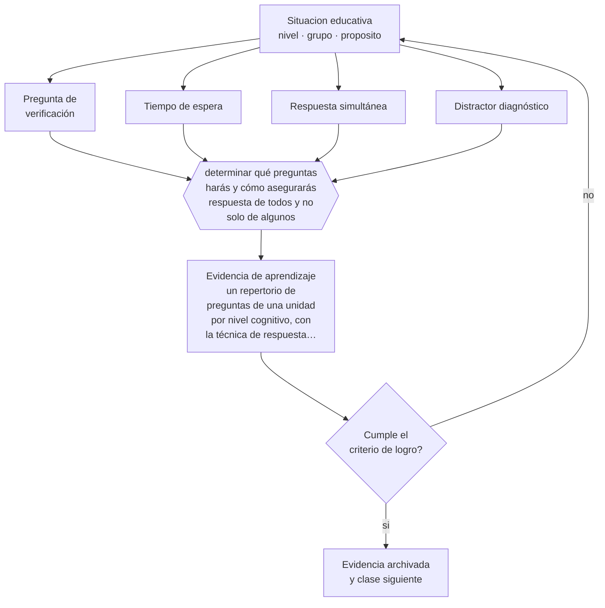

# Clase 124 — Preguntas de alto nivel

> **Parte 10 · Didáctica avanzada** — clase 4 de 12

**Estado de evidencia:** `CONSISTENTE` · **Etapa:** 🟣 Etapa C — Núcleo profesional docente · **Población de referencia:** transversal a niveles y disciplinas 
**Decisión que habilita:** determinar qué preguntas harás y cómo asegurarás respuesta de todos y no solo de algunos 
**Evidencia de aprendizaje:** un repertorio de preguntas de una unidad por nivel cognitivo, con la técnica de respuesta asociada a cada una

## 🎯 Propósito

Formular preguntas que produzcan pensamiento y que revelen el estado de comprensión del curso completo, con técnicas que distribuyan la participación.

## 📚 Resultados de aprendizaje

Al finalizar esta clase podrás:

1. **Definir** con precisión los cuatro conceptos centrales de la clase y reconocerlos en una situación educativa real, no solo en su enunciado.
2. **Explicar** cómo verificar la comprensión de todo el curso y no solo de quienes levantan la mano.
3. **Decidir** —qué preguntas harás y cómo asegurarás respuesta de todos y no solo de algunos— y sostener la decisión con un fundamento escrito.
4. **Producir** la evidencia de la clase —un repertorio de preguntas de una unidad por nivel cognitivo, con la técnica de respuesta asociada a cada una— y contrastarla contra el criterio de logro.
5. **Distinguir** lo que la evidencia sostiene de lo que es práctica instalada, preferencia personal o costumbre de la institución.

## 🧩 Conceptos centrales

| Concepto | Comprensión verificable |
|---|---|
| **Pregunta de verificación** | interrogante diseñada para revelar comprensión o su ausencia |
| **Tiempo de espera** | pausa tras la pregunta antes de aceptar respuesta; aumenta la calidad y la cantidad de participación |
| **Respuesta simultánea** | técnica que obliga a responder a todo el curso a la vez y hace visible el estado general |
| **Distractor diagnóstico** | opción incorrecta diseñada para revelar un error conceptual específico |

## 🗺️ Flujo de razonamiento

## 📖 Desarrollo

### 1. El fondo del asunto

La mayoría de las preguntas de aula se responde por los mismos estudiantes y en menos de un segundo. Dos cambios simples tienen efectos documentados: aumentar el tiempo de espera a tres segundos, que mejora la extensión y la calidad de las respuestas, y usar técnicas de respuesta simultánea, que hacen visible lo que la mano levantada oculta. La pregunta con distractores diagnósticos es la herramienta más eficiente para detectar errores conceptuales en segundos.

### 2. Cómo se traduce en decisiones de enseñanza

Preparar preguntas es parte del diseño de la clase, no una improvisación. Un repertorio útil combina preguntas de verificación factual, de aplicación y de explicación, cada una con su técnica de respuesta. Y la regla más difícil de sostener: preguntar antes de explicar más, en vez de repetir la explicación cuando algo no se entendió.

### 3. Qué sostiene la evidencia y qué no

Las preguntas de alto nivel no siempre son mejores: con contenido nuevo, preguntar por aplicación antes de asegurar la base produce frustración y respuestas vacías. La progresión importa. Y las técnicas de respuesta simultánea requieren un clima donde equivocarse no tenga costo social, que hay que construir antes.

> **Cómo leer el estado de evidencia `CONSISTENTE`.** La evidencia es amplia y coherente, pero proviene sobre todo de estudios correlacionales, de síntesis con heterogeneidad alta o de contextos distintos al tuyo. Sirve para orientar la decisión y exige que compruebes el efecto en tu propio grupo.

## 🧪 Taller guiado

Aplica la clase a **uno** de los contextos siguientes y repite después el ejercicio en un
contexto de exigencia distinta. Cambiar de contexto es parte del aprendizaje: lo que funciona
con un grupo no se traslada intacto a otro.

| Contexto | Rasgo que cambia la decisión |
|---|---|
| Contenido conceptual abstracto | los ejemplos y contraejemplos hacen el trabajo pesado |
| Contenido procedimental | el modelamiento y la corrección inmediata dominan |
| Curso numeroso | verificar comprensión de todos exige técnica, no buena voluntad |
| Clase con conocimiento previo desigual | el andamiaje debe ser diferenciado |
| Modalidad en línea sincrónica | la verificación de comprensión debe rediseñarse |
| Sesión única de capacitación | no hay segunda oportunidad para corregir la secuencia |

**Secuencia de trabajo:**

1. Delimita el contexto: nivel, edad, tamaño del grupo, asignatura o experiencia y tiempo real disponible.
2. Declara qué saben ya los estudiantes y **cómo lo comprobaste**, no cómo lo supones.
3. Formula la decisión pedagógica que esta clase habilita y escribe su fundamento.
4. Anticipa qué observarías si la decisión funciona y qué observarías si no funciona.
5. Diseña de antemano la alternativa que aplicarás si la primera estrategia falla.
6. Ejecuta o simula, y registra lo observado con fecha, contexto y evidencia concreta.
7. Produce la evidencia de aprendizaje de la clase.
8. Contrástala contra el criterio de logro, corrige y recién entonces avanza.

### 📦 Evidencia de aprendizaje

Un repertorio de preguntas de una unidad por nivel cognitivo, con la técnica de respuesta asociada a cada una.

Debe incluir contexto, decisión, fundamento, fuentes consultadas con su fecha, indicador de
logro observable, riesgos previstos y qué harías distinto en la siguiente iteración.

## 🏆 Reto verificable

Aplica tiempo de espera y respuesta simultánea durante dos semanas. Registra qué proporción del curso participa antes y después.

## ✅ Criterio de logro

- [ ] el repertorio asocia cada pregunta a una técnica de respuesta que involucra a todo el curso;
- [ ] incluye al menos dos preguntas con distractores diagnósticos de errores conocidos;
- [ ] cada afirmación sobre «lo que funciona» está atribuida a una fuente identificable, con autor y fecha;
- [ ] la decisión es ejecutable con el tiempo, el espacio, el número de estudiantes y los recursos que realmente tienes;
- [ ] la evidencia queda archivada de forma reproducible: otra persona podría revisarla sin que tú se la expliques.

## ⚠️ Errores frecuentes

**Propios de esta clase:**

- Aceptar la respuesta del primero que levanta la mano como indicador de la comprensión del curso.
- Formular preguntas de aplicación antes de haber asegurado la comprensión básica.

**Característicos de la parte 10:**

- Adoptar una metodología sin verificar si se cumplen sus condiciones de eficacia.
- Explicar sin anticipar el error que el contenido produce siempre.

## ♿ Diversidad, accesibilidad y ética

Las técnicas de respuesta simultánea evitan que la participación dependa de la confianza para hablar en público y hacen visibles a estudiantes que de otro modo pasan semanas sin que nadie sepa qué entendieron.

Antes de aplicar cualquier decisión de esta clase con estudiantes reales, revisa el
[protocolo de práctica responsable](../../../docs/ETICA_Y_PRACTICA_RESPONSABLE.md):
consentimiento, resguardo de datos personales, proporcionalidad de la intervención y derecho
de cada estudiante a no ser objeto de un ensayo que no le reporta beneficio.

## ❓ Preguntas de comprobación

1. ¿Cuánto tiempo esperas realmente después de preguntar?
2. ¿Qué proporción de tu curso responde efectivamente en una clase?
3. ¿Qué error conceptual revelaría tu distractor?

## 📕 Lecturas base

**Rowe, M. B. (1986). *Wait Time: Slowing Down May Be a Way of Speeding Up*.**  
*Qué aporta a esta clase:* el estudio clásico sobre tiempo de espera y sus efectos en la participación.

**Wiliam, D. (2011). *Embedded Formative Assessment*.**  
*Qué aporta a esta clase:* técnicas de respuesta simultánea y de diseño de preguntas diagnósticas.

Catálogo completo: [bibliografía del programa](../../../docs/BIBLIOGRAFIA.md) ·
[glosario](../../../docs/GLOSARIO.md) ·
[fuentes oficiales y cómo leerlas](../../../docs/FUENTES.md).

## 🔗 Conexión con el resto del programa

Es el instrumento de verificación de la clase 122 y se articula con la clase 058.

> [!IMPORTANT]
> Material de formación profesional. No reemplaza un título de pedagogía, una habilitación
> legal para ejercer, ni el juicio de un equipo educativo que conoce a sus estudiantes.

---

| Anterior | Índice | Siguiente |
|---|---|---|
| [← 123 · Ejemplos y contraejemplos](../class-03-ejemplos-y-contraejemplos/README.md) | [Parte 10](../README.md) · [Programa](../../../README.md) | [125 · Diálogo socrático →](../class-05-dialogo-socratico/README.md) |
