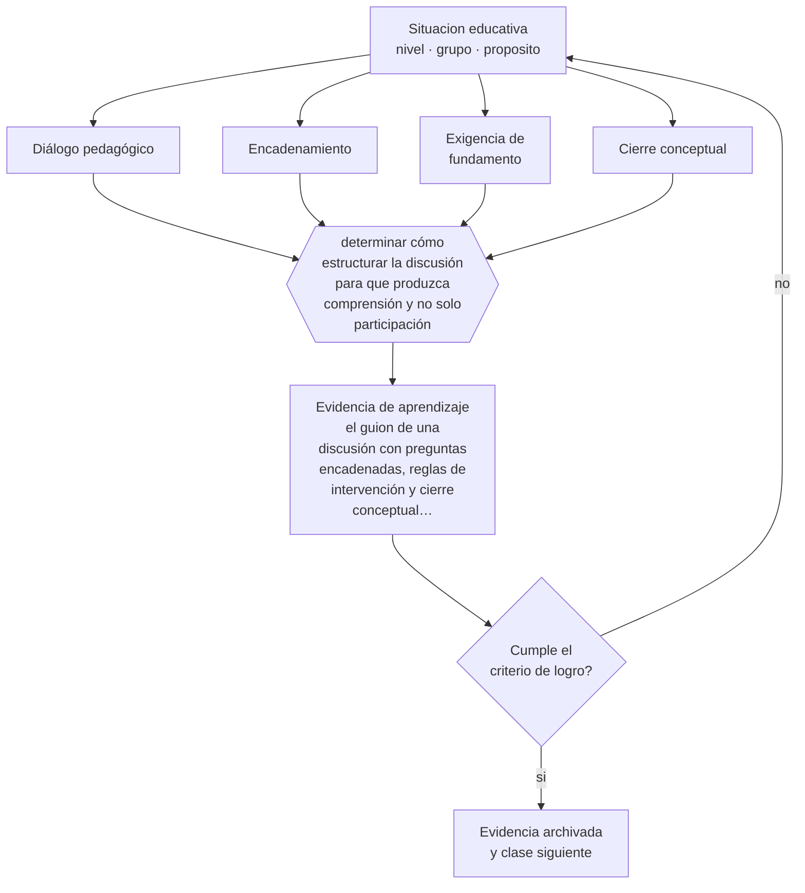

# Clase 125 — Diálogo socrático

> **Parte 10 · Didáctica avanzada** — clase 5 de 12

**Estado de evidencia:** `PRACTICA-PROFESIONAL` · **Etapa:** 🟣 Etapa C — Núcleo profesional docente · **Población de referencia:** transversal a niveles y disciplinas 
**Decisión que habilita:** determinar cómo estructurar la discusión para que produzca comprensión y no solo participación 
**Evidencia de aprendizaje:** el guion de una discusión con preguntas encadenadas, reglas de intervención y cierre conceptual previsto

## 🎯 Propósito

Conducir diálogo pedagógico con estructura: preguntas encadenadas, exigencia de fundamento, construcción sobre lo dicho por otros y cierre que sistematiza lo aprendido.

## 📚 Resultados de aprendizaje

Al finalizar esta clase podrás:

1. **Definir** con precisión los cuatro conceptos centrales de la clase y reconocerlos en una situación educativa real, no solo en su enunciado.
2. **Explicar** cómo conducir una discusión donde el pensamiento avance y no solo se acumulen opiniones.
3. **Decidir** —cómo estructurar la discusión para que produzca comprensión y no solo participación— y sostener la decisión con un fundamento escrito.
4. **Producir** la evidencia de la clase —el guion de una discusión con preguntas encadenadas, reglas de intervención y cierre conceptual previsto— y contrastarla contra el criterio de logro.
5. **Distinguir** lo que la evidencia sostiene de lo que es práctica instalada, preferencia personal o costumbre de la institución.

## 🧩 Conceptos centrales

| Concepto | Comprensión verificable |
|---|---|
| **Diálogo pedagógico** | conversación estructurada orientada a construir comprensión colectiva |
| **Encadenamiento** | conexión de cada intervención con la anterior para que la discusión progrese |
| **Exigencia de fundamento** | norma de que toda afirmación se acompaña de una razón o de evidencia |
| **Cierre conceptual** | sistematización final que fija lo aprendido y evita que la discusión se disuelva |

## 🗺️ Flujo de razonamiento

## 📖 Desarrollo

### 1. El fondo del asunto

Una discusión sin estructura produce una sucesión de opiniones donde cada estudiante habla del tema sin escuchar al anterior. El diálogo que enseña tiene reglas: se responde a lo dicho, se pide fundamento, se contrastan posiciones y se cierra sistematizando. La tradición del diálogo socrático aporta la idea de la pregunta que expone la contradicción; la investigación sobre enseñanza dialógica aporta las condiciones para que ocurra en un curso completo.

### 2. Cómo se traduce en decisiones de enseñanza

El guion previo es lo que distingue una discusión conducida de una conversación. Incluye la pregunta de apertura, las preguntas de profundización previstas, las reglas de intervención y el cierre. Durante la discusión, el trabajo del docente es encadenar —«¿estás de acuerdo con lo que dijo ella y por qué?»— y no responder cada intervención por su cuenta.

### 3. Qué sostiene la evidencia y qué no

La evidencia sobre enseñanza dialógica es prometedora y heterogénea, y depende mucho de la formación del docente y del tiempo disponible. Además, en cursos numerosos la discusión plenaria involucra a pocos: sin trabajo previo en parejas o grupos, la mayoría solo escucha. Y sin conocimiento base, la discusión es intercambio de impresiones.

> **Cómo leer el estado de evidencia `PRACTICA-PROFESIONAL`.** Es conocimiento práctico acumulado del oficio, útil y transferible, pero no probado con diseños de investigación. Trátalo como un buen punto de partida sujeto a comprobación en tu contexto.

## 🧪 Taller guiado

Aplica la clase a **uno** de los contextos siguientes y repite después el ejercicio en un
contexto de exigencia distinta. Cambiar de contexto es parte del aprendizaje: lo que funciona
con un grupo no se traslada intacto a otro.

| Contexto | Rasgo que cambia la decisión |
|---|---|
| Contenido conceptual abstracto | los ejemplos y contraejemplos hacen el trabajo pesado |
| Contenido procedimental | el modelamiento y la corrección inmediata dominan |
| Curso numeroso | verificar comprensión de todos exige técnica, no buena voluntad |
| Clase con conocimiento previo desigual | el andamiaje debe ser diferenciado |
| Modalidad en línea sincrónica | la verificación de comprensión debe rediseñarse |
| Sesión única de capacitación | no hay segunda oportunidad para corregir la secuencia |

**Secuencia de trabajo:**

1. Delimita el contexto: nivel, edad, tamaño del grupo, asignatura o experiencia y tiempo real disponible.
2. Declara qué saben ya los estudiantes y **cómo lo comprobaste**, no cómo lo supones.
3. Formula la decisión pedagógica que esta clase habilita y escribe su fundamento.
4. Anticipa qué observarías si la decisión funciona y qué observarías si no funciona.
5. Diseña de antemano la alternativa que aplicarás si la primera estrategia falla.
6. Ejecuta o simula, y registra lo observado con fecha, contexto y evidencia concreta.
7. Produce la evidencia de aprendizaje de la clase.
8. Contrástala contra el criterio de logro, corrige y recién entonces avanza.

### 📦 Evidencia de aprendizaje

El guion de una discusión con preguntas encadenadas, reglas de intervención y cierre conceptual previsto.

Debe incluir contexto, decisión, fundamento, fuentes consultadas con su fecha, indicador de
logro observable, riesgos previstos y qué harías distinto en la siguiente iteración.

## 🏆 Reto verificable

Conduce una discusión con guion y registra quién habló y cuántas intervenciones se encadenaron. Rediseña las reglas a partir de ese registro.

## ✅ Criterio de logro

- [ ] el guion prevé preguntas de profundización y un cierre conceptual explícito;
- [ ] las reglas exigen fundamentar y responder a lo dicho por otros;
- [ ] cada afirmación sobre «lo que funciona» está atribuida a una fuente identificable, con autor y fecha;
- [ ] la decisión es ejecutable con el tiempo, el espacio, el número de estudiantes y los recursos que realmente tienes;
- [ ] la evidencia queda archivada de forma reproducible: otra persona podría revisarla sin que tú se la expliques.

## ⚠️ Errores frecuentes

**Propios de esta clase:**

- Responder cada intervención en vez de encadenar entre estudiantes.
- Terminar la discusión sin cierre conceptual, con lo que cada uno se queda con su versión.

**Característicos de la parte 10:**

- Adoptar una metodología sin verificar si se cumplen sus condiciones de eficacia.
- Explicar sin anticipar el error que el contenido produce siempre.

## ♿ Diversidad, accesibilidad y ética

Las discusiones plenarias favorecen a quienes tienen más capital verbal. El trabajo previo en parejas, los turnos asignados y la aceptación de respuestas en lenguaje cotidiano amplían quiénes participan realmente.

Antes de aplicar cualquier decisión de esta clase con estudiantes reales, revisa el
[protocolo de práctica responsable](../../../docs/ETICA_Y_PRACTICA_RESPONSABLE.md):
consentimiento, resguardo de datos personales, proporcionalidad de la intervención y derecho
de cada estudiante a no ser objeto de un ensayo que no le reporta beneficio.

## ❓ Preguntas de comprobación

1. ¿Cuántas intervenciones de tu última discusión se conectaron con la anterior?
2. ¿Qué quedó sistematizado al final y quién lo escribió?
3. ¿Qué conocimiento base necesitaban para que la discusión fuera algo más que opiniones?

## 📕 Lecturas base

**Alexander, R. (2020). *A Dialogic Teaching Companion*.**  
*Qué aporta a esta clase:* marco y repertorio de enseñanza dialógica con criterios observables.

**Michaels, S. & O'Connor, C. *Talk Science Primer*.**  
*Qué aporta a esta clase:* protocolos concretos de conducción de discusión con encadenamiento.

Catálogo completo: [bibliografía del programa](../../../docs/BIBLIOGRAFIA.md) ·
[glosario](../../../docs/GLOSARIO.md) ·
[fuentes oficiales y cómo leerlas](../../../docs/FUENTES.md).

## 🔗 Conexión con el resto del programa

Se articula con las clases 067 y 124 y aporta el cierre conceptual que la clase 066 exige.

> [!IMPORTANT]
> Material de formación profesional. No reemplaza un título de pedagogía, una habilitación
> legal para ejercer, ni el juicio de un equipo educativo que conoce a sus estudiantes.

---

| Anterior | Índice | Siguiente |
|---|---|---|
| [← 124 · Preguntas de alto nivel](../class-04-preguntas-de-alto-nivel/README.md) | [Parte 10](../README.md) · [Programa](../../../README.md) | [126 · Modelamiento y think-aloud →](../class-06-modelamiento-y-think-aloud/README.md) |
