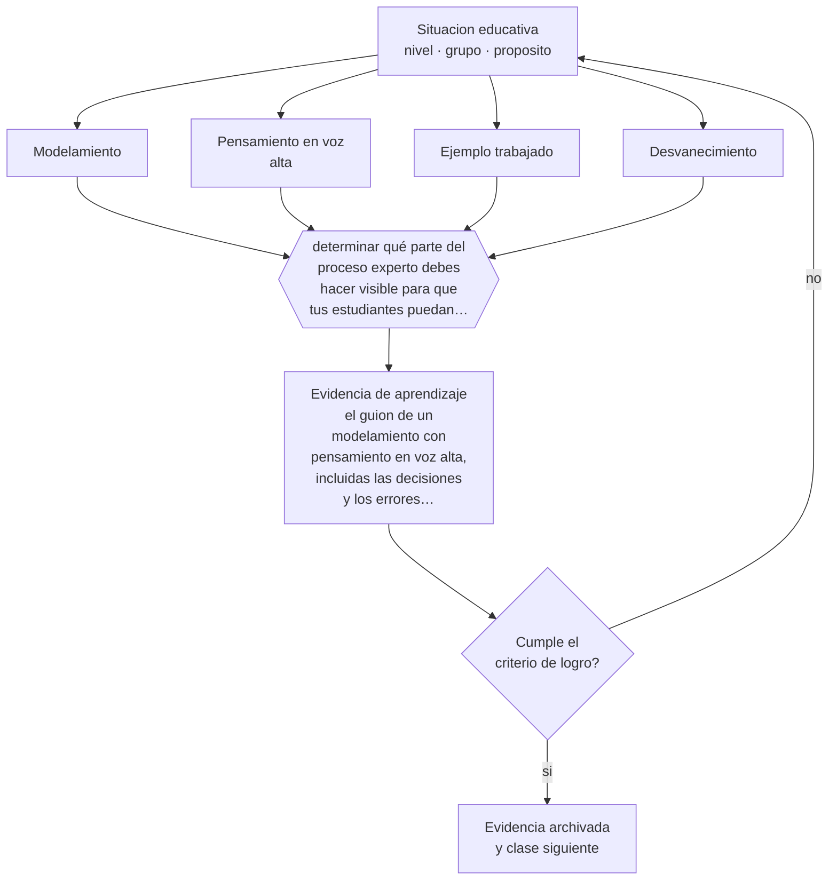

# Clase 126 — Modelamiento y think-aloud

> **Parte 10 · Didáctica avanzada** — clase 6 de 12

**Estado de evidencia:** `ROBUSTA` · **Etapa:** 🟣 Etapa C — Núcleo profesional docente · **Población de referencia:** transversal a niveles y disciplinas 
**Decisión que habilita:** determinar qué parte del proceso experto debes hacer visible para que tus estudiantes puedan imitarlo 
**Evidencia de aprendizaje:** el guion de un modelamiento con pensamiento en voz alta, incluidas las decisiones y los errores previstos

## 🎯 Propósito

Modelar procedimientos y razonamientos haciendo visible el pensamiento experto —decisiones, dudas, correcciones— que normalmente permanece oculto.

## 📚 Resultados de aprendizaje

Al finalizar esta clase podrás:

1. **Definir** con precisión los cuatro conceptos centrales de la clase y reconocerlos en una situación educativa real, no solo en su enunciado.
2. **Explicar** por qué mostrar el resultado terminado enseña menos que mostrar el proceso de llegar a él.
3. **Decidir** —qué parte del proceso experto debes hacer visible para que tus estudiantes puedan imitarlo— y sostener la decisión con un fundamento escrito.
4. **Producir** la evidencia de la clase —el guion de un modelamiento con pensamiento en voz alta, incluidas las decisiones y los errores previstos— y contrastarla contra el criterio de logro.
5. **Distinguir** lo que la evidencia sostiene de lo que es práctica instalada, preferencia personal o costumbre de la institución.

## 🧩 Conceptos centrales

| Concepto | Comprensión verificable |
|---|---|
| **Modelamiento** | demostración del procedimiento por parte del docente con explicación de sus decisiones |
| **Pensamiento en voz alta** | verbalización del razonamiento interno mientras se ejecuta la tarea |
| **Ejemplo trabajado** | problema resuelto paso a paso que reduce la carga del novato |
| **Desvanecimiento** | retirada progresiva del modelo a medida que el estudiante puede ejecutar solo |

## 🗺️ Flujo de razonamiento

## 📖 Desarrollo

### 1. El fondo del asunto

El experto ejecuta sin verbalizar y el novato ve solo el resultado, no las decisiones que lo produjeron: por qué se descartó una alternativa, dónde se detuvo a comprobar, qué hizo cuando se equivocó. Hacer visible ese proceso —hablar mientras se resuelve, incluyendo las dudas— es una de las prácticas con mejor respaldo, y es la base del efecto documentado de los ejemplos trabajados.

### 2. Cómo se traduce en decisiones de enseñanza

El guion de modelamiento incluye lo que se dirá en cada paso, dónde se hará una pausa, qué error se cometerá deliberadamente para mostrar la corrección. Ese último recurso es potente: los estudiantes aprenden que equivocarse y comprobar forma parte del procedimiento experto, no de la incompetencia.

### 3. Qué sostiene la evidencia y qué no

El modelamiento pierde eficacia con estudiantes que ya dominan el procedimiento: el efecto de los ejemplos trabajados se invierte con la experticia. Además, observar produce la ilusión de saber hacer: sin práctica inmediata, el modelamiento no se convierte en competencia.

> **Cómo leer el estado de evidencia `ROBUSTA`.** Hay evidencia convergente de varios equipos, países y diseños de investigación, incluidos estudios experimentales o cuasiexperimentales, y el efecto se sostiene al replicarlo. Puedes apoyar una decisión profesional en ella, sin olvidar que ningún efecto promedio describe a un estudiante concreto.

## 🧪 Taller guiado

Aplica la clase a **uno** de los contextos siguientes y repite después el ejercicio en un
contexto de exigencia distinta. Cambiar de contexto es parte del aprendizaje: lo que funciona
con un grupo no se traslada intacto a otro.

| Contexto | Rasgo que cambia la decisión |
|---|---|
| Contenido conceptual abstracto | los ejemplos y contraejemplos hacen el trabajo pesado |
| Contenido procedimental | el modelamiento y la corrección inmediata dominan |
| Curso numeroso | verificar comprensión de todos exige técnica, no buena voluntad |
| Clase con conocimiento previo desigual | el andamiaje debe ser diferenciado |
| Modalidad en línea sincrónica | la verificación de comprensión debe rediseñarse |
| Sesión única de capacitación | no hay segunda oportunidad para corregir la secuencia |

**Secuencia de trabajo:**

1. Delimita el contexto: nivel, edad, tamaño del grupo, asignatura o experiencia y tiempo real disponible.
2. Declara qué saben ya los estudiantes y **cómo lo comprobaste**, no cómo lo supones.
3. Formula la decisión pedagógica que esta clase habilita y escribe su fundamento.
4. Anticipa qué observarías si la decisión funciona y qué observarías si no funciona.
5. Diseña de antemano la alternativa que aplicarás si la primera estrategia falla.
6. Ejecuta o simula, y registra lo observado con fecha, contexto y evidencia concreta.
7. Produce la evidencia de aprendizaje de la clase.
8. Contrástala contra el criterio de logro, corrige y recién entonces avanza.

### 📦 Evidencia de aprendizaje

El guion de un modelamiento con pensamiento en voz alta, incluidas las decisiones y los errores previstos.

Debe incluir contexto, decisión, fundamento, fuentes consultadas con su fecha, indicador de
logro observable, riesgos previstos y qué harías distinto en la siguiente iteración.

## 🏆 Reto verificable

Modela un procedimiento pensando en voz alta y grábate. Revisa cuántas decisiones verbalizaste y cuántas diste por obvias.

## ✅ Criterio de logro

- [ ] el guion verbaliza decisiones y no solo pasos de ejecución;
- [ ] incluye práctica inmediata posterior con corrección;
- [ ] cada afirmación sobre «lo que funciona» está atribuida a una fuente identificable, con autor y fecha;
- [ ] la decisión es ejecutable con el tiempo, el espacio, el número de estudiantes y los recursos que realmente tienes;
- [ ] la evidencia queda archivada de forma reproducible: otra persona podría revisarla sin que tú se la expliques.

## ⚠️ Errores frecuentes

**Propios de esta clase:**

- Mostrar el procedimiento terminado sin verbalizar las decisiones que lo produjeron.
- Prolongar el modelamiento con estudiantes que ya deberían estar practicando.

**Característicos de la parte 10:**

- Adoptar una metodología sin verificar si se cumplen sus condiciones de eficacia.
- Explicar sin anticipar el error que el contenido produce siempre.

## ♿ Diversidad, accesibilidad y ética

Hacer visible el proceso experto beneficia especialmente a estudiantes sin modelos académicos en su entorno, que de otro modo suponen que los demás resuelven sin esfuerzo y atribuyen su dificultad a incapacidad propia.

Antes de aplicar cualquier decisión de esta clase con estudiantes reales, revisa el
[protocolo de práctica responsable](../../../docs/ETICA_Y_PRACTICA_RESPONSABLE.md):
consentimiento, resguardo de datos personales, proporcionalidad de la intervención y derecho
de cada estudiante a no ser objeto de un ensayo que no le reporta beneficio.

## ❓ Preguntas de comprobación

1. ¿Qué decisión tuya al resolver es invisible para tus estudiantes?
2. ¿Dónde te equivocarías a propósito para mostrar cómo se comprueba?
3. ¿Cuándo deberías dejar de modelar con este grupo?

## 📕 Lecturas base

**Collins, A., Brown, J. S. & Newman, S. (1989). *Cognitive Apprenticeship*.**  
*Qué aporta a esta clase:* formula el modelamiento, el andamiaje y el desvanecimiento como sistema de enseñanza.

**Sweller, J., Ayres, P. & Kalyuga, S. (2011). *Cognitive Load Theory*.**  
*Qué aporta a esta clase:* aporta la evidencia sobre ejemplos trabajados y su reversión por experticia.

Catálogo completo: [bibliografía del programa](../../../docs/BIBLIOGRAFIA.md) ·
[glosario](../../../docs/GLOSARIO.md) ·
[fuentes oficiales y cómo leerlas](../../../docs/FUENTES.md).

## 🔗 Conexión con el resto del programa

Es el primer paso de la secuencia de las clases 127 y 128, y aplica la clase 019.

> [!IMPORTANT]
> Material de formación profesional. No reemplaza un título de pedagogía, una habilitación
> legal para ejercer, ni el juicio de un equipo educativo que conoce a sus estudiantes.

---

| Anterior | Índice | Siguiente |
|---|---|---|
| [← 125 · Diálogo socrático](../class-05-dialogo-socratico/README.md) | [Parte 10](../README.md) · [Programa](../../../README.md) | [127 · Scaffolding →](../class-07-scaffolding/README.md) |
