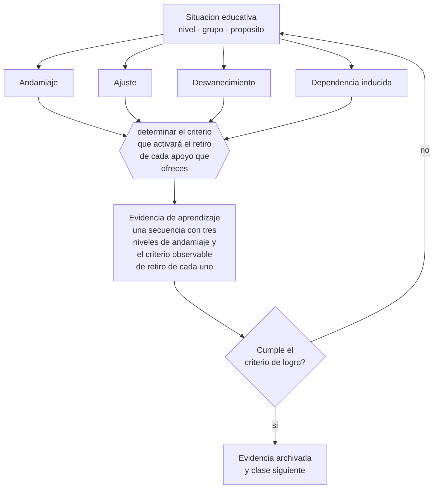

# Clase 127 — Scaffolding

> **Parte 10 · Didáctica avanzada** — clase 7 de 12

**Estado de evidencia:** `ROBUSTA` · **Etapa:** 🟣 Etapa C — Núcleo profesional docente · **Población de referencia:** transversal a niveles y disciplinas 
**Decisión que habilita:** determinar el criterio que activará el retiro de cada apoyo que ofreces 
**Evidencia de aprendizaje:** una secuencia con tres niveles de andamiaje y el criterio observable de retiro de cada uno

## 🎯 Propósito

Diseñar andamiaje ajustado al desempeño real y con criterio explícito de retiro, evitando tanto la dependencia como el abandono prematuro.

## 📚 Resultados de aprendizaje

Al finalizar esta clase podrás:

1. **Definir** con precisión los cuatro conceptos centrales de la clase y reconocerlos en una situación educativa real, no solo en su enunciado.
2. **Explicar** cómo se decide cuánto apoyo dar y, sobre todo, cuándo quitarlo.
3. **Decidir** —el criterio que activará el retiro de cada apoyo que ofreces— y sostener la decisión con un fundamento escrito.
4. **Producir** la evidencia de la clase —una secuencia con tres niveles de andamiaje y el criterio observable de retiro de cada uno— y contrastarla contra el criterio de logro.
5. **Distinguir** lo que la evidencia sostiene de lo que es práctica instalada, preferencia personal o costumbre de la institución.

## 🧩 Conceptos centrales

| Concepto | Comprensión verificable |
|---|---|
| **Andamiaje** | apoyo temporal ajustado que permite un desempeño todavía no autónomo |
| **Ajuste** | correspondencia entre el apoyo ofrecido y el desempeño observado, no el esperado |
| **Desvanecimiento** | retirada progresiva del apoyo conforme aumenta el dominio |
| **Dependencia inducida** | situación en que el apoyo permanente impide el desarrollo de la autonomía |

## 🗺️ Flujo de razonamiento

## 📖 Desarrollo

### 1. El fondo del asunto

El andamiaje tiene tres propiedades que lo distinguen de la simple ayuda: es contingente al desempeño observado, es temporal y tiene criterio de retiro. La ayuda que se da siempre igual, independiente de cómo va el estudiante, no es andamiaje: es una muleta. Y el apoyo que nunca se retira produce dependencia, que en la práctica se observa como estudiantes que solo trabajan cuando el docente está al lado.

### 2. Cómo se traduce en decisiones de enseñanza

Escribir el criterio de retiro junto con el apoyo es lo que convierte la intuición en decisión profesional: «se retira la plantilla cuando complete dos tareas sin errores en la estructura». Sin ese criterio, el apoyo permanece por inercia y nadie nota el problema hasta la evaluación final, cuando el estudiante ya no tiene el andamio.

### 3. Qué sostiene la evidencia y qué no

El andamiaje contingente exige observar de cerca, lo que en cursos numerosos es difícil de sostener para todos. La alternativa realista es andamiaje diferenciado por grupos y no individual, con criterios de retiro por grupo. Reconocer esa restricción evita diseños ideales que nadie ejecuta.

> **Cómo leer el estado de evidencia `ROBUSTA`.** Hay evidencia convergente de varios equipos, países y diseños de investigación, incluidos estudios experimentales o cuasiexperimentales, y el efecto se sostiene al replicarlo. Puedes apoyar una decisión profesional en ella, sin olvidar que ningún efecto promedio describe a un estudiante concreto.

## 🧪 Taller guiado

Aplica la clase a **uno** de los contextos siguientes y repite después el ejercicio en un
contexto de exigencia distinta. Cambiar de contexto es parte del aprendizaje: lo que funciona
con un grupo no se traslada intacto a otro.

| Contexto | Rasgo que cambia la decisión |
|---|---|
| Contenido conceptual abstracto | los ejemplos y contraejemplos hacen el trabajo pesado |
| Contenido procedimental | el modelamiento y la corrección inmediata dominan |
| Curso numeroso | verificar comprensión de todos exige técnica, no buena voluntad |
| Clase con conocimiento previo desigual | el andamiaje debe ser diferenciado |
| Modalidad en línea sincrónica | la verificación de comprensión debe rediseñarse |
| Sesión única de capacitación | no hay segunda oportunidad para corregir la secuencia |

**Secuencia de trabajo:**

1. Delimita el contexto: nivel, edad, tamaño del grupo, asignatura o experiencia y tiempo real disponible.
2. Declara qué saben ya los estudiantes y **cómo lo comprobaste**, no cómo lo supones.
3. Formula la decisión pedagógica que esta clase habilita y escribe su fundamento.
4. Anticipa qué observarías si la decisión funciona y qué observarías si no funciona.
5. Diseña de antemano la alternativa que aplicarás si la primera estrategia falla.
6. Ejecuta o simula, y registra lo observado con fecha, contexto y evidencia concreta.
7. Produce la evidencia de aprendizaje de la clase.
8. Contrástala contra el criterio de logro, corrige y recién entonces avanza.

### 📦 Evidencia de aprendizaje

Una secuencia con tres niveles de andamiaje y el criterio observable de retiro de cada uno.

Debe incluir contexto, decisión, fundamento, fuentes consultadas con su fecha, indicador de
logro observable, riesgos previstos y qué harías distinto en la siguiente iteración.

## 🏆 Reto verificable

Diseña tres niveles de andamiaje con criterio de retiro y aplícalos un mes. Registra cuántos estudiantes avanzaron de nivel y cuántos apoyos no lograste retirar.

## ✅ Criterio de logro

- [ ] cada nivel de andamiaje declara su criterio observable de retiro;
- [ ] existe al menos una instancia de desempeño sin apoyo antes de la evaluación;
- [ ] cada afirmación sobre «lo que funciona» está atribuida a una fuente identificable, con autor y fecha;
- [ ] la decisión es ejecutable con el tiempo, el espacio, el número de estudiantes y los recursos que realmente tienes;
- [ ] la evidencia queda archivada de forma reproducible: otra persona podría revisarla sin que tú se la expliques.

## ⚠️ Errores frecuentes

**Propios de esta clase:**

- Ofrecer siempre el mismo apoyo sin relación con el desempeño observado.
- Retirar el andamiaje por calendario y no por criterio de dominio.

**Característicos de la parte 10:**

- Adoptar una metodología sin verificar si se cumplen sus condiciones de eficacia.
- Explicar sin anticipar el error que el contenido produce siempre.

## ♿ Diversidad, accesibilidad y ética

El andamiaje es el mecanismo que permite exigir el mismo objetivo a todos: cambia la vía y no la meta. Su registro y revisión evitan que un apoyo se convierta en una etiqueta permanente sobre el estudiante.

Antes de aplicar cualquier decisión de esta clase con estudiantes reales, revisa el
[protocolo de práctica responsable](../../../docs/ETICA_Y_PRACTICA_RESPONSABLE.md):
consentimiento, resguardo de datos personales, proporcionalidad de la intervención y derecho
de cada estudiante a no ser objeto de un ensayo que no le reporta beneficio.

## ❓ Preguntas de comprobación

1. ¿Qué apoyo tuyo lleva meses sin cambiar?
2. ¿Cómo sabrías que un estudiante ya no lo necesita?
3. ¿Qué estudiantes solo trabajan cuando estás al lado, y qué dice eso de tu andamiaje?

## 📕 Lecturas base

**Wood, D., Bruner, J. & Ross, G. (1976). *The Role of Tutoring in Problem Solving*.**  
*Qué aporta a esta clase:* define el andamiaje con criterios observables de ajuste y retiro.

**van de Pol, J., Volman, M. & Beishuizen, J. (2010). *Scaffolding in Teacher–Student Interaction*.**  
*Qué aporta a esta clase:* revisión que sistematiza contingencia, desvanecimiento y transferencia de responsabilidad.

Catálogo completo: [bibliografía del programa](../../../docs/BIBLIOGRAFIA.md) ·
[glosario](../../../docs/GLOSARIO.md) ·
[fuentes oficiales y cómo leerlas](../../../docs/FUENTES.md).

## 🔗 Conexión con el resto del programa

Aplica la clase 016 y ordena la transición entre las clases 126 y 128.

> [!IMPORTANT]
> Material de formación profesional. No reemplaza un título de pedagogía, una habilitación
> legal para ejercer, ni el juicio de un equipo educativo que conoce a sus estudiantes.

---

| Anterior | Índice | Siguiente |
|---|---|---|
| [← 126 · Modelamiento y think-aloud](../class-06-modelamiento-y-think-aloud/README.md) | [Parte 10](../README.md) · [Programa](../../../README.md) | [128 · Práctica guiada e independiente →](../class-08-practica-guiada-e-independiente/README.md) |
