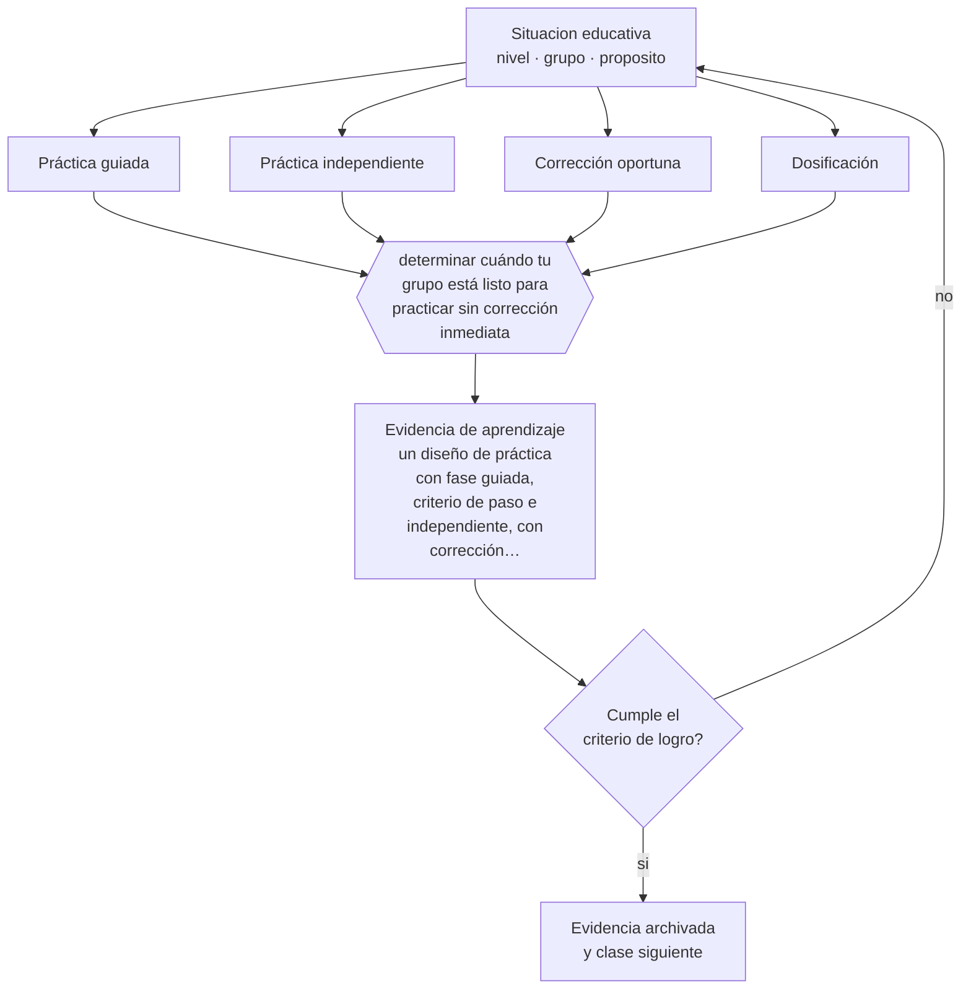

# Clase 128 — Práctica guiada e independiente

> **Parte 10 · Didáctica avanzada** — clase 8 de 12

**Estado de evidencia:** `ROBUSTA` · **Etapa:** 🟣 Etapa C — Núcleo profesional docente · **Población de referencia:** transversal a niveles y disciplinas 
**Decisión que habilita:** determinar cuándo tu grupo está listo para practicar sin corrección inmediata 
**Evidencia de aprendizaje:** un diseño de práctica con fase guiada, criterio de paso e independiente, con corrección planificada

## 🎯 Propósito

Diseñar la transición de práctica guiada a práctica independiente con corrección oportuna, dosificación adecuada y distribución en el tiempo.

## 📚 Resultados de aprendizaje

Al finalizar esta clase podrás:

1. **Definir** con precisión los cuatro conceptos centrales de la clase y reconocerlos en una situación educativa real, no solo en su enunciado.
2. **Explicar** por qué la práctica sin corrección inmediata consolida errores en vez de aprendizajes.
3. **Decidir** —cuándo tu grupo está listo para practicar sin corrección inmediata— y sostener la decisión con un fundamento escrito.
4. **Producir** la evidencia de la clase —un diseño de práctica con fase guiada, criterio de paso e independiente, con corrección planificada— y contrastarla contra el criterio de logro.
5. **Distinguir** lo que la evidencia sostiene de lo que es práctica instalada, preferencia personal o costumbre de la institución.

## 🧩 Conceptos centrales

| Concepto | Comprensión verificable |
|---|---|
| **Práctica guiada** | ejecución del estudiante con verificación y corrección inmediata del docente |
| **Práctica independiente** | ejecución autónoma, cuando el desempeño ya es correcto de forma consistente |
| **Corrección oportuna** | retroalimentación entregada antes de que el error se consolide |
| **Dosificación** | cantidad y distribución de la práctica necesaria para automatizar sin saturar |

## 🗺️ Flujo de razonamiento

## 📖 Desarrollo

### 1. El fondo del asunto

El error más costoso en la enseñanza de procedimientos es dejar practicar demasiado pronto sin corrección: el estudiante repite el procedimiento equivocado hasta automatizarlo, y desaprenderlo cuesta mucho más que aprenderlo bien la primera vez. La regla derivada de la investigación sobre docentes eficaces es simple: no se pasa a práctica independiente hasta que el desempeño guiado es correcto de forma consistente.

### 2. Cómo se traduce en decisiones de enseñanza

El diseño explicita el criterio de paso —por ejemplo, tres ejecuciones correctas seguidas— y organiza la corrección: quién corrige, cuándo y cómo, considerando que un docente no puede revisar treinta ejecuciones simultáneas. Autocorrección con pauta, corrección entre pares con criterios y muestreo del docente son alternativas viables. Y la práctica se distribuye en el tiempo en vez de concentrarse.

### 3. Qué sostiene la evidencia y qué no

La práctica excesiva sin variación produce ejecución rígida que no transfiere. Y la corrección inmediata, útil al inicio, puede volverse contraproducente después: en fases avanzadas, demorar la retroalimentación favorece la retención. Ajustar el momento de la corrección según la fase es parte del oficio.

> **Cómo leer el estado de evidencia `ROBUSTA`.** Hay evidencia convergente de varios equipos, países y diseños de investigación, incluidos estudios experimentales o cuasiexperimentales, y el efecto se sostiene al replicarlo. Puedes apoyar una decisión profesional en ella, sin olvidar que ningún efecto promedio describe a un estudiante concreto.

## 🧪 Taller guiado

Aplica la clase a **uno** de los contextos siguientes y repite después el ejercicio en un
contexto de exigencia distinta. Cambiar de contexto es parte del aprendizaje: lo que funciona
con un grupo no se traslada intacto a otro.

| Contexto | Rasgo que cambia la decisión |
|---|---|
| Contenido conceptual abstracto | los ejemplos y contraejemplos hacen el trabajo pesado |
| Contenido procedimental | el modelamiento y la corrección inmediata dominan |
| Curso numeroso | verificar comprensión de todos exige técnica, no buena voluntad |
| Clase con conocimiento previo desigual | el andamiaje debe ser diferenciado |
| Modalidad en línea sincrónica | la verificación de comprensión debe rediseñarse |
| Sesión única de capacitación | no hay segunda oportunidad para corregir la secuencia |

**Secuencia de trabajo:**

1. Delimita el contexto: nivel, edad, tamaño del grupo, asignatura o experiencia y tiempo real disponible.
2. Declara qué saben ya los estudiantes y **cómo lo comprobaste**, no cómo lo supones.
3. Formula la decisión pedagógica que esta clase habilita y escribe su fundamento.
4. Anticipa qué observarías si la decisión funciona y qué observarías si no funciona.
5. Diseña de antemano la alternativa que aplicarás si la primera estrategia falla.
6. Ejecuta o simula, y registra lo observado con fecha, contexto y evidencia concreta.
7. Produce la evidencia de aprendizaje de la clase.
8. Contrástala contra el criterio de logro, corrige y recién entonces avanza.

### 📦 Evidencia de aprendizaje

Un diseño de práctica con fase guiada, criterio de paso e independiente, con corrección planificada.

Debe incluir contexto, decisión, fundamento, fuentes consultadas con su fecha, indicador de
logro observable, riesgos previstos y qué harías distinto en la siguiente iteración.

## 🏆 Reto verificable

Aplica un criterio explícito de paso a práctica independiente durante una unidad. Compara la cantidad de errores consolidados con la unidad anterior.

## ✅ Criterio de logro

- [ ] el diseño declara el criterio de paso a práctica independiente;
- [ ] la corrección está planificada y es viable con el número real de estudiantes;
- [ ] cada afirmación sobre «lo que funciona» está atribuida a una fuente identificable, con autor y fecha;
- [ ] la decisión es ejecutable con el tiempo, el espacio, el número de estudiantes y los recursos que realmente tienes;
- [ ] la evidencia queda archivada de forma reproducible: otra persona podría revisarla sin que tú se la expliques.

## ⚠️ Errores frecuentes

**Propios de esta clase:**

- Enviar a práctica independiente antes de comprobar desempeño correcto consistente.
- Concentrar toda la práctica en una sesión y no volver sobre el procedimiento.

**Característicos de la parte 10:**

- Adoptar una metodología sin verificar si se cumplen sus condiciones de eficacia.
- Explicar sin anticipar el error que el contenido produce siempre.

## ♿ Diversidad, accesibilidad y ética

Los estudiantes sin apoyo en casa dependen enteramente de que la práctica corregida ocurra en clase. Enviar práctica sin corrección como tarea domiciliaria amplía la brecha en vez de reducirla.

Antes de aplicar cualquier decisión de esta clase con estudiantes reales, revisa el
[protocolo de práctica responsable](../../../docs/ETICA_Y_PRACTICA_RESPONSABLE.md):
consentimiento, resguardo de datos personales, proporcionalidad de la intervención y derecho
de cada estudiante a no ser objeto de un ensayo que no le reporta beneficio.

## ❓ Preguntas de comprobación

1. ¿Cuántas ejecuciones correctas necesitas ver antes de soltar?
2. ¿Quién corrige la práctica de treinta estudiantes y cómo?
3. ¿Cuándo vuelven a practicar este procedimiento?

## 📕 Lecturas base

**Rosenshine, B. (2012). *Principles of Instruction*.**  
*Qué aporta a esta clase:* establece la secuencia de práctica guiada e independiente con sus criterios.

**Soderstrom, N. & Bjork, R. (2015). *Learning versus Performance*.**  
*Qué aporta a esta clase:* distingue desempeño inmediato de aprendizaje duradero; clave para dosificar y distribuir.

Catálogo completo: [bibliografía del programa](../../../docs/BIBLIOGRAFIA.md) ·
[glosario](../../../docs/GLOSARIO.md) ·
[fuentes oficiales y cómo leerlas](../../../docs/FUENTES.md).

## 🔗 Conexión con el resto del programa

Cierra la secuencia de las clases 126 y 127 y se apoya en la clase 020.

> [!IMPORTANT]
> Material de formación profesional. No reemplaza un título de pedagogía, una habilitación
> legal para ejercer, ni el juicio de un equipo educativo que conoce a sus estudiantes.

---

| Anterior | Índice | Siguiente |
|---|---|---|
| [← 127 · Scaffolding](../class-07-scaffolding/README.md) | [Parte 10](../README.md) · [Programa](../../../README.md) | [129 · Aprendizaje colaborativo →](../class-09-aprendizaje-colaborativo/README.md) |
