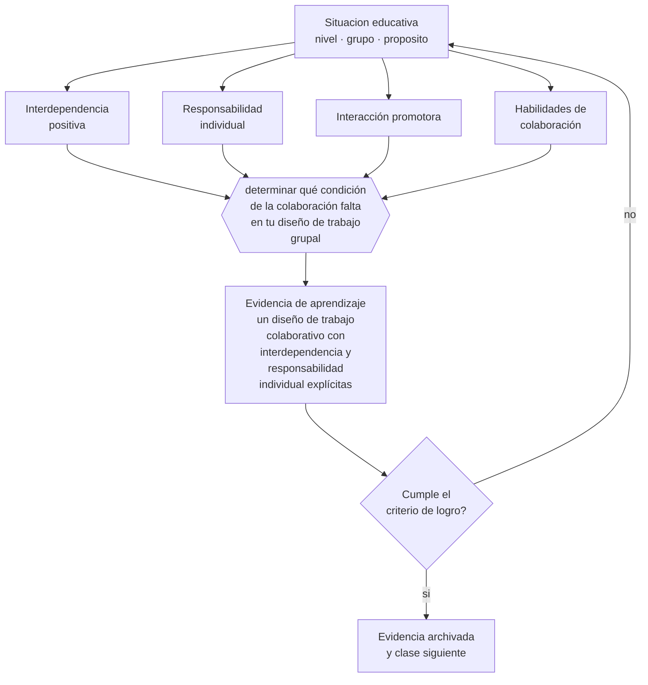

# Clase 129 — Aprendizaje colaborativo

> **Parte 10 · Didáctica avanzada** — clase 9 de 12

**Estado de evidencia:** `ROBUSTA` · **Etapa:** 🟣 Etapa C — Núcleo profesional docente · **Población de referencia:** transversal a niveles y disciplinas 
**Decisión que habilita:** determinar qué condición de la colaboración falta en tu diseño de trabajo grupal 
**Evidencia de aprendizaje:** un diseño de trabajo colaborativo con interdependencia y responsabilidad individual explícitas

## 🎯 Propósito

Diseñar aprendizaje colaborativo con las condiciones que la evidencia identifica: interdependencia positiva, responsabilidad individual, interacción promotora, habilidades sociales y evaluación del proceso.

## 📚 Resultados de aprendizaje

Al finalizar esta clase podrás:

1. **Definir** con precisión los cuatro conceptos centrales de la clase y reconocerlos en una situación educativa real, no solo en su enunciado.
2. **Explicar** qué condiciones convierten un trabajo en grupo en aprendizaje colaborativo real.
3. **Decidir** —qué condición de la colaboración falta en tu diseño de trabajo grupal— y sostener la decisión con un fundamento escrito.
4. **Producir** la evidencia de la clase —un diseño de trabajo colaborativo con interdependencia y responsabilidad individual explícitas— y contrastarla contra el criterio de logro.
5. **Distinguir** lo que la evidencia sostiene de lo que es práctica instalada, preferencia personal o costumbre de la institución.

## 🧩 Conceptos centrales

| Concepto | Comprensión verificable |
|---|---|
| **Interdependencia positiva** | estructura en que el logro de uno requiere el logro de los demás |
| **Responsabilidad individual** | exigencia de que cada integrante responda por su aprendizaje, no solo el grupo por el producto |
| **Interacción promotora** | dinámica en que los integrantes se explican, se corrigen y se apoyan efectivamente |
| **Habilidades de colaboración** | conductas concretas —escuchar, pedir aclaración, distribuir— que se enseñan explícitamente |

## 🗺️ Flujo de razonamiento

## 📖 Desarrollo

### 1. El fondo del asunto

Poner a los estudiantes en grupos no produce aprendizaje colaborativo: produce reparto de tareas, donde uno hace, otro copia y otro se desconecta. La investigación identifica condiciones específicas que hacen la diferencia, y la más determinante es la combinación de interdependencia positiva con responsabilidad individual: la tarea debe requerir a todos y cada uno debe responder por lo aprendido.

### 2. Cómo se traduce en decisiones de enseñanza

Diseñar estas condiciones exige decisiones concretas: información distribuida entre integrantes, roles con función real, evaluación individual del contenido además del producto grupal, y enseñanza explícita de las conductas de colaboración. Los grupos de tres a cuatro funcionan mejor que los grandes, donde la desconexión es más fácil.

### 3. Qué sostiene la evidencia y qué no

El aprendizaje colaborativo tiene evidencia sólida cuando se cumplen sus condiciones y resultados pobres cuando no. También tiene costos: consume más tiempo que la instrucción directa para el mismo contenido, de modo que conviene reservarlo para objetivos que lo justifiquen —explicar, argumentar, resolver problemas complejos— y no para todo.

> **Cómo leer el estado de evidencia `ROBUSTA`.** Hay evidencia convergente de varios equipos, países y diseños de investigación, incluidos estudios experimentales o cuasiexperimentales, y el efecto se sostiene al replicarlo. Puedes apoyar una decisión profesional en ella, sin olvidar que ningún efecto promedio describe a un estudiante concreto.

## 🧪 Taller guiado

Aplica la clase a **uno** de los contextos siguientes y repite después el ejercicio en un
contexto de exigencia distinta. Cambiar de contexto es parte del aprendizaje: lo que funciona
con un grupo no se traslada intacto a otro.

| Contexto | Rasgo que cambia la decisión |
|---|---|
| Contenido conceptual abstracto | los ejemplos y contraejemplos hacen el trabajo pesado |
| Contenido procedimental | el modelamiento y la corrección inmediata dominan |
| Curso numeroso | verificar comprensión de todos exige técnica, no buena voluntad |
| Clase con conocimiento previo desigual | el andamiaje debe ser diferenciado |
| Modalidad en línea sincrónica | la verificación de comprensión debe rediseñarse |
| Sesión única de capacitación | no hay segunda oportunidad para corregir la secuencia |

**Secuencia de trabajo:**

1. Delimita el contexto: nivel, edad, tamaño del grupo, asignatura o experiencia y tiempo real disponible.
2. Declara qué saben ya los estudiantes y **cómo lo comprobaste**, no cómo lo supones.
3. Formula la decisión pedagógica que esta clase habilita y escribe su fundamento.
4. Anticipa qué observarías si la decisión funciona y qué observarías si no funciona.
5. Diseña de antemano la alternativa que aplicarás si la primera estrategia falla.
6. Ejecuta o simula, y registra lo observado con fecha, contexto y evidencia concreta.
7. Produce la evidencia de aprendizaje de la clase.
8. Contrástala contra el criterio de logro, corrige y recién entonces avanza.

### 📦 Evidencia de aprendizaje

Un diseño de trabajo colaborativo con interdependencia y responsabilidad individual explícitas.

Debe incluir contexto, decisión, fundamento, fuentes consultadas con su fecha, indicador de
logro observable, riesgos previstos y qué harías distinto en la siguiente iteración.

## 🏆 Reto verificable

Rediseña un trabajo grupal con interdependencia y responsabilidad individual. Compara el aprendizaje individual con el de la versión anterior.

## ✅ Criterio de logro

- [ ] la tarea exige genuinamente a todos los integrantes para completarse;
- [ ] existe evaluación individual del aprendizaje además del producto del grupo;
- [ ] cada afirmación sobre «lo que funciona» está atribuida a una fuente identificable, con autor y fecha;
- [ ] la decisión es ejecutable con el tiempo, el espacio, el número de estudiantes y los recursos que realmente tienes;
- [ ] la evidencia queda archivada de forma reproducible: otra persona podría revisarla sin que tú se la expliques.

## ⚠️ Errores frecuentes

**Propios de esta clase:**

- Evaluar solo el producto grupal, con lo que se premia el reparto y no el aprendizaje.
- Suponer que las habilidades de colaboración están disponibles sin haberlas enseñado.

**Característicos de la parte 10:**

- Adoptar una metodología sin verificar si se cumplen sus condiciones de eficacia.
- Explicar sin anticipar el error que el contenido produce siempre.

## ♿ Diversidad, accesibilidad y ética

Sin condiciones explícitas, el trabajo grupal reproduce las jerarquías del curso: los mismos deciden, los mismos ejecutan y los mismos quedan al margen. Roles asignados y responsabilidad individual corrigen esa dinámica.

Antes de aplicar cualquier decisión de esta clase con estudiantes reales, revisa el
[protocolo de práctica responsable](../../../docs/ETICA_Y_PRACTICA_RESPONSABLE.md):
consentimiento, resguardo de datos personales, proporcionalidad de la intervención y derecho
de cada estudiante a no ser objeto de un ensayo que no le reporta beneficio.

## ❓ Preguntas de comprobación

1. ¿Podría un integrante completar la tarea solo? Si sí, no hay interdependencia.
2. ¿Cómo sabes qué aprendió cada uno?
3. ¿Qué conducta de colaboración enseñaste explícitamente este semestre?

## 📕 Lecturas base

**Johnson, D. & Johnson, R. (2009). *An Educational Psychology Success Story*.**  
*Qué aporta a esta clase:* define las cinco condiciones del aprendizaje cooperativo con la evidencia acumulada.

**Slavin, R. (2014). *Cooperative Learning and Academic Achievement*.**  
*Qué aporta a esta clase:* revisa qué estructuras cooperativas producen efectos y cuáles no.

Catálogo completo: [bibliografía del programa](../../../docs/BIBLIOGRAFIA.md) ·
[glosario](../../../docs/GLOSARIO.md) ·
[fuentes oficiales y cómo leerlas](../../../docs/FUENTES.md).

## 🔗 Conexión con el resto del programa

Se apoya en la clase 016 y condiciona el diseño de las clases 065 y 132.

> [!IMPORTANT]
> Material de formación profesional. No reemplaza un título de pedagogía, una habilitación
> legal para ejercer, ni el juicio de un equipo educativo que conoce a sus estudiantes.

---

| Anterior | Índice | Siguiente |
|---|---|---|
| [← 128 · Práctica guiada e independiente](../class-08-practica-guiada-e-independiente/README.md) | [Parte 10](../README.md) · [Programa](../../../README.md) | [130 · Flipped classroom →](../class-10-flipped-classroom/README.md) |
