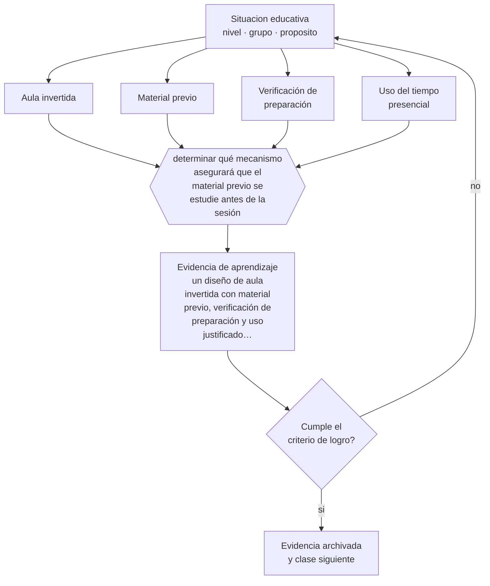

# Clase 130 — Flipped classroom

> **Parte 10 · Didáctica avanzada** — clase 10 de 12

**Estado de evidencia:** `EN-DEBATE` · **Etapa:** 🟣 Etapa C — Núcleo profesional docente · **Población de referencia:** transversal a niveles y disciplinas 
**Decisión que habilita:** determinar qué mecanismo asegurará que el material previo se estudie antes de la sesión 
**Evidencia de aprendizaje:** un diseño de aula invertida con material previo, verificación de preparación y uso justificado del tiempo presencial

## 🎯 Propósito

Diseñar aula invertida con sus condiciones de funcionamiento: material previo breve y verificado, tiempo de clase dedicado a práctica y aplicación, y mecanismo real que asegure la preparación.

## 📚 Resultados de aprendizaje

Al finalizar esta clase podrás:

1. **Definir** con precisión los cuatro conceptos centrales de la clase y reconocerlos en una situación educativa real, no solo en su enunciado.
2. **Explicar** qué hace funcionar el aula invertida y por qué fracasa cuando nadie estudia el material previo.
3. **Decidir** —qué mecanismo asegurará que el material previo se estudie antes de la sesión— y sostener la decisión con un fundamento escrito.
4. **Producir** la evidencia de la clase —un diseño de aula invertida con material previo, verificación de preparación y uso justificado del tiempo presencial— y contrastarla contra el criterio de logro.
5. **Distinguir** lo que la evidencia sostiene de lo que es práctica instalada, preferencia personal o costumbre de la institución.

## 🧩 Conceptos centrales

| Concepto | Comprensión verificable |
|---|---|
| **Aula invertida** | modelo que traslada la primera exposición al contenido fuera de la sesión y usa el tiempo presencial para práctica |
| **Material previo** | recurso breve y estructurado que el estudiante trabaja antes de la clase |
| **Verificación de preparación** | mecanismo que comprueba y hace consecuente el trabajo previo |
| **Uso del tiempo presencial** | actividades que aprovechan la presencia del docente y de los pares |

## 🗺️ Flujo de razonamiento

## 📖 Desarrollo

### 1. El fondo del asunto

El aula invertida tiene una lógica sólida: si la exposición puede consumirse de forma asincrónica, el tiempo presencial se reserva para lo que requiere al docente y a los pares —práctica corregida, resolución de dificultades, discusión—. La condición crítica es que el material previo se trabaje efectivamente, y ahí fracasa la mayoría de las implementaciones. Sin verificación con consecuencia, entre la mitad y dos tercios llega sin preparación.

### 2. Cómo se traduce en decisiones de enseñanza

El diseño requiere material breve —no una clase grabada de cincuenta minutos—, con preguntas incorporadas, y una verificación al inicio de la sesión que tenga alguna consecuencia. Y el tiempo presencial debe cambiar realmente: si se vuelve a explicar lo mismo, el modelo se anula y los estudiantes aprenden que no vale la pena prepararse.

### 3. Qué sostiene la evidencia y qué no

Los metaanálisis muestran efectos positivos pequeños a moderados, con alta heterogeneidad y dependientes del diseño. El modelo traslada carga de trabajo al estudiante y penaliza a quienes tienen menos tiempo o peor conectividad, lo que puede aumentar desigualdades si no se compensa.

> **Cómo leer el estado de evidencia `EN-DEBATE`.** Hay desacuerdo activo y publicado entre especialistas competentes. La clase presenta las posiciones y sus argumentos; tu tarea no es escoger un bando, sino saber qué evidencia te haría cambiar de posición.

## 🧪 Taller guiado

Aplica la clase a **uno** de los contextos siguientes y repite después el ejercicio en un
contexto de exigencia distinta. Cambiar de contexto es parte del aprendizaje: lo que funciona
con un grupo no se traslada intacto a otro.

| Contexto | Rasgo que cambia la decisión |
|---|---|
| Contenido conceptual abstracto | los ejemplos y contraejemplos hacen el trabajo pesado |
| Contenido procedimental | el modelamiento y la corrección inmediata dominan |
| Curso numeroso | verificar comprensión de todos exige técnica, no buena voluntad |
| Clase con conocimiento previo desigual | el andamiaje debe ser diferenciado |
| Modalidad en línea sincrónica | la verificación de comprensión debe rediseñarse |
| Sesión única de capacitación | no hay segunda oportunidad para corregir la secuencia |

**Secuencia de trabajo:**

1. Delimita el contexto: nivel, edad, tamaño del grupo, asignatura o experiencia y tiempo real disponible.
2. Declara qué saben ya los estudiantes y **cómo lo comprobaste**, no cómo lo supones.
3. Formula la decisión pedagógica que esta clase habilita y escribe su fundamento.
4. Anticipa qué observarías si la decisión funciona y qué observarías si no funciona.
5. Diseña de antemano la alternativa que aplicarás si la primera estrategia falla.
6. Ejecuta o simula, y registra lo observado con fecha, contexto y evidencia concreta.
7. Produce la evidencia de aprendizaje de la clase.
8. Contrástala contra el criterio de logro, corrige y recién entonces avanza.

### 📦 Evidencia de aprendizaje

Un diseño de aula invertida con material previo, verificación de preparación y uso justificado del tiempo presencial.

Debe incluir contexto, decisión, fundamento, fuentes consultadas con su fecha, indicador de
logro observable, riesgos previstos y qué harías distinto en la siguiente iteración.

## 🏆 Reto verificable

Implementa una unidad invertida con verificación de preparación. Mide qué proporción llega preparada y ajusta el mecanismo hasta superar el ochenta por ciento.

## ✅ Criterio de logro

- [ ] el material previo es breve, estructurado y con preguntas incorporadas;
- [ ] existe verificación de preparación con consecuencia al inicio de la sesión;
- [ ] cada afirmación sobre «lo que funciona» está atribuida a una fuente identificable, con autor y fecha;
- [ ] la decisión es ejecutable con el tiempo, el espacio, el número de estudiantes y los recursos que realmente tienes;
- [ ] la evidencia queda archivada de forma reproducible: otra persona podría revisarla sin que tú se la expliques.

## ⚠️ Errores frecuentes

**Propios de esta clase:**

- Grabar la clase completa y llamarlo aula invertida.
- Repetir la explicación en la sesión presencial, con lo que se elimina el incentivo a prepararse.

**Característicos de la parte 10:**

- Adoptar una metodología sin verificar si se cumplen sus condiciones de eficacia.
- Explicar sin anticipar el error que el contenido produce siempre.

## ♿ Diversidad, accesibilidad y ética

El modelo supone tiempo y conectividad fuera de la jornada. En contextos con desigualdad de acceso, ofrecer el material también en formato descargable o en tiempo de escuela evita que el diseño excluya a quienes menos recursos tienen.

Antes de aplicar cualquier decisión de esta clase con estudiantes reales, revisa el
[protocolo de práctica responsable](../../../docs/ETICA_Y_PRACTICA_RESPONSABLE.md):
consentimiento, resguardo de datos personales, proporcionalidad de la intervención y derecho
de cada estudiante a no ser objeto de un ensayo que no le reporta beneficio.

## ❓ Preguntas de comprobación

1. ¿Qué proporción de tu curso llega realmente preparada?
2. ¿Qué haces en la sesión que no podrías hacer sin la preparación previa?
3. ¿Quién no puede estudiar el material previo por sus condiciones, y cómo lo compensas?

## 📕 Lecturas base

**Abeysekera, L. & Dawson, P. (2015). *Motivation and Cognitive Load in the Flipped Classroom*.**  
*Qué aporta a esta clase:* analiza los mecanismos que explicarían el efecto y sus condiciones.

**van Alten, D. et al. (2019). *Effects of Flipping the Classroom on Learning: A Meta-Analysis*.**  
*Qué aporta a esta clase:* síntesis con efectos, heterogeneidad y variables moderadoras.

Catálogo completo: [bibliografía del programa](../../../docs/BIBLIOGRAFIA.md) ·
[glosario](../../../docs/GLOSARIO.md) ·
[fuentes oficiales y cómo leerlas](../../../docs/FUENTES.md).

## 🔗 Conexión con el resto del programa

Se apoya en las clases 122 y 128 y su implementación técnica se trabaja en la parte 13.

> [!IMPORTANT]
> Material de formación profesional. No reemplaza un título de pedagogía, una habilitación
> legal para ejercer, ni el juicio de un equipo educativo que conoce a sus estudiantes.

---

| Anterior | Índice | Siguiente |
|---|---|---|
| [← 129 · Aprendizaje colaborativo](../class-09-aprendizaje-colaborativo/README.md) | [Parte 10](../README.md) · [Programa](../../../README.md) | [131 · Mastery learning →](../class-11-mastery-learning/README.md) |
