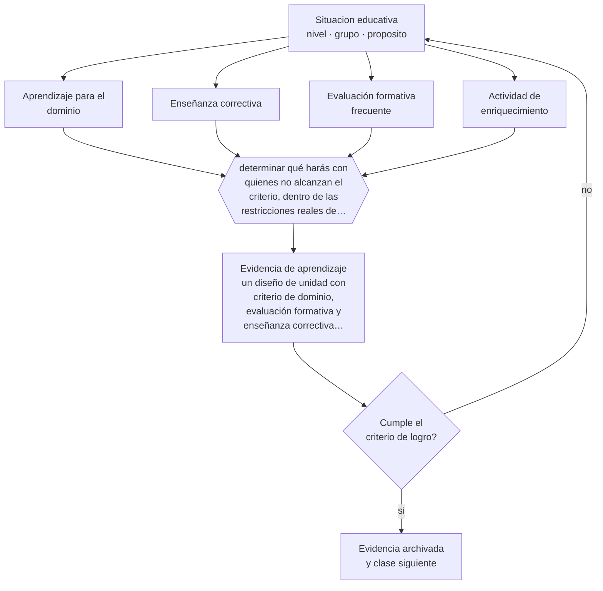

# Clase 131 — Mastery learning

> **Parte 10 · Didáctica avanzada** — clase 11 de 12

**Estado de evidencia:** `CONSISTENTE` · **Etapa:** 🟣 Etapa C — Núcleo profesional docente · **Población de referencia:** transversal a niveles y disciplinas 
**Decisión que habilita:** determinar qué harás con quienes no alcanzan el criterio, dentro de las restricciones reales de tu calendario 
**Evidencia de aprendizaje:** un diseño de unidad con criterio de dominio, evaluación formativa y enseñanza correctiva planificada

## 🎯 Propósito

Aplicar la lógica del aprendizaje para el dominio: criterio de logro fijo, tiempo variable, evaluación formativa frecuente y enseñanza correctiva antes de avanzar.

## 📚 Resultados de aprendizaje

Al finalizar esta clase podrás:

1. **Definir** con precisión los cuatro conceptos centrales de la clase y reconocerlos en una situación educativa real, no solo en su enunciado.
2. **Explicar** qué implica realmente enseñar para el dominio cuando el calendario no se puede mover.
3. **Decidir** —qué harás con quienes no alcanzan el criterio, dentro de las restricciones reales de tu calendario— y sostener la decisión con un fundamento escrito.
4. **Producir** la evidencia de la clase —un diseño de unidad con criterio de dominio, evaluación formativa y enseñanza correctiva planificada— y contrastarla contra el criterio de logro.
5. **Distinguir** lo que la evidencia sostiene de lo que es práctica instalada, preferencia personal o costumbre de la institución.

## 🧩 Conceptos centrales

| Concepto | Comprensión verificable |
|---|---|
| **Aprendizaje para el dominio** | enfoque que fija el nivel de logro y permite variar el tiempo hasta alcanzarlo |
| **Enseñanza correctiva** | enseñanza distinta —no repetición— dirigida a quienes no alcanzaron el criterio |
| **Evaluación formativa frecuente** | comprobación periódica que identifica a tiempo a quienes no logran el criterio |
| **Actividad de enriquecimiento** | trabajo con mayor exigencia para quienes ya alcanzaron el criterio |

## 🗺️ Flujo de razonamiento

## 📖 Desarrollo

### 1. El fondo del asunto

La lógica del dominio invierte la variable que se deja libre: en vez de fijar el tiempo y aceptar resultados dispares, fija el resultado y permite variar el tiempo. Su evidencia es favorable, sobre todo para estudiantes con menor desempeño previo. Su dificultad es organizacional: los calendarios escolares y universitarios están construidos sobre tiempo fijo, y sin margen para el tiempo variable el enfoque se convierte en una declaración.

### 2. Cómo se traduce en decisiones de enseñanza

La implementación realista trabaja dentro de la restricción: unidades más cortas con evaluación formativa al cierre, enseñanza correctiva para quienes no alcanzan el criterio mientras el resto realiza enriquecimiento, y un segundo intento con instrumento equivalente. La clave es que la enseñanza correctiva sea distinta de la original: repetir lo mismo más lento no funciona.

### 3. Qué sostiene la evidencia y qué no

El enfoque exige tiempo docente adicional y materiales alternativos, y su efecto depende de la calidad de la enseñanza correctiva. Además, en cursos con currículo extenso y evaluación externa, detenerse hasta el dominio puede comprometer la cobertura. Es una decisión de priorización que conviene tomar explícitamente y no por omisión.

> **Cómo leer el estado de evidencia `CONSISTENTE`.** La evidencia es amplia y coherente, pero proviene sobre todo de estudios correlacionales, de síntesis con heterogeneidad alta o de contextos distintos al tuyo. Sirve para orientar la decisión y exige que compruebes el efecto en tu propio grupo.

## 🧪 Taller guiado

Aplica la clase a **uno** de los contextos siguientes y repite después el ejercicio en un
contexto de exigencia distinta. Cambiar de contexto es parte del aprendizaje: lo que funciona
con un grupo no se traslada intacto a otro.

| Contexto | Rasgo que cambia la decisión |
|---|---|
| Contenido conceptual abstracto | los ejemplos y contraejemplos hacen el trabajo pesado |
| Contenido procedimental | el modelamiento y la corrección inmediata dominan |
| Curso numeroso | verificar comprensión de todos exige técnica, no buena voluntad |
| Clase con conocimiento previo desigual | el andamiaje debe ser diferenciado |
| Modalidad en línea sincrónica | la verificación de comprensión debe rediseñarse |
| Sesión única de capacitación | no hay segunda oportunidad para corregir la secuencia |

**Secuencia de trabajo:**

1. Delimita el contexto: nivel, edad, tamaño del grupo, asignatura o experiencia y tiempo real disponible.
2. Declara qué saben ya los estudiantes y **cómo lo comprobaste**, no cómo lo supones.
3. Formula la decisión pedagógica que esta clase habilita y escribe su fundamento.
4. Anticipa qué observarías si la decisión funciona y qué observarías si no funciona.
5. Diseña de antemano la alternativa que aplicarás si la primera estrategia falla.
6. Ejecuta o simula, y registra lo observado con fecha, contexto y evidencia concreta.
7. Produce la evidencia de aprendizaje de la clase.
8. Contrástala contra el criterio de logro, corrige y recién entonces avanza.

### 📦 Evidencia de aprendizaje

Un diseño de unidad con criterio de dominio, evaluación formativa y enseñanza correctiva planificada.

Debe incluir contexto, decisión, fundamento, fuentes consultadas con su fecha, indicador de
logro observable, riesgos previstos y qué harías distinto en la siguiente iteración.

## 🏆 Reto verificable

Aplica el enfoque en una unidad corta con enseñanza correctiva real. Compara la proporción de estudiantes que alcanza el criterio con la unidad anterior.

## ✅ Criterio de logro

- [ ] el diseño incluye enseñanza correctiva distinta de la enseñanza original;
- [ ] prevé actividad de enriquecimiento para quienes ya alcanzaron el criterio;
- [ ] cada afirmación sobre «lo que funciona» está atribuida a una fuente identificable, con autor y fecha;
- [ ] la decisión es ejecutable con el tiempo, el espacio, el número de estudiantes y los recursos que realmente tienes;
- [ ] la evidencia queda archivada de forma reproducible: otra persona podría revisarla sin que tú se la expliques.

## ⚠️ Errores frecuentes

**Propios de esta clase:**

- Ofrecer como enseñanza correctiva la misma explicación repetida.
- Declarar aprendizaje para el dominio sin ninguna holgura real de tiempo en la planificación.

**Característicos de la parte 10:**

- Adoptar una metodología sin verificar si se cumplen sus condiciones de eficacia.
- Explicar sin anticipar el error que el contenido produce siempre.

## ♿ Diversidad, accesibilidad y ética

El aprendizaje para el dominio beneficia especialmente a estudiantes con menor desempeño previo, que en el modelo de tiempo fijo acumulan vacíos. Es una de las estructuras de enseñanza más equitativas disponibles, y también una de las más exigentes de sostener.

Antes de aplicar cualquier decisión de esta clase con estudiantes reales, revisa el
[protocolo de práctica responsable](../../../docs/ETICA_Y_PRACTICA_RESPONSABLE.md):
consentimiento, resguardo de datos personales, proporcionalidad de la intervención y derecho
de cada estudiante a no ser objeto de un ensayo que no le reporta beneficio.

## ❓ Preguntas de comprobación

1. ¿Qué haces hoy con quien no alcanzó el criterio, además de anotar la nota?
2. ¿En qué se diferencia tu enseñanza correctiva de la original?
3. ¿Qué holgura real tiene tu calendario para esto?

## 📕 Lecturas base

**Bloom, B. (1968). *Learning for Mastery*.**  
*Qué aporta a esta clase:* la formulación original del enfoque y su fundamento.

**Guskey, T. (2010). *Lessons of Mastery Learning*. Educational Leadership, 68(2).**  
*Qué aporta a esta clase:* revisa qué se implementa mal y qué condiciones hacen funcionar el enfoque.

Catálogo completo: [bibliografía del programa](../../../docs/BIBLIOGRAFIA.md) ·
[glosario](../../../docs/GLOSARIO.md) ·
[fuentes oficiales y cómo leerlas](../../../docs/FUENTES.md).

## 🔗 Conexión con el resto del programa

Se apoya en las clases 058 y 128 y anticipa el problema de la parte 11 sobre evaluación con consecuencias.

> [!IMPORTANT]
> Material de formación profesional. No reemplaza un título de pedagogía, una habilitación
> legal para ejercer, ni el juicio de un equipo educativo que conoce a sus estudiantes.

---

| Anterior | Índice | Siguiente |
|---|---|---|
| [← 130 · Flipped classroom](../class-10-flipped-classroom/README.md) | [Parte 10](../README.md) · [Programa](../../../README.md) | [132 · Proyecto integrador: secuencia didáctica →](../class-12-proyecto-integrador-secuencia-didactica/README.md) |
