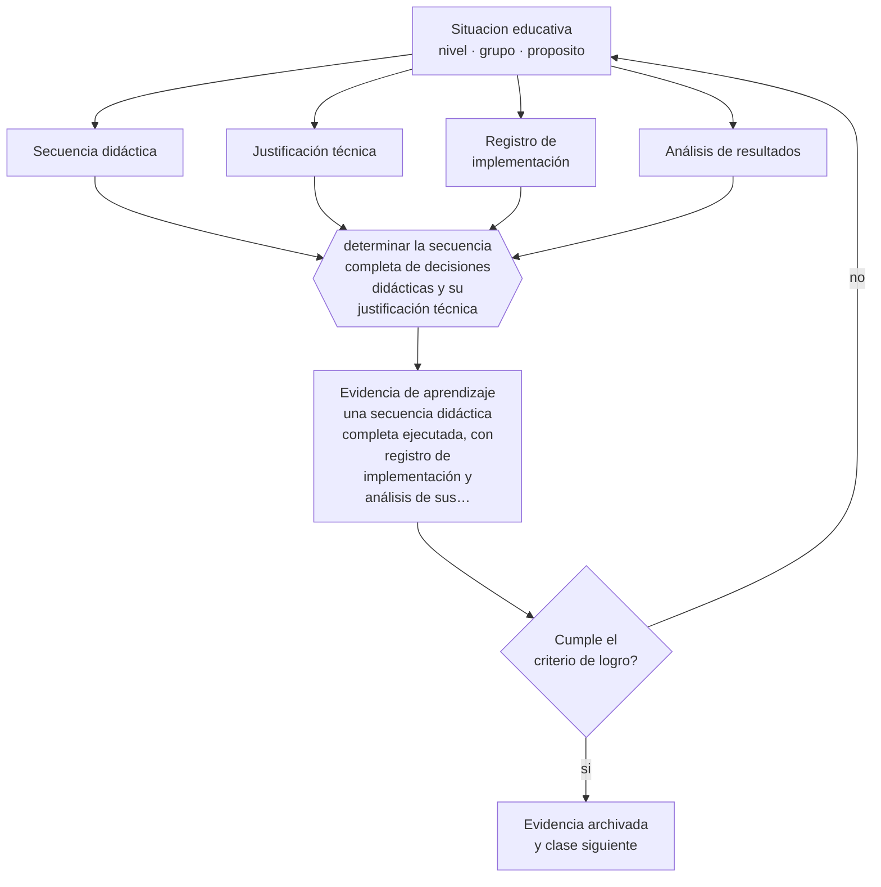

# Clase 132 — Proyecto integrador: secuencia didáctica

> **Parte 10 · Didáctica avanzada** — clase 12 de 12

**Estado de evidencia:** `ROBUSTA` · **Etapa:** 🟣 Etapa C — Núcleo profesional docente · **Población de referencia:** transversal a niveles y disciplinas 
**Decisión que habilita:** determinar la secuencia completa de decisiones didácticas y su justificación técnica 
**Evidencia de aprendizaje:** una secuencia didáctica completa ejecutada, con registro de implementación y análisis de sus resultados

## 🎯 Propósito

Integrar la parte diseñando y ejecutando una secuencia didáctica completa que combine explicación, modelamiento, andamiaje, práctica, verificación y colaboración con criterio.

## 📚 Resultados de aprendizaje

Al finalizar esta clase podrás:

1. **Definir** con precisión los cuatro conceptos centrales de la clase y reconocerlos en una situación educativa real, no solo en su enunciado.
2. **Explicar** cómo se articulan todas las técnicas de la parte en una secuencia que se sostiene en el tiempo real de clase.
3. **Decidir** —la secuencia completa de decisiones didácticas y su justificación técnica— y sostener la decisión con un fundamento escrito.
4. **Producir** la evidencia de la clase —una secuencia didáctica completa ejecutada, con registro de implementación y análisis de sus resultados— y contrastarla contra el criterio de logro.
5. **Distinguir** lo que la evidencia sostiene de lo que es práctica instalada, preferencia personal o costumbre de la institución.

## 🧩 Conceptos centrales

| Concepto | Comprensión verificable |
|---|---|
| **Secuencia didáctica** | conjunto ordenado de decisiones de enseñanza para un contenido determinado |
| **Justificación técnica** | fundamento de cada decisión en un mecanismo de aprendizaje documentado |
| **Registro de implementación** | documentación de lo que efectivamente ocurrió, incluidas las desviaciones |
| **Análisis de resultados** | comparación entre lo esperado y lo obtenido, con hipótesis sobre las diferencias |

## 🗺️ Flujo de razonamiento

## 📖 Desarrollo

### 1. El fondo del asunto

La secuencia integradora exige elegir: no todas las técnicas caben en una unidad, y usarlas todas produce clases sobrecargadas. La competencia profesional consiste en escoger las que corresponden al contenido, al grupo y al tiempo disponible, y justificar cada elección. Un docente experto no usa más técnicas: usa las adecuadas y las ejecuta bien.

### 2. Cómo se traduce en decisiones de enseñanza

El trabajo incluye diseñar, ejecutar y registrar. El registro de implementación es lo que permite interpretar los resultados: una secuencia que no funcionó puede haber estado mal diseñada o mal ejecutada, y sin registro no se puede distinguir. Ese es el mismo criterio que la parte 16 exige a cualquier investigación.

### 3. Qué sostiene la evidencia y qué no

Una secuencia aplicada una vez, con un grupo, no prueba nada sobre la eficacia de las técnicas: hay efecto de novedad, esfuerzo adicional y particularidades del grupo. Lo que produce es evidencia sobre tu propia práctica, suficiente para decidir la siguiente iteración y no para generalizar.

> **Cómo leer el estado de evidencia `ROBUSTA`.** Hay evidencia convergente de varios equipos, países y diseños de investigación, incluidos estudios experimentales o cuasiexperimentales, y el efecto se sostiene al replicarlo. Puedes apoyar una decisión profesional en ella, sin olvidar que ningún efecto promedio describe a un estudiante concreto.

## 🧪 Taller guiado

Aplica la clase a **uno** de los contextos siguientes y repite después el ejercicio en un
contexto de exigencia distinta. Cambiar de contexto es parte del aprendizaje: lo que funciona
con un grupo no se traslada intacto a otro.

| Contexto | Rasgo que cambia la decisión |
|---|---|
| Contenido conceptual abstracto | los ejemplos y contraejemplos hacen el trabajo pesado |
| Contenido procedimental | el modelamiento y la corrección inmediata dominan |
| Curso numeroso | verificar comprensión de todos exige técnica, no buena voluntad |
| Clase con conocimiento previo desigual | el andamiaje debe ser diferenciado |
| Modalidad en línea sincrónica | la verificación de comprensión debe rediseñarse |
| Sesión única de capacitación | no hay segunda oportunidad para corregir la secuencia |

**Secuencia de trabajo:**

1. Delimita el contexto: nivel, edad, tamaño del grupo, asignatura o experiencia y tiempo real disponible.
2. Declara qué saben ya los estudiantes y **cómo lo comprobaste**, no cómo lo supones.
3. Formula la decisión pedagógica que esta clase habilita y escribe su fundamento.
4. Anticipa qué observarías si la decisión funciona y qué observarías si no funciona.
5. Diseña de antemano la alternativa que aplicarás si la primera estrategia falla.
6. Ejecuta o simula, y registra lo observado con fecha, contexto y evidencia concreta.
7. Produce la evidencia de aprendizaje de la clase.
8. Contrástala contra el criterio de logro, corrige y recién entonces avanza.

### 📦 Evidencia de aprendizaje

Una secuencia didáctica completa ejecutada, con registro de implementación y análisis de sus resultados.

Debe incluir contexto, decisión, fundamento, fuentes consultadas con su fecha, indicador de
logro observable, riesgos previstos y qué harías distinto en la siguiente iteración.

## 🏆 Reto verificable

Ejecuta la secuencia, registra la implementación y analiza los resultados por estudiante. Escribe qué cambiarás y por qué antes de la siguiente iteración.

## ✅ Criterio de logro

- [ ] cada decisión didáctica está justificada por un mecanismo y por el contexto del grupo;
- [ ] el registro de implementación documenta desviaciones y permite interpretar el resultado;
- [ ] cada afirmación sobre «lo que funciona» está atribuida a una fuente identificable, con autor y fecha;
- [ ] la decisión es ejecutable con el tiempo, el espacio, el número de estudiantes y los recursos que realmente tienes;
- [ ] la evidencia queda archivada de forma reproducible: otra persona podría revisarla sin que tú se la expliques.

## ⚠️ Errores frecuentes

**Propios de esta clase:**

- Incorporar todas las técnicas de la parte y sobrecargar la secuencia.
- Interpretar el resultado sin registro de implementación.

**Característicos de la parte 10:**

- Adoptar una metodología sin verificar si se cumplen sus condiciones de eficacia.
- Explicar sin anticipar el error que el contenido produce siempre.

## ♿ Diversidad, accesibilidad y ética

El análisis de resultados debe desagregarse: una secuencia que funcionó en promedio puede haber dejado fuera al mismo tercio de siempre. Mirar quién no aprendió es la parte que convierte el ejercicio en mejora real.

Antes de aplicar cualquier decisión de esta clase con estudiantes reales, revisa el
[protocolo de práctica responsable](../../../docs/ETICA_Y_PRACTICA_RESPONSABLE.md):
consentimiento, resguardo de datos personales, proporcionalidad de la intervención y derecho
de cada estudiante a no ser objeto de un ensayo que no le reporta beneficio.

## ❓ Preguntas de comprobación

1. ¿Qué técnica descartaste y por qué?
2. ¿Qué se desvió de lo planificado y cómo afectó el resultado?
3. ¿Qué cambiarías en la próxima iteración y qué evidencia lo sostiene?

## 📕 Lecturas base

**Rosenshine, B. (2012). *Principles of Instruction*.**  
*Qué aporta a esta clase:* marco de referencia para justificar y ordenar las decisiones de la secuencia.

**Kirschner, P. & Hendrick, C. (2020). *How Learning Happens*.**  
*Qué aporta a esta clase:* modelo de justificación de decisiones didácticas a partir de la investigación.

Catálogo completo: [bibliografía del programa](../../../docs/BIBLIOGRAFIA.md) ·
[glosario](../../../docs/GLOSARIO.md) ·
[fuentes oficiales y cómo leerlas](../../../docs/FUENTES.md).

## 🔗 Conexión con el resto del programa

Cierra la parte 10 integrando sus once clases previas y se conecta con las partes 11 y 16.

> [!IMPORTANT]
> Material de formación profesional. No reemplaza un título de pedagogía, una habilitación
> legal para ejercer, ni el juicio de un equipo educativo que conoce a sus estudiantes.

---

| Anterior | Índice | Siguiente |
|---|---|---|
| [← 131 · Mastery learning](../class-11-mastery-learning/README.md) | [Parte 10](../README.md) · [Programa](../../../README.md) | [Programa completo →](../../../README.md) |
