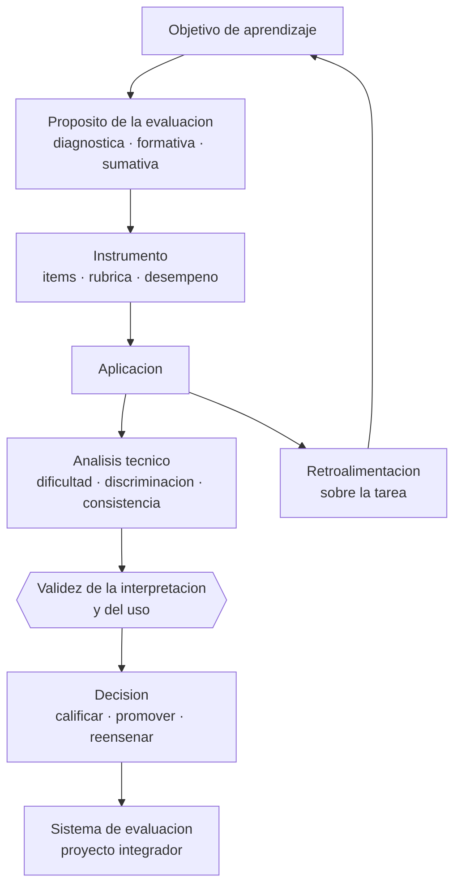

# Parte 11 — Evaluación y psicometría

> *Una nota es una inferencia sobre una persona: exige la misma prueba que cualquier otra*

🟣 **Etapa C — Núcleo profesional docente** · salida de la etapa: diseñar, enseñar, evaluar y gestionar un curso completo con evidencia

**Clases:** 12 (133–144) · **Población de referencia:** transversal, con foco en instrumentos y decisiones · **Conceptos con definición operacional:** 48 
**Contenido central:** Evaluación diagnóstica, formativa, sumativa y auténtica, construcción de ítems, rúbricas, retroalimentación, validez, confiabilidad, análisis de ítems y teoría clásica e IRT

## 🎯 De qué trata esta parte

Evaluar es hacer una inferencia: a partir de un desempeño limitado en un momento concreto se afirma algo sobre lo que una persona sabe o puede hacer. Formulado así, queda claro por qué la validez es el concepto central: no es una propiedad del instrumento sino de la interpretación que se hace con sus resultados y del uso que se le da. Una misma prueba puede ser válida para orientar la enseñanza e inválida para decidir la promoción de un estudiante.

La parte enseña a construir instrumentos y a criticarlos con herramientas técnicas: análisis de dificultad y discriminación, consistencia interna y sus límites, funcionamiento diferencial entre grupos, y las nociones básicas de teoría clásica y de teoría de respuesta al ítem. No para convertir al docente en psicometrista, sino para que pueda leer un informe técnico —de una prueba estandarizada, de un sistema nacional— sin que le vendan como precisión lo que es ruido.

El otro eje es la retroalimentación, que es el punto donde la evaluación se convierte en enseñanza. La evidencia es clara en una cosa incómoda: entregar nota y comentario juntos anula el efecto del comentario, porque la atención va a la nota. Y es matizada en otra: la retroalimentación no siempre mejora el desempeño; puede empeorarlo cuando se dirige a la persona en vez de a la tarea. Esa distinción, bien aplicada, cambia más resultados que cualquier rediseño de prueba.

## 📚 Resultados de la parte

Al terminar esta parte podrás:

1. **Construir instrumentos alineados con el objetivo y defender su validez**.
2. **Analizar técnicamente una prueba aplicada y corregir sus ítems defectuosos**.
3. **Diseñar retroalimentación que produzca cambio en el trabajo del estudiante**.
4. **Leer críticamente resultados de evaluaciones estandarizadas nacionales o internacionales**.

## 🗺️ Mapa de la parte

## 🧠 Marco de referencia

- validez como argumento sobre la interpretación y el uso de los puntajes
- confiabilidad, error de medida y sus consecuencias en decisiones individuales
- teoría clásica de los tests y nociones básicas de teoría de respuesta al ítem
- evaluación formativa y retroalimentación efectiva

**Autoras y autores que conviene conocer:** Samuel Messick, Michael Kane, Lee Cronbach, Paul Black y Dylan Wiliam, John Hattie y Helen Timperley, Georg Rasch, equipos de la Agencia de Calidad de la Educación

## 📋 Las 12 clases

| # | Clase | Decisión que habilita | Evidencia |
|---:|---|---|---|
| 133 | [Evaluación diagnóstica](class-01-evaluacion-diagnostica/README.md) | determinar qué prerrequisitos vas a medir y qué harás con cada resultado posible | `CONSISTENTE` |
| 134 | [Evaluación formativa](class-02-evaluacion-formativa/README.md) | determinar qué evidencia recogerás y qué decisión de enseñanza modificará | `ROBUSTA` |
| 135 | [Evaluación sumativa](class-03-evaluacion-sumativa/README.md) | determinar qué evidencia sumativa justifica la decisión que vas a tomar sobre cada estudiante | `CONSISTENTE` |
| 136 | [Evaluación auténtica](class-04-evaluacion-autentica/README.md) | determinar qué amenaza a la validez introduce tu tarea auténtica y cómo la controlarás | `CONSISTENTE` |
| 137 | [Construcción de ítems](class-05-construccion-de-items/README.md) | determinar qué formato de ítem corresponde al desempeño que quieres evaluar | `CONSISTENTE` |
| 138 | [Rúbricas y escalas](class-06-rubricas-y-escalas/README.md) | determinar el tipo de rúbrica y los descriptores que sostendrán la consistencia de tu evaluación | `CONSISTENTE` |
| 139 | [Retroalimentación efectiva](class-07-retroalimentacion-efectiva/README.md) | determinar cuándo y cómo entregarás la retroalimentación para que el estudiante pueda usarla | `ROBUSTA` |
| 140 | [Validez](class-08-validez/README.md) | determinar qué afirmación puedes sostener con los resultados de tu evaluación y cuál no | `ROBUSTA` |
| 141 | [Confiabilidad](class-09-confiabilidad/README.md) | determinar si la diferencia de puntaje que estás interpretando supera el error de medida | `ROBUSTA` |
| 142 | [Análisis de dificultad y discriminación](class-10-analisis-de-dificultad-y-discriminacion/README.md) | determinar qué ítems de tu prueba deben corregirse o eliminarse y por qué | `ROBUSTA` |
| 143 | [Introducción a teoría clásica e IRT](class-11-introduccion-a-teoria-clasica-e-irt/README.md) | determinar qué se puede concluir de un informe técnico de una evaluación estandarizada y qué no | `ROBUSTA` |
| 144 | [Proyecto integrador: sistema de evaluación](class-12-proyecto-integrador-sistema-de-evaluacion/README.md) | determinar el conjunto de decisiones de evaluación de tu asignatura y su justificación técnica | `CONSISTENTE` |

## ⚠️ Riesgos característicos

- Atribuir validez al instrumento en vez de a la interpretación y al uso.
- Usar el alfa de Cronbach como sello de calidad sin revisar sus supuestos.
- Entregar nota y comentario juntos y esperar que el comentario opere.
- Tomar decisiones de alto impacto con una sola medición.

## 📕 Lecturas de referencia de la parte

- **AERA, APA & NCME (2014). *Standards for Educational and Psychological Testing*.** — el estándar técnico de referencia internacional; define qué se puede afirmar con un puntaje y qué no.
- **Messick, S. (1989). *Validity*. En Educational Measurement.** — el capítulo que reorganiza la validez como juicio integrado sobre interpretación y consecuencias.
- **Black, P. & Wiliam, D. (1998). *Assessment and Classroom Learning*. Assessment in Education, 5(1).** — la revisión que instala la evaluación formativa como intervención con efecto y no como discurso.
- **Hattie, J. & Timperley, H. (2007). *The Power of Feedback*. Review of Educational Research, 77(1).** — modelo de retroalimentación por niveles; explica por qué el elogio a la persona no mejora el desempeño.

## ✅ Evidencia mínima para dar la parte por cerrada

- [ ] un instrumento construido con tabla de especificaciones y argumento de validez;
- [ ] el análisis técnico de una prueba aplicada con ítems corregidos;
- [ ] una rúbrica calibrada entre al menos dos evaluadores;
- [ ] un sistema de evaluación de asignatura completo y defendible.

---

| Anterior | Índice | Siguiente |
|---|---|---|
| [← Parte 10 · Didáctica avanzada](../part-10-didactica-avanzada/README.md) | [Programa](../../README.md) · [Currículo](../../CURRICULUM.md) | [Parte 12 · Gestión del aula y convivencia →](../part-12-gestion-del-aula-y-convivencia/README.md) |
