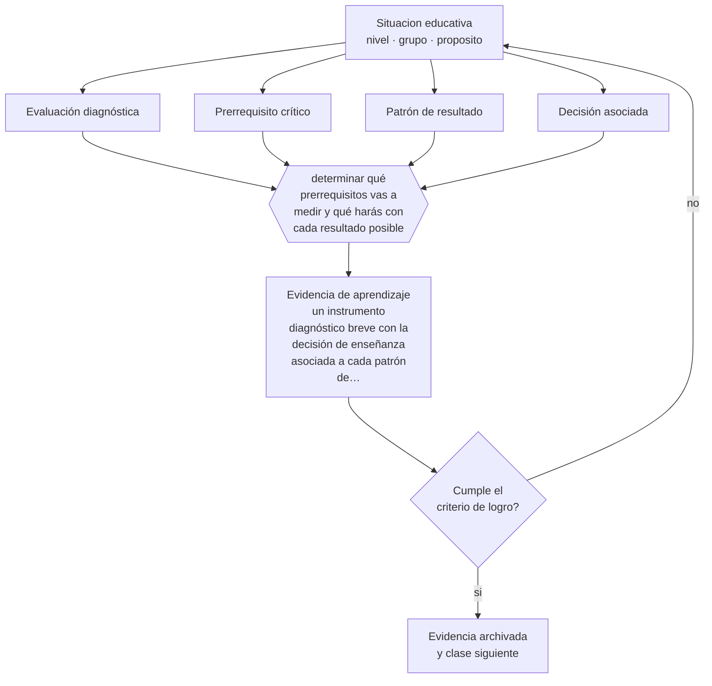

# Clase 133 — Evaluación diagnóstica

> **Parte 11 · Evaluación y psicometría** — clase 1 de 12

**Estado de evidencia:** `CONSISTENTE` · **Etapa:** 🟣 Etapa C — Núcleo profesional docente · **Población de referencia:** transversal, con foco en instrumentos y decisiones 
**Decisión que habilita:** determinar qué prerrequisitos vas a medir y qué harás con cada resultado posible 
**Evidencia de aprendizaje:** un instrumento diagnóstico breve con la decisión de enseñanza asociada a cada patrón de resultado

## 🎯 Propósito

Diseñar evaluación diagnóstica útil: acotada a los prerrequisitos que condicionan la unidad, interpretable en el momento y conectada con una decisión de enseñanza.

## 📚 Resultados de aprendizaje

Al finalizar esta clase podrás:

1. **Definir** con precisión los cuatro conceptos centrales de la clase y reconocerlos en una situación educativa real, no solo en su enunciado.
2. **Explicar** para qué sirve una evaluación diagnóstica que nadie usa para cambiar la planificación.
3. **Decidir** —qué prerrequisitos vas a medir y qué harás con cada resultado posible— y sostener la decisión con un fundamento escrito.
4. **Producir** la evidencia de la clase —un instrumento diagnóstico breve con la decisión de enseñanza asociada a cada patrón de resultado— y contrastarla contra el criterio de logro.
5. **Distinguir** lo que la evidencia sostiene de lo que es práctica instalada, preferencia personal o costumbre de la institución.

## 🧩 Conceptos centrales

| Concepto | Comprensión verificable |
|---|---|
| **Evaluación diagnóstica** | recogida de información previa sobre conocimiento y dificultades que condicionan la unidad |
| **Prerrequisito crítico** | conocimiento sin el cual la unidad no puede comprenderse |
| **Patrón de resultado** | combinación típica de aciertos y errores que sugiere una decisión distinta |
| **Decisión asociada** | acción de enseñanza definida de antemano para cada resultado posible |

## 🗺️ Flujo de razonamiento

## 📖 Desarrollo

### 1. El fondo del asunto

Muchos diagnósticos escolares son largos, generales y sin consecuencia: se aplican en marzo, se archivan y la planificación sigue igual. Un diagnóstico útil es breve, se enfoca en los dos o tres prerrequisitos que realmente condicionan la unidad, y tiene decisiones asociadas escritas antes de aplicarlo. Si ningún resultado posible cambiaría tu planificación, no vale la pena aplicarlo.

### 2. Cómo se traduce en decisiones de enseñanza

El diseño empieza identificando el prerrequisito crítico —lo que si falta hace imposible la unidad— y construyendo pocas preguntas que lo revelen, incluidos distractores que expongan errores específicos. Después se escriben las decisiones: si más del treinta por ciento falla en esto, se dedica una sesión a recuperarlo antes de avanzar.

### 3. Qué sostiene la evidencia y qué no

El diagnóstico mide un momento y con pocos ítems, de modo que su precisión individual es limitada: sirve mejor para decidir sobre el grupo que para clasificar personas. Y no debe usarse para bajar expectativas: detectar un vacío indica qué enseñar, no de qué es capaz el estudiante.

> **Cómo leer el estado de evidencia `CONSISTENTE`.** La evidencia es amplia y coherente, pero proviene sobre todo de estudios correlacionales, de síntesis con heterogeneidad alta o de contextos distintos al tuyo. Sirve para orientar la decisión y exige que compruebes el efecto en tu propio grupo.

## 🧪 Taller guiado

Aplica la clase a **uno** de los contextos siguientes y repite después el ejercicio en un
contexto de exigencia distinta. Cambiar de contexto es parte del aprendizaje: lo que funciona
con un grupo no se traslada intacto a otro.

| Contexto | Rasgo que cambia la decisión |
|---|---|
| Evaluación de aula de baja consecuencia | prioriza información para enseñar |
| Evaluación sumativa que decide promoción | la exigencia técnica sube con la consecuencia |
| Evaluación de desempeño en taller o práctica | la rúbrica y el calibrado son el instrumento |
| Evaluación estandarizada externa | hay que leer el informe técnico, no el titular |
| Evaluación en línea | seguridad, integridad y equivalencia de condiciones |
| Evaluación con estudiantes con NEE | adecuación sin invalidar la inferencia |

**Secuencia de trabajo:**

1. Delimita el contexto: nivel, edad, tamaño del grupo, asignatura o experiencia y tiempo real disponible.
2. Declara qué saben ya los estudiantes y **cómo lo comprobaste**, no cómo lo supones.
3. Formula la decisión pedagógica que esta clase habilita y escribe su fundamento.
4. Anticipa qué observarías si la decisión funciona y qué observarías si no funciona.
5. Diseña de antemano la alternativa que aplicarás si la primera estrategia falla.
6. Ejecuta o simula, y registra lo observado con fecha, contexto y evidencia concreta.
7. Produce la evidencia de aprendizaje de la clase.
8. Contrástala contra el criterio de logro, corrige y recién entonces avanza.

### 📦 Evidencia de aprendizaje

Un instrumento diagnóstico breve con la decisión de enseñanza asociada a cada patrón de resultado.

Debe incluir contexto, decisión, fundamento, fuentes consultadas con su fecha, indicador de
logro observable, riesgos previstos y qué harías distinto en la siguiente iteración.

## 🏆 Reto verificable

Diseña un diagnóstico breve con decisiones escritas de antemano. Aplícalo y ejecuta la decisión que corresponda, aunque implique retrasar la planificación.

## ✅ Criterio de logro

- [ ] cada patrón de resultado tiene su decisión de enseñanza escrita antes de aplicar;
- [ ] el instrumento se enfoca en prerrequisitos críticos y es breve;
- [ ] cada afirmación sobre «lo que funciona» está atribuida a una fuente identificable, con autor y fecha;
- [ ] la decisión es ejecutable con el tiempo, el espacio, el número de estudiantes y los recursos que realmente tienes;
- [ ] la evidencia queda archivada de forma reproducible: otra persona podría revisarla sin que tú se la expliques.

## ⚠️ Errores frecuentes

**Propios de esta clase:**

- Aplicar un diagnóstico extenso sin decisiones asociadas y archivarlo.
- Usar el resultado diagnóstico para reducir la exigencia de un estudiante en vez de para enseñarle lo que falta.

**Característicos de la parte 11:**

- Atribuir validez al instrumento en vez de a la interpretación y al uso.
- Usar el alfa de Cronbach como sello de calidad sin revisar sus supuestos.

## ♿ Diversidad, accesibilidad y ética

Un diagnóstico bien diseñado detecta vacíos de oportunidad y no capacidades: distinguir esas dos lecturas es lo que impide que el instrumento se convierta en un mecanismo de segregación temprana dentro del curso.

Antes de aplicar cualquier decisión de esta clase con estudiantes reales, revisa el
[protocolo de práctica responsable](../../../docs/ETICA_Y_PRACTICA_RESPONSABLE.md):
consentimiento, resguardo de datos personales, proporcionalidad de la intervención y derecho
de cada estudiante a no ser objeto de un ensayo que no le reporta beneficio.

## ❓ Preguntas de comprobación

1. ¿Qué resultado de tu diagnóstico cambiaría tu planificación, y cómo?
2. ¿Qué prerrequisito estás suponiendo sin haberlo medido nunca?
3. ¿Qué hiciste el año pasado con los resultados del diagnóstico?

## 📕 Lecturas base

**Ausubel, D. (1968). *Educational Psychology: A Cognitive View*.**  
*Qué aporta a esta clase:* fundamenta por qué el conocimiento previo es el factor que más condiciona el aprendizaje nuevo.

**Wiliam, D. (2011). *Embedded Formative Assessment*.**  
*Qué aporta a esta clase:* aporta técnicas breves de recogida de evidencia aplicables al diagnóstico inicial.

Catálogo completo: [bibliografía del programa](../../../docs/BIBLIOGRAFIA.md) ·
[glosario](../../../docs/GLOSARIO.md) ·
[fuentes oficiales y cómo leerlas](../../../docs/FUENTES.md).

## 🔗 Conexión con el resto del programa

Abre la parte 11 y se apoya en la clase 114 sobre prerrequisitos y secuenciación.

> [!IMPORTANT]
> Material de formación profesional. No reemplaza un título de pedagogía, una habilitación
> legal para ejercer, ni el juicio de un equipo educativo que conoce a sus estudiantes.

---

| Anterior | Índice | Siguiente |
|---|---|---|
| [← Parte 11](../README.md) | [Parte 11](../README.md) · [Programa](../../../README.md) | [134 · Evaluación formativa →](../class-02-evaluacion-formativa/README.md) |
